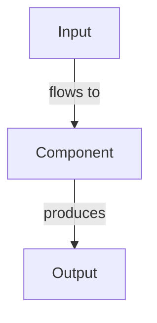

Scaffold a new article in the system design knowledge base.

Usage: /new-article <layer> <path> <title>
  layer: concept | poc | problem | case-study | interview-q
  path:  relative path from content/ (e.g. 01-databases/concepts/my-topic)
  title: Article title in quotes

The article will be created at docs-site/content/<path>.md with:
- Correct frontmatter for the layer type
- Two-depth structure (Level 1 Surface + Level 2 Deep Dive)
- Mermaid diagram placeholders
- References section

## Article writing rules (ALWAYS follow)

1. **Two depth levels are mandatory** — Level 1 must be readable by a junior engineer in 2 minutes with zero assumed knowledge. Level 2 must satisfy a Solution Architect reviewing a design.
2. **Every claim needs a number** — "handles 100k RPS" not "handles lots of traffic". "adds 20ms latency" not "adds latency".
3. **At least one Mermaid diagram per depth level** — Level 1 gets a simple happy-path diagram (5-8 nodes). Level 2 gets sequence diagrams for timing-sensitive flows.
4. **At least one comparison table** — comparing approaches, not just listing them.
5. **Real company examples where possible** — cite engineering blogs, not hypothetical scenarios. Minimum 3 companies.
6. **Failure modes are mandatory** — every production pattern breaks in specific ways. Name them, describe impact, give the fix.
7. **External references required** — minimum 3 links (official docs, engineering blogs, conference talks).
8. **After writing**: run `/generate-cheat-sheet <path>` to update the domain cheat sheet.
9. **After writing**: run `/sync-graph` to update `linked_from` arrays across the knowledge graph.

## Frontmatter template

For `concept` layer:
```yaml
---
title: "Article Title"
layer: concept
section: "path/from/content/root"
difficulty: beginner|intermediate|advanced|senior
tags: [tag1, tag2, tag3]
category: databases|caching|messaging|scalability|security|observability|architecture|algorithms
prerequisites: []
see_poc: []
related_problems: []
case_studies: []
linked_from: []
references:
  - title: "Resource name"
    url: "https://..."
    type: article|video|docs
---
```

For `poc` layer:
```yaml
---
title: "POC: Topic Name"
layer: poc
section: "path/from/content/root"
difficulty: beginner|intermediate|advanced
tags: [tag1, tag2]
category: databases|caching|messaging|scalability|security
prerequisites: []
concept_article: "path/to/parent/concept"
linked_from: []
---
```

For `problem` layer:
```yaml
---
title: "Problem: Failure Scenario Name"
layer: problem
section: "problems-at-scale/category"
difficulty: intermediate|advanced|senior
tags: [tag1, tag2]
category: concurrency|availability|scalability|consistency|performance
affected_scale: "when does this problem appear? (e.g. >10k RPS)"
solutions:
  - "path/to/concept/that/solves/this"
linked_from: []
references:
  - title: "Post-mortem or case study"
    url: "https://..."
    type: article
---
```

For `case-study` layer:
```yaml
---
title: "System Design: Product Name"
layer: case-study
section: "system-design/case-studies"
difficulty: advanced|senior
tags: [tag1, tag2]
category: architecture
company: "Company name"
scale: "e.g. 500M users, 1M RPS"
concepts_used:
  - "path/to/concept1"
  - "path/to/concept2"
linked_from: []
references:
  - title: "Engineering blog post"
    url: "https://..."
    type: article
---
```

For `interview-q` layer:
```yaml
---
title: "Question: Design a ..."
layer: interview-q
section: "interview-prep/system-design"
difficulty: intermediate|advanced|senior
tags: [tag1, tag2]
category: architecture
prerequisites:
  - "path/to/concept1"
see_poc: []
related_problems: []
case_studies: []
linked_from: []
---
```

## Full article body template

Paste this template into the new file and fill in every section:

```markdown
# [Title]

**Difficulty**: [emoji] [Level]
**Reading Time**: [N] minutes
**Practical Application**: [one-line — when does this matter in production?]

## Level 1 — Surface (2-minute read)

> For juniors and those needing a quick refresher.

### What is [topic]?

[One-line definition in plain English. No jargon. If a term is unavoidable, define it in the same sentence.]

### When do you need it?

[Concrete real-world trigger with numbers. Example: "When your single PostgreSQL instance handles more than 10,000 writes/sec and write latency P99 exceeds 50ms."]

### Core concept

- [Point 1 — complete idea in plain English]
- [Point 2 — complete idea in plain English]
- [Point 3 — complete idea in plain English]
- [Point 4 — complete idea in plain English (optional)]
- [Point 5 — complete idea in plain English (optional)]

### Simple diagram

[diagram showing the happy path, 5-8 nodes max]



### When to use vs. not use

| Use this when | Don't use this when |
|--------------|---------------------|
| [condition 1] | [counter-condition 1] |
| [condition 2] | [counter-condition 2] |
| [condition 3] | [counter-condition 3] |

---

## Level 2 — Deep Dive

> For seniors, architects, and staff+ interview prep.

### Problem Statement

[Exact problem with failure scenario and numbers. What breaks, when, at what scale? Include a production failure story if applicable.]

### Approach A — [Name] (Simplest)

[How it works — 2-4 paragraphs explaining the mechanism]

```mermaid
[architecture diagram showing full flow including failure paths]
```

| Dimension | Value |
|-----------|-------|
| Pros | ... |
| Cons | ... |
| Best for | ... |
| Avoid when | ... |

```sql
-- or pseudocode — with comments explaining WHY not just WHAT
[code example]
```

### Approach B — [Name] (More Sophisticated)

[same structure]

### Approach C — [Name] (Production Grade)

[same structure]

### Comparison Table

| Dimension | Approach A | Approach B | Approach C |
|-----------|-----------|-----------|-----------|
| Throughput | | | |
| Latency (P99) | | | |
| Operational complexity | | | |
| When to use | | | |

### Production Numbers

- [Metric 1]: [value] at [hardware/config]
- [Metric 2]: P50 = X, P99 = Y, P99.9 = Z
- Scale threshold: switch from A to B at [specific condition]

### How Real Companies Solve This

| Company | Approach | Scale | Key Insight |
|---------|----------|-------|-------------|
| [Company 1] | | | |
| [Company 2] | | | |
| [Company 3] | | | |

### Common Mistakes

1. **[Mistake name]** — [why it happens] — [how to avoid, with a number if applicable]
2. **[Mistake name]** — [why it happens] — [how to avoid]
3. **[Mistake name]** — [why it happens] — [how to avoid]

### Key Takeaways (TL;DR)

- [Specific fact with number]
- [Decision rule: use X when Y, use Z when W]
- [The non-obvious thing that trips people up]
- [What to monitor in production]

---

## References

> 📺 [Video title](url) — [one sentence: what this covers and why worth watching]
> 📖 [Blog post title](url) — [one sentence summary]
> 📚 [Official docs title](url) — [one sentence: which section to read]
```

## Gold-standard example

See `docs-site/content/01-databases/concepts/write-ahead-log.md` for a complete reference implementation of this two-depth pattern.
