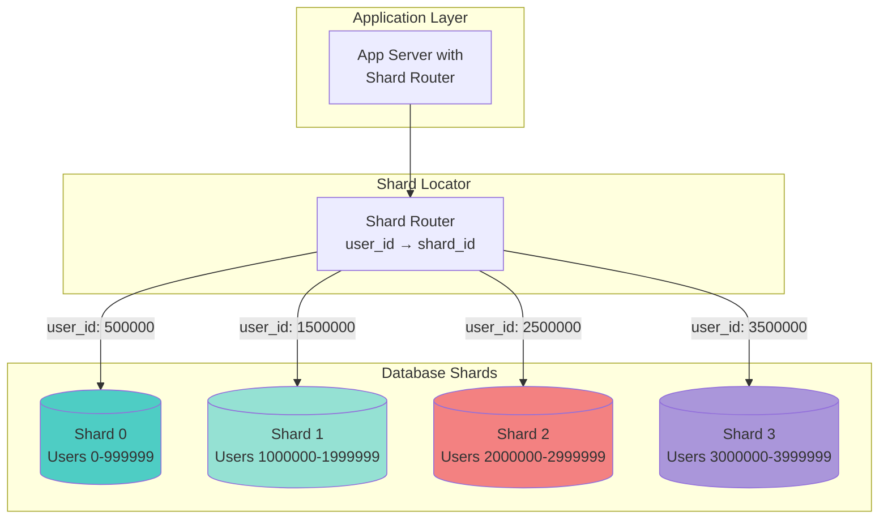
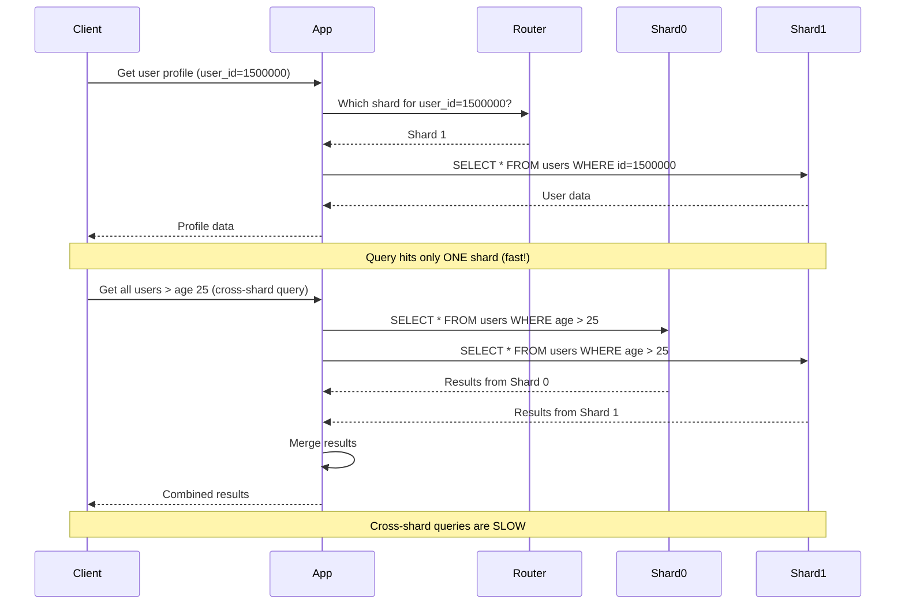
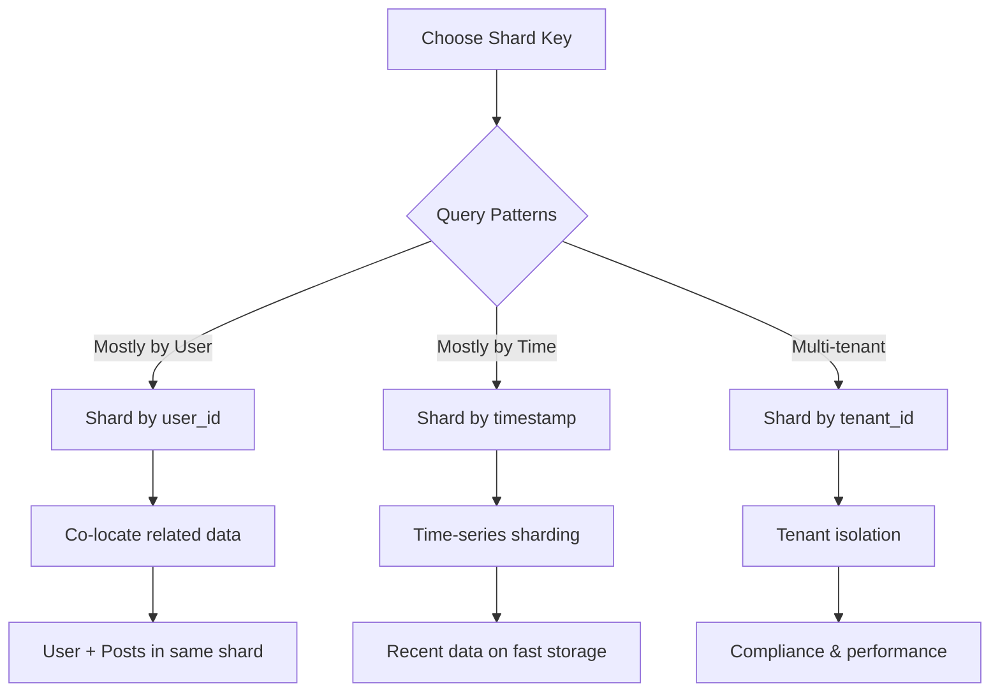
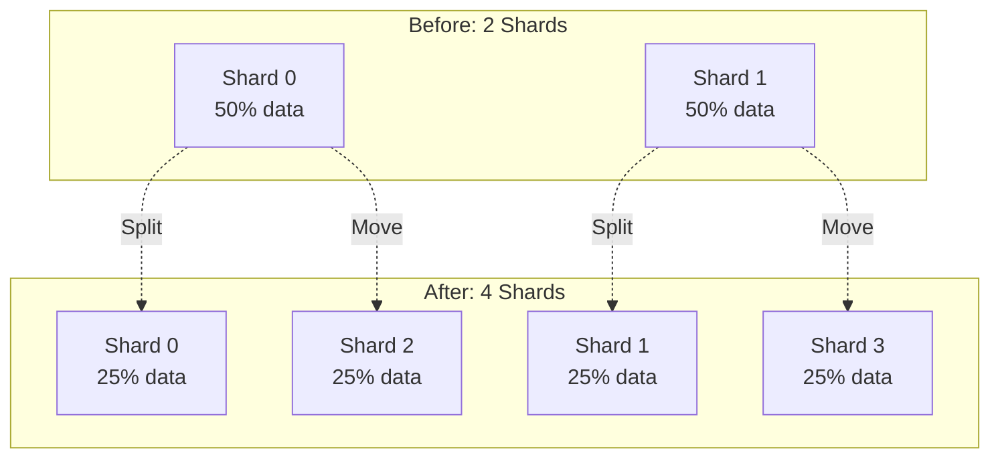

# Database Sharding Strategies

**Difficulty**: 🟡 Intermediate
**Reading Time**: 15 minutes
**Practical Application**: When single database > 1TB or writes > 50,000/sec

## 🎯 Problem Statement

Your database has grown too large:
- Database size: 5TB (single server limit: 2TB)
- Write throughput: 100,000/sec (single server limit: 20,000/sec)
- Query performance degrading despite indexes
- Backup/restore takes hours

**Read replicas can't help** - they scale reads, not writes or storage.

**Solution**: Sharding (Horizontal Partitioning) - split data across multiple databases

## 🌍 Real-World Context

**When you need this**:
- Database > 500GB and growing
- Write-heavy workload (> 10,000 writes/sec)
- Single table > 100M rows
- Geographic data distribution needed

**Real Companies**:
- **Instagram**: User data sharded by user_id → 1000s of shards
- **Uber**: Trips sharded by geography → Regional databases
- **Discord**: Messages sharded by channel_id → Handles billions of messages
- **Notion**: Workspaces sharded by workspace_id → Isolated tenants

## 🏗️ Architecture

### Sharded Database System



### Query Routing



## 🎯 Sharding Strategies

### 1. Range-Based Sharding

**Concept**: Split by ranges of shard key

```javascript
class RangeBasedSharding {
  constructor() {
    this.shards = [
      { id: 0, range: [0, 999999], db: connectToDatabase('shard-0') },
      { id: 1, range: [1000000, 1999999], db: connectToDatabase('shard-1') },
      { id: 2, range: [2000000, 2999999], db: connectToDatabase('shard-2') },
      { id: 3, range: [3000000, 3999999], db: connectToDatabase('shard-3') }
    ];
  }

  getShardForUserId(userId) {
    for (const shard of this.shards) {
      const [min, max] = shard.range;
      if (userId >= min && userId <= max) {
        return shard.db;
      }
    }
    throw new Error(`No shard found for user_id: ${userId}`);
  }

  async getUser(userId) {
    const shard = this.getShardForUserId(userId);
    return await shard.execute(
      'SELECT * FROM users WHERE id = $1',
      [userId]
    );
  }

  async createUser(userData) {
    // Generate next user_id
    const userId = await this.getNextUserId();

    // Determine shard
    const shard = this.getShardForUserId(userId);

    // Insert into appropriate shard
    return await shard.execute(
      'INSERT INTO users (id, name, email) VALUES ($1, $2, $3)',
      [userId, userData.name, userData.email]
    );
  }
}
```

**Pros**:
- ✅ Simple to understand
- ✅ Range queries within shard are efficient
- ✅ Easy to add new ranges

**Cons**:
- ❌ Uneven data distribution (hotspots)
- ❌ Last shard gets all new data

**Use Cases**:
- Time-series data (shard by date ranges)
- Auto-incrementing IDs

### 2. Hash-Based Sharding (Most Common)

**Concept**: Hash the shard key to distribute evenly

```javascript
class HashBasedSharding {
  constructor(numShards = 4) {
    this.numShards = numShards;
    this.shards = Array(numShards).fill(null).map((_, i) =>
      connectToDatabase(`shard-${i}`)
    );
  }

  // Simple hash function
  hash(key) {
    let hash = 0;
    for (let i = 0; i < key.length; i++) {
      hash = ((hash << 5) - hash) + key.charCodeAt(i);
      hash = hash & hash; // Convert to 32-bit integer
    }
    return Math.abs(hash);
  }

  getShardId(userId) {
    // Convert userId to string and hash
    const hashValue = this.hash(userId.toString());

    // Modulo to get shard ID
    return hashValue % this.numShards;
  }

  getShard(userId) {
    const shardId = this.getShardId(userId);
    return this.shards[shardId];
  }

  async getUser(userId) {
    const shard = this.getShard(userId);
    return await shard.execute(
      'SELECT * FROM users WHERE id = $1',
      [userId]
    );
  }

  async getUserPosts(userId) {
    const shard = this.getShard(userId);

    // Posts are co-located with user (same shard key)
    return await shard.execute(
      'SELECT * FROM posts WHERE user_id = $1 ORDER BY created_at DESC',
      [userId]
    );
  }

  // Cross-shard query (EXPENSIVE!)
  async searchUsersByName(name) {
    // Must query ALL shards
    const results = await Promise.all(
      this.shards.map(shard =>
        shard.execute(
          'SELECT * FROM users WHERE name LIKE $1',
          [`%${name}%`]
        )
      )
    );

    // Merge and sort results
    return results
      .flat()
      .sort((a, b) => a.name.localeCompare(b.name));
  }
}

// Usage
const sharding = new HashBasedSharding(4);

// Single shard queries (FAST)
const user = await sharding.getUser(12345);
const posts = await sharding.getUserPosts(12345);

// Cross-shard query (SLOW)
const users = await sharding.searchUsersByName('Alice');
```

**Pros**:
- ✅ Even data distribution
- ✅ No hotspots
- ✅ Predictable performance

**Cons**:
- ❌ Range queries span all shards
- ❌ Resharding is complex

**Use Cases**:
- User data (shard by user_id)
- Session data (shard by session_id)

### 3. Geographic Sharding

**Concept**: Shard by geographic location

```javascript
class GeographicSharding {
  constructor() {
    this.shards = {
      'us-east': connectToDatabase('us-east-db'),
      'us-west': connectToDatabase('us-west-db'),
      'eu': connectToDatabase('eu-db'),
      'asia': connectToDatabase('asia-db')
    };
  }

  getRegionForUser(userId) {
    // Look up user's region (cached or from metadata service)
    return userRegionCache.get(userId) || 'us-east';
  }

  getShard(userId) {
    const region = this.getRegionForUser(userId);
    return this.shards[region];
  }

  async getUserData(userId) {
    const shard = this.getShard(userId);

    // Low latency - database is geographically close
    return await shard.execute(
      'SELECT * FROM users WHERE id = $1',
      [userId]
    );
  }

  // Cross-region query (HIGH LATENCY!)
  async getGlobalStats() {
    const results = await Promise.all(
      Object.values(this.shards).map(shard =>
        shard.execute('SELECT COUNT(*) as count FROM users')
      )
    );

    return results.reduce((sum, r) => sum + r[0].count, 0);
  }
}
```

**Pros**:
- ✅ Low latency (data close to users)
- ✅ Data sovereignty compliance
- ✅ Natural isolation

**Cons**:
- ❌ Cross-region queries are slow
- ❌ Uneven distribution

**Use Cases**:
- Global applications (Uber, Airbnb)
- Compliance requirements (GDPR)

### 4. Directory-Based Sharding

**Concept**: Lookup table to map entities to shards

```javascript
class DirectoryBasedSharding {
  constructor() {
    this.shards = [
      connectToDatabase('shard-0'),
      connectToDatabase('shard-1'),
      connectToDatabase('shard-2'),
      connectToDatabase('shard-3')
    ];

    // Separate lookup database
    this.directory = connectToDatabase('directory-db');
  }

  async getShardForUser(userId) {
    // Look up in directory
    const result = await this.directory.execute(
      'SELECT shard_id FROM user_shard_mapping WHERE user_id = $1',
      [userId]
    );

    if (!result.length) {
      throw new Error(`No shard mapping for user: ${userId}`);
    }

    return this.shards[result[0].shard_id];
  }

  async createUser(userData) {
    // Choose shard with least users (load balancing)
    const shardId = await this.getLeastLoadedShard();

    // Insert into shard
    const shard = this.shards[shardId];
    const user = await shard.execute(
      'INSERT INTO users (name, email) VALUES ($1, $2) RETURNING id',
      [userData.name, userData.email]
    );

    // Create directory mapping
    await this.directory.execute(
      'INSERT INTO user_shard_mapping (user_id, shard_id) VALUES ($1, $2)',
      [user.id, shardId]
    );

    return user;
  }

  async migrateUserToShard(userId, newShardId) {
    // Get current shard
    const currentShard = await this.getShardForUser(userId);

    // Get user data
    const user = await currentShard.execute(
      'SELECT * FROM users WHERE id = $1',
      [userId]
    );

    // Insert into new shard
    const newShard = this.shards[newShardId];
    await newShard.execute(
      'INSERT INTO users (id, name, email) VALUES ($1, $2, $3)',
      [user.id, user.name, user.email]
    );

    // Update directory
    await this.directory.execute(
      'UPDATE user_shard_mapping SET shard_id = $1 WHERE user_id = $2',
      [newShardId, userId]
    );

    // Delete from old shard
    await currentShard.execute(
      'DELETE FROM users WHERE id = $1',
      [userId]
    );
  }

  async getLeastLoadedShard() {
    const counts = await Promise.all(
      this.shards.map((shard, id) =>
        shard.execute('SELECT COUNT(*) as count FROM users').then(r => ({
          shardId: id,
          count: r[0].count
        }))
      )
    );

    return counts.reduce((min, curr) =>
      curr.count < min.count ? curr : min
    ).shardId;
  }
}
```

**Pros**:
- ✅ Flexible reassignment
- ✅ Easy rebalancing
- ✅ Can handle hotspots

**Cons**:
- ❌ Extra lookup (latency)
- ❌ Directory is single point of failure
- ❌ Directory can become bottleneck

**Use Cases**:
- Multi-tenant SaaS (tenant → shard)
- Flexible migration needs

## 🔧 Choosing a Shard Key

### Critical Decision: What to Shard By?



### Good Shard Key Properties

```javascript
// ✅ GOOD: High cardinality (many unique values)
shardKey = userId; // Millions of unique users

// ❌ BAD: Low cardinality (few unique values)
shardKey = accountType; // Only 3 types: free, pro, enterprise

// ✅ GOOD: Evenly distributed
shardKey = hash(userId); // Hash distributes evenly

// ❌ BAD: Skewed distribution
shardKey = countryCode; // US has 80% of users

// ✅ GOOD: Query patterns match shard key
// Most queries: "Get user's posts"
shardKey = userId;
// Posts table also sharded by userId → Single shard query!

// ❌ BAD: Query patterns don't match
// Most queries: "Get posts by category"
shardKey = userId;
// Categories span all shards → Must query ALL shards!
```

### Co-locating Related Data

```javascript
class UserShardingWithCoLocation {
  // User and their posts in SAME shard
  constructor() {
    this.sharding = new HashBasedSharding(4);
  }

  async getUserWithPosts(userId) {
    const shard = this.sharding.getShard(userId);

    // Single shard query (FAST!) - everything is co-located
    const [user, posts] = await Promise.all([
      shard.execute('SELECT * FROM users WHERE id = $1', [userId]),
      shard.execute(
        'SELECT * FROM posts WHERE user_id = $1 ORDER BY created_at DESC',
        [userId]
      )
    ]);

    return { user: user[0], posts };
  }

  async createPost(userId, content) {
    const shard = this.sharding.getShard(userId);

    // Insert post in same shard as user
    return await shard.execute(
      'INSERT INTO posts (user_id, content) VALUES ($1, $2) RETURNING *',
      [userId, content]
    );
  }
}
```

## ⚠️ Common Pitfalls

### 1. Cross-Shard Joins

```javascript
// ❌ TERRIBLE: Join across shards
async getPostsWithUserInfo() {
  // This requires joining data from different shards - VERY SLOW!
  const allPosts = await getAllPostsFromAllShards(); // Query all shards

  for (const post of allPosts) {
    const shard = this.getShard(post.user_id);
    post.user = await shard.execute(
      'SELECT * FROM users WHERE id = $1',
      [post.user_id]
    );
  }

  return allPosts;
}

// ✅ BETTER: Denormalize data
// Store user info WITH post (duplicate data)
async createPost(userId, content) {
  const shard = this.getShard(userId);

  // Get user info
  const user = await shard.execute('SELECT name, avatar FROM users WHERE id = $1', [userId]);

  // Store with post (denormalization)
  return await shard.execute(
    `INSERT INTO posts (user_id, user_name, user_avatar, content)
     VALUES ($1, $2, $3, $4)`,
    [userId, user.name, user.avatar, content]
  );
}
```

### 2. Hot Shards (Celebrity Problem)

```javascript
// Problem: Celebrity with 10M followers all on same shard
// Solution: Separate table for celebrities

class HotShardMitigation {
  async getUser(userId) {
    // Check if celebrity (stored separately)
    if (this.isCelebrity(userId)) {
      return await this.celebrityCache.get(userId);
    }

    // Regular user
    const shard = this.getShard(userId);
    return await shard.execute('SELECT * FROM users WHERE id = $1', [userId]);
  }

  isCelebrity(userId) {
    // Users with > 1M followers are "celebrities"
    return this.celebritySet.has(userId);
  }
}
```

### 3. Counting Across Shards

```javascript
// ❌ SLOW: Real-time count across all shards
async getTotalUsers() {
  const counts = await Promise.all(
    this.shards.map(shard =>
      shard.execute('SELECT COUNT(*) as count FROM users')
    )
  );

  return counts.reduce((sum, r) => sum + r[0].count, 0);
}

// ✅ BETTER: Cache aggregated counts
class AggregatedMetrics {
  constructor() {
    this.cache = new Redis();

    // Update counts periodically
    setInterval(() => this.updateCounts(), 60000); // Every minute
  }

  async updateCounts() {
    const counts = await Promise.all(
      this.shards.map((shard, id) =>
        shard.execute('SELECT COUNT(*) as count FROM users').then(r => ({
          shardId: id,
          count: r[0].count
        }))
      )
    );

    const total = counts.reduce((sum, c) => sum + c.count, 0);

    // Cache for 1 minute
    await this.cache.set('total_users', total, 'EX', 60);

    // Also cache per-shard
    for (const { shardId, count } of counts) {
      await this.cache.set(`shard_${shardId}_users`, count, 'EX', 60);
    }
  }

  async getTotalUsers() {
    // Return cached value
    return await this.cache.get('total_users');
  }
}
```

## 🏢 Real-World Example: Instagram

### Instagram's Sharding Strategy

```javascript
class InstagramSharding {
  constructor() {
    this.NUM_LOGICAL_SHARDS = 4096; // Logical shards
    this.NUM_PHYSICAL_SHARDS = 100;  // Physical databases

    // Map logical shards to physical databases
    this.logicalToPhysical = this.buildMapping();
  }

  buildMapping() {
    const mapping = {};
    const shardsPerDB = this.NUM_LOGICAL_SHARDS / this.NUM_PHYSICAL_SHARDS;

    for (let i = 0; i < this.NUM_LOGICAL_SHARDS; i++) {
      const physicalShard = Math.floor(i / shardsPerDB);
      mapping[i] = physicalShard;
    }

    return mapping;
  }

  getLogicalShard(userId) {
    // Hash to one of 4096 logical shards
    return this.hash(userId) % this.NUM_LOGICAL_SHARDS;
  }

  getPhysicalShard(userId) {
    const logicalShard = this.getLogicalShard(userId);
    const physicalShardId = this.logicalToPhysical[logicalShard];

    return this.physicalDatabases[physicalShardId];
  }

  hash(userId) {
    // Instagram's actual approach uses first 41 bits of user ID
    return userId >> 22; // Shift to get first 41 bits
  }

  async getUserPhotos(userId) {
    const shard = this.getPhysicalShard(userId);

    // All user's photos are in same physical shard
    return await shard.execute(
      `SELECT * FROM photos
       WHERE user_id = $1
       ORDER BY created_at DESC
       LIMIT 50`,
      [userId]
    );
  }
}

// Why logical + physical shards?
// - Start with 100 physical databases
// - Use 4096 logical shards
// - Each DB hosts 40-41 logical shards
// - Easy to split: Move logical shards to new physical databases
// - No application changes needed!
```

## 📈 Resharding Strategy

### Adding New Shards



```javascript
class ReshardingOrchestrator {
  async reshard(oldShardCount, newShardCount) {
    // Step 1: Create new empty shards
    const newShards = await this.provisionShards(newShardCount);

    // Step 2: Copy data (double-write period)
    await this.enableDoubleWrites(newShards);

    // Step 3: Backfill historical data
    await this.backfillData(oldShardCount, newShardCount);

    // Step 4: Switch reads to new shards
    await this.switchReads(newShards);

    // Step 5: Disable writes to old shards
    await this.disableOldShardWrites();

    // Step 6: Verify and cleanup
    await this.verifyAndCleanup();
  }

  // This takes DAYS/WEEKS for large databases!
}
```

## 🎓 Key Takeaways

1. ✅ **Sharding scales writes and storage** - Unlike read replicas
2. ✅ **Choose shard key carefully** - Hard to change later
3. ✅ **Co-locate related data** - Avoid cross-shard queries
4. ✅ **Start with hash-based sharding** - Even distribution
5. ✅ **Plan for resharding** - Use logical + physical shards
6. ✅ **Monitor shard balance** - Watch for hot shards

## 🔗 Next Steps

- [Hot Partition Problem](./10-hot-partition.md) - Handling skewed data
- [Multi-Region Databases](./07-multi-region-setup.md) - Geographic sharding
- [Distributed Transactions](./11-distributed-transactions.md) - Cross-shard operations

## 📚 Further Reading

- Vitess (MySQL Sharding): https://vitess.io/docs/
- Instagram Engineering: https://instagram-engineering.com/sharding-ids-at-instagram-1cf5a71e5a5c
- MongoDB Sharding: https://docs.mongodb.com/manual/sharding/
