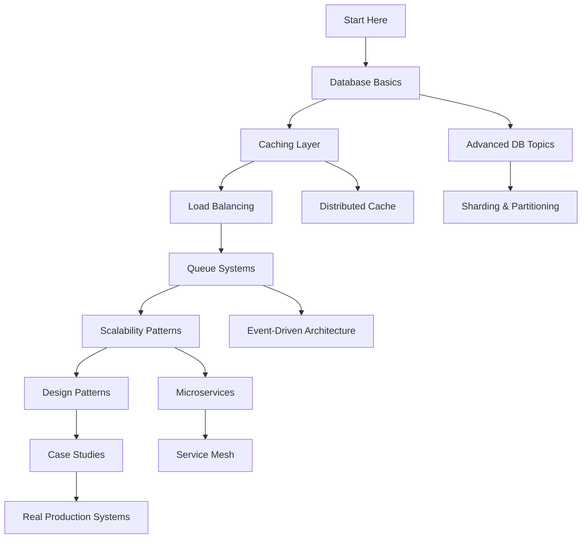

# System Design Knowledge Base

> A practical, implementation-focused guide to system design for developers building large-scale applications

## 🎯 Purpose

This knowledge base is designed for junior to mid-level developers who want to understand **how things actually work** in production systems handling millions of users. Each article focuses on practical implementation, real-world examples, and battle-tested patterns used at scale.

## 📚 Philosophy

- **80/20 Principle**: Cover 80% of essential topics with 20% of the effort
- **Implementation-First**: Focus on HOW things work, not just theory
- **Real Examples**: Every concept includes practical code and architecture
- **Production-Grade**: Patterns and practices used in real large-scale systems
- **Single Source**: All content centralized in `docs-site/pages/` for easy maintenance

## 🏗️ Repository Architecture

### Single-Source Structure

All content is centralized in **`docs-site/pages/`** - a Nextra-powered documentation site containing 169 articles:

```
docs-site/
├── pages/                    # All content lives here
│   ├── system-design/       # 21 articles across 12 topics
│   ├── interview-prep/      # 121 files (34 Q&A + 61 POCs)
│   └── problems-at-scale/   # 24 articles on production problems
├── public/                  # Static assets
└── theme.config.jsx         # Nextra configuration
```

### Historical Note

Old root-level folders (01-databases through 12-consistency) have been archived to `_archive/`. All content has been migrated to the single-source `docs-site/pages/` structure for easier maintenance and navigation.

### Why Single-Source?

- **One Place to Edit**: All articles in one directory tree
- **Better Navigation**: Automatic sidebar generation via Nextra
- **Consistent Formatting**: Single theme and styling system
- **Easy Search**: Built-in full-text search across all content
- **Simple Deployment**: One docs site, one build process

## 🗂️ Content Structure

All paths are relative to `docs-site/pages/`

### 1. System Design Fundamentals (21 articles)

#### 📊 [Databases](docs-site/pages/system-design/databases/) (5 articles)
Master-slave replication, read replicas, sharding strategies, indexing, and partitioning.
- [Replication Basics](docs-site/pages/system-design/databases/replication-basics.md) 🟢
- [Read Replicas](docs-site/pages/system-design/databases/read-replicas.md) 🟢
- [Sharding Strategies](docs-site/pages/system-design/databases/sharding-strategies.md) 🟡
- [Indexing Strategies](docs-site/pages/system-design/databases/indexing-strategies.md) 🟡

#### ⚡ [Caching](docs-site/pages/system-design/caching/) (2 articles)
Cache-aside, write-through, distributed caching, and CDN strategies.
- [Caching Fundamentals](docs-site/pages/system-design/caching/caching-fundamentals.md) 🟢

#### 📬 [Message Queues](docs-site/pages/system-design/queues/) (2 articles)
Async processing, pub/sub, event-driven architecture.
- [Message Queue Basics](docs-site/pages/system-design/queues/message-queue-basics.md) 🟢

#### 🎯 [Design Patterns](docs-site/pages/system-design/patterns/) (2 articles)
Circuit breaker, retry with backoff, saga, bulkhead, and CQRS.
- [Circuit Breaker Pattern](docs-site/pages/system-design/patterns/circuit-breaker.md) 🟡

#### 🏢 [Case Studies](docs-site/pages/system-design/case-studies/) (2 articles)
Real-world system designs from Twitter, Netflix, Uber, Instagram.
- [URL Shortener](docs-site/pages/system-design/case-studies/url-shortener.md) 🟡

#### Other Topics (1 article each)
- [Load Balancing](docs-site/pages/system-design/load-balancing/) - Algorithms, health checks, sticky sessions, failover
- [Scalability Patterns](docs-site/pages/system-design/scalability/) - Horizontal/vertical scaling, stateless design, microservices
- [Performance Optimization](docs-site/pages/system-design/performance/) - Query tuning, connection pooling, profiling
- [API Design](docs-site/pages/system-design/api-design/) - REST, GraphQL, gRPC, versioning, pagination
- [Monitoring & Observability](docs-site/pages/system-design/monitoring/) - Metrics, logging, tracing, SLOs/SLIs
- [Security & Authentication](docs-site/pages/system-design/security/) - OAuth, JWT, session management, DDoS protection
- [Data Consistency](docs-site/pages/system-design/consistency/) - ACID, BASE, CAP theorem, eventual consistency

---

### 2. Interview Preparation (121 files) ⭐

All paths are relative to `docs-site/pages/interview-prep/`

#### 🏗️ [System Design Questions](docs-site/pages/interview-prep/system-design/) (34 Q&A)
Real interview questions with quick + detailed answers:
- [PDF Converter System](docs-site/pages/interview-prep/system-design/pdf-converter.md)
- [Rate Limiting Service](docs-site/pages/interview-prep/system-design/rate-limiting.md)
- [Flash Sales Platform](docs-site/pages/interview-prep/system-design/flash-sales.md)
- [URL Shortener](docs-site/pages/interview-prep/system-design/url-shortener.md)
- [Video Streaming Platform](docs-site/pages/interview-prep/system-design/video-streaming.md)
- And 29 more system design questions

#### 💻 [Practice POCs](docs-site/pages/interview-prep/practice-pocs/) (61 hands-on examples)

**Redis POCs (25 implementations)**:
- Key-value cache, distributed locks, job queues, rate limiting
- Leaderboards, session management, pub/sub patterns
- Lua scripting, HyperLogLog, streams, clustering
- Transactions, pipelining, geospatial operations

**Database POCs (20 implementations)**:
- CRUD operations, indexes, transactions, sharding, partitioning
- CTEs, window functions, materialized views, triggers
- Connection pooling, replication, EXPLAIN analysis

**Kafka POCs (5 implementations)**:
- Producer/consumer basics, consumer groups, exactly-once semantics
- Kafka Streams, performance tuning

**API POCs (6 implementations)**:
- REST best practices, GraphQL servers, gRPC Protocol Buffers
- API versioning, rate limiting, gateway patterns

**PostgreSQL Deep Dives (5 implementations)**:
- B-tree vs hash indexes, composite/covering indexes
- EXPLAIN ANALYZE optimization, partitioning strategies

#### 🔐 [Security & Encryption](docs-site/pages/interview-prep/security-encryption/) (6 articles)
- [RSA vs AES](docs-site/pages/interview-prep/security-encryption/rsa-vs-aes.md)
- [Hashing vs Encryption](docs-site/pages/interview-prep/security-encryption/hashing-vs-encryption.md)
- And 4 more security topics

#### ☁️ [AWS Cloud](docs-site/pages/interview-prep/aws-cloud/) (6 articles)
Cloud architecture patterns and AWS services

#### 🗄️ [Database & Storage](docs-site/pages/interview-prep/database-storage/) (7 articles)
Advanced database concepts and storage solutions

#### ⚡ [Caching & CDN](docs-site/pages/interview-prep/caching-cdn/) (6 articles)
Caching strategies and content delivery networks

---

### 3. Problems at Scale (24 articles) 🔥

All paths are relative to `docs-site/pages/problems-at-scale/`

Real production problems and solutions at scale:

#### 🔄 [Concurrency Problems](docs-site/pages/problems-at-scale/concurrency/) (7 articles)
- Race conditions in booking systems
- Double booking prevention
- Payment processing conflicts
- Inventory management at scale
- Lost updates and write conflicts
- Phantom reads in transactions

#### 🚨 [Availability Problems](docs-site/pages/problems-at-scale/availability/) (6 articles)
- Thundering herd problem
- Cascading failures
- Split brain syndrome
- Circuit breaker failures
- Retry storms
- Connection pool exhaustion

#### Other Problem Categories (2-3 articles each)
- 📈 [Scalability](docs-site/pages/problems-at-scale/scalability/) - Scaling bottlenecks and solutions
- ⚖️ [Consistency](docs-site/pages/problems-at-scale/consistency/) - Distributed consistency challenges
- ⚡ [Performance](docs-site/pages/problems-at-scale/performance/) - Performance degradation patterns
- 🗄️ [Data Integrity](docs-site/pages/problems-at-scale/data-integrity/) - Data corruption and recovery
- 💰 [Cost Optimization](docs-site/pages/problems-at-scale/cost-optimization/) - Resource efficiency

## 🚀 Quick Start Guide

### For Absolute Beginners
Start here in order:
1. [Database Replication Basics](docs-site/pages/system-design/databases/replication-basics.md)
2. [Caching Fundamentals](docs-site/pages/system-design/caching/caching-fundamentals.md)
3. [Message Queue Basics](docs-site/pages/system-design/queues/message-queue-basics.md)
4. [Circuit Breaker Pattern](docs-site/pages/system-design/patterns/circuit-breaker.md)

### For Intermediate Developers
Focus on these areas:
1. [Database Sharding Strategies](docs-site/pages/system-design/databases/sharding-strategies.md)
2. [URL Shortener Case Study](docs-site/pages/system-design/case-studies/url-shortener.md)
3. [Problems at Scale: Concurrency](docs-site/pages/problems-at-scale/concurrency/)
4. [Practice POCs: Redis](docs-site/pages/interview-prep/practice-pocs/)

### For Interview Preparation ⭐
Go to [Interview Prep Section](docs-site/pages/interview-prep/) for:
1. **34 System Design Questions** - Quick + detailed answers
2. **61 Practice POCs** - Hands-on implementations (Redis, Kafka, PostgreSQL)
3. **Real Questions** - From HDFC, AWS, FAANG companies
4. **Study Plans** - 1-week, 2-week, 30-day prep paths

Study these popular questions:
- [PDF Converter System](docs-site/pages/interview-prep/system-design/pdf-converter.md)
- [RSA vs AES](docs-site/pages/interview-prep/security-encryption/rsa-vs-aes.md)
- [URL Shortener](docs-site/pages/system-design/case-studies/url-shortener.md)

### For Solving Production Problems
Jump to [Problems at Scale](docs-site/pages/problems-at-scale/) when you face:
- **Race conditions?** → [Concurrency Problems](docs-site/pages/problems-at-scale/concurrency/)
- **System failures?** → [Availability Problems](docs-site/pages/problems-at-scale/availability/)
- **Slow queries?** → [Performance Problems](docs-site/pages/problems-at-scale/performance/)
- **High costs?** → [Cost Optimization](docs-site/pages/problems-at-scale/cost-optimization/)

## 📖 How to Use This Resource

1. **Each article is standalone** - Read in any order based on your needs
2. **Follow the mermaid diagrams** - Visual architecture helps understanding
3. **Try the pseudocode** - Understand the implementation approach
4. **Compare alternatives** - Learn trade-offs between different approaches
5. **Study real examples** - See how companies solve actual problems

## 💻 Development Setup

### Prerequisites
- Node.js 18+ installed
- npm, yarn, or pnpm package manager

### Running the Documentation Site

```bash
# Navigate to docs-site
cd docs-site

# Install dependencies (first time only)
npm install

# Start development server (http://localhost:3000)
npm run dev

# Build for production
npm run build

# Start production server
npm start
```

### Clear Next.js Cache (if issues)

```bash
cd docs-site
rm -rf .next
npm run dev
```

### Project Structure for Developers

```
docs-site/pages/
├── system-design/          # 12 topic areas, 21 articles
│   ├── databases/
│   │   ├── _meta.js       # Controls navigation order
│   │   ├── index.md       # Section overview
│   │   └── *.md           # Individual articles
│   ├── caching/
│   └── ...
├── interview-prep/         # 121 files total
│   ├── system-design/     # 34 Q&A articles
│   ├── practice-pocs/     # 61 hands-on POCs
│   └── ...
└── problems-at-scale/      # 24 articles
    ├── concurrency/
    ├── availability/
    └── ...
```

### Meta Files

Each directory has a `_meta.js` or `_meta.json` that controls:
- Navigation order in sidebar
- Section titles and icons
- Collapsed/expanded state

Example `_meta.js`:
```javascript
export default {
  index: "Overview",
  databases: "📊 Databases",
  caching: "⚡ Caching"
}
```

## 🎓 Learning Path



## 🔧 Technologies Covered

- **Databases**: PostgreSQL, MySQL, MongoDB, Cassandra, DynamoDB
- **Cache**: Redis, Memcached, CDN (CloudFront, Cloudflare)
- **Queues**: RabbitMQ, Kafka, AWS SQS, Redis Pub/Sub, BullMQ
- **Load Balancers**: Nginx, HAProxy, AWS ELB/ALB
- **APIs**: REST, GraphQL, gRPC, WebSocket
- **Languages**: JavaScript/Node.js, SQL, pseudocode
- **Platforms**: AWS, GCP, Azure architecture patterns

## 📊 Content Statistics

**Last Updated**: 2026-01-12

### By Category
- **System Design**: 21 articles across 12 topics
  - Databases (5), Caching (2), Queues (2), Patterns (2), Case Studies (2)
  - Other topics (1 each): Load Balancing, Scalability, Performance, API Design, Monitoring, Security, Consistency

- **Interview Prep**: 121 files
  - System Design Q&A: 34 questions with quick + detailed answers
  - Practice POCs: 61 hands-on implementations
    - Redis (25), Database (20), Kafka (5), API (6), PostgreSQL (5)
  - Topic Articles: 26 (Security 6, AWS 6, Database 7, Caching 6)

- **Problems at Scale**: 24 articles across 7 categories
  - Concurrency (7), Availability (6)
  - Others (2-3 each): Scalability, Consistency, Performance, Data Integrity, Cost Optimization

### Total Content
- **169 articles** - Production-grade, implementation-focused content
- **70,000+ words** - Comprehensive technical depth
- **100+ code examples** - Real-world, runnable code
- **50+ architecture diagrams** - Visual understanding with Mermaid
- **Focus**: Practical implementation at scale (FAANG patterns)

## 🎯 Target Audience

This resource is perfect for:
- Junior developers learning system design
- Mid-level engineers preparing for senior roles
- Interview candidates studying system design
- Engineers building their first large-scale system
- Anyone wanting to understand how production systems work

## 🤝 Contributing

### Adding New Articles

#### 1. Choose the Right Location

Add content to the appropriate section in `docs-site/pages/`:
- **System Design fundamentals** → `docs-site/pages/system-design/{topic}/`
- **Interview questions** → `docs-site/pages/interview-prep/system-design/`
- **Practice POCs** → `docs-site/pages/interview-prep/practice-pocs/`
- **Production problems** → `docs-site/pages/problems-at-scale/{category}/`

#### 2. Create the Article File

```bash
# Example: Adding a new database article
cd docs-site/pages/system-design/databases/
touch connection-pooling.md
```

#### 3. Follow the Article Template

See the "📝 Article Template" section below for the complete structure.

#### 4. Update Navigation

Add entry to the directory's `_meta.js`:

```javascript
export default {
  index: "Overview",
  "replication-basics": "🟢 Replication Basics",
  "connection-pooling": "🟡 Connection Pooling", // New entry
}
```

#### 5. Use Difficulty Badges
- 🟢 Beginner - Fundamental concepts
- 🟡 Intermediate - Requires basic knowledge
- 🔴 Advanced - Complex distributed systems

### Adding Practice POCs

POCs should be:
- **Runnable**: Include actual code that can be executed
- **Focused**: Single concept per POC
- **Practical**: Solve real-world problems
- **Well-commented**: Explain what each section does
- **Self-contained**: Include setup instructions

### Naming Conventions

**Articles**: Use kebab-case
- ✅ `database-sharding-strategies.md`
- ❌ `DatabaseShardingStrategies.md`

**POCs**: Prefix with technology
- ✅ `redis-distributed-lock.md`
- ✅ `kafka-consumer-groups.md`
- ✅ `postgresql-partitioning.md`

### Session Summaries

Create session summaries in `session-summaries/` after significant work:

```
session-summaries/YYYY-MM-DD_HH-MM-SS_<description>.md
```

Include:
- Objective of the session
- Changes made
- Files modified
- Key technical decisions
- Next steps

### Content Priorities

Topics are prioritized based on:
1. **Practical relevance** - Used in real production systems
2. **Impact** - Solves critical scalability/performance problems
3. **Clarity** - Can be explained with clear examples
4. **Fundamentals** - Core concepts that unlock understanding

## 📝 Article Template

Each article follows this structure:
1. **Problem Statement** - What problem does this solve?
2. **Real-World Context** - When do you actually need this?
3. **Architecture Diagram** - Visual representation
4. **Implementation** - Pseudocode and examples
5. **Trade-offs** - Pros, cons, and alternatives
6. **Real Examples** - How companies use this pattern
7. **Common Pitfalls** - What to avoid
8. **Further Reading** - Deep dive resources

## 🚦 Traffic Light System

Articles are tagged by difficulty:
- 🟢 **Beginner** - Fundamental concepts, start here
- 🟡 **Intermediate** - Requires basic knowledge
- 🔴 **Advanced** - Complex distributed systems concepts

---

**Last Updated**: 2026-01-12
**Total Articles**: 169 (21 System Design + 121 Interview Prep + 24 Problems at Scale + 3 Root Pages)
**Architecture**: Single-source in `docs-site/pages/`
**Focus**: Production-grade, practical implementation
**Status**: Active development - see [CONTINUATION_PLAN.md](CONTINUATION_PLAN.md)
