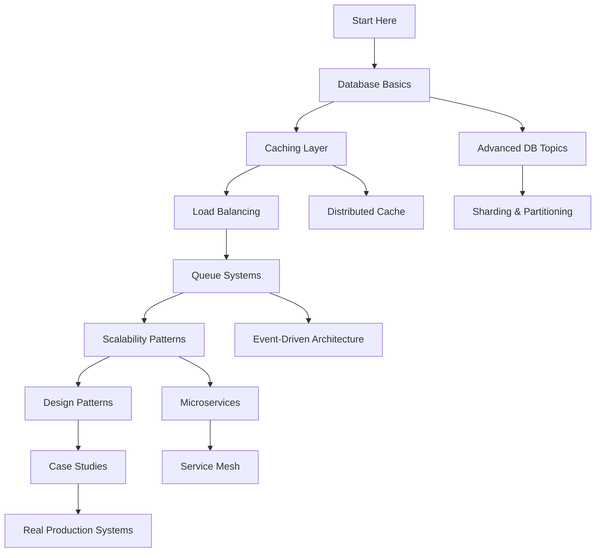

# System Design Knowledge Base

> A practical, implementation-focused guide to system design for developers building large-scale applications

## 🎯 Purpose

This knowledge base is designed for junior to mid-level developers who want to understand **how things actually work** in production systems handling millions of users. Each article focuses on practical implementation, real-world examples, and battle-tested patterns used at scale.

## 📚 Philosophy

- **80/20 Principle**: Cover 80% of essential topics with 20% of the effort
- **Implementation-First**: Focus on HOW things work, not just theory
- **Real Examples**: Every concept includes practical code and architecture
- **Production-Grade**: Patterns and practices used in real large-scale systems

## 🗂️ Content Structure

### 1. [Database & Data Layer](./01-databases/README.md)
Master-slave replication, read replicas, sharding, partitioning, indexing strategies, and more.

### 2. [Caching Strategies](./02-caching/README.md)
Cache-aside, write-through, write-back, CDN, distributed caching, and invalidation patterns.

### 3. [Queues & Messaging](./03-queues/README.md)
Message queues, event-driven architecture, pub/sub, stream processing, and async patterns.

### 4. [Load Balancing](./04-load-balancing/README.md)
Algorithms, health checks, sticky sessions, global load balancing, and failover strategies.

### 5. [Scalability Patterns](./05-scalability/README.md)
Horizontal/vertical scaling, stateless design, microservices, and distributed systems.

### 6. [Performance Optimization](./06-performance/README.md)
Database optimization, query tuning, connection pooling, async processing, and profiling.

### 7. [Design Patterns](./07-patterns/README.md)
Circuit breaker, rate limiting, retry with backoff, bulkhead, saga, and CQRS patterns.

### 8. [Real-World Case Studies](./08-case-studies/README.md)
How Twitter, Netflix, Uber, Instagram, and others solve specific problems at scale.

### 9. [API Design](./09-api-design/README.md)
REST, GraphQL, gRPC, versioning, pagination, rate limiting, and API gateway patterns.

### 10. [Monitoring & Observability](./10-monitoring/README.md)
Metrics, logging, tracing, alerting, SLOs/SLIs, and debugging distributed systems.

### 11. [Security & Authentication](./11-security/README.md)
OAuth, JWT, session management, rate limiting, DDoS protection, and encryption.

### 12. [Data Consistency](./12-consistency/README.md)
ACID, BASE, CAP theorem, eventual consistency, distributed transactions, and consensus.

### 💼 [Interview Preparation](./interview-prep/README.md) ⭐ NEW!
**149 real interview questions** analyzed with detailed answers. Includes HDFC, AWS, system design, security, and more. Quick + detailed answer format for interview prep.

## 🚀 Quick Start Guide

### For Absolute Beginners
Start here in order:
1. [Database Replication Basics](./01-databases/01-replication-basics.md)
2. [Why Caching Matters](./02-caching/01-caching-fundamentals.md)
3. [Load Balancer 101](./04-load-balancing/01-load-balancer-basics.md)
4. [Horizontal vs Vertical Scaling](./05-scalability/01-scaling-basics.md)

### For Intermediate Developers
Focus on these areas:
1. [Database Sharding Strategies](./01-databases/03-sharding-strategies.md)
2. [Message Queue Patterns](./03-queues/02-queue-patterns.md)
3. [Circuit Breaker Pattern](./07-patterns/01-circuit-breaker.md)
4. [Designing for High Availability](./05-scalability/05-high-availability.md)

### For Interview Preparation ⭐ NEW!
Go to [Interview Prep Section](./interview-prep/README.md) for:
1. **149 Real Interview Questions** - Analyzed and categorized
2. **Quick + Detailed Answers** - Perfect for interview prep
3. **System Design Questions** - [PDF Converter](./interview-prep/03-system-design/01-pdf-converter.md), Rate Limiting, Flash Sales
4. **Security Questions** - [RSA vs AES](./interview-prep/01-security-encryption/01-rsa-vs-aes.md), [Hashing vs Encryption](./interview-prep/01-security-encryption/02-hashing-vs-encryption.md)
5. **Study Plans** - 1-week, 2-week, 30-day prep paths

Or study these case studies:
1. [Design a URL Shortener](./08-case-studies/01-url-shortener.md)
2. [Design Instagram Feed](./08-case-studies/02-instagram-feed.md)
3. [Design a Rate Limiter](./08-case-studies/03-rate-limiter.md)
4. [Design Uber Backend](./08-case-studies/04-uber-backend.md)

## 📖 How to Use This Resource

1. **Each article is standalone** - Read in any order based on your needs
2. **Follow the mermaid diagrams** - Visual architecture helps understanding
3. **Try the pseudocode** - Understand the implementation approach
4. **Compare alternatives** - Learn trade-offs between different approaches
5. **Study real examples** - See how companies solve actual problems

## 🎓 Learning Path

## 🔧 Technologies Covered

- **Databases**: PostgreSQL, MySQL, MongoDB, Cassandra, DynamoDB
- **Cache**: Redis, Memcached, CDN (CloudFront, Cloudflare)
- **Queues**: RabbitMQ, Kafka, AWS SQS, Redis Pub/Sub
- **Load Balancers**: Nginx, HAProxy, AWS ELB/ALB, CloudFlare
- **Languages**: Pseudocode (language-agnostic), Node.js, Python, Go examples
- **Platforms**: AWS, GCP, Azure architecture patterns

## 📊 Content Statistics

- **100+ Articles**: Each covering a specific concept or pattern
- **Interactive Diagrams**: Mermaid diagrams in every article
- **Real Code**: Pseudocode and actual implementation examples
- **Case Studies**: 15+ real-world system design problems solved
- **Patterns**: 20+ battle-tested design patterns explained

## 🎯 Target Audience

This resource is perfect for:
- Junior developers learning system design
- Mid-level engineers preparing for senior roles
- Interview candidates studying system design
- Engineers building their first large-scale system
- Anyone wanting to understand how production systems work

## 🤝 Contributing

This is a living knowledge base. Topics are prioritized based on:
1. **Practical relevance** - Used in real production systems
2. **Impact** - Solves critical scalability/performance problems
3. **Clarity** - Can be explained with clear examples
4. **Fundamentals** - Core concepts that unlock understanding

## 📝 Article Template

Each article follows this structure:
1. **Problem Statement** - What problem does this solve?
2. **Real-World Context** - When do you actually need this?
3. **Architecture Diagram** - Visual representation
4. **Implementation** - Pseudocode and examples
5. **Trade-offs** - Pros, cons, and alternatives
6. **Real Examples** - How companies use this pattern
7. **Common Pitfalls** - What to avoid
8. **Further Reading** - Deep dive resources

## 🚦 Traffic Light System

Articles are tagged by difficulty:
- 🟢 **Beginner** - Fundamental concepts, start here
- 🟡 **Intermediate** - Requires basic knowledge
- 🔴 **Advanced** - Complex distributed systems concepts

---

**Last Updated**: 2025-12-31
**Total Articles**: 100+
**Focus**: Production-grade, practical implementation
