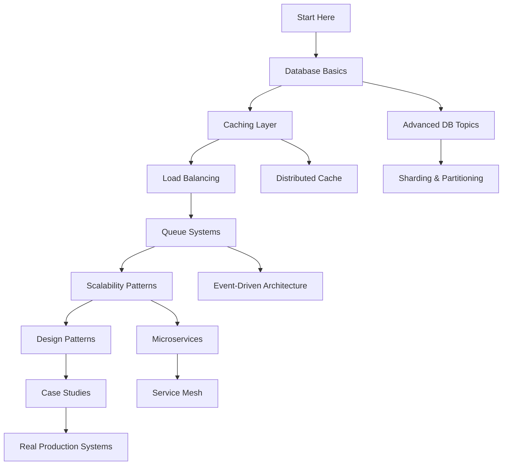

# System Design Knowledge Base

> A practical, implementation-focused guide to system design for developers building large-scale applications

## 🎯 Purpose

This knowledge base is designed for junior to mid-level developers who want to understand **how things actually work** in production systems handling millions of users. Each article focuses on practical implementation, real-world examples, and battle-tested patterns used at scale.

## 📚 Philosophy

- **80/20 Principle**: Cover 80% of essential topics with 20% of the effort
- **Implementation-First**: Focus on HOW things work, not just theory
- **Real Examples**: Every concept includes practical code and architecture
- **Production-Grade**: Patterns and practices used in real large-scale systems
- **Single Source**: All content centralized in `docs-site/content/` for easy maintenance

## 🏗️ Repository Architecture

### Single-Source Structure

All content is centralized in **`docs-site/content/`** — a Nextra 4 (App Router) powered documentation site containing 558+ articles across 16 numbered modules:

```
docs-site/
├── content/                  # All content lives here (Nextra 4 App Router)
│   ├── 00-start-here/       # Getting started guide
│   ├── 01-databases/        # 58 articles — replication, sharding, indexing, storage engines
│   ├── 02-caching/          # 22 articles — cache patterns, CDN, Redis
│   ├── 03-redis/            # 42 articles — Redis deep dives and POCs
│   ├── 04-messaging/        # 28 articles — Kafka, queues, event-driven architecture
│   ├── 05-distributed-systems/ # 24 articles — CAP, consensus, clocks
│   ├── 06-scalability/      # 23 articles — horizontal scaling, load balancing
│   ├── 07-api-design/       # 25 articles — REST, GraphQL, gRPC, API gateway
│   ├── 08-security/         # 17 articles — auth, encryption, DDoS, secrets
│   ├── 09-observability/    # 39 articles — metrics, tracing, alerting, SLOs
│   ├── 10-architecture/     # 43 articles — microservices, patterns, infrastructure
│   ├── 11-real-world/       # 20 articles — case studies: Netflix, Uber, etc.
│   ├── 12-interview-prep/   # 109 articles — system design Q&A + practice POCs
│   ├── 13-agent-workflows/  # 70 articles — AI agents, RAG, multi-agent, MCP
│   ├── 14-algorithms/       # 64 articles — data structures, distributed algos, interview patterns
│   ├── 15-vector-databases/ # 22 articles — embeddings, ANN indexes, hybrid search
│   ├── cheat-sheets/        # Quick-reference cheat sheets for every domain
│   └── problems-at-scale/   # Production failure patterns across all categories
├── app/                     # Next.js App Router entrypoint (Nextra 4)
├── public/                  # Static assets
└── next.config.mjs          # Next.js + Nextra configuration
```

### 3-Layer Context Management System

The knowledge base uses a three-layer navigation system so you (and AI agents) can quickly find the right article:

```
KNOWLEDGE-MAP.md                  ← Layer 0: master index of all 16 modules
docs-site/content/
  ├── KNOWLEDGE-GRAPH.md          ← cross-module dependency graph
  ├── <module>/CONTEXT.md         ← Layer 1: module overview, subsections, routing table
  ├── <module>/<subsection>/CONTEXT.md  ← Layer 2: file list + per-file descriptions
  └── <module>/<subsection>/<file>.md   ← Layer 3: per-file frontmatter (title, tags, difficulty)
```

- **Layer 1** (`module/CONTEXT.md`) — describes the whole module, lists subsections, routing table, prerequisites, and cross-module connections
- **Layer 2** (`module/subsection/CONTEXT.md`) — lists every file in the subsection with one-line descriptions and a routing table
- **Layer 3** — per-file YAML frontmatter (title, description, tags) — do not modify via CONTEXT files

### Why Single-Source?

- **One Place to Edit**: All articles in one directory tree
- **Better Navigation**: Automatic sidebar generation via Nextra 4
- **Consistent Formatting**: Single theme and styling system
- **Easy Search**: Built-in Pagefind full-text search across all content
- **Simple Deployment**: One docs site, one build process

## 🗂️ Content Structure

All content lives in `docs-site/content/` — 16 numbered modules with 558+ articles total.

### Module Overview

| Module | Articles | Topics |
|--------|----------|--------|
| [00-start-here](docs-site/content/00-start-here/) | 4 | Orientation, learning paths, how to use this KB |
| [01-databases](docs-site/content/01-databases/) | 58 | Replication, sharding, indexing, storage engines, partitioning |
| [02-caching](docs-site/content/02-caching/) | 22 | Cache patterns (aside, write-through), CDN, eviction policies |
| [03-redis](docs-site/content/03-redis/) | 42 | Redis data types, persistence, clustering, POCs |
| [04-messaging](docs-site/content/04-messaging/) | 28 | Kafka, RabbitMQ, event-driven architecture, pub/sub |
| [05-distributed-systems](docs-site/content/05-distributed-systems/) | 24 | CAP theorem, consistency models, distributed clocks |
| [06-scalability](docs-site/content/06-scalability/) | 23 | Horizontal scaling, load balancing, stateless design |
| [07-api-design](docs-site/content/07-api-design/) | 25 | REST, GraphQL, gRPC, rate limiting, API versioning |
| [08-security](docs-site/content/08-security/) | 17 | Auth, OAuth/JWT, encryption, DDoS, secrets management |
| [09-observability](docs-site/content/09-observability/) | 39 | Metrics, structured logging, distributed tracing, SLOs/SLIs |
| [10-architecture](docs-site/content/10-architecture/) | 43 | Microservices, service mesh, DDD, event sourcing, CQRS |
| [11-real-world](docs-site/content/11-real-world/) | 20 | Case studies: Netflix, Uber, Discord, YouTube, Twitter |
| [12-interview-prep](docs-site/content/12-interview-prep/) | 109 | System design Q&A, practice POCs, cheat sheets |
| [13-agent-workflows](docs-site/content/13-agent-workflows/) | 70 | AI agents, RAG, multi-agent, MCP, A2A, failure modes |
| [14-algorithms](docs-site/content/14-algorithms/) | 64 | Data structures, distributed algorithms, interview patterns, POCs |
| [15-vector-databases](docs-site/content/15-vector-databases/) | 22 | Embeddings, ANN indexes, hybrid search, vector DB comparison |

### Highlighted Sections

#### 🤖 AI Agent Workflows (Module 13 — 70 articles)
Everything for building production AI agents:
- **concepts/** — ReAct pattern, tool calling, RAG, memory types, multi-agent orchestration, safety, observability, MCP/A2A protocols
- **hands-on/** — Basic agent loop, RAG pipeline, MCP server, multi-agent research pipeline
- **platforms/** — LangChain, CrewAI, AutoGen, AWS Bedrock Agents, OpenAI Assistants
- **failures/** — Hallucination, context overflow, infinite loops, prompt injection, cost runaway
- **case-studies/** — ReAct data agent, OpenClaw architecture

#### 🧮 Algorithms & Data Structures (Module 14 — 64 articles)
Algorithm knowledge for interviews and production systems:
- **concepts/** — B+Tree, LSM Tree, Bloom Filter, Trie, Consistent Hashing, HyperLogLog, Merkle Tree
- **distributed/** — Raft, Paxos, Gossip Protocol, Vector Clocks, CRDTs, Two-Phase Commit
- **interview-patterns/** — 22 LeetCode-style patterns: Sliding Window, DP, Union-Find, Graph BFS/DFS, etc.
- **hands-on/** — Runnable implementations: LRU Cache, Bloom Filter, Consistent Hashing Ring, Trie

#### 🧠 Vector Databases (Module 15 — 22 articles)
Semantic search and embedding-based retrieval:
- **concepts/** — Embeddings, HNSW/IVF indexes, similarity metrics, hybrid search, reranking, DB comparison
- **hands-on/** — pgvector setup, similarity search from scratch, embedding pipeline, hybrid search POC
- **failures/** — Embedding drift, index staleness, silent retrieval degradation, scaling failures

#### 🎯 Interview Preparation (Module 12 — 109 articles)
- 34+ system design questions with quick + detailed answers
- Practice POCs: Redis (25), Database (20), Kafka (5), API (6), PostgreSQL (5)
- Security, AWS Cloud, Database, and Caching topic articles

#### 🔥 Problems at Scale
Production failure patterns across all categories:
- **Concurrency** — Race conditions, double booking, payment conflicts, phantom reads
- **Availability** — Thundering herd, cascading failures, split brain, retry storms
- **Scalability, Consistency, Performance, Data Integrity, Cost Optimization**

## 🚀 Quick Start Guide

### For Absolute Beginners
Start here in order:
1. [Start Here module](docs-site/content/00-start-here/) — orientation and learning paths
2. [Databases module](docs-site/content/01-databases/) — replication and sharding basics
3. [Caching module](docs-site/content/02-caching/) — cache patterns
4. [Messaging module](docs-site/content/04-messaging/) — queues and event-driven design

### For Intermediate Developers
Focus on these areas:
1. [Scalability module](docs-site/content/06-scalability/) — horizontal scaling patterns
2. [Real-World Systems](docs-site/content/11-real-world/) — Netflix, Uber, Discord case studies
3. [Problems at Scale](docs-site/content/problems-at-scale/) — production failure patterns
4. [Redis POCs](docs-site/content/03-redis/) — hands-on Redis implementations

### For Interview Preparation ⭐
Go to [Interview Prep module](docs-site/content/12-interview-prep/) for:
1. **34+ System Design Questions** — Quick + detailed answers
2. **Practice POCs** — Hands-on implementations (Redis, Kafka, PostgreSQL)
3. **Real Questions** — From HDFC, AWS, FAANG companies
4. **Study Plans** — 1-week, 2-week, 30-day prep paths

Also use [Algorithms module](docs-site/content/14-algorithms/interview-patterns/) for LeetCode-style patterns.

### For AI / Agent Engineering
Start in [Agent Workflows module](docs-site/content/13-agent-workflows/):
- Build your first agent → `concepts/from-zero-to-production-agent.md`
- RAG pipeline → `concepts/rag-deep-dive.md` + `hands-on/rag-pipeline.md`
- Vector search → [Vector Databases module](docs-site/content/15-vector-databases/)

### For Solving Production Problems
Jump to [Problems at Scale](docs-site/content/problems-at-scale/) when you face:
- **Race conditions?** → concurrency/ subfolder
- **System failures?** → availability/ subfolder
- **Slow queries?** → performance/ subfolder
- **High costs?** → cost-optimization/ subfolder

## 📖 How to Use This Resource

1. **Each article is standalone** - Read in any order based on your needs
2. **Follow the mermaid diagrams** - Visual architecture helps understanding
3. **Try the pseudocode** - Understand the implementation approach
4. **Compare alternatives** - Learn trade-offs between different approaches
5. **Study real examples** - See how companies solve actual problems

## 💻 Development Setup

### Prerequisites
- Node.js 18+ installed
- npm, yarn, or pnpm package manager

### Running the Documentation Site

```bash
# Navigate to docs-site
cd docs-site

# Install dependencies (first time only)
npm install

# Start development server (http://localhost:3000)
npm run dev

# Build for production
npm run build

# Start production server
npm start
```

### Clear Next.js Cache (if issues)

```bash
cd docs-site
rm -rf .next
npm run dev
```

### Production Deployment

The site runs in production at **https://rnd.blr0.geekydev.com/system-design/** behind an Nginx reverse proxy and PM2 process manager.

```bash
# After making content changes:
cd docs-site && npm run build

# Restart PM2
pm2 restart system-design

# Check status
pm2 list
pm2 logs system-design --lines 30
```

Key config:
- **Port**: 3001 (internal Next.js server)
- **basePath**: `/system-design` (set in `next.config.mjs`)
- **PM2 config**: `ecosystem.config.js` at repo root
- **Nginx config**: `/etc/nginx/apps.d/rnd-system-design.conf`
- **Search index**: regenerated by `postbuild` via `pagefind --site .next/server/app`

### Project Structure for Developers

```
docs-site/
├── content/                 # All articles (Nextra 4, App Router)
│   ├── _meta.js             # Root nav — controls top-level sidebar
│   ├── 00-start-here/       # Module folders, each with _meta.js
│   │   ├── _meta.js         # Controls nav within this module
│   │   ├── index.md         # Module landing page
│   │   └── *.md             # Individual articles
│   ├── 01-databases/
│   │   ├── concepts/        # Subsection folders
│   │   │   ├── _meta.js
│   │   │   ├── CONTEXT.md   # Layer 2 context file (for navigation/AI)
│   │   │   └── *.md
│   │   └── CONTEXT.md       # Layer 1 context file
│   └── ... (02 through 15)
├── app/                     # Next.js App Router pages
│   └── [[...mdxPath]]/      # Catch-all route for MDX content
├── public/                  # Static assets
├── next.config.mjs          # Next.js + Nextra + basePath config
└── package.json
```

### Meta Files

Each directory has a `_meta.js` that controls:
- Navigation order in sidebar
- Section titles and icons
- Visibility (`display: 'hidden'` for top-nav-only sections)

Example `_meta.js`:
```javascript
export default {
  index: "Overview",
  "replication-basics": "🟢 Replication Basics",
  "sharding-strategies": "🟡 Sharding Strategies",
}
```

## 🎓 Learning Path


```mermaid
graph TD
    A[Start Here] --> B[Database Basics]
    B --> C[Caching Layer]
    C --> D[Load Balancing]
    D --> E[Queue Systems]
    E --> F[Scalability Patterns]
    F --> G[Design Patterns]
    G --> H[Case Studies]

    B --> I[Advanced DB Topics]
    I --> J[Sharding & Partitioning]

    C --> K[Distributed Cache]

    E --> L[Event-Driven Architecture]

    F --> M[Microservices]
    M --> N[Service Mesh]

    H --> O[Real Production Systems]
```

## 🔧 Technologies Covered

- **Databases**: PostgreSQL, MySQL, MongoDB, Cassandra, DynamoDB
- **Cache**: Redis, Memcached, CDN (CloudFront, Cloudflare)
- **Queues**: RabbitMQ, Kafka, AWS SQS, Redis Pub/Sub, BullMQ
- **Load Balancers**: Nginx, HAProxy, AWS ELB/ALB
- **APIs**: REST, GraphQL, gRPC, WebSocket
- **Languages**: JavaScript/Node.js, SQL, pseudocode
- **Platforms**: AWS, GCP, Azure architecture patterns

## 📊 Content Statistics

**Last Updated**: 2026-03-25

### By Module
| Module | Articles |
|--------|----------|
| 00-start-here | 4 |
| 01-databases | 58 |
| 02-caching | 22 |
| 03-redis | 42 |
| 04-messaging | 28 |
| 05-distributed-systems | 24 |
| 06-scalability | 23 |
| 07-api-design | 25 |
| 08-security | 17 |
| 09-observability | 39 |
| 10-architecture | 43 |
| 11-real-world | 20 |
| 12-interview-prep | 109 |
| 13-agent-workflows | 70 |
| 14-algorithms | 64 |
| 15-vector-databases | 22 |
| **Total** | **610** |

### Total Content
- **610 articles** — Production-grade, implementation-focused content
- **16 numbered modules** — Covering fundamentals through AI/agent engineering
- **100+ code examples** — Real-world, runnable code
- **50+ architecture diagrams** — Visual understanding with Mermaid
- **Focus**: Practical implementation at scale (FAANG patterns)

## 🎯 Target Audience

This resource is perfect for:
- Junior developers learning system design
- Mid-level engineers preparing for senior roles
- Interview candidates studying system design
- Engineers building their first large-scale system
- Anyone wanting to understand how production systems work

## 🤝 Contributing

### Adding New Articles

#### 1. Choose the Right Location

Add content to the appropriate module in `docs-site/content/`:
- **Database topics** → `docs-site/content/01-databases/{subsection}/`
- **AI agent topics** → `docs-site/content/13-agent-workflows/{concepts|hands-on|failures}/`
- **Algorithm topics** → `docs-site/content/14-algorithms/{concepts|interview-patterns|hands-on}/`
- **Interview questions** → `docs-site/content/12-interview-prep/system-design/`
- **Practice POCs** → `docs-site/content/12-interview-prep/practice-pocs/`
- **Production problems** → `docs-site/content/problems-at-scale/{category}/`

#### 2. Create the Article File

```bash
# Example: Adding a new database article
cd docs-site/content/01-databases/concepts/
touch connection-pooling.md
```

#### 3. Follow the Article Template

See the "📝 Article Template" section below for the complete structure.

#### 4. Update Navigation

Add entry to the directory's `_meta.js`:

```javascript
export default {
  index: "Overview",
  "replication-basics": "🟢 Replication Basics",
  "connection-pooling": "🟡 Connection Pooling", // New entry
}
```

#### 5. Use Difficulty Badges
- 🟢 Beginner - Fundamental concepts
- 🟡 Intermediate - Requires basic knowledge
- 🔴 Advanced - Complex distributed systems

### Adding Practice POCs

POCs should be:
- **Runnable**: Include actual code that can be executed
- **Focused**: Single concept per POC
- **Practical**: Solve real-world problems
- **Well-commented**: Explain what each section does
- **Self-contained**: Include setup instructions

### Naming Conventions

**Articles**: Use kebab-case
- ✅ `database-sharding-strategies.md`
- ❌ `DatabaseShardingStrategies.md`

**POCs**: Prefix with technology
- ✅ `redis-distributed-lock.md`
- ✅ `kafka-consumer-groups.md`
- ✅ `postgresql-partitioning.md`

### Session Summaries

Create session summaries in `session-summaries/` after significant work:

```
session-summaries/YYYY-MM-DD_HH-MM-SS_<description>.md
```

Include:
- Objective of the session
- Changes made
- Files modified
- Key technical decisions
- Next steps

### Content Priorities

Topics are prioritized based on:
1. **Practical relevance** - Used in real production systems
2. **Impact** - Solves critical scalability/performance problems
3. **Clarity** - Can be explained with clear examples
4. **Fundamentals** - Core concepts that unlock understanding

## 📝 Article Template

Each article follows this structure:
1. **Problem Statement** - What problem does this solve?
2. **Real-World Context** - When do you actually need this?
3. **Architecture Diagram** - Visual representation
4. **Implementation** - Pseudocode and examples
5. **Trade-offs** - Pros, cons, and alternatives
6. **Real Examples** - How companies use this pattern
7. **Common Pitfalls** - What to avoid
8. **Further Reading** - Deep dive resources

## 🚦 Traffic Light System

Articles are tagged by difficulty:
- 🟢 **Beginner** - Fundamental concepts, start here
- 🟡 **Intermediate** - Requires basic knowledge
- 🔴 **Advanced** - Complex distributed systems concepts

---

**Last Updated**: 2026-03-25
**Total Articles**: 610 across 16 modules
**Architecture**: Single-source in `docs-site/content/` (Nextra 4, App Router)
**Deployment**: https://rnd.blr0.geekydev.com/system-design/ (PM2 + Nginx, port 3001)
**Context System**: KNOWLEDGE-MAP.md → module CONTEXT.md → subsection CONTEXT.md → per-file frontmatter
**Focus**: Production-grade, practical implementation
**Status**: Active development - see [CONTINUATION_PLAN.md](CONTINUATION_PLAN.md)
