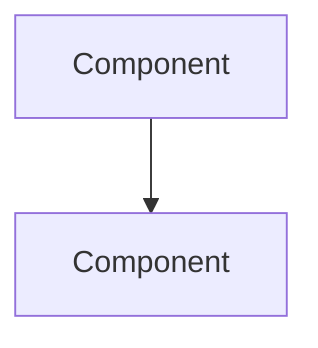

# System Design Knowledge Base - Single-Source Documentation

**THE** centralized content repository for the entire System Design Knowledge Base. All 169 articles, POCs, and interview prep materials live here.

Built with [Nextra](https://nextra.site/) - beautiful, searchable, production-ready documentation.

> **Architecture Note**: This is not just a "docs site" - it's the **single source of truth** for all content. The old root-level folders (01-databases through 12-consistency) have been archived. Everything is here.

## 🚀 Quick Start

### 1. Install Dependencies

```bash
npm install
# or
yarn install
# or
pnpm install
```

### 2. Run Development Server

```bash
npm run dev
# or
yarn dev
# or
pnpm dev
```

Open [http://localhost:3000](http://localhost:3000) in your browser.

### 3. Build for Production

```bash
npm run build
npm start
```

## 📁 Project Structure

### Complete Content Tree

```
docs-site/
├── pages/                           # ALL content lives here (169 files)
│   ├── index.mdx                   # Homepage
│   ├── get-started.mdx             # Learning paths
│   ├── navigation.md               # Navigation guide
│   │
│   ├── system-design/              # 21 articles across 12 topics
│   │   ├── _meta.js               # Navigation configuration
│   │   ├── databases/             # 5 articles
│   │   │   ├── _meta.js
│   │   │   ├── index.md
│   │   │   ├── replication-basics.md
│   │   │   ├── read-replicas.md
│   │   │   ├── sharding-strategies.md
│   │   │   └── indexing-strategies.md
│   │   ├── caching/               # 2 articles
│   │   ├── queues/                # 2 articles
│   │   ├── patterns/              # 2 articles
│   │   ├── case-studies/          # 2 articles
│   │   └── ...                    # 7 more topics (1 article each)
│   │
│   ├── interview-prep/             # 121 files total
│   │   ├── _meta.js
│   │   ├── system-design/         # 34 Q&A articles
│   │   ├── practice-pocs/         # 61 hands-on POCs
│   │   │   ├── redis-*.md        # 25 Redis implementations
│   │   │   ├── database-*.md     # 20 Database POCs
│   │   │   ├── kafka-*.md        # 5 Kafka examples
│   │   │   ├── postgresql-*.md   # 5 PostgreSQL deep dives
│   │   │   └── *-api-*.md        # 6 API implementations
│   │   ├── security-encryption/   # 6 articles
│   │   ├── aws-cloud/            # 6 articles
│   │   ├── database-storage/     # 7 articles
│   │   └── caching-cdn/          # 6 articles
│   │
│   └── problems-at-scale/          # 24 articles across 7 categories
│       ├── _meta.js
│       ├── concurrency/           # 7 articles
│       ├── availability/          # 6 articles
│       ├── scalability/           # 2 articles
│       ├── consistency/           # 2 articles
│       ├── performance/           # 2 articles
│       ├── data-integrity/        # 2 articles
│       └── cost-optimization/     # 2 articles
│
├── public/                         # Static assets
├── theme.config.jsx                # Nextra theme customization
├── next.config.mjs                 # Next.js configuration
└── package.json
```

### Content Breakdown

| Section | Files | Description |
|---------|-------|-------------|
| **System Design** | 21 | Core system design topics across 12 areas |
| **Interview Prep** | 121 | 34 Q&A + 61 POCs + 26 topic articles |
| **Problems at Scale** | 24 | Real production problems across 7 categories |
| **Root Pages** | 3 | Homepage, get-started, navigation |
| **Total** | **169** | All content in one place |

## ✨ Features

- ✅ **Single source of truth** - All 169 articles in one place
- ✅ **Full-text search** - Search across all content
- ✅ **Dark/Light mode** - Toggle theme
- ✅ **Mobile responsive** - Works on all devices
- ✅ **Table of contents** - Auto-generated for each page
- ✅ **Syntax highlighting** - Beautiful code blocks
- ✅ **Reading time** - Estimated time for each article
- ✅ **Breadcrumbs** - Easy navigation
- ✅ **Previous/Next** - Navigate between pages
- ✅ **Mermaid diagrams** - Interactive architecture diagrams

## 🎨 Customization

### Theme Configuration

Edit `theme.config.jsx` to customize:
- Logo
- Colors
- Footer
- Banner
- Navigation

### Content Organization

Edit `_meta.json` files in each directory to control:
- Navigation order
- Section titles
- Icons/emojis

## 📝 Adding Content

### IMPORTANT: This is THE Primary Content Location

All content for the System Design Knowledge Base lives here in `docs-site/pages/`. When adding new content:

### 1. Choose the Right Section

- **System design fundamentals** → `pages/system-design/{topic}/`
- **Interview Q&A** → `pages/interview-prep/system-design/`
- **Practice POCs** → `pages/interview-prep/practice-pocs/`
- **Production problems** → `pages/problems-at-scale/{category}/`

### 2. Create Your File

```bash
# Example: New database article
cd pages/system-design/databases/
touch connection-pooling.md
```

### 3. Use `.md` or `.mdx`

- `.md` for simple markdown content
- `.mdx` for pages with React components

### 4. Update Navigation

Edit the `_meta.js` file in the same directory:

```javascript
export default {
  index: "Overview",
  "replication-basics": "🟢 Replication Basics",
  "connection-pooling": "🟡 Connection Pooling", // Add this
}
```

### 5. Content Automatically Appears

Your new article will automatically appear in the sidebar navigation.

---

### Article Template

```markdown
# Article Title

> Quick 1-2 sentence summary

## Problem Statement
What problem does this solve?

## Real-World Context
When you need this (include numbers: 1M users, 10K QPS, etc.)

## Architecture


## Implementation
[Code examples here]

## Trade-offs
| Approach | Pros | Cons |

## Real Examples
How Netflix, Instagram, etc. use this

## Common Pitfalls
What to avoid

## Key Takeaways
- Point 1
- Point 2
```

---

### POC Template

Practice POCs should include:

```markdown
# Redis Distributed Lock - POC #03

## Problem
Prevent race conditions when multiple servers access shared resources.

## Setup
```bash
npm install ioredis
```

## Implementation
[Working code with detailed comments]

## Testing
[How to test locally]

## Real-World Usage
Used by: Stripe (payment processing), Uber (driver matching)

## Resources
- [Redis SETNX documentation]
- [Redlock algorithm paper]
```

## 🚀 Deployment

### Vercel (Recommended)

```bash
# Install Vercel CLI
npm i -g vercel

# Deploy
vercel
```

### Other Platforms

Build the static site:

```bash
npm run build
```

Deploy the `.next` folder to any static hosting service.

## 🔗 Links

- [Nextra Documentation](https://nextra.site/)
- [Next.js Documentation](https://nextjs.org/docs)
- [Deployment Guide](https://nextra.site/docs/guide/deploy)

## 📊 Features Overview

### Search
Press `Cmd/Ctrl + K` to open search

### Navigation
- Sidebar automatically generated from folder structure
- Collapsible sections
- Difficulty badges (🟢🟡🔴)

### Code Blocks
```javascript
// Automatic syntax highlighting
const example = "Hello World";
```

### Callouts
Use Nextra components for callouts, cards, tabs, and more.

## 💡 Tips

- Use `.mdx` for pages with React components
- Use `.md` for simple markdown content
- Mermaid diagrams work automatically
- All markdown files are symlinked from parent directory

## 🐛 Troubleshooting

**Search not working?**
- Rebuild the search index: `rm -rf .next && npm run dev`

**Styles not loading?**
- Clear Next.js cache: `rm -rf .next`

**Links broken?**
- Check `_meta.json` file paths
- Ensure symbolic links are correct

## 📝 License

MIT License - feel free to use for your own documentation!
