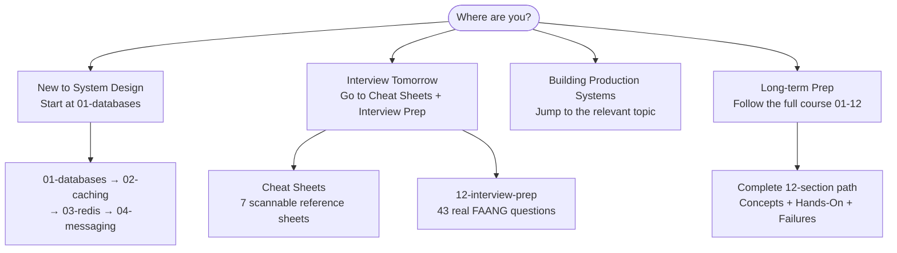

# Start Here

Welcome to the System Design Knowledge Base — a practical, implementation-focused resource for software engineers preparing for system design interviews or leveling up their distributed systems knowledge.

## What's Inside

This site contains **250+ articles** organized into 12 sections:

| Section | What You'll Learn |
|---------|-------------------|
| [01 - Databases](../01-databases) | Replication, sharding, indexing, MVCC |
| [02 - Caching](../02-caching) | Cache strategies, invalidation, CDN |
| [03 - Redis](../03-redis) | 7 concept articles + 27 hands-on POCs |
| [04 - Messaging](../04-messaging) | Kafka, event sourcing, outbox pattern |
| [05 - Distributed Systems](../05-distributed-systems) | CAP, consensus, consistency models |
| [06 - Scalability](../06-scalability) | Consistent hashing, rate limiting, global distribution |
| [07 - API Design](../07-api-design) | REST, GraphQL, gRPC, idempotency |
| [08 - Security](../08-security) | OAuth2, zero-trust, mTLS, encryption |
| [09 - Observability](../09-observability) | Metrics, logs, traces, SLOs, performance |
| [10 - Architecture](../10-architecture) | Circuit breaker, saga, microservices patterns |
| [11 - Real-World](../11-real-world) | Netflix, YouTube, Uber, and 11 more case studies |
| [12 - Interview Prep](../12-interview-prep) | 33+ real questions + quick-reference sheets |

## How to Use This Site

Each section has three sub-sections:
- **Concepts** — theory and mental models
- **Hands-On** — working code you can run
- **Failures** — real production disasters and how to prevent them

## Choose Your Path

See [Learning Paths](./learning-paths) for structured study plans based on your goal.

## Key Numbers to Memorize

See [Back-of-Envelope Estimation](./back-of-envelope) for the numbers every engineer should know.
