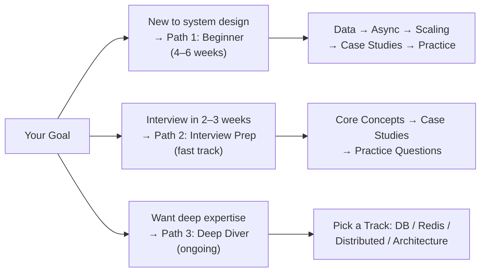

# Learning Paths

Choose the path that matches your goal.

## 🗺️ Quick Overview

*Three structured paths — choose based on how much time you have and what outcome you need.*

---

## Path 1: Beginner (4-6 weeks)

You're new to system design and want to build a solid foundation.

### Week 1: Data Layer
1. [Replication Basics](../01-databases/concepts/replication-basics)
2. [Indexing Strategies](../01-databases/concepts/indexing-strategies)
3. [Sharding Strategies](../01-databases/concepts/sharding-strategies)
4. [Caching Fundamentals](../02-caching/concepts/caching-fundamentals)
5. [Caching Strategies](../02-caching/concepts/caching-strategies)

### Week 2: Async & Communication
1. [Message Queue Basics](../04-messaging/concepts/message-queue-basics)
2. [Kafka vs RabbitMQ](../04-messaging/concepts/kafka-vs-rabbitmq)
3. [REST vs GraphQL vs gRPC](../07-api-design/concepts/rest-graphql-grpc)
4. [Idempotency](../07-api-design/concepts/idempotency)

### Week 3: Scaling
1. [Scaling Basics](../06-scalability/concepts/scaling-basics)
2. [Consistent Hashing](../06-scalability/concepts/consistent-hashing-deep-dive)
3. [Rate Limiting Algorithms](../06-scalability/concepts/rate-limiting-algorithms)
4. [High Availability](../06-scalability/concepts/high-availability)

### Week 4: Distributed Systems Fundamentals
1. [CAP Theorem](../05-distributed-systems/concepts/cap-theorem-practical)
2. [ACID vs BASE](../05-distributed-systems/concepts/acid-vs-base)
3. [Circuit Breaker](../10-architecture/concepts/circuit-breaker)
4. [Microservices Architecture](../10-architecture/concepts/microservices-architecture)

### Week 5: Real-World Case Studies
Pick 5 from [Real-World Systems](../11-real-world):
- [URL Shortener](../11-real-world/url-shortener) — good starter
- [Chat System](../11-real-world/chat-system)
- [News Feed](../11-real-world/news-feed)
- [Rate Limiter](../11-real-world/rate-limiter)
- [Unique ID Generator](../11-real-world/unique-id-generator)

### Week 6: Interview Practice
Work through [Interview Prep](../12-interview-prep) questions.

---

## Path 2: Interview Prep (2-3 weeks)

You have a system design interview coming up and need to prepare fast.

### Days 1-3: Core Concepts
- [Back-of-Envelope Estimation](./back-of-envelope) — memorize key numbers
- [CAP Theorem](../05-distributed-systems/concepts/cap-theorem-practical)
- [Consistent Hashing](../06-scalability/concepts/consistent-hashing-deep-dive)
- [Caching Strategies](../02-caching/concepts/caching-strategies)
- [Database Sharding](../01-databases/concepts/sharding-strategies)
- [Message Queue Basics](../04-messaging/concepts/message-queue-basics)

### Days 4-7: Case Studies
Work through all 14 [Real-World Systems](../11-real-world) case studies.

### Days 8-14: Practice Questions
Work through the [System Design Interview Questions](../12-interview-prep/system-design).

Focus on: URL Shortener, Chat System, Video Streaming, News Feed, Rate Limiter, Notification System

### Days 15-21: Weak Areas + Mock Interviews
Revisit any weak areas and practice explaining designs out loud.

---

## Path 3: Deep Diver (ongoing)

You want deep expertise in distributed systems, not just interview prep.

### Track A: Database Depth
1. All of [01 - Databases Concepts](../01-databases/concepts)
2. [MVCC](../01-databases/concepts/mvcc-concurrency-control) — how PostgreSQL handles concurrency
3. [Write-Ahead Logging](../01-databases/concepts/write-ahead-logging) — durability explained
4. [Distributed Transactions](../01-databases/concepts/distributed-transactions)
5. All hands-on POCs in [01 - Databases Hands-On](../01-databases/hands-on)

### Track B: Redis Mastery
1. All of [03 - Redis Concepts](../03-redis/concepts)
2. All 27 hands-on POCs in [03 - Redis Hands-On](../03-redis/hands-on)

### Track C: Distributed Systems Depth
1. All of [05 - Distributed Systems Concepts](../05-distributed-systems/concepts)
2. [Raft Consensus](../05-distributed-systems/concepts/raft-consensus)
3. [Vector Clocks](../05-distributed-systems/concepts/vector-clocks-logical-time)
4. [Two-Phase Commit](../05-distributed-systems/concepts/two-phase-commit)
5. Study the [Failure Modes](../05-distributed-systems/failures) — learn from production disasters

### Track D: Architecture Patterns
1. All of [10 - Architecture Concepts](../10-architecture/concepts)
2. [Saga Pattern](../10-architecture/concepts/saga-pattern-deep-dive)
3. [Service Mesh](../10-architecture/concepts/service-mesh-architecture)
4. [CQRS](../10-architecture/concepts/cqrs)
5. Study [Failure Modes](../10-architecture/failures)
