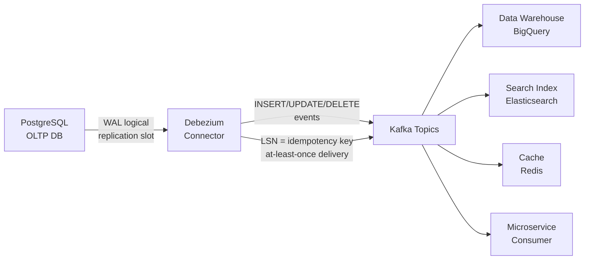
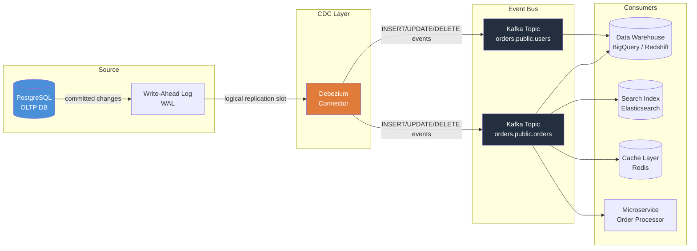

## 🗺️ Quick Overview



*CDC reads the database's own WAL to stream every committed change to downstream systems with near-zero write overhead — eliminating polling, dual-writes, and missed deletes.*

**Without CDC, you are either polling your database to death or shipping stale data to every downstream system.**

## The Problem Class

Modern applications are rarely a single database serving a single app. The moment you add a search index, an analytics warehouse, a cache layer, or a second microservice, you face the same fundamental question: **how does data get from the source of truth to everywhere else?**

The naive approaches each break in a different way:

- **Polling** (`SELECT * FROM orders WHERE updated_at > last_check`): misses deletes, hammers the database, introduces lag proportional to polling interval, and requires every table to have an `updated_at` column.
- **Dual writes** (write to DB then write to Kafka in code): if the app crashes between the two writes, one system has the change and the other does not. You now have a consistency gap you cannot close.
- **Database triggers**: fire on every row change, but run inside the transaction, slowing every write. Hard to manage, nearly impossible to evolve safely across schema changes.

**Change Data Capture (CDC)** solves this by reading the database's own internal write log — the same log the database uses internally for replication and crash recovery. Every committed INSERT, UPDATE, and DELETE appears exactly once, in order, with before and after state. No extra load on the database. No missed events.

## How It Works

### The Three CDC Approaches

| Approach | Mechanism | Pros | Cons |
|---|---|---|---|
| WAL tailing | Reads the database replication log directly | Zero overhead, captures deletes, preserves order | Requires replication privileges, log format is DB-specific |
| Triggers | DB triggers write changes to a side table | Works on any DB, no special access needed | Adds latency to every write, complex to maintain |
| Timestamp polling | `WHERE updated_at > last_seen` query | Simple, no special access | Misses hard deletes, needs `updated_at` column everywhere, polling lag |

WAL tailing is the dominant production approach. Every major database has a replication log:

- **PostgreSQL**: Write-Ahead Log (WAL) with logical decoding
- **MySQL**: Binary Log (binlog)
- **MongoDB**: Oplog (operations log)
- **SQL Server**: Transaction log via CDC feature

### Debezium + Kafka: The De-Facto Stack

Debezium is an open-source CDC platform that tails these logs and publishes structured change events to Kafka. It handles the low-level protocol for each database so you don't have to.



Debezium uses a PostgreSQL **logical replication slot**, which is PostgreSQL's built-in mechanism for streaming WAL changes to an external consumer. The slot guarantees that WAL segments are retained until the consumer acknowledges them — so Debezium will never miss a change even if it restarts.

### What a CDC Event Looks Like

Debezium emits a structured JSON envelope for every change. Here is a real UPDATE on an `orders` table:

```json
{
  "before": {
    "id": 9182,
    "user_id": 441,
    "status": "pending",
    "total_cents": 4999,
    "updated_at": "2026-03-20T10:14:00Z"
  },
  "after": {
    "id": 9182,
    "user_id": 441,
    "status": "shipped",
    "total_cents": 4999,
    "updated_at": "2026-03-20T10:17:43Z"
  },
  "source": {
    "db": "orders",
    "schema": "public",
    "table": "orders",
    "ts_ms": 1742469463000,
    "lsn": 87654321,
    "txId": 750001
  },
  "op": "u",
  "ts_ms": 1742469463217
}
```

Key fields:
- `op`: `c` = create (INSERT), `u` = update, `d` = delete, `r` = read (snapshot)
- `before`: the row state before the change (null for INSERTs)
- `after`: the row state after the change (null for DELETEs)
- `source.lsn`: the WAL position — your idempotency key
- `source.txId`: lets you group events from the same transaction

For a DELETE, `after` is null and `before` holds the last known state.

## Implementation

### Setting Up Debezium with PostgreSQL

**Step 1: Configure PostgreSQL for logical replication**

```sql
-- postgresql.conf changes (require restart)
-- wal_level = logical
-- max_replication_slots = 4
-- max_wal_senders = 4

-- Create a replication user
CREATE USER debezium REPLICATION LOGIN PASSWORD 'debezium_pass';
GRANT SELECT ON ALL TABLES IN SCHEMA public TO debezium;
```

**Step 2: Register the Debezium connector via Kafka Connect REST API**

```bash
curl -X POST http://kafka-connect:8083/connectors \
  -H "Content-Type: application/json" \
  -d '{
    "name": "orders-postgres-cdc",
    "config": {
      "connector.class": "io.debezium.connector.postgresql.PostgresConnector",
      "database.hostname": "postgres-primary",
      "database.port": "5432",
      "database.user": "debezium",
      "database.password": "debezium_pass",
      "database.dbname": "orders",
      "database.server.name": "orders",
      "table.include.list": "public.orders,public.users",
      "plugin.name": "pgoutput",
      "slot.name": "debezium_orders_slot",
      "publication.name": "debezium_publication",
      "topic.prefix": "cdc"
    }
  }'
```

This publishes events to Kafka topics: `cdc.public.orders` and `cdc.public.users`.

**Step 3: Consume CDC events in a downstream service**

```javascript
const { Kafka } = require('kafkajs');

const kafka = new Kafka({ brokers: ['kafka:9092'] });
const consumer = kafka.consumer({ groupId: 'search-indexer' });

async function startCDCConsumer() {
  await consumer.connect();
  await consumer.subscribe({
    topic: 'cdc.public.orders',
    fromBeginning: false
  });

  await consumer.run({
    eachMessage: async ({ message }) => {
      const event = JSON.parse(message.value.toString());

      // Skip tombstone messages (Kafka compaction markers)
      if (!event) return;

      const { op, before, after, source } = event;

      switch (op) {
        case 'c': // INSERT
          await searchIndex.upsert(after.id, toSearchDoc(after));
          break;

        case 'u': // UPDATE
          await searchIndex.upsert(after.id, toSearchDoc(after));
          break;

        case 'd': // DELETE
          await searchIndex.delete(before.id);
          break;

        case 'r': // snapshot read — treat as upsert
          await searchIndex.upsert(after.id, toSearchDoc(after));
          break;
      }

      // Commit offset only after successful processing
      // KafkaJS auto-commits, but you can manage manually for exactly-once semantics
    }
  });
}
```

### Handling Duplicates: At-Least-Once Delivery

CDC gives you **at-least-once delivery** — Debezium may re-send events after a restart. The WAL LSN (`source.lsn`) is your idempotency key.

```javascript
// Track the last processed LSN per table in Redis
async function processWithIdempotency(event) {
  const { source, after, before } = event;
  const idempotencyKey = `cdc:processed:${source.table}:${source.lsn}`;

  // Check if already processed (e.g. after a consumer restart)
  const alreadyProcessed = await redis.get(idempotencyKey);
  if (alreadyProcessed) {
    console.log(`Skipping duplicate event LSN=${source.lsn}`);
    return;
  }

  // Process the event
  await applyChangeToDownstream(event);

  // Mark as processed with a TTL (WAL LSNs are monotonically increasing,
  // so we only need to guard against recent duplicates)
  await redis.set(idempotencyKey, '1', 'EX', 3600);
}
```

For truly exactly-once semantics, write the processed LSN atomically with the business change inside a transaction:

```sql
-- In your consumer's database, store the last processed LSN
BEGIN;
  INSERT INTO search_documents (id, content) VALUES ($1, $2)
  ON CONFLICT (id) DO UPDATE SET content = EXCLUDED.content;

  INSERT INTO cdc_offsets (topic, partition, lsn)
  VALUES ('cdc.public.orders', $partition, $lsn)
  ON CONFLICT (topic, partition) DO UPDATE SET lsn = EXCLUDED.lsn;
COMMIT;
-- On restart, resume from the stored LSN, not from Kafka's offset
```

## Real-World Usage

### LinkedIn — Databus (2012, the original)

LinkedIn built **Databus** to keep their search index and recommendation systems in sync with the member profile database. Before Databus, they polled MySQL every few seconds — at scale this created thundering-herd reads that destabilized the primary.

Databus introduced the concept of tailing the MySQL binlog and publishing changes to an in-memory relay. LinkedIn now processes **hundreds of billions** of CDC events per day across their data infrastructure.

### Uber — Apache Hudi

Uber uses CDC to power **Apache Hudi** (Hadoop Upserts Deletes and Incrementals), which they open-sourced. Their data lake on HDFS needed to handle updates and deletes from their Postgres and Cassandra sources — not just appends.

CDC events from their transactional databases flow into Hudi tables on S3, supporting GDPR delete requests at petabyte scale. Uber processes CDC from **thousands of tables** across their micro-service fleet.

### Netflix — Delta (Flink-based)

Netflix built **Delta**, a CDC-powered data synchronization platform, to keep their Elasticsearch search indexes, Cassandra caches, and Iceberg data lake tables consistent with their MySQL sources.

A key Netflix insight: CDC lag — the delay between a write and when it appears downstream — is a first-class SLO metric. They alert when CDC lag exceeds 30 seconds for customer-facing systems.

### Airbnb — Sqoop to Debezium migration

Airbnb originally used Sqoop (bulk MySQL export) for warehouse ingestion, running full table scans every few hours. This created 2–4 hour data staleness and caused 30-minute spikes in MySQL CPU.

After migrating to Debezium CDC, warehouse data freshness improved from hours to **under 60 seconds**, and MySQL CPU from CDC reads dropped to near zero (WAL reads have negligible overhead compared to full scans).

## Trade-offs

| Aspect | WAL Tailing (Debezium) | Database Triggers | Timestamp Polling |
|---|---|---|---|
| Write overhead | Near-zero | High (in-transaction) | None |
| Captures DELETEs | Yes (full before/after) | Yes | No |
| Schema changes | Breaks consumers (needs schema registry) | Manual trigger updates | Breaks `updated_at` assumption |
| Operational complexity | High (Kafka Connect cluster) | Low | Low |
| Delivery guarantee | At-least-once | At-least-once | At-least-once |
| Ordering guarantee | Per-table ordering | Per-row ordering | None |
| DB version dependency | Yes (WAL format varies) | No | No |
| Cold start / backfill | Snapshot mode built-in | Manual | Query-based |

**Alternatives to Debezium:**
- **AWS DMS** (Database Migration Service) — managed CDC for AWS sources/targets, simpler ops but less flexible
- **Striim** — commercial, real-time data integration with CDC
- **Airbyte** — open-source EL tool with some CDC connectors
- **Fivetran** — managed data pipelines with CDC for SaaS sources

## Common Pitfalls

1. **Schema evolution breaks consumers.** When you rename a column or add a NOT NULL column, the CDC event format changes. Use a **Schema Registry** (Confluent Schema Registry or AWS Glue) with Avro or Protobuf to enforce backward compatibility. Make schema changes using the expand-contract pattern: add the new column (expand), migrate consumers, drop the old column (contract).

2. **WAL retention gaps.** If your Debezium connector is down for longer than the configured WAL retention (`wal_keep_size` in PostgreSQL), the replication slot falls behind and the WAL segments get recycled. The connector cannot resume — you must re-snapshot the entire table. Monitor `pg_replication_slots` and alert on slot lag exceeding 80% of your WAL retention.

3. **Snapshot + stream ordering.** On first start, Debezium takes a snapshot of existing rows before switching to streaming. During snapshot, live writes continue. Without careful handling, you can apply a streaming UPDATE before the snapshot row arrives. Use the snapshot's maximum transaction ID as a fence: ignore streaming events with a lower `txId` than the snapshot boundary.

4. **Large object and TOAST columns.** PostgreSQL only writes changed columns to the WAL by default (`REPLICA IDENTITY DEFAULT`). Unchanged TOAST (large text/binary) columns appear as `__debezium_unavailable_value` in the event. Change to `REPLICA IDENTITY FULL` on tables with large columns if you need complete before/after snapshots — but be aware this increases WAL volume significantly.

5. **CDC lag as a metric, not just a symptom.** Teams often discover CDC lag only when downstream data is visibly stale. Treat CDC consumer lag (measured in bytes behind the WAL head, not just Kafka consumer lag) as a primary SLO. A common target: p99 CDC lag < 5 seconds for cache invalidation, < 60 seconds for analytics.

6. **Cascading consumer failures on high-volume tables.** A single table with a bulk import of 50 million rows will flood the CDC topic. Consumers that cannot keep up will fall behind, their offsets stall, and downstream systems go stale. Use Kafka topic partitioning (by primary key or user ID) so consumers can scale horizontally, and apply back-pressure controls on the connector's `max.batch.size`.

## Key Takeaways

- CDC reads the database's internal replication log to capture every INSERT, UPDATE, and DELETE without adding write overhead.
- Debezium + Kafka is the production standard: PostgreSQL WAL → logical replication slot → Debezium connector → Kafka topic → any number of consumers.
- CDC events carry `before` and `after` state, the table name, LSN (log sequence number), and transaction ID.
- Delivery is at-least-once. Use the WAL LSN as an idempotency key in consumers.
- The three pitfalls to get right upfront: schema evolution (use a schema registry), WAL retention monitoring (alert before the slot gaps), and TOAST column handling (set `REPLICA IDENTITY` appropriately).
- CDC lag — the delay between a write and when it's visible downstream — is a first-class SLO, not an afterthought.
