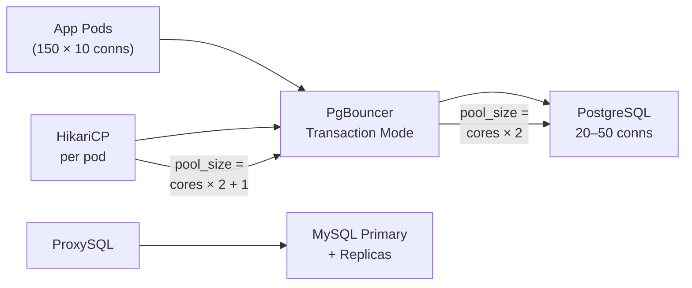
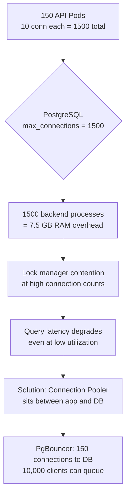
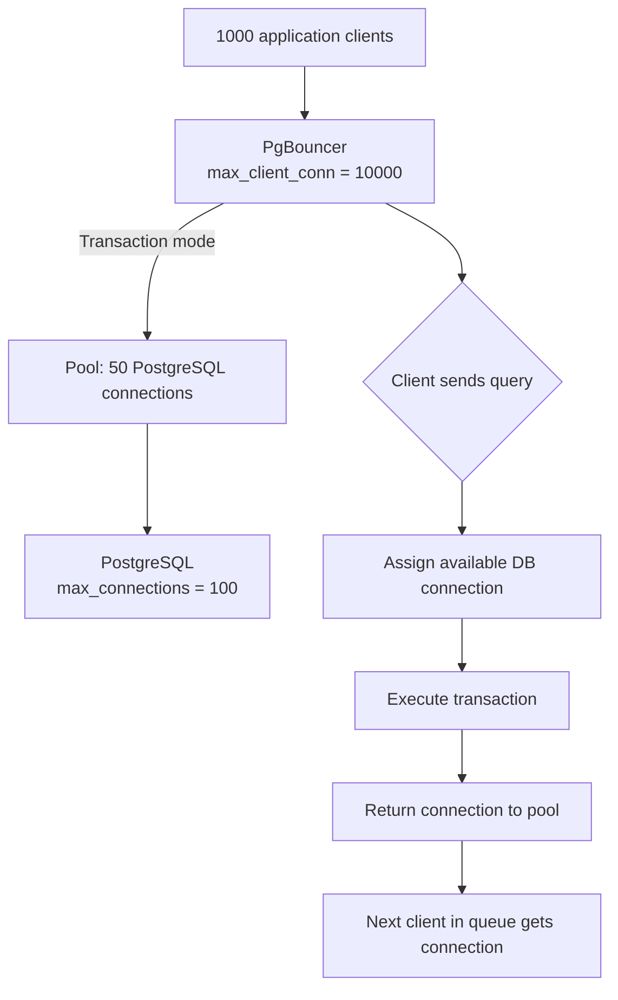
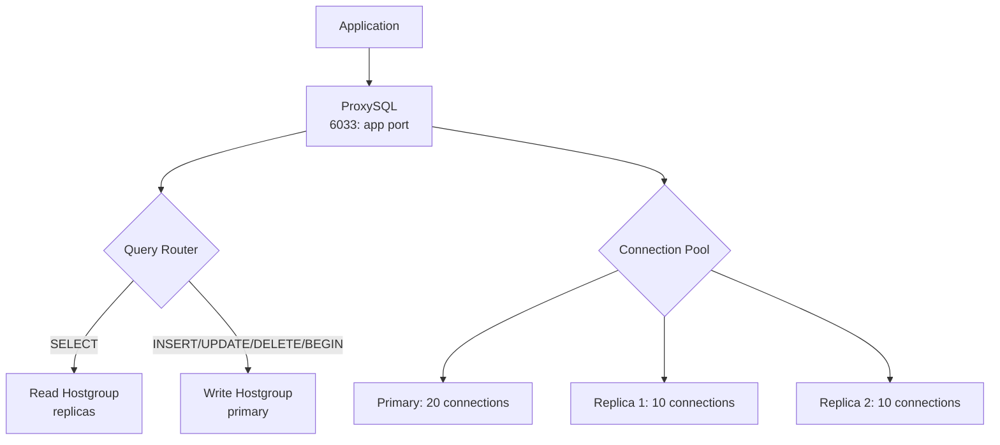
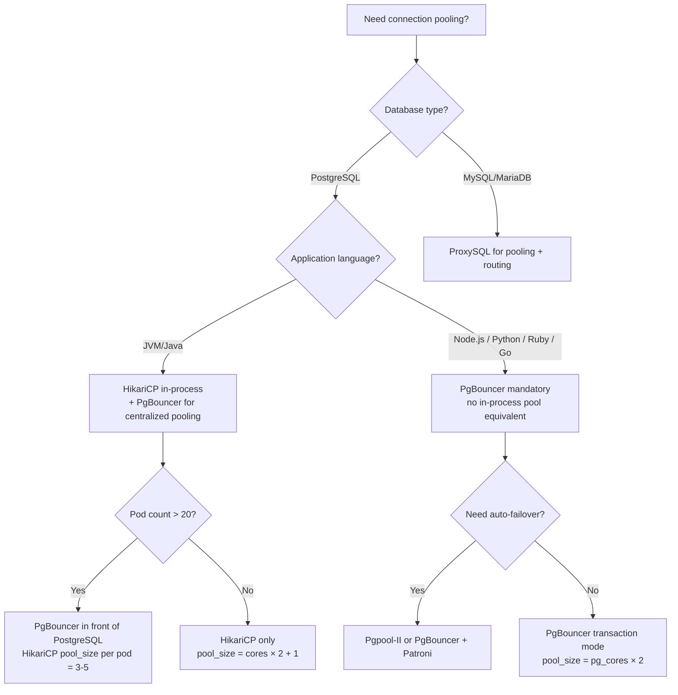

# Database Connection Pooling: PgBouncer, HikariCP, and Pool Sizing at Scale

## 🗺️ Quick Overview



*A centralised pooler like PgBouncer multiplexes thousands of app connections onto a small, right-sized set of real DB connections — preventing the performance cliff at 300+ PostgreSQL connections.*

**PostgreSQL can handle ~300-500 active connections before performance degrades significantly. Your 200-instance Kubernetes deployment wants 10 connections per pod. You just requested 2000 connections — and you're about to make every query slower.** Connection pooling is not optional at scale. But it introduces its own class of failures that are worse than the problem it solves when misconfigured.

---

## The Problem Class `[Mid]`

A typical microservices deployment:
- 150 API server pods
- Each pod uses a connection pool of 10 connections
- Total: 1,500 PostgreSQL connections

PostgreSQL's connection model: **each connection is a separate OS process**. 1,500 connections = 1,500 forked backend processes. At ~5MB RSS per process, that's 7.5GB of RAM just for connection overhead — before your actual query workload.

More critically: PostgreSQL's scheduler and lock manager performance degrades at high connection counts. Benchmark data (from EnterpriseDB):

```
Connections    TPS (simple SELECT)    Latency P99
50             125,000                2ms
200            98,000                 8ms
500            61,000                 45ms
1000           34,000                 120ms
2000           18,000                 380ms
```

You go from 125K TPS to 18K TPS just by having too many connections, with zero actual load increase.



---

## Why the Obvious Solution Fails `[Senior]`

**Approach 1: Just increase max_connections**

Setting `max_connections = 5000` doesn't help — it makes things worse. More connections = more process overhead, more lock contention in shared memory structures. PostgreSQL's internal lock table (`ProcArray`, `LockMethodProcLockHash`) scales poorly beyond 200-300 active workers.

**Approach 2: Connection pool at the application layer only**

HikariCP/DBCP inside each pod helps, but doesn't solve the N×M problem. If you have 200 pods with 10 connections each, you still have 2,000 connections to PostgreSQL. You need a centralized pooler.

**Approach 3: Increase shared_buffers to absorb connection overhead**

`shared_buffers` is PostgreSQL's page cache, not connection memory. Connection overhead is per-process RSS, not in shared memory. Increasing `shared_buffers` doesn't reduce connection count impact.

---

## The Solution Landscape `[Senior]`

### Solution 1: PgBouncer `[Senior]`

**What it is**: A lightweight, single-threaded connection pooler for PostgreSQL. Sits between application and database. Accepts thousands of application connections, maintains a small pool of actual PostgreSQL connections.

**Three pooling modes** — this is the critical decision:

**Session mode**: One PostgreSQL connection is assigned to a client for the lifetime of the client connection. Client connects → gets a PostgreSQL connection. Client disconnects → connection returned to pool. Minimal compatibility issues. Almost no benefit over direct connection if connections are long-lived.

**Transaction mode**: A PostgreSQL connection is assigned for the duration of a single transaction. After `COMMIT` or `ROLLBACK`, the connection is returned to the pool. This is the **sweet spot** for most web applications — connections are held only for milliseconds (transaction duration), not seconds (request duration).

**Statement mode**: Connection released after each individual SQL statement. Only works with autocommit. Incompatible with multi-statement transactions. Rarely used in production.



**How it actually works at depth**:

PgBouncer is single-threaded and uses libevent for async I/O. It maintains a connection queue and connection state machine. When a client sends a query, PgBouncer looks for an idle server connection in the pool. If none available, the client is queued. When a server connection completes a transaction and is returned to the pool, the next queued client is served.

**The non-obvious failure: prepared statements in transaction mode** `[Staff+]`:

PostgreSQL prepared statements (`PREPARE name AS ...`) are server-side objects tied to a specific connection. In transaction mode, your application's connection changes on each transaction. If your ORM uses named prepared statements, they'll fail:

```
ERROR: prepared statement "s1" does not exist
```

**Solutions**:
1. Use `protocol-level prepared statements` via PgBouncer's `prepared_statements = on` (PgBouncer 1.22+, 2024 feature — tracks and re-prepares statements when connection switches)
2. Use `DEALLOCATE ALL` after each transaction (expensive)
3. Use ORM `no-prepare` mode (e.g., Sequelize `?noStmt=true`, Hibernate `hibernate.jdbc.use_get_generated_keys=false`)
4. Use session mode only if application is prepared-statement-heavy

**Sizing guidance** `[Staff+]`:

```
# PgBouncer pool size for PostgreSQL
optimal_pool_size = num_postgresql_cores × 2

# Example: 8-core PostgreSQL server
optimal_pool_size = 16 connections

# With read replicas:
total_pool_size = (primary_pool + sum(replica_pools))
= 16 (primary) + 2 × 8 (replicas) = 32 connections to the cluster

# PgBouncer configuration
[databases]
mydb = host=postgres-primary port=5432 dbname=mydb pool_size=16

[pgbouncer]
max_client_conn = 10000      # application connections
default_pool_size = 16        # DB connections per database
reserve_pool_size = 5         # emergency connections
reserve_pool_timeout = 5      # seconds before using reserve
pool_mode = transaction
server_idle_timeout = 600     # close idle server connections after 10min
client_idle_timeout = 0       # don't close idle client connections (let app manage)
server_connect_timeout = 15   # fail fast if DB unreachable
max_db_connections = 25       # hard cap per database
```

**Failure modes** `[Staff+]`:
- **SET statements lost**: `SET search_path TO myschema` is connection-level. In transaction mode, subsequent transactions may run on a different server connection without the SET applied. Use `search_path` in database config or connection string, not session SET commands.
- **Advisory locks don't work**: `pg_advisory_lock()` is session-scoped. In transaction mode, the lock is released when the connection is returned to pool.
- **LISTEN/NOTIFY broken**: PostgreSQL's pub/sub requires a persistent dedicated connection. Use session mode for LISTEN channels, not the main transaction pool.

**Observability** `[Staff+]`:
```
-- PgBouncer SHOW POOLS:
SHOW POOLS;
-- cl_active: clients executing queries
-- cl_waiting: clients in queue (alert if > 0 sustained)
-- sv_active: server connections in use
-- sv_idle: available server connections
-- maxwait: age of oldest waiting client (alert if > 1s)
-- avg_query: average query time

SHOW STATS;
-- total_xact_count, total_query_count, total_wait_time
```

---

### Solution 2: HikariCP (JVM applications) `[Senior]`

**What it is**: The de-facto standard JDBC connection pool for Java/JVM applications. Default in Spring Boot since 2.x. Known for extremely low latency and minimal lock contention.

**How it actually works at depth**:

HikariCP uses a `ConcurrentBag` data structure — a lock-free connection borrow/return mechanism. Connections are parked per-thread using `ThreadLocal` first, before consulting the shared pool. This eliminates lock contention for the common case (same thread reuses same connection within a request).

**Hikari's pool sizing formula** `[Staff+]`:

Ben Manes (HikariCP author) and the research behind "How I learned to stop worrying and love the pool":

```
pool_size = (core_count × 2) + effective_spindle_count

# For modern SSD systems (effective_spindle_count ≈ 1):
pool_size = (core_count × 2) + 1

# Example: 4-core application server, SSD PostgreSQL:
pool_size = (4 × 2) + 1 = 9

# This is the MAX useful pool size for a single app node.
# More connections than this do NOT improve throughput —
# they increase context switching and lock contention.
```

**Why this seems wrong but is correct**: You might think "more connections = more parallelism = higher throughput." The paradox: database queries spend most of their time waiting for I/O or holding locks. Adding more concurrent connections increases contention at every shared resource (buffer pool, lock manager, WAL writer) without increasing useful throughput.

```yaml
# Spring Boot application.yml HikariCP configuration
spring:
  datasource:
    hikari:
      maximum-pool-size: 10          # Use the formula, not intuition
      minimum-idle: 5                # Keep 5 warm connections ready
      connection-timeout: 3000       # 3 seconds max wait for connection (not query!)
      idle-timeout: 600000           # 10 minutes before idle connection closed
      max-lifetime: 1800000          # 30 minutes max connection lifetime (prevent stale TCP)
      keepalive-time: 60000          # Send keepalive every 60s (detect dead connections)
      leak-detection-threshold: 5000 # Log connections held > 5s (find leaks)
      pool-name: "PrimaryPool"
      # Critical for PgBouncer transaction mode compatibility:
      # connection-init-sql: "SET search_path TO myschema"
      # (runs on connection creation, not per-query)
```

**Sizing guidance** `[Staff+]`:
```
For 50 application pods, each with pool_size=10:
Total DB connections = 50 × 10 = 500

This is often too many. Options:
1. Use PgBouncer between app and DB:
   App pools: 50 × 10 = 500 connections to PgBouncer
   PgBouncer: 20 connections to PostgreSQL
   Net PostgreSQL connections: 20 (from 500)

2. Reduce app pool size:
   50 pods × 4 connections = 200 connections (often sufficient)
   Measure: is pool utilization > 80%? Size up. < 30%? Size down.
```

**Failure modes** `[Staff+]`:
- **Connection leak**: A thread borrows a connection, throws an uncaught exception, and never returns it. Pool exhausts over minutes/hours. `leak-detection-threshold` logs the stack trace of the borrow site after the threshold.
- **Pool starvation under slow queries**: A single slow query (N+1, missing index) holds a connection for 30+ seconds. All other requests queue for a connection. Symptom: `connection-timeout` exceptions spiking while DB CPU is idle.
- **Stale connection after PostgreSQL restart**: If PostgreSQL restarts, existing connections in the pool are broken. HikariCP detects this via `keepalive-time` and `max-lifetime` — but there's a window of failed requests. Fix: `connectionTestQuery: "SELECT 1"` validates connection on borrow.

---

### Solution 3: ProxySQL for MySQL `[Senior]`

**What it is**: An advanced MySQL-compatible proxy that handles connection pooling, query routing (primary vs replica), query caching, and query rewriting — all in one layer.

**How it actually works at depth**:

ProxySQL is multi-threaded (unlike PgBouncer's single-threaded model) and understands the MySQL protocol at the query AST level. It can route `SELECT` queries to read replicas and `INSERT/UPDATE/DELETE` to primary based on query patterns.



**Key ProxySQL features not in PgBouncer**:
- Query rules for routing, rewriting, and blocking (`mysql_query_rules`)
- Connection multiplexing with query cache
- Read/write splitting with transaction stickiness
- Automatic failover with `mysql_replication_hostgroups`

**Sizing guidance** `[Staff+]`:
```
# ProxySQL variables
mysql-max_connections = 2000          # max frontend connections
mysql-max_transaction_time = 14400    # kill transactions > 4 hours
mysql-default_query_timeout = 10000   # kill queries > 10s
mysql-throttle_max_bytes_per_second_to_client = 0  # no throttle
mysql-sessions_sort = 1               # LIFO connection reuse (cache locality)

# Per-hostgroup connection sizing
INSERT INTO mysql_servers (hostgroup_id, hostname, max_connections) VALUES
(1, 'mysql-primary', 20),    -- write hostgroup
(2, 'mysql-replica-1', 15),  -- read hostgroup
(2, 'mysql-replica-2', 15);
```

---

### Solution 4: Pgpool-II `[Senior]`

**What it is**: A more feature-rich PostgreSQL proxy that adds connection pooling + query caching + automatic failover + load balancing in one component.

**When to choose Pgpool-II over PgBouncer**:
- You need built-in automatic failover (Pgpool-II watches PostgreSQL health and promotes standby)
- You need query-level load balancing (route SELECTs to replicas automatically)
- You're willing to accept higher operational complexity

**When to stick with PgBouncer**:
- Pure connection pooling with lowest overhead
- Simplicity and stability (PgBouncer's codebase is ~15K lines; Pgpool-II is ~300K lines)
- Using Patroni or other external HA solution (Pgpool-II's HA is redundant)

---

## Trade-off Matrix `[Senior]` → `[Staff+]`

| Dimension | PgBouncer | HikariCP | ProxySQL | Pgpool-II |
|---|---|---|---|---|
| Protocol support | PostgreSQL only | JVM JDBC | MySQL only | PostgreSQL only |
| Threading model | Single-threaded | Thread-per-pool | Multi-threaded | Multi-process |
| Transaction mode support | Yes | N/A | Yes | Yes |
| Prepared statement support | PgBouncer 1.22+ | Full | Full | Partial |
| Query routing | No | No | Yes | Yes |
| Auto-failover | No | No | Yes (MySQL) | Yes (PG) |
| Operational complexity | Low | Low | Medium | High |
| Max throughput | ~100K qps | per-pod | ~200K qps | ~50K qps |
| Memory footprint | <100MB | JVM heap | 500MB-1GB | 200-500MB |

---

## Decision Framework — When to Pick Each `[Senior]` → `[Staff+]`



---

## Production Failure Story `[Staff+]`

**The prepared statement mode explosion**:

A Node.js fintech application migrated from direct connections to PgBouncer transaction mode to reduce the 800 connections to PostgreSQL down to 20. Testing passed. Deployed to production.

Within 10 minutes: `ERROR: prepared statement "s1" does not exist` errors flooding Sentry. 40% of all database queries failing.

Root cause: The `pg` npm driver by default uses PostgreSQL protocol-level prepared statements (binary `Parse` messages) for query performance. These are named server-side. In transaction mode PgBouncer, the server connection changes between transactions — the prepared statement is gone.

The fix options evaluated:

Option A: `pg_config.statement_timeout = true` — forces simple query protocol (no prepared statements). All queries become string queries. Performance regression of ~15% for frequent small queries.

Option B: Upgrade to PgBouncer 1.22 with `prepared_statements = yes`. This version tracks prepared statements per client and re-issues `PARSE` when a new server connection is assigned. Deployed with zero code changes.

Option C: Session mode PgBouncer. Defeats the connection multiplexing benefit. Rejected.

**They chose Option B** — PgBouncer 1.22 prepared statement tracking. Post-deployment: 0 statement errors, 4x reduction in PostgreSQL connections (800 → 20), 15% write throughput improvement from reduced connection overhead.

**Lesson**: Before migrating to transaction mode, audit every database driver/ORM in your stack for prepared statement usage. pg (Node.js), psycopg2 (Python), lib/pq (Go) all have modes for this.

---

## Observability Playbook `[Staff+]`

```sql
-- PostgreSQL: connection count by state
SELECT state, count(*)
FROM pg_stat_activity
GROUP BY state;

-- Alert if idle_in_transaction > 5 (possible application bug holding connections)
-- Alert if active > 80% of max_connections

-- HikariCP metrics (via Micrometer → Prometheus)
-- hikaricp_connections_active (in use)
-- hikaricp_connections_idle (available)
-- hikaricp_connections_pending (waiting)
-- hikaricp_connection_timeout_total (connections that timed out — CRITICAL metric)
-- hikaricp_connection_acquire_seconds (histogram)

-- PgBouncer: essential monitoring queries
-- SHOW POOLS; — watch cl_waiting and maxwait
-- SHOW STATS; — watch avg_wait_time

-- Connection efficiency ratio
-- target: (sv_active / (sv_active + sv_idle)) > 0.7
-- Under 0.3: pool too large (wasted connections)
-- Over 0.9: pool too small (queuing)
```

**Prometheus alerting rules**:
```yaml
# Pool exhaustion
- alert: HikariPoolExhausted
  expr: hikaricp_connections_pending > 0
  for: 30s
  annotations:
    summary: "Connection pool has waiting requests"

# Connection timeout rate
- alert: HikariConnectionTimeout
  expr: rate(hikaricp_connection_timeout_total[5m]) > 0
  annotations:
    summary: "Connections timing out — pool too small or DB too slow"

# PgBouncer client queue
- alert: PgBouncerClientWaiting
  expr: pgbouncer_pools_cl_waiting > 10
  for: 1m
```

---

## Architectural Evolution `[Staff+]`

**2026 connection pooling landscape**:

**Sidecar pool pattern (Kubernetes)**: The 2026 pattern moves PgBouncer into a sidecar container alongside each application pod. Each pod gets its own PgBouncer instance with `pool_size = 3-5`. Total PostgreSQL connections: `pods × 5 = 200-500` (manageable). No separate PgBouncer deployment to manage. Service mesh (Istio/Linkerd) handles health checking.

**Serverless PostgreSQL and connection pooling**: Neon, PlanetScale, and Supabase have built connection pooling into the cloud layer. Neon's serverless driver uses HTTP/WebSocket connections, eliminating the TCP connection overhead entirely. The 2026 serverless stack: no PgBouncer configuration — the managed platform handles it.

**pgBouncer in Rust (pgDog)**: A new Rust-based PgBouncer-compatible pooler announced in 2024. Multi-threaded (unlike PgBouncer's single-threaded C), eliminating the CPU bottleneck that limits PgBouncer to ~100K qps. Beta in 2025, production-ready in 2026 for high-throughput workloads.

**eBPF connection tracking**: Observability tools using eBPF now provide per-connection query latency histograms at the kernel network layer — without modifying application or database configuration. This enables pool sizing analysis without any instrumentation code.

---

## Decision Framework Checklist `[All Levels]`

- [ ] Calculate total PostgreSQL connections: `pod_count × pool_size_per_pod`; if > 200, deploy PgBouncer
- [ ] Use HikariCP formula: `pool_size = (cores × 2) + 1` per application node — do not use intuition
- [ ] For PgBouncer: start with transaction mode; audit your application for prepared statements first
- [ ] Set `max_db_connections` in PgBouncer to hard-cap regardless of pool configuration
- [ ] Configure `connection-timeout` (not query timeout) in application pool: 3-5 seconds
- [ ] Enable `leak-detection-threshold` in HikariCP: 5000ms catches connection leaks in minutes
- [ ] Monitor `cl_waiting` in PgBouncer: sustained > 0 means pool undersized or queries too slow
- [ ] Test PgBouncer prepared statement behavior in staging before production migration
- [ ] Set `server_idle_timeout` in PgBouncer: 600s closes idle PostgreSQL connections, reduces overhead
- [ ] For Kubernetes: consider sidecar PgBouncer pattern to eliminate centralized pooler SPOF

---
*Written by Gaurav Porwal — 10+ Year Engineer | Tech Lead | Product Owner | Business-Minded Builder*
*Last updated: 2026-03-18*
