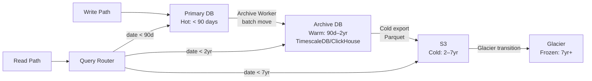
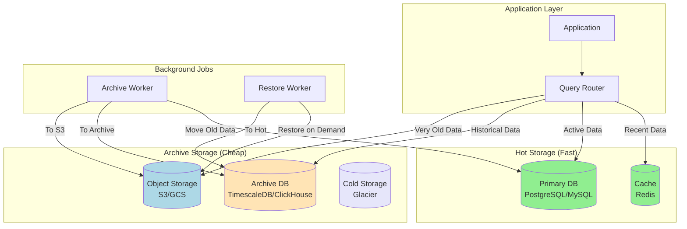
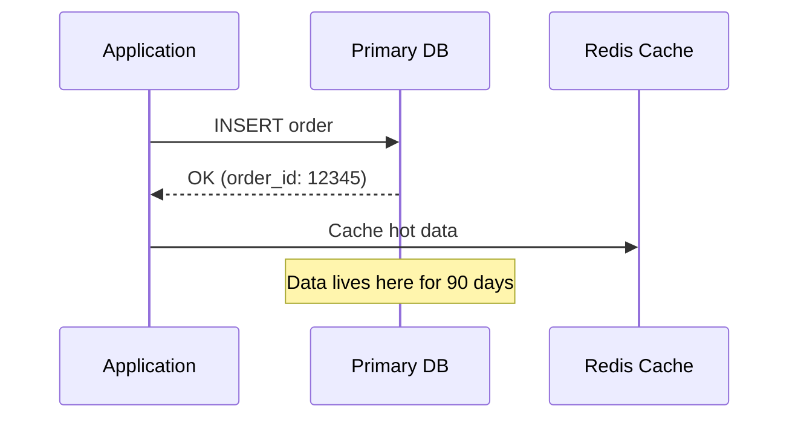
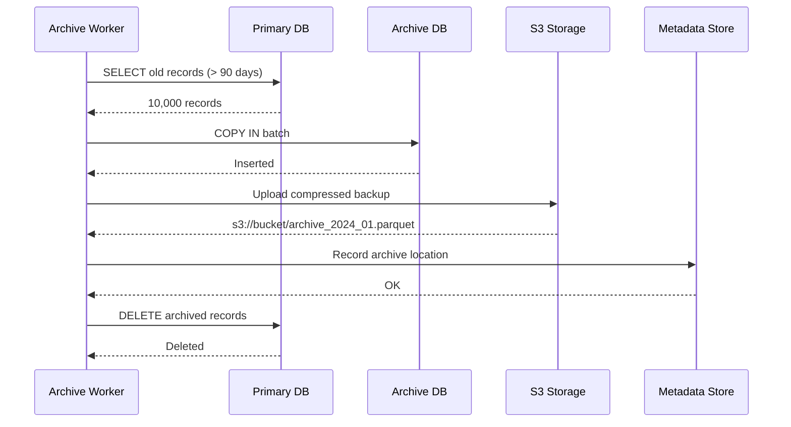
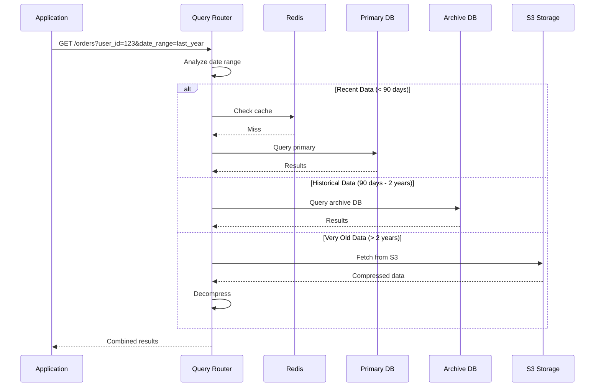

# Data Archival Strategies

**Difficulty**: 🟡 Intermediate
**Reading Time**: 20 minutes
**Prerequisites**: Database basics, partitioning concepts

## 🗺️ Quick Overview



*Data archival moves infrequently accessed rows through progressively cheaper storage tiers — a query router makes this transparent to the application while keeping the primary database lean and fast.*

---

## The Problem

Your database grows unboundedly. Active users need fast queries, but 80% of your data is historical and rarely accessed. Storing everything in your primary database:

- **Degrades performance** - Larger indexes, slower queries
- **Increases costs** - Premium storage for cold data
- **Complicates backups** - Hours to backup/restore terabytes

**The Solution**: Implement a data archival strategy that moves old data to cheaper storage while maintaining query capability when needed.

---

## Real-World Scale

| Company | Active Data | Archived Data | Archival Strategy |
|---------|-------------|---------------|-------------------|
| **Gmail** | 30 days | 15+ years | Colossus tiered storage |
| **Slack** | 90 days | Unlimited | S3 + ElasticSearch |
| **Instagram** | 7 days | Forever | Cassandra + cold storage |
| **Uber** | 30 days | 7 years | Hive data lake |
| **LinkedIn** | 60 days | 10+ years | Espresso + HDFS |

---

## System Architecture

### High-Level Overview



### Data Flow: Write Path



### Data Flow: Archival Process



### Data Flow: Query Path



---

## Implementation Patterns

### Pattern 1: Archive Tables (Same Database)

The simplest approach - move old data to archive tables within the same database.

```sql
-- Active orders table (optimized for writes)
CREATE TABLE orders (
    id BIGSERIAL PRIMARY KEY,
    user_id BIGINT NOT NULL,
    total_amount DECIMAL(10,2),
    status VARCHAR(20),
    created_at TIMESTAMP DEFAULT NOW(),

    -- Indexes for active queries
    INDEX idx_user_orders (user_id, created_at DESC),
    INDEX idx_status (status) WHERE status IN ('pending', 'processing')
);

-- Archive orders table (optimized for reads, no write indexes)
CREATE TABLE orders_archive (
    id BIGINT PRIMARY KEY,  -- No SERIAL, we copy IDs
    user_id BIGINT NOT NULL,
    total_amount DECIMAL(10,2),
    status VARCHAR(20),
    created_at TIMESTAMP,
    archived_at TIMESTAMP DEFAULT NOW(),

    -- Minimal indexes for historical queries
    INDEX idx_archive_user (user_id, created_at DESC)
) WITH (
    -- Use columnar storage for compression
    fillfactor = 100  -- No updates expected
);

-- Archive old orders
CREATE OR REPLACE FUNCTION archive_old_orders()
RETURNS INTEGER AS $$
DECLARE
    rows_archived INTEGER;
BEGIN
    -- Move orders older than 90 days
    WITH archived AS (
        DELETE FROM orders
        WHERE created_at < NOW() - INTERVAL '90 days'
        AND status IN ('completed', 'cancelled')
        RETURNING *
    )
    INSERT INTO orders_archive
    SELECT *, NOW() as archived_at FROM archived;

    GET DIAGNOSTICS rows_archived = ROW_COUNT;
    RETURN rows_archived;
END;
$$ LANGUAGE plpgsql;

-- Query across both tables
CREATE OR REPLACE FUNCTION get_user_orders(
    p_user_id BIGINT,
    p_start_date TIMESTAMP,
    p_end_date TIMESTAMP
)
RETURNS TABLE (
    id BIGINT,
    total_amount DECIMAL,
    status VARCHAR,
    created_at TIMESTAMP,
    source VARCHAR
) AS $$
BEGIN
    -- Check if date range needs archive
    IF p_start_date < NOW() - INTERVAL '90 days' THEN
        -- Query both tables
        RETURN QUERY
        SELECT o.id, o.total_amount, o.status, o.created_at, 'active'::VARCHAR
        FROM orders o
        WHERE o.user_id = p_user_id
          AND o.created_at BETWEEN p_start_date AND p_end_date

        UNION ALL

        SELECT a.id, a.total_amount, a.status, a.created_at, 'archive'::VARCHAR
        FROM orders_archive a
        WHERE a.user_id = p_user_id
          AND a.created_at BETWEEN p_start_date AND p_end_date

        ORDER BY created_at DESC;
    ELSE
        -- Only query active table
        RETURN QUERY
        SELECT o.id, o.total_amount, o.status, o.created_at, 'active'::VARCHAR
        FROM orders o
        WHERE o.user_id = p_user_id
          AND o.created_at BETWEEN p_start_date AND p_end_date
        ORDER BY created_at DESC;
    END IF;
END;
$$ LANGUAGE plpgsql;
```

### Pattern 2: Separate Archive Database

For larger scale, use a dedicated archive database optimized for historical queries.

```python
from datetime import datetime, timedelta
from typing import List, Optional
import asyncio

class ArchivalService:
    """
    Manages data archival between primary and archive databases.

    Architecture:
    - Primary DB: PostgreSQL (hot data, < 90 days)
    - Archive DB: TimescaleDB/ClickHouse (historical, 90 days - 2 years)
    - Cold Storage: S3 Parquet files (> 2 years)
    """

    def __init__(self, primary_db, archive_db, s3_client):
        self.primary_db = primary_db
        self.archive_db = archive_db
        self.s3_client = s3_client
        self.archive_cutoff_days = 90
        self.cold_storage_cutoff_days = 730  # 2 years

    async def archive_old_data(self, table_name: str, batch_size: int = 10000):
        """
        Move old data from primary to archive database.
        Runs as a background job.
        """
        cutoff = datetime.utcnow() - timedelta(days=self.archive_cutoff_days)

        while True:
            # Fetch batch of old records
            records = await self.primary_db.fetch(
                f"""
                SELECT * FROM {table_name}
                WHERE created_at < $1
                ORDER BY created_at ASC
                LIMIT $2
                FOR UPDATE SKIP LOCKED
                """,
                cutoff, batch_size
            )

            if not records:
                break

            # Insert into archive database
            await self.archive_db.copy_records(
                table_name=f"{table_name}_archive",
                records=records
            )

            # Delete from primary
            record_ids = [r['id'] for r in records]
            await self.primary_db.execute(
                f"DELETE FROM {table_name} WHERE id = ANY($1)",
                record_ids
            )

            # Track archival
            await self._record_archival(table_name, len(records))

            # Avoid overwhelming databases
            await asyncio.sleep(0.1)

        return {"table": table_name, "archived_count": total_archived}

    async def move_to_cold_storage(self, table_name: str):
        """
        Move very old data from archive DB to S3 Parquet files.
        """
        cutoff = datetime.utcnow() - timedelta(days=self.cold_storage_cutoff_days)

        # Export to Parquet
        records = await self.archive_db.fetch(
            f"""
            SELECT * FROM {table_name}_archive
            WHERE created_at < $1
            """,
            cutoff
        )

        if not records:
            return

        # Convert to Parquet (columnar, compressed)
        import pyarrow as pa
        import pyarrow.parquet as pq

        table = pa.Table.from_pylist(records)

        # Partition by year/month for efficient queries
        year = cutoff.year
        month = cutoff.month
        s3_key = f"archive/{table_name}/year={year}/month={month}/data.parquet"

        # Upload to S3
        buffer = pa.BufferOutputStream()
        pq.write_table(table, buffer, compression='snappy')

        await self.s3_client.put_object(
            Bucket='data-archive',
            Key=s3_key,
            Body=buffer.getvalue().to_pybytes()
        )

        # Record location for later queries
        await self._record_cold_storage_location(
            table_name, cutoff, s3_key, len(records)
        )

        # Delete from archive DB
        await self.archive_db.execute(
            f"DELETE FROM {table_name}_archive WHERE created_at < $1",
            cutoff
        )


class QueryRouter:
    """
    Routes queries to appropriate storage tier based on date range.

    Tiers:
    1. Cache (Redis) - Last 24 hours, hot data
    2. Primary DB - Last 90 days
    3. Archive DB - 90 days to 2 years
    4. Cold Storage (S3) - 2+ years
    """

    def __init__(self, cache, primary_db, archive_db, s3_client):
        self.cache = cache
        self.primary_db = primary_db
        self.archive_db = archive_db
        self.s3_client = s3_client

    async def query(
        self,
        table_name: str,
        filters: dict,
        date_range: tuple
    ) -> List[dict]:
        """
        Query across all storage tiers transparently.
        """
        start_date, end_date = date_range
        now = datetime.utcnow()

        results = []

        # Determine which tiers to query
        tiers_to_query = self._determine_tiers(start_date, end_date, now)

        # Query each tier in parallel
        tasks = []

        if 'primary' in tiers_to_query:
            tasks.append(self._query_primary(table_name, filters, date_range))

        if 'archive' in tiers_to_query:
            tasks.append(self._query_archive(table_name, filters, date_range))

        if 'cold' in tiers_to_query:
            tasks.append(self._query_cold_storage(table_name, filters, date_range))

        # Wait for all queries
        tier_results = await asyncio.gather(*tasks)

        # Combine and sort results
        for tier_result in tier_results:
            results.extend(tier_result)

        # Sort by date descending
        results.sort(key=lambda x: x['created_at'], reverse=True)

        return results

    def _determine_tiers(self, start_date, end_date, now) -> set:
        """
        Determine which storage tiers need to be queried.
        """
        tiers = set()

        primary_cutoff = now - timedelta(days=90)
        archive_cutoff = now - timedelta(days=730)

        # Check primary (< 90 days)
        if end_date > primary_cutoff:
            tiers.add('primary')

        # Check archive (90 days - 2 years)
        if start_date < primary_cutoff and end_date > archive_cutoff:
            tiers.add('archive')

        # Check cold storage (> 2 years)
        if start_date < archive_cutoff:
            tiers.add('cold')

        return tiers

    async def _query_primary(self, table_name, filters, date_range):
        """Query primary database."""
        start_date, end_date = date_range

        query = f"""
            SELECT *, 'primary' as source
            FROM {table_name}
            WHERE created_at BETWEEN $1 AND $2
        """

        # Add filters
        params = [start_date, end_date]
        for key, value in filters.items():
            query += f" AND {key} = ${len(params) + 1}"
            params.append(value)

        return await self.primary_db.fetch(query, *params)

    async def _query_archive(self, table_name, filters, date_range):
        """Query archive database."""
        start_date, end_date = date_range

        # Archive DB might use different query syntax (ClickHouse, TimescaleDB)
        query = f"""
            SELECT *, 'archive' as source
            FROM {table_name}_archive
            WHERE created_at BETWEEN $1 AND $2
        """

        params = [start_date, end_date]
        for key, value in filters.items():
            query += f" AND {key} = ${len(params) + 1}"
            params.append(value)

        return await self.archive_db.fetch(query, *params)

    async def _query_cold_storage(self, table_name, filters, date_range):
        """
        Query cold storage (S3 Parquet files).
        Uses partition pruning for efficiency.
        """
        start_date, end_date = date_range

        # Find relevant partitions
        partitions = self._get_partitions_for_range(start_date, end_date)

        results = []
        for partition in partitions:
            s3_key = f"archive/{table_name}/year={partition.year}/month={partition.month}/data.parquet"

            try:
                # Use S3 Select for predicate pushdown
                response = await self.s3_client.select_object_content(
                    Bucket='data-archive',
                    Key=s3_key,
                    ExpressionType='SQL',
                    Expression=self._build_s3_select_query(filters, date_range),
                    InputSerialization={'Parquet': {}},
                    OutputSerialization={'JSON': {}}
                )

                # Parse results
                for event in response['Payload']:
                    if 'Records' in event:
                        records = json.loads(event['Records']['Payload'])
                        for record in records:
                            record['source'] = 'cold_storage'
                        results.extend(records)

            except self.s3_client.exceptions.NoSuchKey:
                # Partition doesn't exist
                continue

        return results
```

### Pattern 3: Federated Queries with Foreign Data Wrappers

Use PostgreSQL FDW to query across databases transparently.

```sql
-- Primary database setup
-- Install FDW extension
CREATE EXTENSION IF NOT EXISTS postgres_fdw;

-- Create foreign server pointing to archive database
CREATE SERVER archive_server
    FOREIGN DATA WRAPPER postgres_fdw
    OPTIONS (host 'archive-db.internal', port '5432', dbname 'archive');

-- Create user mapping
CREATE USER MAPPING FOR app_user
    SERVER archive_server
    OPTIONS (user 'archive_reader', password 'secret');

-- Create foreign table (schema must match)
CREATE FOREIGN TABLE orders_archive (
    id BIGINT,
    user_id BIGINT,
    total_amount DECIMAL(10,2),
    status VARCHAR(20),
    created_at TIMESTAMP,
    archived_at TIMESTAMP
)
SERVER archive_server
OPTIONS (schema_name 'public', table_name 'orders_archive');

-- Create a view that combines both
CREATE OR REPLACE VIEW orders_all AS
    -- Active orders
    SELECT id, user_id, total_amount, status, created_at,
           'active' as storage_tier
    FROM orders

    UNION ALL

    -- Archived orders (foreign table)
    SELECT id, user_id, total_amount, status, created_at,
           'archive' as storage_tier
    FROM orders_archive;

-- Query transparently
SELECT * FROM orders_all
WHERE user_id = 123
  AND created_at > '2023-01-01'
ORDER BY created_at DESC;

-- Optimize with partitioned views
CREATE OR REPLACE FUNCTION get_orders_optimized(
    p_user_id BIGINT,
    p_start_date TIMESTAMP,
    p_end_date TIMESTAMP
)
RETURNS SETOF orders_all AS $$
DECLARE
    archive_cutoff TIMESTAMP := NOW() - INTERVAL '90 days';
BEGIN
    -- Only query archive if date range requires it
    IF p_start_date < archive_cutoff THEN
        RETURN QUERY
        SELECT * FROM orders
        WHERE user_id = p_user_id
          AND created_at BETWEEN p_start_date AND p_end_date
        UNION ALL
        SELECT * FROM orders_archive
        WHERE user_id = p_user_id
          AND created_at BETWEEN p_start_date AND p_end_date
        ORDER BY created_at DESC;
    ELSE
        -- Only query active table
        RETURN QUERY
        SELECT * FROM orders
        WHERE user_id = p_user_id
          AND created_at BETWEEN p_start_date AND p_end_date
        ORDER BY created_at DESC;
    END IF;
END;
$$ LANGUAGE plpgsql;
```

---

## Query Router Implementation

The query router is the brain of the archival system - it decides where to fetch data from.

```python
from enum import Enum
from dataclasses import dataclass
from datetime import datetime, timedelta
from typing import List, Dict, Any, Optional
import asyncio


class StorageTier(Enum):
    CACHE = "cache"           # Redis - milliseconds
    HOT = "hot"               # Primary DB - tens of ms
    WARM = "warm"             # Archive DB - hundreds of ms
    COLD = "cold"             # S3 - seconds
    GLACIER = "glacier"       # Glacier - hours


@dataclass
class TierConfig:
    """Configuration for each storage tier."""
    tier: StorageTier
    max_age_days: int         # Data older than this moves to next tier
    latency_sla_ms: int       # Expected query latency
    cost_per_gb: float        # Monthly cost per GB


class SmartQueryRouter:
    """
    Intelligent query router that:
    1. Determines optimal storage tier based on date range
    2. Parallelizes queries across tiers when needed
    3. Handles tier failures gracefully
    4. Tracks query patterns for optimization
    """

    # Storage tier configuration
    TIER_CONFIG = [
        TierConfig(StorageTier.CACHE, 1, 5, 25.0),       # Last 24h
        TierConfig(StorageTier.HOT, 90, 50, 0.50),       # Last 90 days
        TierConfig(StorageTier.WARM, 730, 200, 0.10),    # 90 days - 2 years
        TierConfig(StorageTier.COLD, 2555, 5000, 0.02),  # 2-7 years
        TierConfig(StorageTier.GLACIER, 9999, 3600000, 0.004),  # 7+ years
    ]

    def __init__(self, storage_backends: Dict[StorageTier, Any]):
        self.backends = storage_backends
        self.query_stats = {}  # Track query patterns

    async def query(
        self,
        table: str,
        filters: Dict[str, Any],
        date_range: Optional[tuple] = None,
        limit: int = 1000
    ) -> List[Dict]:
        """
        Execute query across appropriate storage tiers.

        Args:
            table: Table name to query
            filters: Query filters (e.g., {"user_id": 123})
            date_range: (start_date, end_date) tuple
            limit: Maximum records to return

        Returns:
            Combined results from all relevant tiers
        """
        # Determine which tiers to query
        tiers = self._plan_query(date_range)

        # Build queries for each tier
        queries = []
        for tier in tiers:
            backend = self.backends.get(tier)
            if backend:
                queries.append(
                    self._execute_tier_query(
                        tier, backend, table, filters, date_range, limit
                    )
                )

        # Execute in parallel with timeout handling
        results = await asyncio.gather(*queries, return_exceptions=True)

        # Combine successful results
        combined = []
        for tier, result in zip(tiers, results):
            if isinstance(result, Exception):
                # Log error but continue with other tiers
                self._log_tier_error(tier, result)
                continue
            combined.extend(result)

        # Sort and deduplicate
        combined = self._merge_results(combined)

        # Apply limit
        return combined[:limit]

    def _plan_query(self, date_range: Optional[tuple]) -> List[StorageTier]:
        """
        Determine which storage tiers need to be queried.
        Returns tiers in order of expected latency (fastest first).
        """
        if not date_range:
            # No date range - query all tiers
            return [StorageTier.HOT, StorageTier.WARM]

        start_date, end_date = date_range
        now = datetime.utcnow()

        tiers = []

        for config in self.TIER_CONFIG:
            tier_start = now - timedelta(days=config.max_age_days)
            prev_tier_start = now - timedelta(
                days=self.TIER_CONFIG[self.TIER_CONFIG.index(config) - 1].max_age_days
            ) if self.TIER_CONFIG.index(config) > 0 else now

            # Check if date range overlaps with this tier
            if start_date < prev_tier_start and end_date > tier_start:
                tiers.append(config.tier)

        return tiers or [StorageTier.HOT]  # Default to hot if no overlap

    async def _execute_tier_query(
        self,
        tier: StorageTier,
        backend,
        table: str,
        filters: Dict,
        date_range: tuple,
        limit: int
    ) -> List[Dict]:
        """Execute query on specific storage tier."""
        start_time = datetime.utcnow()

        try:
            if tier == StorageTier.CACHE:
                results = await backend.get(
                    self._build_cache_key(table, filters, date_range)
                )
                return results or []

            elif tier == StorageTier.HOT:
                results = await backend.fetch(
                    f"SELECT * FROM {table} WHERE created_at BETWEEN $1 AND $2",
                    date_range[0], date_range[1],
                    filters=filters,
                    limit=limit
                )

            elif tier == StorageTier.WARM:
                results = await backend.fetch(
                    f"SELECT * FROM {table}_archive WHERE created_at BETWEEN $1 AND $2",
                    date_range[0], date_range[1],
                    filters=filters,
                    limit=limit
                )

            elif tier == StorageTier.COLD:
                results = await self._query_s3_parquet(
                    backend, table, filters, date_range, limit
                )

            elif tier == StorageTier.GLACIER:
                # Glacier requires restoration first
                results = await self._query_with_glacier_restore(
                    backend, table, filters, date_range, limit
                )

            # Add tier metadata
            for r in results:
                r['_storage_tier'] = tier.value

            return results

        finally:
            # Track latency
            latency_ms = (datetime.utcnow() - start_time).total_seconds() * 1000
            self._record_query_stats(tier, latency_ms)

    async def _query_s3_parquet(
        self, s3_client, table: str, filters: Dict, date_range: tuple, limit: int
    ) -> List[Dict]:
        """
        Query S3 Parquet files with partition pruning.
        """
        import pyarrow.parquet as pq

        start_date, end_date = date_range
        results = []

        # Generate partition paths
        current = start_date.replace(day=1)
        while current <= end_date:
            path = f"s3://data-archive/{table}/year={current.year}/month={current.month}/"

            try:
                # Use PyArrow for efficient Parquet reading
                dataset = pq.ParquetDataset(
                    path,
                    filters=[
                        ('created_at', '>=', start_date),
                        ('created_at', '<=', end_date),
                        *[(k, '==', v) for k, v in filters.items()]
                    ]
                )

                table = dataset.read()
                results.extend(table.to_pylist())

            except FileNotFoundError:
                continue

            # Move to next month
            current = (current + timedelta(days=32)).replace(day=1)

        return results[:limit]

    def _merge_results(self, results: List[Dict]) -> List[Dict]:
        """
        Merge and deduplicate results from multiple tiers.
        Prefer data from faster tiers (more up-to-date).
        """
        # Deduplicate by ID, keeping first occurrence (faster tier)
        seen_ids = set()
        unique_results = []

        for result in results:
            if result['id'] not in seen_ids:
                seen_ids.add(result['id'])
                unique_results.append(result)

        # Sort by created_at descending
        unique_results.sort(key=lambda x: x['created_at'], reverse=True)

        return unique_results
```

---

## Restoration Patterns

When users need archived data, you need efficient restoration.

### On-Demand Restoration

```python
class ArchiveRestorer:
    """
    Restores archived data to hot storage on demand.

    Patterns:
    1. Lazy restoration - Restore when user requests
    2. Predictive restoration - Restore based on access patterns
    3. Batch restoration - Restore related data together
    """

    async def restore_record(
        self,
        table: str,
        record_id: int,
        restore_to_hot: bool = False
    ) -> Dict:
        """
        Restore a single archived record.

        Args:
            table: Table name
            record_id: ID of record to restore
            restore_to_hot: If True, copy back to hot storage
        """
        # Check archive metadata
        location = await self._find_record_location(table, record_id)

        if not location:
            raise RecordNotFoundError(f"Record {record_id} not in archive")

        # Fetch from appropriate tier
        if location.tier == StorageTier.WARM:
            record = await self._fetch_from_archive_db(table, record_id)
        elif location.tier == StorageTier.COLD:
            record = await self._fetch_from_s3(location.s3_key, record_id)
        elif location.tier == StorageTier.GLACIER:
            record = await self._restore_from_glacier(location.s3_key, record_id)

        # Optionally restore to hot storage
        if restore_to_hot:
            await self._copy_to_hot_storage(table, record)

        return record

    async def restore_user_data(
        self,
        user_id: int,
        date_range: tuple,
        tables: List[str]
    ) -> Dict[str, List]:
        """
        Restore all archived data for a user.
        Useful for data export requests (GDPR).
        """
        results = {}

        for table in tables:
            # Find all archived records for user
            archived_ids = await self._find_user_archived_records(
                table, user_id, date_range
            )

            if not archived_ids:
                continue

            # Batch restore
            records = await self._batch_restore(table, archived_ids)
            results[table] = records

        return results

    async def _restore_from_glacier(
        self,
        s3_key: str,
        record_id: int,
        tier: str = 'Expedited'
    ) -> Dict:
        """
        Restore from Glacier storage.

        Tiers:
        - Expedited: 1-5 minutes, $0.03/GB
        - Standard: 3-5 hours, $0.01/GB
        - Bulk: 5-12 hours, $0.0025/GB
        """
        # Initiate restore
        await self.s3_client.restore_object(
            Bucket='data-archive',
            Key=s3_key,
            RestoreRequest={
                'Days': 1,
                'GlacierJobParameters': {
                    'Tier': tier
                }
            }
        )

        # Wait for restore (poll or use S3 event notification)
        if tier == 'Expedited':
            # Poll for completion
            for _ in range(60):  # 5 minutes max
                response = await self.s3_client.head_object(
                    Bucket='data-archive',
                    Key=s3_key
                )

                if response.get('Restore', '').startswith('ongoing-request="false"'):
                    break

                await asyncio.sleep(5)
        else:
            # For longer restores, return job ID
            raise RestoreInProgressError(
                "Glacier restore initiated. Data will be available in 3-5 hours.",
                job_id=response['RestoreJobId']
            )

        # Fetch restored object
        return await self._fetch_from_s3(s3_key, record_id)
```

---

## Monitoring and Alerting

```python
class ArchivalMetrics:
    """
    Metrics for monitoring archival system health.
    """

    def __init__(self, metrics_client):
        self.metrics = metrics_client

    async def record_archival_job(
        self,
        table: str,
        records_archived: int,
        bytes_archived: int,
        duration_seconds: float
    ):
        """Record archival job metrics."""
        self.metrics.gauge(
            'archival.records_archived',
            records_archived,
            tags={'table': table}
        )
        self.metrics.gauge(
            'archival.bytes_archived',
            bytes_archived,
            tags={'table': table}
        )
        self.metrics.histogram(
            'archival.job_duration_seconds',
            duration_seconds,
            tags={'table': table}
        )

    async def record_query_routing(
        self,
        table: str,
        tiers_queried: List[str],
        latency_ms: float,
        records_returned: int
    ):
        """Record query routing metrics."""
        for tier in tiers_queried:
            self.metrics.increment(
                'query_router.tier_queries',
                tags={'table': table, 'tier': tier}
            )

        self.metrics.histogram(
            'query_router.latency_ms',
            latency_ms,
            tags={'table': table, 'tiers': ','.join(tiers_queried)}
        )

    async def check_archival_health(self) -> Dict:
        """
        Health check for archival system.
        Returns alerts if issues detected.
        """
        alerts = []

        # Check archival lag
        for table in ['orders', 'events', 'logs']:
            lag = await self._get_archival_lag(table)
            if lag > timedelta(days=7):
                alerts.append({
                    'severity': 'warning',
                    'message': f'{table} archival lag: {lag.days} days'
                })

        # Check storage tier sizes
        hot_size = await self._get_tier_size(StorageTier.HOT)
        if hot_size > 500 * 1024**3:  # 500 GB
            alerts.append({
                'severity': 'critical',
                'message': f'Hot storage size {hot_size/1024**3:.0f}GB exceeds threshold'
            })

        # Check restore queue
        pending_restores = await self._get_pending_restores()
        if pending_restores > 100:
            alerts.append({
                'severity': 'warning',
                'message': f'{pending_restores} pending Glacier restores'
            })

        return {
            'healthy': len(alerts) == 0,
            'alerts': alerts
        }
```

---

## Trade-offs

| Approach | Latency | Cost | Complexity | Data Availability |
|----------|---------|------|------------|-------------------|
| **Same DB Archive Tables** | ⭐⭐⭐⭐ Fast | ⭐⭐ Moderate | ⭐⭐⭐⭐⭐ Simple | ⭐⭐⭐⭐⭐ Immediate |
| **Separate Archive DB** | ⭐⭐⭐ Moderate | ⭐⭐⭐ Good | ⭐⭐⭐ Moderate | ⭐⭐⭐⭐ Fast |
| **S3 Cold Storage** | ⭐⭐ Slow | ⭐⭐⭐⭐ Excellent | ⭐⭐ Complex | ⭐⭐⭐ Seconds |
| **Glacier Deep Archive** | ⭐ Very Slow | ⭐⭐⭐⭐⭐ Best | ⭐⭐ Complex | ⭐ Hours |

---

## When to Use Each Pattern

**Archive Tables (Same DB)**:
- Small to medium data volumes (< 1TB)
- Frequent historical queries
- Need ACID guarantees on archive data
- Simple implementation preferred

**Separate Archive Database**:
- Large data volumes (1-10TB)
- Historical queries with different patterns (OLAP)
- Need different optimization (columnar storage)
- Compliance requires separate data stores

**S3 Cold Storage**:
- Very large data volumes (10TB+)
- Rare access to historical data (< 1% queries)
- Long retention requirements (7+ years)
- Cost optimization is primary goal

**Glacier Deep Archive**:
- Compliance/legal hold data
- Accessed less than once per year
- Multi-year retention (10+ years)
- Cost is critical, latency is not

---

## Key Takeaways

1. **Data has a lifecycle** - Design storage tiers that match access patterns
2. **Query routing is critical** - Route queries to the right tier automatically
3. **Archival is not deletion** - Data should be recoverable when needed
4. **Monitor archival lag** - Ensure background jobs keep up with data growth
5. **Plan for restoration** - Define SLAs for retrieving archived data
6. **Partition for pruning** - Use time-based partitions for efficient queries
7. **Cost vs latency tradeoff** - Cheaper storage means slower access

---

## Further Reading

- [Storage Bloat Solutions](/problems-at-scale/cost-optimization/storage-bloat)
- [Table Partitioning](/interview-prep/practice-pocs/database-partitioning)
- [Storage Cost Optimization](/interview-prep/system-design/instagram-assets-series/07-storage-cost-optimization)
