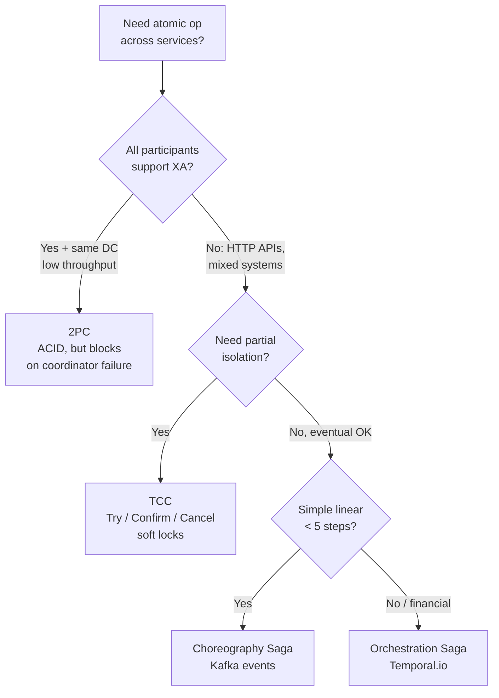
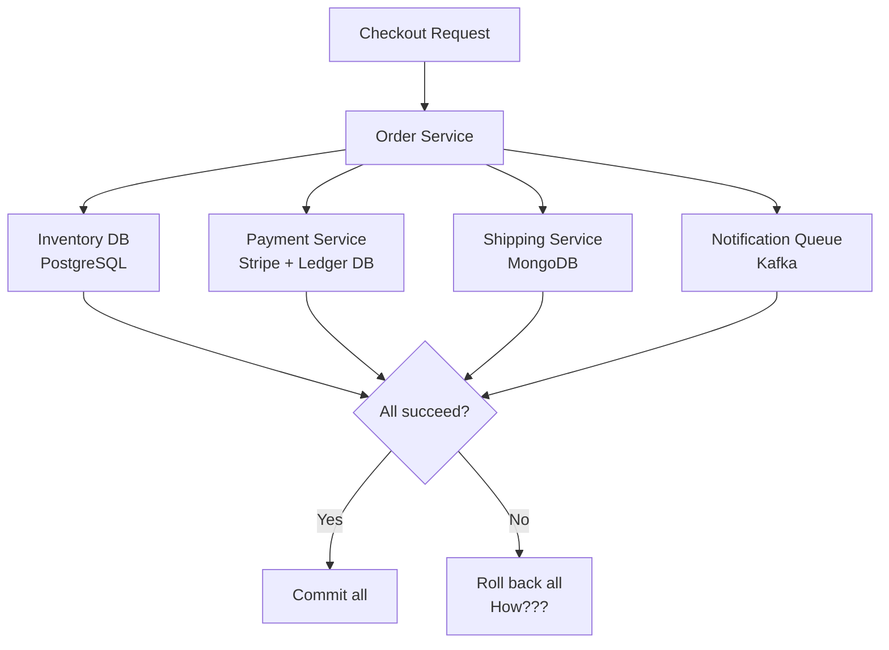
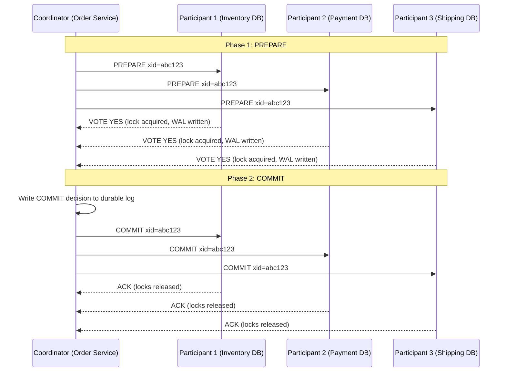
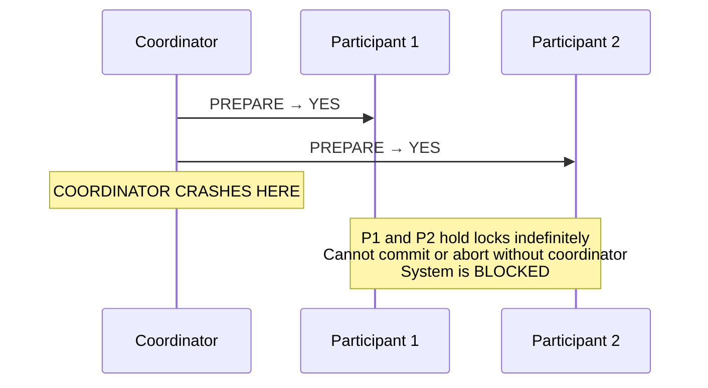
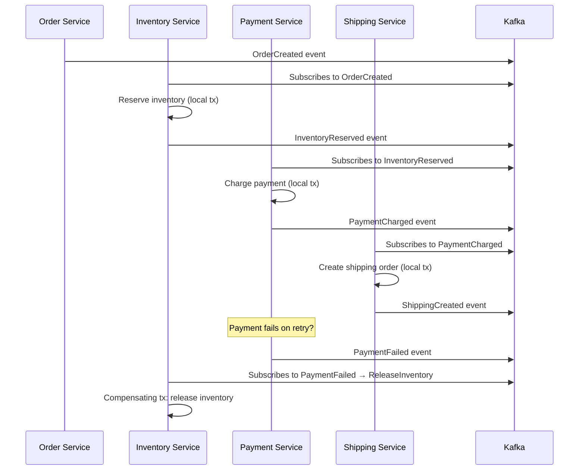
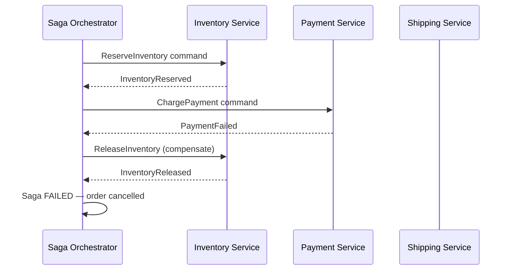
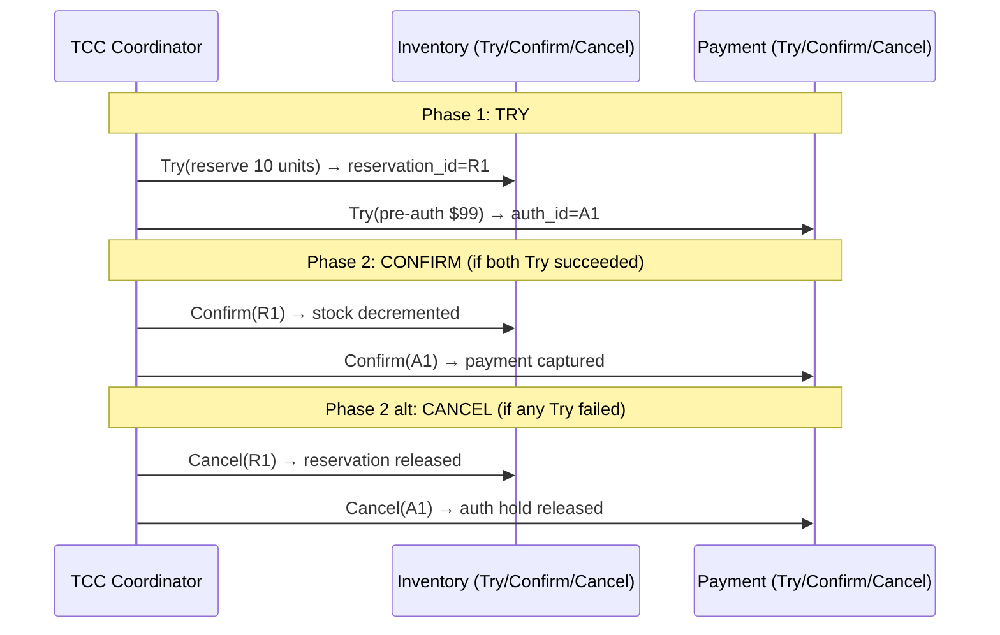
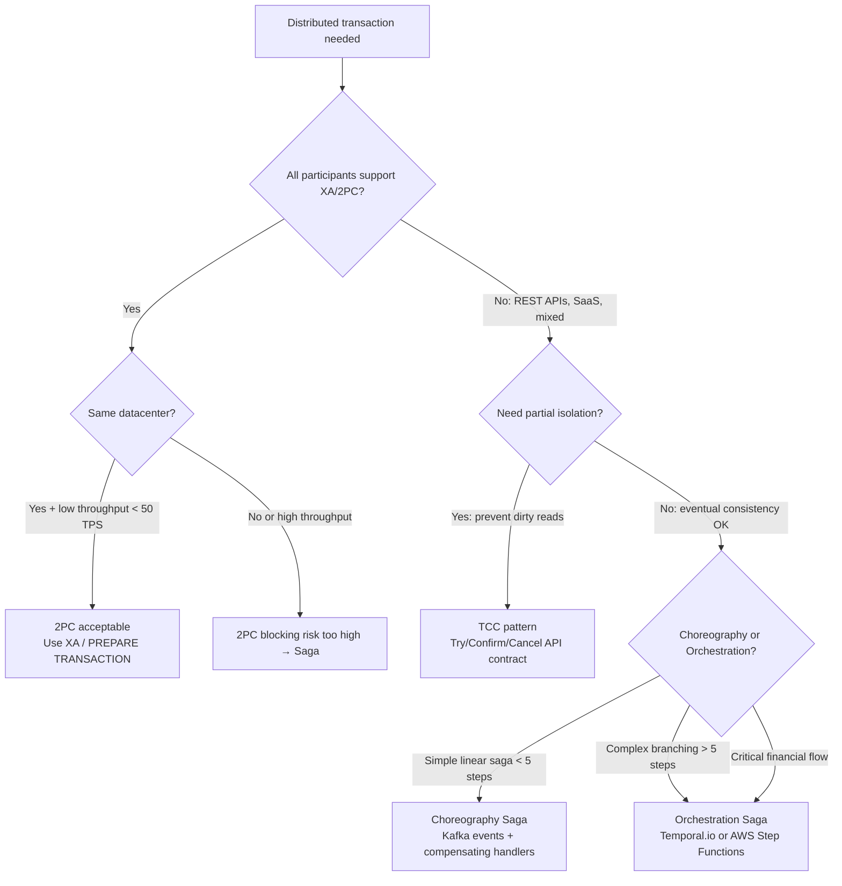

# Distributed Transactions: 2PC, Saga, and TCC at Production Scale

## 🗺️ Quick Overview



*There is no distributed transaction that is both consistent and available — choose 2PC for strong isolation in same-DC XA systems, or Saga/TCC for heterogeneous microservices that need eventual consistency.*

**The moment you split a transaction across two databases, you've made a bet.** Either you accept the complexity of distributed coordination (2PC, TCC) or you accept eventual consistency and compensating logic (Saga). There is no third option. Engineers who try to find one end up with distributed systems that are neither consistent nor available.

This article is about making that bet deliberately.

---

## The Problem Class `[Mid]`

An e-commerce checkout must atomically:
1. Deduct inventory from the warehouse service (PostgreSQL)
2. Charge the customer's payment method (Stripe API + internal ledger)
3. Create a shipping order (MongoDB)
4. Send a confirmation event to the notification service (Kafka)

All four operations must either all succeed or all fail. A customer cannot be charged for an out-of-stock item. A shipping order cannot be created without successful payment. This is a **distributed transaction** spanning four heterogeneous systems.



The rollback case is where the complexity lives. PostgreSQL has `ROLLBACK`. Stripe has a `refund` API call. MongoDB has no concept of cross-service rollback. Kafka messages are already produced.

---

## Why the Obvious Solution Fails `[Senior]`

**Approach: Sequential operations with manual rollback**

```python
def checkout(order):
    inventory_reserved = False
    payment_charged = False

    try:
        reserve_inventory(order)       # Step 1
        inventory_reserved = True

        charge_payment(order)          # Step 2
        payment_charged = True

        create_shipping(order)         # Step 3
        publish_confirmation(order)    # Step 4
    except Exception as e:
        if payment_charged:
            refund_payment(order)      # What if this fails?
        if inventory_reserved:
            release_inventory(order)   # What if this fails?
        raise
```

Problems:
1. **Partial failure during rollback**: If `refund_payment()` fails (Stripe timeout), you have a charged customer with no order.
2. **No atomicity**: Between Step 1 and Step 2, another process could read the reserved inventory and make decisions based on it.
3. **No isolation**: The inventory is visible as "reserved" from Step 1 onwards; other services see the intermediate state.
4. **Kafka messages can't be unproduced**: Once published, the notification event is permanent.

This is not a recoverable architecture. You need a protocol.

---

## The Solution Landscape `[Senior]`

### Solution 1: Two-Phase Commit (2PC) `[Senior]`

**What it is**: A distributed atomic commitment protocol. A coordinator asks all participants to "prepare" (guarantee they can commit), then issues a global "commit" or "rollback".

**How it actually works at depth**:



In PostgreSQL, this is `PREPARE TRANSACTION 'xid'` followed by `COMMIT PREPARED 'xid'` — or `ROLLBACK PREPARED 'xid'` if any participant votes NO.

**The critical property**: Once a participant votes YES in Phase 1, it has written the prepared state to WAL and holds locks on all affected rows. It **cannot unilaterally abort** — it must wait for the coordinator's Phase 2 decision. This is the **blocking problem**.

**The coordinator failure problem** `[Staff+]`:



This is the fundamental 2PC flaw: if the coordinator fails after Phase 1 but before sending Phase 2, participants are blocked indefinitely with rows locked. This is not theoretical — it happens on network partitions, coordinator OOM kills, and during deployments.

**Sizing guidance** `[Staff+]`:
- Lock hold time in 2PC = network RTT × 2 + coordinator decision time
- At 10ms cross-datacenter RTT: ~30-50ms lock hold time per 2PC transaction
- Acceptable for: < 100 concurrent distributed transactions on a table
- Not acceptable for: high-throughput tables with > 500 concurrent distributed transactions (lock contention dominates)

**Configuration decisions that matter** `[Staff+]`:
```sql
-- PostgreSQL prepared transaction configuration
max_prepared_transactions = 100   -- default 0 (disabled); set to max_connections
-- WARNING: prepared transactions that are never resolved hold locks forever
-- Monitor: SELECT gid, prepared, owner, database FROM pg_prepared_xacts

-- Alert if any prepared transaction is > 30 seconds old (coordinator failure indicator)
SELECT gid, age(now(), prepared) AS age
FROM pg_prepared_xacts
WHERE prepared < now() - interval '30 seconds';
```

**Failure modes** `[Staff+]`:
- **In-doubt transactions**: Coordinator crashes after PREPARE but before COMMIT. Participants hold locks until DBA manually resolves. On AWS RDS, this requires a support ticket. **Prevention**: coordinator must write decision to durable storage before sending Phase 2.
- **Network partition causing asymmetric commit**: Coordinator sends COMMIT to P1 (succeeds) but not to P2 (network timeout). P1 committed, P2 still prepared. Requires reconciliation logic or manual intervention.
- **XA transaction leaks**: Java EE/Jakarta EE XA resources (JTA) that are never committed leave prepared transactions in the database. This is extremely common in enterprise Java applications.

**When 2PC is acceptable** `[Staff+]`:
- Same data center (RTT < 1ms, network partition probability low)
- Low transaction rate (< 50 concurrent distributed transactions)
- Homogeneous systems that all support XA/2PC (PostgreSQL + PostgreSQL, not PostgreSQL + Stripe)
- Recovery coordinator is HA (not a single JVM process)

---

### Solution 2: Saga Pattern `[Senior]`

**What it is**: Break the distributed transaction into a sequence of local transactions, each with a corresponding compensating transaction that reverses its effect.

**Choreography Saga** (event-driven, decentralized):



**Orchestration Saga** (centralized coordinator manages state):



**How it actually works at depth**:

Each step in a saga is a local ACID transaction. The saga itself provides **ACD** (Atomicity through compensation, Consistency via business rules, Durability) but NOT isolation — intermediate states are visible to other transactions.

The **compensating transaction** is not a simple rollback. It's a new forward-moving transaction that undoes the business effect:
- Reserve inventory → compensate: Release inventory
- Charge payment → compensate: Issue refund
- Create shipping → compensate: Cancel shipment (if not yet picked)

**Critical property**: Compensating transactions must be idempotent. Network failures mean they may be executed multiple times.

**Sizing guidance** `[Staff+]`:
- Saga completion time = sum of all step latencies + messaging overhead
- With Kafka and 5 steps at 20ms each: ~100ms nominal, but P99 includes retry delays
- Compensating transaction budget: each compensation adds latency to failure path
- State storage: orchestration sagas require durable state (Redis with persistence or PostgreSQL) for exactly-once execution guarantees

**Configuration decisions that matter** `[Staff+]`:
```
# Temporal.io workflow for Saga orchestration (2026 standard)
# Defines retries, timeouts, compensation at the framework level

@workflow.defn
class CheckoutSaga:
    @workflow.run
    async def run(self, order: Order) -> Result:
        # Each activity has its own retry policy and timeout
        inventory = await workflow.execute_activity(
            reserve_inventory,
            order,
            start_to_close_timeout=timedelta(seconds=5),
            retry_policy=RetryPolicy(maximum_attempts=3)
        )

        try:
            payment = await workflow.execute_activity(
                charge_payment,
                order,
                start_to_close_timeout=timedelta(seconds=10),
            )
        except ActivityError:
            await workflow.execute_activity(
                release_inventory,  # compensation
                inventory.reservation_id,
                start_to_close_timeout=timedelta(seconds=5),
            )
            raise
```

**Failure modes** `[Staff+]`:
- **Compensation failure**: The compensating transaction also fails. Now you have a half-completed saga with no way to compensate automatically. Requires a **saga dead-letter queue** and manual intervention or a "pivot transaction" approach.
- **Dirty reads (lack of isolation)**: Between "inventory reserved" and "payment charged," other sagas can read the reserved inventory state. If your business logic isn't designed for this, you get phantom availability.
- **Duplicate compensation**: Network timeout on compensation acknowledgment causes re-execution. If compensation is not idempotent (e.g., `refund()` charges the refund twice), you have a new consistency violation. **Fix**: idempotency keys on all compensating API calls.
- **Lost messages (choreography)**: A Kafka consumer crashes between consuming the event and committing the local transaction. The message is re-processed. Local transaction must be idempotent (outbox pattern solves this).

---

### Solution 3: Try-Confirm-Cancel (TCC) `[Senior]`

**What it is**: A two-phase approach at the business logic level. Phase 1 (Try) reserves resources. Phase 2 (Confirm or Cancel) finalizes or releases.

**How it actually works at depth**:

Unlike 2PC (which operates at the database protocol level), TCC is a business-level API pattern. Each service exposes three endpoints:

```
POST /inventory/try      → Reserve 10 units (soft lock, not final)
POST /inventory/confirm  → Finalize the reservation (decrement stock)
POST /inventory/cancel   → Release the reservation (undo the soft lock)

POST /payment/try        → Pre-authorize charge (hold on card, not charged)
POST /payment/confirm    → Capture the pre-authorized charge
POST /payment/cancel     → Release the authorization hold
```



**Advantages over Saga**:
- Resources are soft-locked during Try phase: better isolation than pure Saga
- Cancel is always possible (Try never makes final changes)
- Simpler compensation: Cancel undoes Try directly, no complex business logic

**Advantages over 2PC**:
- Non-blocking: coordinator failure doesn't hold database locks indefinitely
- Works with non-database resources (HTTP APIs, Stripe pre-authorization)

**Sizing guidance** `[Staff+]`:
- Try reservation timeout: must be set per resource type. Default: 30 seconds.
- If Confirm/Cancel not received within timeout: resource auto-releases (timeout-based compensation)
- Coordinator timeout must be shorter than resource reservation timeout

**Failure modes** `[Staff+]`:
- **Dangling reservations**: Coordinator crashes after Try but before Confirm/Cancel. Resources stay soft-locked until timeout. **Fix**: every Try creates a reservation with an explicit TTL. Resources self-release after TTL.
- **Confirm after Cancel**: Race condition: Cancel arrives at service before Confirm (out-of-order network). Service must track state machine: `TRIED → CONFIRMED` and `TRIED → CANCELLED` are valid; `CANCELLED → CONFIRMED` is not.
- **Try partial failure**: I.Try succeeds, P.Try fails. Must Cancel I. If I.Cancel fails: same problem as Saga compensation failure.

---

## XA Transactions `[Staff+]`

**What it is**: The X/Open XA standard for distributed transactions. Implemented by most enterprise databases (PostgreSQL, MySQL, Oracle) and message brokers (ActiveMQ). Used by Java EE/JTA transaction managers (Atomikos, Narayana, Bitronix).

**When XA is appropriate**:
- All participants support XA (PostgreSQL, MySQL, Oracle, IBM MQ)
- Low transaction rate (< 50 concurrent XA transactions per participating database)
- Enterprise Java stack with JTA-compatible transaction manager

**Production reality**: XA in microservices is almost never appropriate. The participants (REST APIs, Kafka, NoSQL stores) don't support XA. The blocking failure mode is unacceptable at web scale.

---

## Trade-off Matrix `[Senior]` → `[Staff+]`

| Dimension | 2PC | Saga (Choreography) | Saga (Orchestration) | TCC |
|---|---|---|---|---|
| Isolation | Full (ACID) | None (ACD only) | None (ACD only) | Partial (soft locks) |
| Blocking on failure | Yes (coordinator) | No | No | No |
| Works with HTTP APIs | No | Yes | Yes | Yes |
| Compensation complexity | Simple (ROLLBACK) | High (business logic) | Medium (centralized) | Low (Cancel endpoint) |
| State visibility | DB protocol | Service state | Orchestrator DB | Reservation state |
| Failure observability | pg_prepared_xacts | Dead letter queue | Orchestrator dashboard | Reservation timeouts |
| Latency overhead | 2 × RTT | Async (low sync cost) | Async + orchestrator | 2 × RTT (sync) |
| Participant support | XA-capable only | Any | Any | Any (with API contract) |
| Cross-language/system | Limited | Any | Any | Any |

---

## Decision Framework — When to Pick Each `[Senior]` → `[Staff+]`



---

## Production Failure Story `[Staff+]`

**The inventory double-refund incident**:

A mid-size e-commerce platform used a choreography Saga for checkout. The Saga steps:
1. `OrderCreated` → Inventory: reserve stock
2. `InventoryReserved` → Payment: charge card
3. `PaymentFailed` → Inventory: release stock (compensation)

Under normal conditions: worked perfectly for 18 months.

**The incident**: A DynamoDB write timeout on Step 2 (Payment service failed to record the charge status). The Payment service treated this as `PaymentFailed` and published the event. The Inventory service released the stock (compensation fired).

But the DynamoDB write had actually succeeded — the payment was charged to the customer. The `PaymentFailed` event was incorrect. Now: customer was charged, inventory released, order cancelled. Customer calls support: "I was charged but my order was cancelled."

**Root cause**: The Payment service did not distinguish between "payment rejected by card network" and "our internal storage failed to record the payment." Both mapped to `PaymentFailed`.

**Fix**:
1. Distinguish failure types: `PaymentDeclined` (customer-facing, compensate) vs `PaymentServiceUnavailable` (infrastructure, retry)
2. Add idempotency keys to charge API: `stripe.charges.create(idempotencyKey=order_id)` — duplicate call returns original result
3. Add dead-letter queue for unresolved saga state: humans review ambiguous outcomes

**Lesson**: Saga compensation must only fire on semantically confirmed failures, not infrastructure errors. Infrastructure errors should retry, not compensate.

---

## Observability Playbook `[Staff+]`

```sql
-- 2PC: Monitor in-doubt transactions
SELECT
    gid AS transaction_id,
    prepared AS prepared_at,
    age(now(), prepared) AS age,
    owner,
    database
FROM pg_prepared_xacts
ORDER BY prepared;
-- Alert: any prepared_xact older than 60 seconds

-- Saga: Key metrics
-- saga_started_total (counter)
-- saga_completed_total (counter)
-- saga_failed_total (counter)
-- saga_compensation_triggered_total (counter) — ratio to failed indicates compensation health
-- saga_step_duration_seconds (histogram per step)
-- saga_in_flight (gauge) — sagas currently executing

-- TCC: Reservation tracking
-- tcc_try_succeeded_total
-- tcc_confirm_succeeded_total
-- tcc_cancel_succeeded_total
-- tcc_dangling_reservations (gauge) — TTL expired but not confirmed/cancelled
-- Alert: dangling_reservations > 0 for > 5 minutes
```

**Distributed tracing** (essential for saga debugging):
- Propagate `trace_id` through all saga events and compensation calls
- Every Kafka message should carry `X-Trace-ID` header
- Every HTTP call in TCC should carry `X-Request-ID` (idempotency key)
- Temporal.io provides built-in workflow execution history and replay

---

## Architectural Evolution `[Staff+]`

**2026 distributed transaction landscape**:

**Temporal.io as the default Saga orchestrator**: In 2026, Temporal has become the reference implementation for durable saga orchestration. Its worker model (Rust/Go core engine, language SDKs for Python/Java/TypeScript/Go) provides exactly-once workflow execution with built-in retry, timeout, and compensation support. The 2026 pattern: all sagas beyond 3 steps go through Temporal.

**CockroachDB and distributed ACID**: For teams that need true serializable distributed ACID without the 2PC coordinator failure problem, CockroachDB's parallel commit protocol (similar to 2PC but non-blocking via pipelined replicas) and YugabyteDB are production-proven in 2026. These avoid the Saga vs 2PC debate entirely for PostgreSQL-compatible workloads — but at 3-5x the cost of managed PostgreSQL.

**CRDT-based eventual consistency**: For high-availability use cases (social feed, gaming inventory), 2026 sees increased adoption of CRDTs (Conflict-free Replicated Data Types) that merge concurrent writes without coordination. Amazon's shopping cart has used CRDTs since 2007; the pattern is now mainstream with Redis CRDT (RedisGears) and Riak-inspired libraries.

**Platform engineering codification**: The 2026 approach: saga patterns and TCC contracts are encoded in service mesh policy (Istio Wasm plugins, Envoy filters) that enforce idempotency key headers and log all compensation events automatically — making distributed transaction observability a platform concern, not an application concern.

---

## Decision Framework Checklist `[All Levels]`

- [ ] If using 2PC: set alert on `pg_prepared_xacts` age > 60 seconds (in-doubt transaction = system blocked)
- [ ] Never use 2PC across datacenters or with HTTP APIs — use Saga or TCC
- [ ] Every compensating transaction must be idempotent — test this explicitly
- [ ] Distinguish infrastructure failures from business failures — only business failures trigger compensation
- [ ] Use idempotency keys on all external API calls (payment, email, SMS) in Saga steps
- [ ] For choreography Sagas: implement a dead-letter queue for saga failures requiring human review
- [ ] For orchestration Sagas: use Temporal.io or AWS Step Functions — don't implement your own state machine
- [ ] For TCC: every Try reservation must have an explicit TTL — auto-release prevents dangling reservations
- [ ] Propagate trace IDs through all Saga events for distributed tracing
- [ ] Load test compensation paths — they are as critical as the happy path and rarely tested

---
*Written by Gaurav Porwal — 10+ Year Engineer | Tech Lead | Product Owner | Business-Minded Builder*
*Last updated: 2026-03-18*
