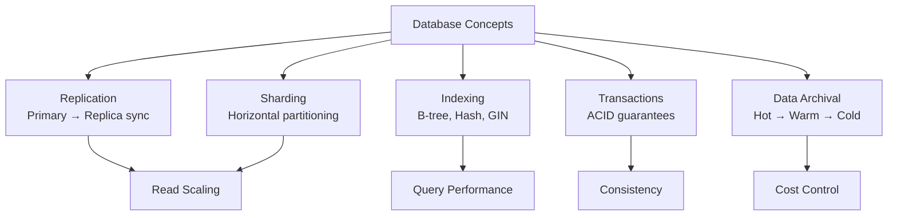

# Database Concepts

Core theory behind database design, scaling, and reliability.

```mermaid
graph TD
    CONCEPTS[Database Concepts]
    CONCEPTS --> REP[Replication\nPrimary → Replica sync]
    CONCEPTS --> SHARD[Sharding\nHorizontal partitioning]
    CONCEPTS --> IDX[Indexing\nB-tree, Hash, GIN]
    CONCEPTS --> TXN[Transactions\nACID guarantees]
    CONCEPTS --> ARCH[Data Archival\nHot → Warm → Cold]
    REP --> SCALE[Read Scaling]
    SHARD --> SCALE
    IDX --> PERF[Query Performance]
    TXN --> CONSIST[Consistency]
    ARCH --> COST[Cost Control]
```
