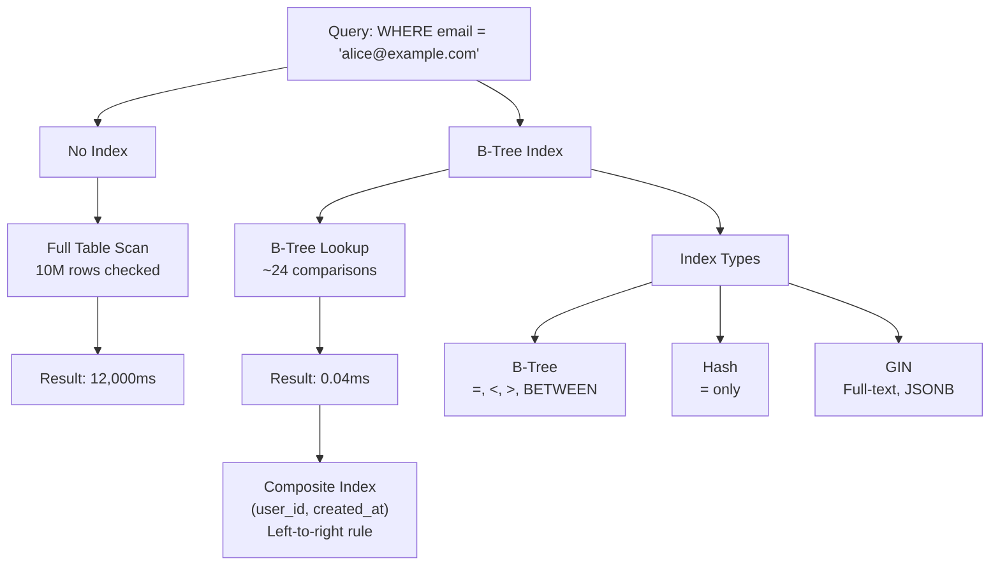

# Database Indexing Deep Dive - Make Queries 1000x Faster

> **Reading Time:** 20 minutes
> **Difficulty:** 🟡 Intermediate
> **Impact:** Transform 30-second queries into 30-millisecond queries

## 🗺️ Quick Overview



*An index trades write overhead for dramatically faster reads — the right index type and column order determine whether queries use it at all.*

## The Twitter Timeline Problem: 500M Queries/Second

**How Twitter serves your timeline in 50ms:**

```
Without indexes:
- Scan 500M tweets to find yours
- Time: 45 seconds per request
- Result: Twitter doesn't exist

With indexes:
- Jump directly to your tweets
- Time: 5ms per request
- Result: 500M timeline queries/second
```

**The secret:** Strategic indexing on (user_id, created_at) lets Twitter skip 99.999% of the data.

This article shows you how to achieve the same for your database.

---

## The Problem: Why Queries Are Slow

### The Full Table Scan

```sql
-- Find user by email
SELECT * FROM users WHERE email = 'alice@example.com';
```

**Without index (Full Table Scan):**
```
Table: users (10 million rows)

Scan row 1: bob@example.com ❌
Scan row 2: charlie@example.com ❌
Scan row 3: david@example.com ❌
...
Scan row 8,234,567: alice@example.com ✅

Time: 12,450ms (12.4 seconds!)
Rows scanned: 10,000,000
Rows returned: 1
Efficiency: 0.00001%
```

**Why it's slow:** PostgreSQL has no way to find Alice without checking every single row.

### The EXPLAIN Proof

```sql
EXPLAIN ANALYZE
SELECT * FROM users WHERE email = 'alice@example.com';

-- Output (BAD):
Seq Scan on users  (cost=0.00..234567.00 rows=1 width=128)
                   (actual time=12345.678..12450.123 rows=1 loops=1)
  Filter: (email = 'alice@example.com'::text)
  Rows Removed by Filter: 9999999
Planning Time: 0.123 ms
Execution Time: 12450.456 ms  ← 12 SECONDS!
```

---

## The Solution: B-Tree Indexes

### How B-Tree Works

```
B-Tree Index on email:
                        [M]
                       /   \
                    [D]     [S]
                   /   \   /   \
                [A-C] [E-L] [N-R] [T-Z]
                  ↓
            alice@example.com → Row 8,234,567

Lookup process:
1. Start at root [M]
2. alice < M, go left to [D]
3. alice < D, go left to [A-C]
4. Binary search in leaf: found!
5. Jump directly to row 8,234,567

Comparisons: ~24 (log₂ of 10M)
Time: 2ms
```

### Creating the Index

```sql
-- Create B-Tree index (default type)
CREATE INDEX idx_users_email ON users(email);

-- Verify with EXPLAIN
EXPLAIN ANALYZE
SELECT * FROM users WHERE email = 'alice@example.com';

-- Output (GOOD):
Index Scan using idx_users_email on users
    (cost=0.43..8.45 rows=1 width=128)
    (actual time=0.023..0.024 rows=1 loops=1)
  Index Cond: (email = 'alice@example.com'::text)
Planning Time: 0.089 ms
Execution Time: 0.042 ms  ← 0.04ms! (300,000x faster)
```

---

## Index Types: When to Use Each

### B-Tree (Default) - Most Common

```sql
-- Good for: =, <, >, <=, >=, BETWEEN, IN, IS NULL
CREATE INDEX idx_users_email ON users(email);
CREATE INDEX idx_orders_created ON orders(created_at);
CREATE INDEX idx_products_price ON products(price);

-- Use cases:
SELECT * FROM users WHERE email = 'alice@example.com';  ✅
SELECT * FROM orders WHERE created_at > '2024-01-01';   ✅
SELECT * FROM products WHERE price BETWEEN 10 AND 50;   ✅
```

### Hash Index - Equality Only

```sql
-- Good for: = only (no range queries)
CREATE INDEX idx_users_email_hash ON users USING HASH (email);

-- Faster than B-Tree for pure equality
SELECT * FROM users WHERE email = 'alice@example.com';  ✅
SELECT * FROM users WHERE email LIKE 'alice%';          ❌ Won't use index
SELECT * FROM orders WHERE created_at > '2024-01-01';   ❌ Won't use index

-- When to use: High-cardinality equality lookups
-- When NOT to use: Range queries, sorting, LIKE patterns
```

### GIN Index - Full-Text & Arrays

```sql
-- Good for: Full-text search, JSONB, arrays
CREATE INDEX idx_articles_search ON articles USING GIN (to_tsvector('english', content));
CREATE INDEX idx_products_tags ON products USING GIN (tags);
CREATE INDEX idx_users_metadata ON users USING GIN (metadata);

-- Use cases:
SELECT * FROM articles WHERE to_tsvector('english', content) @@ to_tsquery('database');
SELECT * FROM products WHERE tags @> ARRAY['electronics'];
SELECT * FROM users WHERE metadata @> '{"role": "admin"}';
```

### GiST Index - Geometric & Range

```sql
-- Good for: Geographic data, ranges, nearest neighbor
CREATE INDEX idx_locations_point ON locations USING GIST (point);
CREATE INDEX idx_events_duration ON events USING GIST (duration);

-- Use cases:
SELECT * FROM locations WHERE point <@ circle '((0,0),10)';  -- Within radius
SELECT * FROM events WHERE duration && '[2024-01-01, 2024-01-31]';  -- Overlapping ranges
```

---

## Composite Indexes: The Power Move

### The Order Matters

```sql
-- Index on (user_id, created_at)
CREATE INDEX idx_orders_user_date ON orders(user_id, created_at);

-- This index can be used for:
SELECT * FROM orders WHERE user_id = 123;                        ✅ Uses index
SELECT * FROM orders WHERE user_id = 123 AND created_at > '2024-01-01';  ✅ Uses index
SELECT * FROM orders WHERE user_id = 123 ORDER BY created_at;    ✅ Uses index for both

-- This index CANNOT be used for:
SELECT * FROM orders WHERE created_at > '2024-01-01';            ❌ Can't skip user_id
SELECT * FROM orders ORDER BY created_at;                        ❌ Can't use index

-- Rule: Index is usable left-to-right
-- (A, B, C) can search: A, (A,B), (A,B,C)
-- (A, B, C) cannot search: B, C, (B,C)
```

### Covering Index (Index-Only Scan)

```sql
-- Query needs: user_id, email, created_at
SELECT user_id, email, created_at FROM users WHERE email = 'alice@example.com';

-- Regular index: Must fetch row from table (heap)
CREATE INDEX idx_users_email ON users(email);
-- Index Scan → Heap Fetch → Return data

-- Covering index: All data in index (no heap fetch!)
CREATE INDEX idx_users_email_covering ON users(email) INCLUDE (user_id, created_at);
-- Index Only Scan → Return data (2x faster!)

EXPLAIN ANALYZE SELECT user_id, email, created_at FROM users WHERE email = 'alice@example.com';
-- "Index Only Scan" ← This is the goal
```

---

## When NOT to Index

### Low Cardinality Columns

```sql
-- ❌ BAD: Boolean column (only 2 values)
CREATE INDEX idx_users_active ON users(is_active);

-- Why it's bad:
-- is_active = true: 90% of rows
-- is_active = false: 10% of rows
-- PostgreSQL will still scan most rows
-- Index overhead not worth it

-- Exception: When one value is rare
-- If is_active = false is only 0.1%, index helps for:
SELECT * FROM users WHERE is_active = false;  -- Uses index
```

### Small Tables

```sql
-- ❌ BAD: Indexing table with 100 rows
CREATE INDEX idx_config_key ON config(key);

-- Why it's bad:
-- Full table scan of 100 rows: <1ms
-- Index lookup: ~1ms
-- No benefit, just overhead

-- Rule of thumb: Don't index tables < 10,000 rows
```

### Write-Heavy Tables

```sql
-- ⚠️ CAREFUL: Every index slows writes
-- Table: logs (100M inserts/day)

-- Each INSERT must update:
-- 1. The table
-- 2. idx_logs_timestamp
-- 3. idx_logs_level
-- 4. idx_logs_service
-- 5. idx_logs_trace_id

-- 5 indexes = 5x write overhead!

-- Solution: Minimal indexes on write-heavy tables
-- Use partitioning instead of indexes for time-series data
```

---

## Real-World Indexing Strategies

### E-Commerce Product Search (Amazon-style)

```sql
-- Products table: 10M products

-- Query patterns:
-- 1. Browse by category: WHERE category_id = X
-- 2. Sort by price: ORDER BY price
-- 3. Filter by price range: WHERE price BETWEEN X AND Y
-- 4. Search by name: WHERE name ILIKE '%keyword%'
-- 5. Filter in stock: WHERE stock > 0

-- Optimal indexes:
CREATE INDEX idx_products_category_price ON products(category_id, price);
-- Covers: category browse + price sort + price filter

CREATE INDEX idx_products_name_trgm ON products USING GIN (name gin_trgm_ops);
-- Covers: ILIKE search (requires pg_trgm extension)

CREATE INDEX idx_products_in_stock ON products(category_id) WHERE stock > 0;
-- Partial index: Only indexes in-stock items (smaller, faster)

-- Query examples:
SELECT * FROM products
WHERE category_id = 5 AND stock > 0
ORDER BY price
LIMIT 20;
-- Uses: idx_products_category_price + idx_products_in_stock
```

### Social Media Timeline (Twitter-style)

```sql
-- Tweets table: 500M tweets

-- Query pattern:
-- Get user's recent tweets: WHERE user_id = X ORDER BY created_at DESC LIMIT 20

-- Optimal index:
CREATE INDEX idx_tweets_user_timeline ON tweets(user_id, created_at DESC);

-- Why DESC: Matches ORDER BY direction, no extra sort needed

-- Query:
SELECT * FROM tweets
WHERE user_id = 12345
ORDER BY created_at DESC
LIMIT 20;

-- Execution:
-- 1. Index lookup for user_id = 12345
-- 2. Already sorted by created_at DESC
-- 3. Return first 20 (no scan beyond)
-- Time: 2ms for any user
```

### Financial Transactions (Stripe-style)

```sql
-- Transactions table: 1B rows

-- Query patterns:
-- 1. By customer: WHERE customer_id = X
-- 2. By date range: WHERE created_at BETWEEN X AND Y
-- 3. By status: WHERE status = 'pending'
-- 4. Reconciliation: SUM(amount) GROUP BY date

-- Optimal indexes:
CREATE INDEX idx_txn_customer_date ON transactions(customer_id, created_at DESC);
CREATE INDEX idx_txn_status_date ON transactions(status, created_at) WHERE status = 'pending';
CREATE INDEX idx_txn_date_amount ON transactions(created_at) INCLUDE (amount);

-- Partial index for pending (hot data):
-- Only 0.1% of transactions are pending
-- Index is 1000x smaller than full index
```

---

## Index Maintenance

### Monitoring Index Usage

```sql
-- Find unused indexes (waste of space and write performance)
SELECT
  schemaname || '.' || relname AS table,
  indexrelname AS index,
  pg_size_pretty(pg_relation_size(i.indexrelid)) AS index_size,
  idx_scan AS times_used
FROM pg_stat_user_indexes ui
JOIN pg_index i ON ui.indexrelid = i.indexrelid
WHERE idx_scan < 50  -- Used less than 50 times
ORDER BY pg_relation_size(i.indexrelid) DESC;

-- Find missing indexes (slow queries without index)
SELECT
  schemaname || '.' || relname AS table,
  seq_scan,
  seq_tup_read,
  idx_scan,
  seq_tup_read / NULLIF(seq_scan, 0) AS avg_rows_per_scan
FROM pg_stat_user_tables
WHERE seq_scan > 100
ORDER BY seq_tup_read DESC;
```

### Index Bloat

```sql
-- Indexes bloat over time (dead tuples, fragmentation)
-- Check index bloat
SELECT
  schemaname || '.' || relname AS table,
  indexrelname AS index,
  pg_size_pretty(pg_relation_size(indexrelid)) AS size,
  idx_scan
FROM pg_stat_user_indexes
ORDER BY pg_relation_size(indexrelid) DESC
LIMIT 10;

-- Rebuild bloated indexes (during maintenance window)
REINDEX INDEX CONCURRENTLY idx_users_email;

-- Or drop and recreate
DROP INDEX CONCURRENTLY idx_users_email;
CREATE INDEX CONCURRENTLY idx_users_email ON users(email);
```

---

## Quick Win: Optimize Your Slowest Query

### Step 1: Find Slow Queries

```sql
-- PostgreSQL: Enable query logging
ALTER SYSTEM SET log_min_duration_statement = 1000;  -- Log queries > 1s
SELECT pg_reload_conf();

-- Or use pg_stat_statements
SELECT
  query,
  calls,
  total_exec_time / calls AS avg_time_ms,
  rows / calls AS avg_rows
FROM pg_stat_statements
ORDER BY total_exec_time DESC
LIMIT 10;
```

### Step 2: Analyze with EXPLAIN

```sql
EXPLAIN (ANALYZE, BUFFERS, FORMAT TEXT)
SELECT * FROM orders WHERE user_id = 123 AND status = 'pending';

-- Look for:
-- "Seq Scan" → Needs index
-- "Rows Removed by Filter: 9999999" → Inefficient filter
-- "Sort" → Might benefit from index with ORDER BY
```

### Step 3: Create the Right Index

```sql
-- For this query:
SELECT * FROM orders WHERE user_id = 123 AND status = 'pending';

-- Create composite index:
CREATE INDEX CONCURRENTLY idx_orders_user_status ON orders(user_id, status);

-- Verify improvement:
EXPLAIN ANALYZE SELECT * FROM orders WHERE user_id = 123 AND status = 'pending';
-- Should show "Index Scan" instead of "Seq Scan"
```

---

## Key Takeaways

### Index Decision Framework

```
1. Is this column in WHERE, JOIN, or ORDER BY?
   YES → Consider indexing
   NO → Don't index

2. Is the column high cardinality (many unique values)?
   YES → Good index candidate
   NO → Probably not worth indexing

3. Is this table write-heavy?
   YES → Minimize indexes
   NO → Index freely

4. Is this a common query pattern?
   YES → Optimize with composite index
   NO → Single column index is fine
```

### The Rules

1. **Index columns in WHERE clauses** (especially equality checks)
2. **Composite indexes: leftmost column first** (most selective)
3. **Match index order to query** (ORDER BY direction matters)
4. **Use covering indexes** for frequently accessed columns
5. **Monitor and remove unused indexes** (they slow writes)
6. **Partial indexes** for hot data (status = 'pending')

---

## Related Content

- [POC #12: Database Indexes](/01-databases/hands-on/database-indexes) - Hands-on practice
- [POC #14: EXPLAIN Analysis](/01-databases/hands-on/database-explain) - Query plan mastery
- [N+1 Query Problem](/problems-at-scale/performance/n-plus-one-query) - Common performance killer

---

**Remember:** The best index is the one that lets your database skip 99.99% of the data. Use EXPLAIN ANALYZE to verify your indexes are actually being used.
