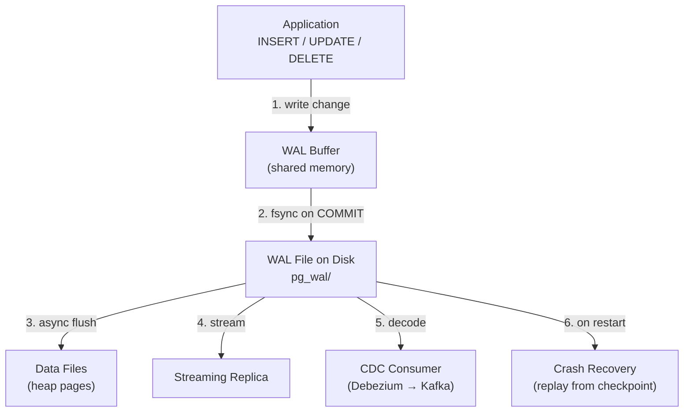
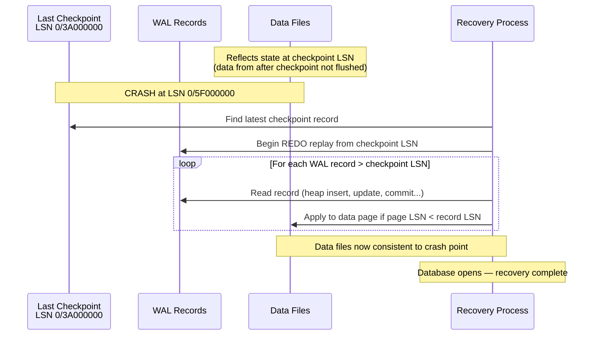
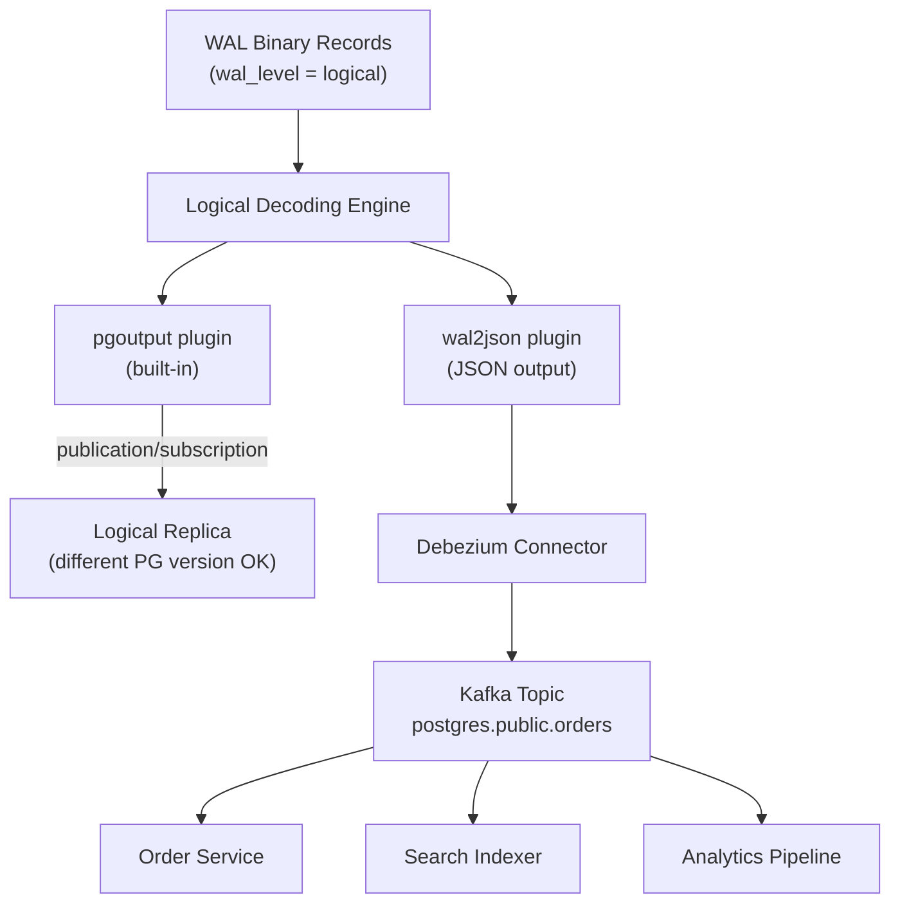

# Write-Ahead Log (WAL): Crash Recovery, Replication, and CDC

**Difficulty**: 🟡 Intermediate → 🔴 Advanced
**Reading Time**: 18 minutes
**Practical Application**: Understanding WAL is understanding how durability, replication, and change data capture all emerge from a single database primitive. Every COMMIT you've ever issued went through WAL first.

---

## Level 1 — Surface (2-minute read)

> For juniors and anyone needing a quick refresher. No prior database internals knowledge assumed.

### What is a Write-Ahead Log?

A **Write-Ahead Log (WAL)** is a sequential append-only file that a database writes to *before* it updates its actual data files. Think of it as a receipt journal: before any purchase is reflected in the inventory system, it is first written to a chronological log. If the system crashes, the log is replayed to reconstruct what happened.

The "write-ahead" in the name means the rule: **log the change before you apply it**.

### When do you need to understand WAL?

- When a PostgreSQL server crashes and you want to understand why no data was lost (or why it was)
- When you're setting up streaming replication and need to know why the replica drifts
- When you're wiring Debezium to stream database changes into Kafka and it mysteriously fills your disk
- When you're tuning database write throughput and hitting a checkpoint I/O wall

### Core concept

- Every INSERT, UPDATE, and DELETE is first written to WAL as a sequential append — then the actual data files are updated asynchronously
- WAL is sequential I/O; data file updates are random I/O — sequential is 100-1000x faster on spinning disk, 3-10x faster on SSD
- On a crash, the database replays WAL records from the last checkpoint to rebuild any data that wasn't flushed to data files
- Streaming replication works by shipping WAL records from primary to replica — the replica replays them to stay in sync
- Change data capture (CDC) tools like Debezium read WAL to emit row-level change events to Kafka without touching application code

### Simple diagram



### When to use vs. not use WAL features

| Use this when | Don't use this when |
|--------------|---------------------|
| You need zero data loss on primary crash | You need micro-second write latency and can tolerate losing the last 200ms of writes (use `synchronous_commit = off`) |
| Setting up read replicas for read scaling | You want a replica that can run a different major PostgreSQL version (use logical replication instead) |
| Streaming row-level changes to downstream services | You only need periodic full-table snapshots (a simpler ETL export works fine) |
| Point-in-time recovery (PITR) for compliance | You're running a throwaway dev database — WAL archiving adds disk and complexity |

---

## Level 2 — Deep Dive

> For senior engineers, architects, and staff+ interview prep.

### Problem Statement

Your PostgreSQL primary is handling 15,000 writes/sec. At this rate:
- **Durability**: A crash at any point must lose zero committed transactions — but data files are 8KB pages and a single transaction touches dozens of them across random disk locations
- **Read scaling**: A read replica must stay within 500ms lag for read-your-writes consistency
- **Event streaming**: Your event pipeline must capture every row change for downstream microservices without touching application code

All three requirements are served by one mechanism: the Write-Ahead Log.

The naive alternative — fsyncing actual data pages on every COMMIT — fails at scale. A transaction touching 100 rows across 30 different heap pages requires 30 random I/O writes. WAL converts those 30 random writes into a single sequential append. That difference is the foundation of modern database durability.

### Approach A — WAL for Crash Recovery (The Foundation)

WAL exists primarily for crash recovery. It solves the problem of data files being inconsistently updated when a crash occurs mid-write.

**How it works:**

When a transaction commits, PostgreSQL:
1. Writes the change to the WAL buffer (in shared memory)
2. Fsyncs the WAL buffer to a WAL segment file on disk
3. Returns COMMIT success to the client
4. Data file pages are updated asynchronously later (by background writer and checkpointer)

On a crash, data files may reflect an older state. PostgreSQL's recovery process:
1. Finds the most recent checkpoint record in WAL
2. Replays all WAL records after that checkpoint, applying changes to data files
3. Skips records for pages that already have the change (page LSN >= record LSN)
4. Opens for connections when replay is complete

PostgreSQL uses REDO-only recovery. Unlike Oracle or SQL Server, there is no UNDO phase — uncommitted changes never make it to data files in a way that corrupts committed state (MVCC handles uncommitted visibility at query time, not at crash recovery time).



**Checkpoint mechanics:**

A checkpoint flushes all dirty shared_buffers pages to disk and writes a checkpoint WAL record marking the recovery start point. Frequent checkpoints mean shorter recovery time but more I/O during normal operation. The tradeoff is controlled by:

```ini
# postgresql.conf
checkpoint_timeout = 5min          # trigger checkpoint every 5 minutes at most
checkpoint_completion_target = 0.9 # spread checkpoint I/O over 90% of the interval
max_wal_size = 4GB                 # also trigger checkpoint if WAL exceeds this
```

**Recovery time estimation:**
```
RTO ≈ (WAL generated between checkpoints) / (replay speed)
replay speed ≈ 3-5× WAL generation rate

Example: checkpoint_timeout=5min, WAL rate=50 MB/s
  WAL accumulated: 5min × 50 MB/s = 15 GB
  Recovery time: 15 GB / (4 × 50 MB/s) ≈ 75 seconds
  For RTO < 30s: reduce checkpoint_timeout to 2min OR increase max_wal_size to trigger more frequent checkpoints
```

| Dimension | Value |
|-----------|-------|
| Pros | Zero data loss on crash; no application changes needed; works automatically |
| Cons | Recovery adds startup latency; frequent checkpoints increase write I/O |
| Best for | All production PostgreSQL deployments — this is the default behavior |
| Avoid when | Development databases where recovery time doesn't matter (you'd still leave it on) |

```sql
-- Monitor checkpoint frequency and health
SELECT
    checkpoints_timed,
    checkpoints_req,  -- unplanned checkpoints (max_wal_size hit)
    checkpoint_write_time / 1000.0 AS write_s,
    checkpoint_sync_time / 1000.0 AS sync_s,
    buffers_checkpoint,
    buffers_backend  -- backends writing dirty pages directly (bad sign)
FROM pg_stat_bgwriter;

-- Alert condition: checkpoints_req > 30% of total = max_wal_size too small
-- Alert condition: checkpoint_sync_time > 5000ms = storage I/O saturation
```

### Approach B — Physical Streaming Replication

Physical streaming replication ships WAL bytes from primary to standby, maintaining a byte-for-byte identical copy of data files. The standby replays WAL in real time to stay current.

**How it works:**

The WAL sender process on the primary and the WAL receiver process on the standby maintain a persistent TCP connection. WAL records stream as they're generated — before data files are updated on the primary. The standby's startup process (in recovery mode) applies them continuously.

```mermaid
sequenceDiagram
  participant App as Application
  participant P as Primary<br/>(wal_sender)
  participant S as Standby<br/>(wal_receiver + startup)

  App->>P: BEGIN; UPDATE orders SET status='shipped' WHERE id=1001; COMMIT
  P->>P: Write record to WAL buffer
  P->>P: fsync WAL to disk
  P-->>App: COMMIT acknowledged

  P->>S: Stream WAL record (async by default)
  S->>S: Write to standby WAL buffer
  S->>S: Apply to data files (startup process)
  S-->>P: Acknowledge replay_lsn

  Note over P,S: Async lag: typically 10-100ms LAN, 50-500ms WAN
```

**Synchronous commit modes:**

| Mode | Behavior | Write latency added | Risk on primary crash |
|------|----------|--------------------|-----------------------|
| `off` | COMMIT returns before WAL fsync | 0ms (async) | Lose last ~200ms of commits |
| `on` (default) | COMMIT waits for WAL fsync on primary | ~0.5-2ms | Zero loss on primary crash |
| `remote_write` | COMMIT waits for standby to receive + write WAL | +10-20ms RTT | Zero loss even if primary disk fails |
| `remote_apply` | COMMIT waits for standby to replay WAL | +20-50ms RTT | Zero loss, replica immediately queryable |

```ini
# postgresql.conf — replication setup
wal_level = replica           # minimum level for streaming replication
max_wal_senders = 5           # max concurrent streaming connections
wal_keep_size = 2GB           # minimum WAL retained for replica catch-up
wal_compression = on          # saves 30-50% WAL bandwidth, ~2% CPU overhead
```

```sql
-- Monitor replication lag
SELECT
    client_addr,
    application_name,
    state,
    pg_size_pretty(sent_lsn - replay_lsn) AS byte_lag,
    write_lag,
    flush_lag,
    replay_lag
FROM pg_stat_replication
ORDER BY sent_lsn - replay_lsn DESC;

-- Alert: replay_lag > 30s = replication health concern
-- Alert: replay_lag > 5min = replication may be broken
```

| Dimension | Value |
|-----------|-------|
| Pros | Exact copy of primary; supports automatic failover (Patroni, pg_auto_failover); DDL automatically replicated |
| Cons | Replica must be same major PostgreSQL version; writes on standby impossible (hot standby for reads only) |
| Best for | High availability, automatic failover, read-scaling with same PostgreSQL version |
| Avoid when | You need a replica on a different PostgreSQL version, or you need write access on the replica |

### Approach C — Logical Decoding for Change Data Capture (CDC)

Logical decoding interprets WAL binary records into structured row-level change events. This powers CDC tools like Debezium that stream database changes to Kafka without any application code changes.

**How it works:**

With `wal_level = logical`, PostgreSQL records additional information in WAL: old row values for UPDATE/DELETE, and column-level data. Logical decoding plugins (`pgoutput`, `wal2json`) decode these binary records into structured events. A replication slot tracks the consumer's position, preventing WAL recycling until the consumer acknowledges.



```sql
-- Setup: set wal_level = logical in postgresql.conf (requires restart)

-- Create a publication (what to capture)
CREATE PUBLICATION app_pub
FOR TABLE orders, order_items, customers, products
WITH (publish = 'insert, update, delete');

-- Debezium creates the replication slot automatically when configured
-- Manual inspection:
SELECT
    slot_name,
    plugin,
    active,
    pg_size_pretty(pg_wal_lsn_diff(pg_current_wal_lsn(), restart_lsn)) AS wal_retained
FROM pg_replication_slots;
```

**CDC event format (Debezium with wal2json):**
```json
{
  "before": {"id": 1001, "status": "pending", "amount": 99.99},
  "after":  {"id": 1001, "status": "shipped", "amount": 99.99},
  "source": {
    "db": "orders_db",
    "table": "orders",
    "lsn": "0/5FA23400",
    "txId": 1048576,
    "ts_ms": 1710748800000
  },
  "op": "u"
}
```

| Dimension | Value |
|-----------|-------|
| Pros | Zero application code changes; captures all row-level changes including legacy code paths; enables event-driven microservices migration |
| Cons | CPU overhead on primary: 5-15% at 10k writes/sec; WAL size increases 20-40% with `wal_level = logical`; replication slots are a disk-fill footgun |
| Best for | Microservices event streaming, search index sync, audit logs, analytics pipelines |
| Avoid when | Primary write throughput is already CPU-bound; you can modify the application to dual-write to an event bus instead |

### Comparison Table

| Dimension | Crash Recovery | Physical Replication | Logical CDC (Debezium) |
|-----------|---------------|---------------------|------------------------|
| Primary purpose | Durability on crash | HA + read scaling | Event streaming |
| Replica fidelity | N/A (same instance) | Byte-for-byte identical | Change event stream |
| Cross-version support | N/A | Same major version only | Any consumer |
| DDL replication | N/A | Automatic | Not replicated — Schema Registry needed |
| Failover capability | N/A | Yes (Patroni/pg_auto_failover) | No |
| WAL overhead | Baseline | Baseline | +20-40% (logical level) |
| Replication lag | N/A | 10-100ms LAN | 50-500ms + Kafka latency |
| Main failure mode | Slow checkpoint, disk fill on bulk load | Replica WAL segment gap | Replication slot disk fill |
| Monitoring priority | checkpoint_sync_time | replay_lag | wal_retained per slot |

### Production Numbers

- **WAL fsync latency on NVMe SSD**: P50 = 0.3ms, P99 = 3ms, P99.9 = 30ms (idle). Under sustained write pressure: P99 = 5-15ms, P99.9 = 50-200ms.
- **WAL generation rate**: A busy OLTP database generating 15,000 writes/sec produces ~100-300 MB/min of WAL. A batch job with large row updates can hit 1-5 GB/min.
- **Physical replication lag**: LAN (same datacenter): 5-50ms. Cross-AZ: 10-100ms. Cross-region: 50-500ms.
- **Logical replication throughput**: Debezium can process ~50,000 row events/sec per connector instance on a 4-core machine. Above that, use multiple connectors with table partitioning.
- **`wal_level = logical` overhead**: 20-40% larger WAL records (stores old row values for UPDATE/DELETE). CPU: 5-15% increase on primary for decoding.
- **Scale thresholds**:
  - Switch from `synchronous_commit = on` to `remote_write` when RPO must survive primary hardware failure (not just crash)
  - Switch from physical to logical replication when crossing PostgreSQL major versions
  - Add `max_slot_wal_keep_size` the moment any replication slot is created (PostgreSQL 13+)

### How Real Companies Solve This

| Company | Approach | Scale | Key Insight |
|---------|----------|-------|-------------|
| Stripe | Logical CDC (Debezium → Kafka) for microservices events | Billions of transactions | They run Debezium against a logical replica (PostgreSQL 16+), not the primary, eliminating CPU overhead on the write path |
| Netflix | Physical streaming replication with Patroni for automatic failover | 200M+ users, multiple regions | Patroni monitors wal_receiver and pg_stat_replication; promotes standby within 30s of primary failure without manual intervention |
| Neon | WAL stored in a distributed log service separate from compute | Serverless PostgreSQL | Decouples WAL from data files entirely — WAL goes to a distributed storage layer; compute nodes are stateless and start in <1s without checkpoint-based recovery |
| Cloudflare | WAL-based PITR for their database-as-a-service offering | Millions of databases | Archives WAL segments every 30 seconds to object storage, enabling point-in-time recovery to any 30-second window |
| Shopify | Logical CDC to sync MySQL binlog → Kafka for CQRS | Flash sales at millions of RPS | Uses Maxwell (MySQL equivalent of Debezium) to stream MySQL binary log; Kafka topics become the read model for product inventory |

### Common Mistakes

1. **Replication slot without monitoring** — A Debezium connector is stopped for maintenance (or crashes). The replication slot remains active, preventing WAL recycling. At 500 MB/min WAL generation, 10 hours of downtime fills a 300GB WAL disk. Primary crashes with `PANIC: No space left on device`. Recovery requires manual intervention and data files are intact but the experience is identical to data loss. **Fix**: Set `max_slot_wal_keep_size = 10GB` in `postgresql.conf` (PostgreSQL 13+) and alert when any slot's WAL retained exceeds 5GB.

2. **Over-tuning `checkpoint_timeout` without tuning `max_wal_size`** — Setting `checkpoint_timeout = 30min` to reduce I/O, without adjusting `max_wal_size`, means a bulk load easily triggers an emergency checkpoint (when `max_wal_size` is hit). Emergency checkpoints block all writes for several seconds. **Fix**: Set `max_wal_size` to at least `checkpoint_timeout × average_wal_rate × 1.5`. For a 30-minute timeout at 50 MB/s WAL: `max_wal_size = 135GB`.

3. **Running Debezium against the primary with `wal_level = logical`** — Logical decoding adds 5-15% CPU on the primary at moderate throughput. On a write-saturated primary, this can push CPU from 85% to 100%, causing query latency spikes. **Fix**: In PostgreSQL 16+, Debezium can connect to a physical streaming standby that has logical decoding enabled. Zero primary overhead.

4. **Using `synchronous_commit = remote_apply` for all writes** — `remote_apply` ensures the replica has replayed the WAL before COMMIT returns, making reads immediately consistent. But it adds 20-50ms per write (cross-datacenter RTT × 2). For most applications, `remote_write` (standby has received and fsynced WAL, but not replayed) is sufficient and 3-5× faster. **Fix**: Only use `remote_apply` for session-level on the specific transactions that will immediately read their own writes from the replica.

5. **Not testing WAL archive recovery** — Teams configure WAL archiving and assume PITR works. They discover during an actual recovery incident that the archive is incomplete, corrupted, or the recovery process takes 6 hours (not 20 minutes as expected). **Fix**: Test `pg_basebackup` + WAL archive recovery in staging quarterly. Measure actual recovery time. Document the runbook.

### Key Takeaways (TL;DR)

- WAL converts N random data-page writes into 1 sequential append — the performance difference is 100-1000× on HDD and 3-10× on NVMe SSD; this is why crash recovery is fast and not why it's slow
- Every COMMIT is durable the moment WAL is fsynced — data files are a cache; WAL is the truth
- Replication slots are a footgun: they prevent WAL recycling indefinitely — set `max_slot_wal_keep_size = 10GB` on every production cluster before any slot is created
- Physical replication copies bytes; logical replication copies rows — use physical for HA/failover (same major version), logical for CDC and cross-version migrations
- PostgreSQL 16+ supports logical decoding from a standby — always route Debezium to the replica, never the primary, to eliminate CDC CPU overhead on the write path

---

## References

> 📚 [PostgreSQL WAL Internals](https://www.postgresql.org/docs/current/wal-internals.html) — Official docs covering WAL segments, LSNs, checkpoints, and full_page_writes in detail

> 📺 [CMU 15-445: Write-Ahead Logging](https://www.youtube.com/watch?v=IJmBGMFkFhM) — Andy Pavlo's database internals lecture covering ARIES protocol, REDO/UNDO, and how WAL relates to buffer pool management

> 📖 [Debezium Architecture](https://debezium.io/documentation/reference/architecture.html) — Official docs on how Debezium uses PostgreSQL logical decoding for CDC, including replication slot management

> 📖 [Neon: Architecture decisions](https://neon.tech/blog/architecture-decisions-in-neon) — How Neon separates WAL from compute, enabling serverless PostgreSQL with sub-second startup

> 📚 [PostgreSQL Replication Slots](https://www.postgresql.org/docs/current/warm-standby.html#STREAMING-REPLICATION-SLOTS) — Official docs on slot creation, management, and the `max_slot_wal_keep_size` safety parameter
