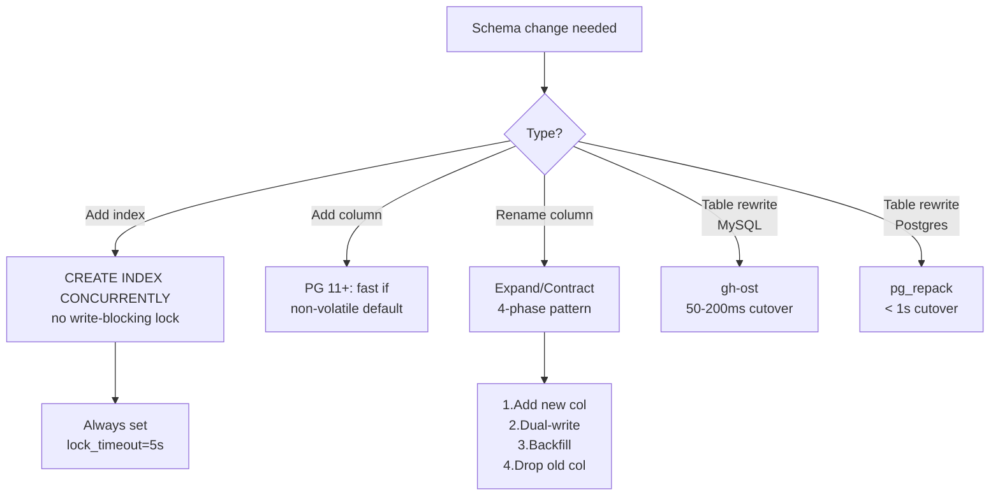
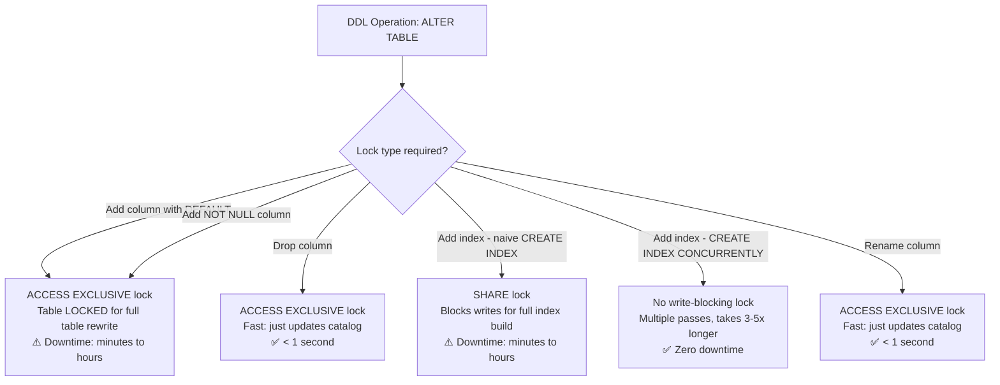
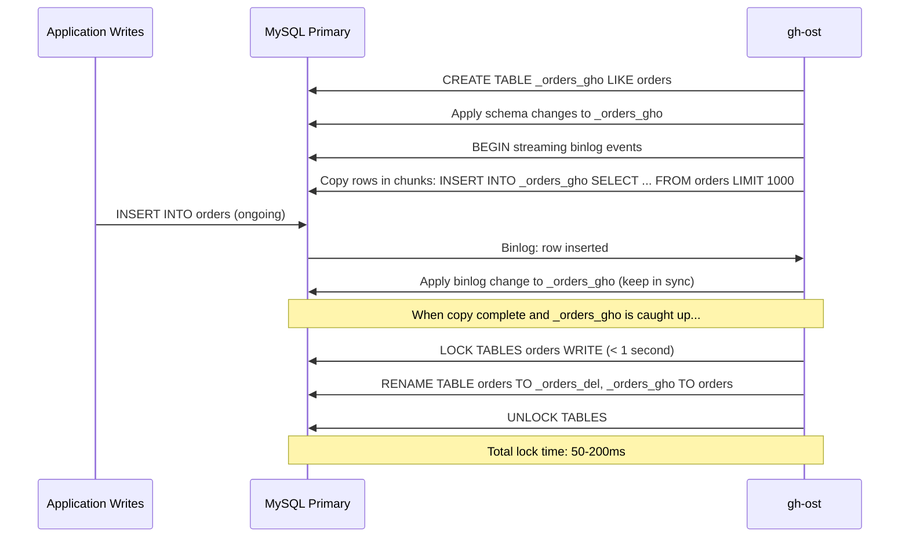
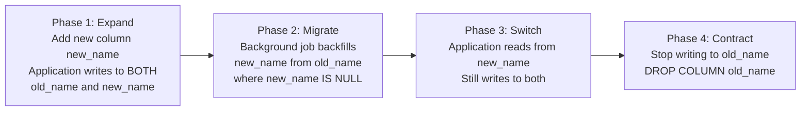
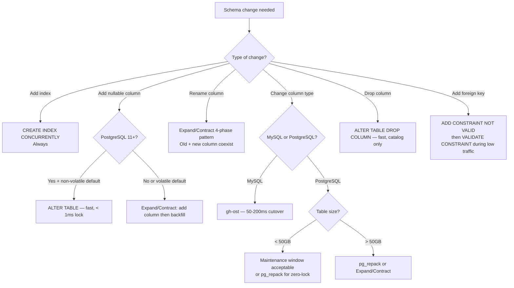
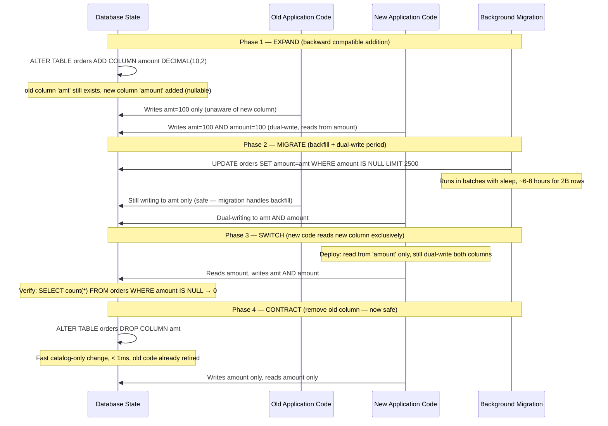

# Zero-Downtime Database Migrations: Online Schema Changes at Scale

## 🗺️ Quick Overview



*Zero-downtime migrations require specific tooling for each change type — always set `lock_timeout` to prevent lock queues from silently taking down production.*

**`ALTER TABLE orders ADD COLUMN discount_pct DECIMAL(5,2);` on a 2-billion-row table takes 4 hours and holds an `ACCESS EXCLUSIVE` lock the entire time.** Every query against that table — reads included — queues. Your application is down for 4 hours during a "routine schema migration." This is not a hypothetical — it is the default behavior of PostgreSQL `ALTER TABLE` for most DDL operations.

Zero-downtime migrations require specific tooling, a specific pattern (expand/contract), and specific failure mode awareness. Here's everything you need.

---

## The Problem Class `[Mid]`

A PostgreSQL table `orders` has 2 billion rows, 800GB on disk, and receives 5,000 writes/second. You need to:
- Add an index on `(customer_id, created_at)`
- Add a new nullable column `discount_pct`
- Rename column `amt` to `amount`
- Drop column `legacy_code`

Each of these operations, done naively, causes application downtime ranging from minutes to hours.



The solution space: use PostgreSQL's native concurrent operations where they exist, and use external tooling (pg_repack, gh-ost) where they don't.

---

## Why the Obvious Solution Fails `[Senior]`

**Approach 1: Maintenance window**

Take the application offline for 2am-4am, run migrations, bring back up. This works for internal tools but is unacceptable for consumer-facing applications with global users and SLA commitments.

**Approach 2: `ALTER TABLE` with low `lock_timeout`**

```sql
SET lock_timeout = '2s';
ALTER TABLE orders ADD COLUMN discount_pct DECIMAL(5,2);
```

This doesn't make the operation zero-downtime. It makes it fail fast if another transaction holds a conflicting lock. The DDL still acquires an `ACCESS EXCLUSIVE` lock when it runs — blocking all concurrent queries for the full duration.

**Approach 3: Blue-green database switch**

Clone the database, migrate the clone, switch traffic. Correct in principle, but:
- Multi-TB databases take hours to clone
- Writes to the original during clone-time are lost unless you dual-write
- Dual-writing during migration adds complexity and potential for data divergence
- Switching traffic has its own latency spike

**Approach 4: New table + background copy + swap**

This is what gh-ost and pg_repack actually do — but you need the tooling to do it correctly at scale.

---

## The Solution Landscape `[Senior]`

### Solution 1: PostgreSQL Native Concurrent DDL `[Senior]`

**CREATE INDEX CONCURRENTLY**

The standard tool for adding indexes without blocking writes:

```sql
-- This acquires SHARE UPDATE EXCLUSIVE (blocks DDL, not DML)
-- Makes multiple table passes:
-- Pass 1: Build index on current data
-- Pass 2: Wait for transactions that started before Pass 1 to finish, update index
-- Pass 3: Validate index consistency, mark VALID
CREATE INDEX CONCURRENTLY idx_orders_customer_created
ON orders (customer_id, created_at);

-- Monitor progress (PostgreSQL 12+):
SELECT
    phase,
    blocks_done,
    blocks_total,
    tuples_done,
    tuples_total,
    lockers_done,
    lockers_total
FROM pg_stat_progress_create_index
WHERE relid = 'orders'::regclass;
```

**Sizing guidance** `[Staff+]`:
- Concurrent index build takes **3-5x longer** than non-concurrent: a 20-minute regular index build takes 60-100 minutes concurrently
- Resource usage: full sequential scan of table (once per pass), significant I/O
- Recommended: schedule during low-traffic periods even though it doesn't block writes (CPU/I/O impact)
- On a 500GB table with 5K writes/sec: expect 45-90 minutes build time

**Failure modes** `[Staff+]`:
- **Invalid index on failure**: If `CREATE INDEX CONCURRENTLY` fails partway through (connection dropped, disk full), it leaves an INVALID index that takes up space and is never used. Must manually `DROP INDEX` the invalid index.
- **Long-running transactions blocking Phase 2**: `CREATE INDEX CONCURRENTLY` Phase 2 waits for all transactions that started before Phase 1 to finish. A long-running OLAP query from Phase 1 can block Phase 2 indefinitely. Monitor `pg_stat_activity` for blocking transactions during index builds.
- **Unique index validation**: `CREATE UNIQUE INDEX CONCURRENTLY` can fail during validation if duplicates exist. Failure leaves an invalid index. Check for duplicates first: `SELECT col, count(*) FROM t GROUP BY col HAVING count(*) > 1`.

**Adding columns: what's fast and what's not**:

```sql
-- FAST (metadata-only change, < 1ms):
ALTER TABLE orders ADD COLUMN notes TEXT;                    -- nullable, no default
ALTER TABLE orders ADD COLUMN archived BOOLEAN DEFAULT FALSE; -- PostgreSQL 11+: stored default

-- SLOW (full table rewrite, ACCESS EXCLUSIVE for hours):
-- PostgreSQL < 11:
ALTER TABLE orders ADD COLUMN archived BOOLEAN DEFAULT FALSE;

-- PostgreSQL 11+ fast path:
-- A column with a non-volatile DEFAULT no longer requires table rewrite!
-- DEFAULT NOW() is volatile (changes each row) → still slow
-- DEFAULT FALSE is non-volatile → fast metadata-only change
```

---

### Solution 2: gh-ost (GitHub Online Schema Change) for MySQL `[Senior]`

**What it is**: GitHub's tool for MySQL table alterations without locking. Uses MySQL binary log replication to capture writes during migration.

**How it actually works at depth**:



**Configuration decisions that matter** `[Staff+]`:
```bash
# gh-ost critical flags
gh-ost \
  --host=primary.db.internal \
  --database=mydb \
  --table=orders \
  --alter="ADD COLUMN discount_pct DECIMAL(5,2)" \
  --chunk-size=1000 \              # rows per copy chunk (smaller = less lock pressure)
  --throttle-control-replicas="replica.db.internal" \  # pause if replica lag > threshold
  --max-lag-millis=1500 \         # pause copy if replica lag > 1.5s
  --ok-to-drop-table \             # drop old table after cutover
  --execute \
  --verbose

# Throttle triggers:
# --max-load=Threads_running=25   # pause if MySQL busy
# --critical-load=Threads_running=1000  # abort if system overloaded
```

**Sizing guidance** `[Staff+]`:
- Copy speed: ~1000 rows/second/core on typical hardware
- 1 billion rows = ~11.5 hours copy time at 24K rows/min
- Total write amplification: ~2x (original writes + binlog replay to ghost table)
- Cutover lock time: 50-200ms (application experiences brief pause, not full downtime)
- Schedule cutover during low-traffic: `--postpone-cut-over-flag-file=/tmp/gh-ost.postpone`

**Failure modes** `[Staff+]`:
- **Replica lag triggering throttle loop**: gh-ost monitors replica lag and pauses copy when lag exceeds `max-lag-millis`. Under high write load, the copy may pause indefinitely if the write rate prevents the replica from catching up. Monitor: check if migration progress has stalled.
- **Binlog position loss**: If the binlog position is lost (MySQL restart, rotation), gh-ost must restart the copy. Keep `--serve-socket-file` for monitoring and `--panic-flag-file` for emergency abort.
- **Cutover race**: Between the `RENAME` and the old table being dropped, any transaction that opened the old table before `RENAME` can still write to it. gh-ost accounts for this with a brief lock window.

---

### Solution 3: pg_repack for PostgreSQL `[Senior]`

**What it is**: A PostgreSQL extension that rebuilds tables and indexes online, removing dead tuple bloat and allowing schema changes, without long-term locks.

**What it can and cannot do**:
- ✅ Remove table bloat (equivalent to `VACUUM FULL` without locking)
- ✅ Rebuild indexes without bloat
- ✅ Add columns, change column types (with limitations)
- ❌ Cannot add non-nullable columns without default
- ❌ Cannot add constraints that require full table validation

**How it actually works at depth**:

```sql
-- Install extension
CREATE EXTENSION pg_repack;

-- Repack a table to reclaim bloat (~VACUUM FULL without locking):
pg_repack --table orders --no-kill-backend

-- Under the hood:
-- 1. CREATE TABLE orders_pgsql_tmp (LIKE orders INCLUDING ALL)
-- 2. CREATE RULE/TRIGGER to capture ongoing changes to a log table
-- 3. Copy rows from orders to orders_pgsql_tmp in batches
-- 4. Replay captured changes (apply delta)
-- 5. LOCK orders briefly → SWAP tables → DROP log table
-- Total lock time: < 1 second
```

**Sizing guidance** `[Staff+]`:
```bash
# pg_repack flags for production use
pg_repack \
  --table orders \
  --jobs 4 \                    # parallel index rebuilds
  --wait-timeout 60 \           # wait up to 60s for lock, then abort
  --no-kill-backend \           # don't kill conflicting backends
  --elevel warning              # verbose logging

# Resource cost: full sequential read + write of table = 2x table size in I/O
# 800GB table: ~1600GB I/O, ~3-6 hours at 100MB/s sustained I/O
# Schedule during off-peak: still generates significant I/O load
```

**Failure modes** `[Staff+]`:
- **Long-running transactions blocking final lock**: pg_repack's final table swap requires a brief exclusive lock. A long-running OLAP query can block this indefinitely. Use `--wait-timeout` to abort if lock not acquired quickly.
- **Trigger-based capture overhead**: The log trigger adds ~15-20% write overhead during the repack operation. On write-heavy tables, this can cause replica lag. Monitor during the operation.
- **Index validity check**: If an index is already `INVALID` before repack (from a failed `CREATE INDEX CONCURRENTLY`), pg_repack will fail. Must resolve invalid indexes first.

---

### Solution 4: The Expand/Contract Pattern `[Senior]`

**What it is**: A multi-deployment, multi-migration approach to schema changes that eliminates the need for long-running DDL locks by spreading the change over several deployments.

**The pattern for renaming a column (old_name → new_name)**:



**Detailed implementation**:

```sql
-- Phase 1: Add new column (fast, non-blocking in PostgreSQL 11+)
ALTER TABLE orders ADD COLUMN amount DECIMAL(10,2);

-- Application code change (deployed alongside Phase 1):
-- Write to BOTH old 'amt' and new 'amount' columns
-- Read from 'amount' if not null, else 'amt' (read new, fallback to old)
```

```python
# Application code during expand phase
def save_order(order):
    db.execute("""
        INSERT INTO orders (customer_id, amt, amount, ...)
        VALUES (%s, %s, %s, ...)
    """, (order.customer_id, order.amount, order.amount, ...))

def get_order_amount(order_row):
    # Read new column, fall back to old
    return order_row['amount'] or order_row['amt']
```

```sql
-- Phase 2: Background migration (runs as a background job, not blocking)
-- Batch update in chunks to avoid lock pressure
UPDATE orders
SET amount = amt
WHERE amount IS NULL
AND id BETWEEN %s AND %s;  -- chunk by primary key range

-- Phase 3: Verify migration complete
SELECT count(*) FROM orders WHERE amount IS NULL; -- must be 0

-- Phase 4: Contract — drop old column
-- At this point, no application code reads 'amt' anymore
ALTER TABLE orders DROP COLUMN amt;  -- fast, catalog-only change
```

**Sizing guidance** `[Staff+]`:
- Background migration batch size: 1000-5000 rows per batch
- Sleep between batches: 10-50ms to limit write amplification
- Total migration time for 2B rows: `(2B / 2500 rows/batch) × 30ms/batch ≈ 24,000 seconds ≈ 6.7 hours`
- At 5K writes/sec, each batch causes ~5K competing writes to surrounding rows

**The FK constraint lock problem** `[Staff+]`:

Adding a foreign key constraint always requires a full table scan to validate existing data. Even `ADD CONSTRAINT ... NOT VALID` + `VALIDATE CONSTRAINT` has a brief `SHARE ROW EXCLUSIVE` lock during validation that blocks concurrent DDL.

```sql
-- Step 1: Add constraint without validation (non-blocking, just marks new rows)
ALTER TABLE order_items
ADD CONSTRAINT fk_orders
FOREIGN KEY (order_id) REFERENCES orders(id)
NOT VALID;

-- Step 2: Validate existing data (SHARE UPDATE EXCLUSIVE — blocks DDL, not DML)
-- Schedule during low-traffic
ALTER TABLE order_items VALIDATE CONSTRAINT fk_orders;
```

---

## Trade-off Matrix `[Senior]` → `[Staff+]`

| Approach | Lock Duration | Works On | Complexity | Failure Recovery |
|---|---|---|---|---|
| Native `CREATE INDEX CONCURRENTLY` | None for DML | PostgreSQL | Low | Drop INVALID index, retry |
| PostgreSQL 11+ add column with default | < 1ms | PostgreSQL | Low | N/A (fast) |
| gh-ost | 50-200ms cutover | MySQL only | Medium | Abort + retry |
| pg_repack | < 1s cutover | PostgreSQL | Medium | Abort + check logs |
| Expand/Contract | None | Any database | High | Rollback application code |
| Maintenance window | Full downtime | Any | Low | N/A |
| Blue-green database | Brief cutover | Any | Very High | Switch back |

---

## Decision Framework — When to Pick Each `[Senior]` → `[Staff+]`



---

## Production Failure Story `[Staff+]`

**The migration-triggered outage via lock queue**:

A SaaS platform needed to add a `deleted_at TIMESTAMP` column to their `users` table (90M rows, 200 writes/second). The DBA ran:

```sql
ALTER TABLE users ADD COLUMN deleted_at TIMESTAMP;
```

PostgreSQL 14. 90M rows. The operation itself was fast (milliseconds — nullable column, no default). But it needed an `ACCESS EXCLUSIVE` lock.

**The actual failure**: The `ALTER TABLE` waited in the lock queue behind a long-running analytics query (`SELECT ... FROM users GROUP BY ...`, started 8 minutes earlier, holding `ACCESS SHARE` lock).

During this wait, **every new query on the `users` table also queued** behind the `ALTER TABLE`'s `ACCESS EXCLUSIVE` lock request. Within 90 seconds, 4,000 connections were queued. The application became completely unresponsive. After 3 minutes, the analytics query finished, `ALTER TABLE` ran in 2ms, all queued queries continued — but the connection pool had exhausted and 40% of pending requests had timed out.

**Root cause**: The lock queue in PostgreSQL is FIFO. An `ACCESS EXCLUSIVE` request blocks all subsequent queries from proceeding, even if those queries only need `ACCESS SHARE`.

**Fix**:
```sql
-- Always use lock_timeout for DDL to prevent queue buildup
SET lock_timeout = '2s';  -- Fail fast rather than queue
ALTER TABLE users ADD COLUMN deleted_at TIMESTAMP;
-- If this times out: retry during low-traffic or after killing the blocking query
```

**Lesson**: A 2ms `ALTER TABLE` can take your application down for minutes via lock queue accumulation. Always set `lock_timeout` on DDL in production. Monitor `pg_stat_activity` for lock waits before running migrations.

---

## Observability Playbook `[Staff+]`

```sql
-- Monitor DDL progress
SELECT phase, blocks_done, blocks_total, tuples_done, tuples_total
FROM pg_stat_progress_create_index
WHERE relid = 'orders'::regclass;

-- Monitor pg_repack / migration lock waits
SELECT
    pid,
    wait_event_type,
    wait_event,
    query_start,
    age(now(), query_start) AS wait_duration,
    left(query, 80) AS query
FROM pg_stat_activity
WHERE wait_event_type = 'Lock'
ORDER BY wait_duration DESC;

-- Detect table bloat requiring pg_repack
SELECT
    tablename,
    pg_size_pretty(pg_total_relation_size(tablename::regclass)) AS total_size,
    pg_size_pretty(pg_relation_size(tablename::regclass)) AS table_size,
    pg_size_pretty(pg_total_relation_size(tablename::regclass) -
                   pg_relation_size(tablename::regclass)) AS index_size,
    n_dead_tup,
    n_live_tup,
    ROUND(n_dead_tup::numeric / NULLIF(n_live_tup, 0) * 100, 1) AS dead_pct
FROM pg_stat_user_tables
WHERE n_dead_tup > 1000000
ORDER BY n_dead_tup DESC;

-- INVALID indexes (cleanup after failed CONCURRENT builds)
SELECT indexname, indexdef
FROM pg_indexes
JOIN pg_class ON pg_class.relname = pg_indexes.indexname
WHERE NOT pg_index.indisvalid
AND pg_index.indexrelid = pg_class.oid;
```

---

## Architectural Evolution `[Staff+]`

**2026 zero-downtime migration landscape**:

**Atlas and SchemaHero for declarative migrations**: In 2026, the standard is declarative schema management via tools like Atlas (`atlasgo.io`) and SchemaHero (Kubernetes-native). You define the target schema state; the tool generates and applies the migration steps automatically, including choosing `CREATE INDEX CONCURRENTLY` vs naive `CREATE INDEX`. Atlas integrates with CI/CD pipelines for migration approval workflows.

**pgroll (Xata) — multi-version schema**: pgroll (open-source from Xata, 2024) takes the expand/contract pattern and automates it. It maintains two schema versions simultaneously using PostgreSQL views and triggers — old application code sees old schema, new application code sees new schema. Zero-downtime column renames become a one-command operation.

**eBPF DDL observability**: eBPF tools now trace `LockAcquire` and `LockRelease` PostgreSQL kernel calls, showing exactly which lock each DDL operation acquires and for how long — enabling pre-migration risk assessment without test-environment uncertainty.

**Platform engineering**: The 2026 approach codifies migration policies in CI/CD: any migration touching tables > 10GB automatically requires `lock_timeout` annotation and gh-ost/pg_repack review. Migrations without these fail the pipeline. This prevents the "fast 2ms ALTER TABLE that queues everything" production failure at the automation layer.

---

## Decision Framework Checklist `[All Levels]`

- [ ] Always set `lock_timeout = '5s'` before any DDL in production to prevent lock queue buildup
- [ ] Use `CREATE INDEX CONCURRENTLY` — never plain `CREATE INDEX` in production
- [ ] After failed `CREATE INDEX CONCURRENTLY`: check for and drop INVALID indexes before retrying
- [ ] On PostgreSQL 11+: adding columns with non-volatile defaults (TRUE, FALSE, 0, NULL) is safe and fast
- [ ] For column renames: use the 4-phase expand/contract pattern — never do direct rename in high-traffic systems
- [ ] For table rewrites (type changes): use pg_repack on PostgreSQL, gh-ost on MySQL
- [ ] For FK constraints: always `ADD CONSTRAINT NOT VALID` first, then `VALIDATE CONSTRAINT` separately
- [ ] Run migrations during low-traffic windows — even zero-downtime migrations cause I/O load
- [ ] Test migration rollback procedure: the expand/contract pattern enables clean rollback by removing the new column
- [ ] Monitor `pg_stat_activity` for lock waits during migrations — have a kill procedure ready for blocking queries

---

## Level 2 — Deep Dive

### The Expand-Contract Pattern in Full Detail `[Staff+]`

The expand/contract pattern is the **universal solution** for any breaking schema change — column renames, type changes, splitting or merging columns. It works because it never requires both old and new code to agree on the schema simultaneously. Each phase is individually safe to roll back.

**The 4 phases for every breaking schema change**:



**Phase breakdown**:

| Phase | DB Change | Code Change | Duration | Rollback |
|-------|-----------|-------------|----------|---------|
| 1 — Expand | Add new column (nullable) | New code dual-writes both columns, reads new-first | Minutes (fast DDL) | Drop new column |
| 2 — Migrate | Backfill data in batches | No code change needed | Hours (background job) | Stop job, leave new column empty |
| 3 — Switch | None | New code reads from new column exclusively | Minutes (deployment) | Redeploy to read old column |
| 4 — Contract | Drop old column | Remove dual-write from code | Minutes (fast DDL) | Cannot undo without restoring old column |

**Critical constraint**: Phases 1 and 4 are separated by at least 2 full deployments. You cannot skip from Phase 1 to Phase 4 — old code still running in production will write to the old column and break if it's gone.

**Minimum safe dual-write period**: Until you have verified (a) all application instances have deployed the new code reading the new column and (b) `SELECT count(*) FROM orders WHERE amount IS NULL` returns 0. In a large fleet with rolling deployments, this is typically 24-72 hours.

---

### Large Table Migration Tools — Comparison `[Senior]` → `[Staff+]`

| Tool | Database | Mechanism | Safe Copy Rate | Replica Lag Monitoring | Cutover Lock | When to Use |
|------|----------|-----------|---------------|----------------------|--------------|-------------|
| **gh-ost** | MySQL | Shadow table + binlog replay | ~50k rows/min (tunable) | Yes — pauses automatically when lag > `max-lag-millis` | 50–200ms | Any MySQL table rewrite (type change, column add on old MySQL) |
| **pt-online-schema-change** | MySQL | Triggers on original table | ~50k rows/min | Manual — check `Seconds_Behind_Master` separately | 1–5s (trigger removal) | Legacy MySQL environments; avoid on write-heavy tables (trigger overhead) |
| **CREATE INDEX CONCURRENTLY** | PostgreSQL | Multi-pass background build | Not row-based — I/O bound | No built-in pausing | None (SHARE UPDATE EXCLUSIVE only) | All PostgreSQL index additions |
| **pg_repack** | PostgreSQL | Shadow table + log trigger | I/O bound (~100MB/s) | Yes (watch replica lag manually) | < 1s | PostgreSQL table bloat removal or type changes |

**When to pick gh-ost vs pt-osc**:

```
Write-heavy table (>1k writes/sec)?
├── YES → gh-ost (binlog replay has lower overhead than triggers)
└── NO  → Either works; pt-osc simpler to set up

Need to pause/resume mid-migration?
├── YES → gh-ost (built-in pause via flag file: touch /tmp/gh-ost.pause)
└── NO  → Either works

MySQL 5.7 or below without row-based binlog?
├── YES → pt-osc (gh-ost requires row-based replication)
└── NO  → gh-ost preferred
```

**gh-ost replica lag protection in depth**:

```bash
# gh-ost monitors replica lag on the specified replicas
# When lag exceeds --max-lag-millis, it pauses the row copy loop
# When lag recovers, it automatically resumes
gh-ost \
  --throttle-control-replicas="replica1.db.internal,replica2.db.internal" \
  --max-lag-millis=1500 \        # pause copy if any replica lags > 1.5s
  --throttle-additional-flag-file=/tmp/gh-ost.throttle  # manual pause control
```

**Monitoring an active gh-ost migration**:

```bash
# Connect to gh-ost's built-in socket for status
echo "status" | nc -U /tmp/gh-ost.orders.sock

# Output includes:
# Migrating `mydb`.`orders`; Ghost table is `mydb`.`_orders_gho`
# Migration started at ...
# chunk-size: 1000; max-lag-millis: 1500ms
# Rows copied: 450000000/2000000000; 22.5%; ETA: 9h45m
# Replica lag: 120ms; throttled: false
```

---

### Backfill Strategies for 1-Billion-Row Tables `[Staff+]`

A new column with `NOT NULL` or a computed value requires backfilling existing rows. At 1B rows, naive `UPDATE orders SET amount = amt` will:
- Hold row-level locks on millions of rows simultaneously
- Generate a massive transaction in the WAL/binlog
- Cause replica lag that can spike to minutes
- Potentially OOM the database server's write buffer

**The correct approach — batched update with rate limiting**:

```python
import psycopg2
import time

def backfill_column(conn_string, batch_size=2500, sleep_ms=20):
    """
    Backfill orders.amount from orders.amt in batches.
    Rate-limited to prevent replica lag and write amplification.
    """
    conn = psycopg2.connect(conn_string)
    conn.autocommit = True
    cur = conn.cursor()

    # Get the ID range to process
    cur.execute("SELECT MIN(id), MAX(id) FROM orders WHERE amount IS NULL")
    min_id, max_id = cur.fetchone()

    if min_id is None:
        print("Backfill already complete.")
        return

    processed = 0
    current_id = min_id

    while current_id <= max_id:
        next_id = current_id + batch_size * 10  # scan window larger than batch

        # Update a bounded batch — avoids full table scan per iteration
        cur.execute("""
            UPDATE orders
            SET amount = amt
            WHERE id >= %s AND id < %s
              AND amount IS NULL
        """, (current_id, next_id))

        rows_updated = cur.rowcount
        processed += rows_updated

        # Rate limiting: sleep between batches to allow replica to catch up
        time.sleep(sleep_ms / 1000.0)

        # Progress logging every 100k rows
        if processed % 100_000 == 0:
            print(f"Processed {processed:,} rows, current id range: {current_id}-{next_id}")

        current_id = next_id

    conn.close()
    print(f"Backfill complete. Total rows updated: {processed:,}")
```

**Sizing the backfill job**:

| Table size | Batch size | Sleep between batches | Estimated duration | Replica lag risk |
|-----------|-----------|----------------------|--------------------|-----------------|
| 100M rows | 2,500 | 10ms | ~1.1 hours | Low |
| 500M rows | 2,500 | 20ms | ~5.6 hours | Low-Medium |
| 1B rows | 2,500 | 30ms | ~11 hours | Medium |
| 2B rows | 1,000 | 50ms | ~28 hours | Medium (reduce if lag spikes) |

**Background worker with progress tracking** (production pattern):

```sql
-- Track backfill progress in a dedicated table
CREATE TABLE migration_progress (
    migration_name TEXT PRIMARY KEY,
    last_processed_id BIGINT DEFAULT 0,
    total_rows BIGINT,
    rows_processed BIGINT DEFAULT 0,
    started_at TIMESTAMPTZ DEFAULT NOW(),
    updated_at TIMESTAMPTZ DEFAULT NOW(),
    completed_at TIMESTAMPTZ
);

INSERT INTO migration_progress (migration_name, total_rows)
VALUES ('orders.amount_backfill', (SELECT count(*) FROM orders WHERE amount IS NULL));

-- Worker updates progress on each batch
UPDATE migration_progress
SET last_processed_id = %s,
    rows_processed = rows_processed + %s,
    updated_at = NOW()
WHERE migration_name = 'orders.amount_backfill';
```

**Verification before cutover** — never cut over without this check:

```sql
-- 1. Verify no NULL values remain
SELECT count(*) AS remaining_nulls
FROM orders
WHERE amount IS NULL;
-- Must be 0 before Phase 3 (Switch)

-- 2. Spot-check value accuracy (sample 1000 rows)
SELECT
    id,
    amt,
    amount,
    amt = amount AS values_match
FROM orders
ORDER BY RANDOM()
LIMIT 1000;
-- All values_match should be TRUE

-- 3. Verify row counts haven't drifted
SELECT
    count(*) FILTER (WHERE amount IS NOT NULL) AS backfilled,
    count(*) FILTER (WHERE amount IS NULL) AS remaining,
    count(*) AS total
FROM orders;
```

**Dual-write period length**: Keep both columns active until (a) zero NULLs in new column, (b) all application pods have deployed new code, and (c) 24 hours have elapsed to catch any delayed or batched writes from cron jobs, event replay, or async workers that might reference the old column name.

---

### Real Company Examples `[Staff+]`

#### GitHub: 1.5TB Table Migration with gh-ost

GitHub's `merge_queue_entries` and related tables crossed 1.5TB during their Git merge queue feature rollout. The table received ~8,000 writes/second at peak, with 12 replicas serving read traffic globally.

**The challenge**: Adding a new index for query performance required a full table scan. On MySQL, this meant a native `ALTER TABLE ... ADD INDEX` would block writes for an estimated 14 hours.

**Their approach** (from GitHub Engineering blog, 2023):
1. Used gh-ost with `--chunk-size=500` (smaller than default 1000 to reduce replication pressure)
2. Set `--max-lag-millis=500` (aggressive — paused copy if any replica lagged > 500ms)
3. Ran the copy over 2 days with automatic pause/resume through traffic spikes
4. Monitored replication lag on all 12 replicas continuously via custom alerting on `Seconds_Behind_Master`
5. Scheduled the final cutover for Sunday 3am PST — the lowest-traffic window
6. Total cutover lock time: 180ms (within their p99 latency budget of 200ms)

**Key lesson**: gh-ost's pause-on-lag feature meant the migration automatically slowed down during business hours and sped up at night without manual intervention. The 2-day migration ran unattended with a PagerDuty alert only if lag exceeded 2 seconds.

**Monitoring query they used during migration**:
```sql
SHOW SLAVE STATUS\G
-- Watch: Seconds_Behind_Master < 1 = healthy
-- Watch: Relay_Log_Space growing = gh-ost keeping up with binlog
```

#### Stripe: Moving $500B/Year Payment Processing Without Downtime

Stripe's migration story (published in their engineering blog, 2022) involved moving their core payment processing from a single-region MySQL cluster to a distributed database (Vitess + MySQL sharding) without downtime on a system processing $500B/year in payments.

**Constraints**:
- Zero tolerance for payment duplication or loss (idempotency keys must survive migration)
- Payment records must be globally consistent at all times
- Existing MySQL schemas had 7 years of organic growth — 40+ tables with complex FK relationships

**Their expand-contract approach**:
1. **Dual-write layer**: Introduced a payment abstraction layer that wrote to both old MySQL and new Vitess for 6 months
2. **Shadow reads**: New Vitess reads ran in "shadow mode" — results compared against MySQL truth but not served to users
3. **Divergence detection**: Any row where shadow read diverged from MySQL truth triggered an alert; reconciliation ran automatically
4. **Incremental traffic shift**: Moved 1% → 5% → 25% → 50% → 100% of read traffic to Vitess over 4 weeks after shadow validation
5. **Write cutover**: Once reads were fully on Vitess and shadow comparison showed 0 divergence for 72 hours, writes cutover in a single atomic switch

**Key numbers**:
- 6 months dual-write period
- 0 payment processing incidents during migration
- 72-hour zero-divergence requirement before cutover
- Shadow read comparison found 3 bugs in the new write path before any real traffic shifted

**Key lesson from Stripe**: The dual-write period is expensive (2x write load) but it is the only way to validate correctness before cutover. They treated the shadow comparison infrastructure as mandatory, not optional.

---

### Common Migration Mistakes `[Senior]` → `[Staff+]`

#### Mistake 1: No Rollback Plan Before Executing

**Root cause**: Engineers treat migrations as one-way operations. They plan the forward path (add column, backfill, drop old column) but not the reverse path (what if the new code is buggy and needs to be reverted 2 hours into Phase 2?).

**The failure**: Mid-backfill, the new application code starts causing errors. The team needs to roll back the deployment. But the database is now half-backfilled: some rows have `amount` set, some have `NULL`. The old code doesn't write to `amount`, so rolling back the code means `amount` will never be populated for new rows. The data is now inconsistent.

**The fix**: Before starting any migration, document:
1. How to roll back Phase 1 (drop new column — safe if no code depends on it yet)
2. How to roll back Phase 2 (stop backfill job; new column remains partially filled but code falls back to old column)
3. How to roll back Phase 3 (redeploy old code; old column still exists because Phase 4 hasn't run)
4. Phase 4 is irreversible — only run after 48-hour stability confirmation

```sql
-- Rollback script for Phase 1 (prepared before Phase 1 runs):
-- IF Phase 1 needs to be reverted:
ALTER TABLE orders DROP COLUMN amount;
-- Safe because no application code has been deployed that reads 'amount' yet
```

#### Mistake 2: Not Testing on Production-Size Data

**Root cause**: Engineers test migrations on staging databases that are 1/100th the size of production. A migration that takes 3 minutes on a 20M-row staging table takes 5 hours on a 2B-row production table — and behaves differently under concurrent production write load.

**The failure scenario**: A startup tests `CREATE INDEX CONCURRENTLY` on staging (200GB) and sees it complete in 8 minutes. They schedule it for production (2TB) expecting a 1-hour window. It takes 9 hours. During those 9 hours, the `SHARE UPDATE EXCLUSIVE` lock (which blocks `VACUUM`) causes dead tuple accumulation. Table bloat grows 15% during the index build. The index is valid but now there's a follow-up bloat problem requiring pg_repack.

**The fix**:
1. Always estimate production duration: `(production_row_count / staging_row_count) × staging_duration × 1.5` (add 50% for production write load overhead)
2. For pg_repack and gh-ost: run a 15-minute sample with `--execute=false` (dry run) to measure actual copy speed on production hardware
3. Use `pg_size_pretty(pg_relation_size('orders'))` to confirm table size before scheduling
4. Run a timing test on a production replica (read-only, no impact) before scheduling on primary

```bash
# gh-ost dry run — measures actual speed without making changes
gh-ost \
  --database=mydb --table=orders \
  --alter="ADD COLUMN discount_pct DECIMAL(5,2)" \
  --execute=false \        # DRY RUN — no changes made
  --verbose
# Output includes: "estimated rows: 2000000000; copy speed: 42000 rows/sec; ETA: 13h09m"
```

#### Mistake 3: Forgetting to Update Indexes After Column Type Change

**Root cause**: Engineers change a column's type (e.g., `INT` → `BIGINT`, `VARCHAR(50)` → `VARCHAR(255)`) using gh-ost or pg_repack — correctly, with zero downtime. They verify the column type is updated. But they forget that indexes on that column store the old type's sort order and encoding.

**The failure scenario**: A table has `user_id INT` with an index `idx_user_id`. The column is migrated to `user_id BIGINT` using gh-ost. gh-ost rebuilds the table with the new schema and the new index — but only if `--alter` explicitly includes any index changes. If `--alter="MODIFY COLUMN user_id BIGINT"` is used without explicitly recreating the index, the rebuilt index may have inconsistent internal pages on MySQL 5.7 (the index was built against the old schema format during the copy phase).

**The failure with expressions**: An expression index `CREATE INDEX idx_lower_email ON users (LOWER(email))` breaks if `email` changes from `VARCHAR(100)` to `TEXT` — the index expression is invalidated because the input type changed. PostgreSQL marks it INVALID silently.

**The fix**:
```sql
-- After any column type change, always verify index validity
-- PostgreSQL:
SELECT indexname, indexdef, pg_index.indisvalid
FROM pg_indexes
JOIN pg_class ON pg_class.relname = pg_indexes.indexname
JOIN pg_index ON pg_index.indexrelid = pg_class.oid
WHERE tablename = 'users';
-- Any indisvalid = FALSE → rebuild that index immediately

-- For expression indexes, explicitly drop and recreate after type change:
DROP INDEX CONCURRENTLY idx_lower_email;
CREATE INDEX CONCURRENTLY idx_lower_email ON users (LOWER(email));

-- MySQL: run ANALYZE TABLE after gh-ost migration to update index statistics
ANALYZE TABLE orders;

-- Verify index is being used (not full scans):
EXPLAIN SELECT * FROM users WHERE LOWER(email) = 'user@example.com';
```

**Check index sizes before and after**: An unexpected size change (>10%) in an index after migration is a signal that the index structure changed and should be investigated.

---

## Key Takeaways / TL;DR `[All Levels]`

- **Always set `lock_timeout = '5s'` before any DDL** — a 2ms `ALTER TABLE` can queue 4,000 connections and cause a multi-minute outage via PostgreSQL's FIFO lock queue
- **Expand/Contract = 4 phases, minimum 2 deployments** — never rename or drop a column in a single deployment; dual-write period must be minimum 24-72 hours
- **gh-ost for MySQL table rewrites: 50-200ms cutover** vs hours of downtime with native `ALTER TABLE`; set `--max-lag-millis=1500` and `--throttle-control-replicas` for safety
- **Backfill 1B rows safely**: batch size 2,500 rows + 20-30ms sleep = ~11 hours, replica lag stays < 200ms; verify with `count(*) WHERE new_col IS NULL = 0` before cutover
- **Test on production-size data**: staging at 1% scale gives 100x optimistic timing estimates; always do a dry-run on a production replica before scheduling migrations

---

## References

- 📖 [GitHub Engineering: gh-ost — Triggerless Online Schema Migrations](https://github.blog/engineering/infrastructure/gh-ost-github-s-online-schema-migrations-for-mysql/) — GitHub's original announcement with architecture details
- 📖 [Stripe Engineering: Online Migrations at Scale](https://stripe.com/blog/online-migrations) — Four-step dual-write pattern used for $500B/year payment infrastructure
- 📖 [Braintree: Safe Operations for High Volume PostgreSQL](https://www.braintreepayments.com/blog/safe-operations-for-high-volume-postgresql/) — Practical guide to lock_timeout, CREATE INDEX CONCURRENTLY pitfalls
- 📚 [PostgreSQL Documentation: CREATE INDEX CONCURRENTLY](https://www.postgresql.org/docs/current/sql-createindex.html#SQL-CREATEINDEX-CONCURRENTLY) — Official docs including failure modes and invalid index handling
- 📚 [pg_repack Documentation](https://reorg.github.io/pg_repack/) — Official pg_repack usage, flags, and known limitations
- 📖 [Xata: pgroll — Zero-downtime schema migrations for PostgreSQL](https://xata.io/blog/pgroll-schema-migrations-postgres) — Multi-version schema approach automating the expand/contract pattern
- 📺 [Percona Live: pt-online-schema-change vs gh-ost](https://www.youtube.com/watch?v=e1oBRvSJiFk) — Direct comparison of trigger-based vs binlog-based approaches at scale

---
*Written by Gaurav Porwal — 10+ Year Engineer | Tech Lead | Product Owner | Business-Minded Builder*
*Last updated: 2026-03-18*
