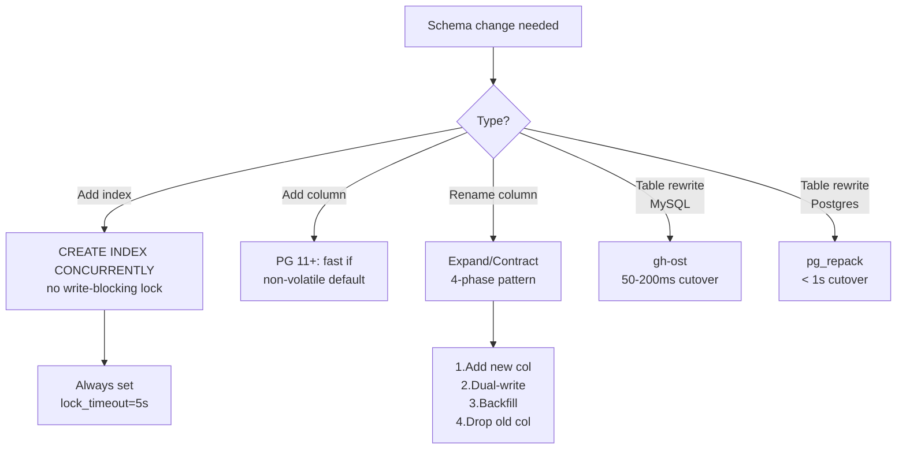
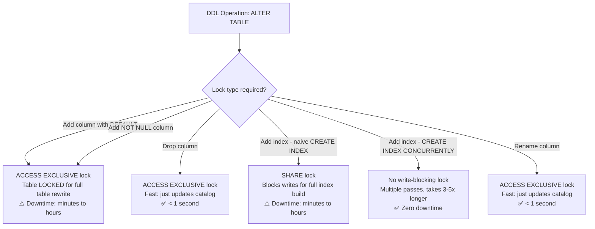
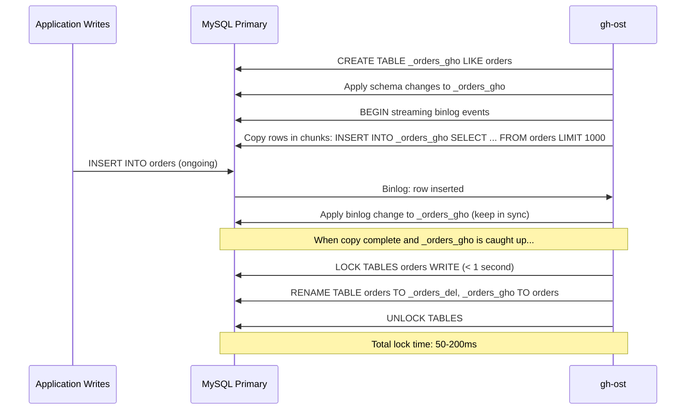
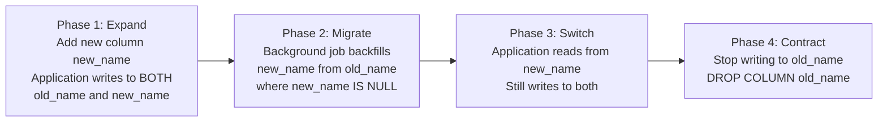
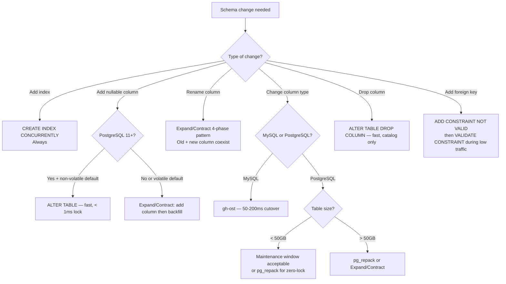

# Zero-Downtime Database Migrations: Online Schema Changes at Scale

## 🗺️ Quick Overview



*Zero-downtime migrations require specific tooling for each change type — always set `lock_timeout` to prevent lock queues from silently taking down production.*

**`ALTER TABLE orders ADD COLUMN discount_pct DECIMAL(5,2);` on a 2-billion-row table takes 4 hours and holds an `ACCESS EXCLUSIVE` lock the entire time.** Every query against that table — reads included — queues. Your application is down for 4 hours during a "routine schema migration." This is not a hypothetical — it is the default behavior of PostgreSQL `ALTER TABLE` for most DDL operations.

Zero-downtime migrations require specific tooling, a specific pattern (expand/contract), and specific failure mode awareness. Here's everything you need.

---

## The Problem Class `[Mid]`

A PostgreSQL table `orders` has 2 billion rows, 800GB on disk, and receives 5,000 writes/second. You need to:
- Add an index on `(customer_id, created_at)`
- Add a new nullable column `discount_pct`
- Rename column `amt` to `amount`
- Drop column `legacy_code`

Each of these operations, done naively, causes application downtime ranging from minutes to hours.



The solution space: use PostgreSQL's native concurrent operations where they exist, and use external tooling (pg_repack, gh-ost) where they don't.

---

## Why the Obvious Solution Fails `[Senior]`

**Approach 1: Maintenance window**

Take the application offline for 2am-4am, run migrations, bring back up. This works for internal tools but is unacceptable for consumer-facing applications with global users and SLA commitments.

**Approach 2: `ALTER TABLE` with low `lock_timeout`**

```sql
SET lock_timeout = '2s';
ALTER TABLE orders ADD COLUMN discount_pct DECIMAL(5,2);
```

This doesn't make the operation zero-downtime. It makes it fail fast if another transaction holds a conflicting lock. The DDL still acquires an `ACCESS EXCLUSIVE` lock when it runs — blocking all concurrent queries for the full duration.

**Approach 3: Blue-green database switch**

Clone the database, migrate the clone, switch traffic. Correct in principle, but:
- Multi-TB databases take hours to clone
- Writes to the original during clone-time are lost unless you dual-write
- Dual-writing during migration adds complexity and potential for data divergence
- Switching traffic has its own latency spike

**Approach 4: New table + background copy + swap**

This is what gh-ost and pg_repack actually do — but you need the tooling to do it correctly at scale.

---

## The Solution Landscape `[Senior]`

### Solution 1: PostgreSQL Native Concurrent DDL `[Senior]`

**CREATE INDEX CONCURRENTLY**

The standard tool for adding indexes without blocking writes:

```sql
-- This acquires SHARE UPDATE EXCLUSIVE (blocks DDL, not DML)
-- Makes multiple table passes:
-- Pass 1: Build index on current data
-- Pass 2: Wait for transactions that started before Pass 1 to finish, update index
-- Pass 3: Validate index consistency, mark VALID
CREATE INDEX CONCURRENTLY idx_orders_customer_created
ON orders (customer_id, created_at);

-- Monitor progress (PostgreSQL 12+):
SELECT
    phase,
    blocks_done,
    blocks_total,
    tuples_done,
    tuples_total,
    lockers_done,
    lockers_total
FROM pg_stat_progress_create_index
WHERE relid = 'orders'::regclass;
```

**Sizing guidance** `[Staff+]`:
- Concurrent index build takes **3-5x longer** than non-concurrent: a 20-minute regular index build takes 60-100 minutes concurrently
- Resource usage: full sequential scan of table (once per pass), significant I/O
- Recommended: schedule during low-traffic periods even though it doesn't block writes (CPU/I/O impact)
- On a 500GB table with 5K writes/sec: expect 45-90 minutes build time

**Failure modes** `[Staff+]`:
- **Invalid index on failure**: If `CREATE INDEX CONCURRENTLY` fails partway through (connection dropped, disk full), it leaves an INVALID index that takes up space and is never used. Must manually `DROP INDEX` the invalid index.
- **Long-running transactions blocking Phase 2**: `CREATE INDEX CONCURRENTLY` Phase 2 waits for all transactions that started before Phase 1 to finish. A long-running OLAP query from Phase 1 can block Phase 2 indefinitely. Monitor `pg_stat_activity` for blocking transactions during index builds.
- **Unique index validation**: `CREATE UNIQUE INDEX CONCURRENTLY` can fail during validation if duplicates exist. Failure leaves an invalid index. Check for duplicates first: `SELECT col, count(*) FROM t GROUP BY col HAVING count(*) > 1`.

**Adding columns: what's fast and what's not**:

```sql
-- FAST (metadata-only change, < 1ms):
ALTER TABLE orders ADD COLUMN notes TEXT;                    -- nullable, no default
ALTER TABLE orders ADD COLUMN archived BOOLEAN DEFAULT FALSE; -- PostgreSQL 11+: stored default

-- SLOW (full table rewrite, ACCESS EXCLUSIVE for hours):
-- PostgreSQL < 11:
ALTER TABLE orders ADD COLUMN archived BOOLEAN DEFAULT FALSE;

-- PostgreSQL 11+ fast path:
-- A column with a non-volatile DEFAULT no longer requires table rewrite!
-- DEFAULT NOW() is volatile (changes each row) → still slow
-- DEFAULT FALSE is non-volatile → fast metadata-only change
```

---

### Solution 2: gh-ost (GitHub Online Schema Change) for MySQL `[Senior]`

**What it is**: GitHub's tool for MySQL table alterations without locking. Uses MySQL binary log replication to capture writes during migration.

**How it actually works at depth**:



**Configuration decisions that matter** `[Staff+]`:
```bash
# gh-ost critical flags
gh-ost \
  --host=primary.db.internal \
  --database=mydb \
  --table=orders \
  --alter="ADD COLUMN discount_pct DECIMAL(5,2)" \
  --chunk-size=1000 \              # rows per copy chunk (smaller = less lock pressure)
  --throttle-control-replicas="replica.db.internal" \  # pause if replica lag > threshold
  --max-lag-millis=1500 \         # pause copy if replica lag > 1.5s
  --ok-to-drop-table \             # drop old table after cutover
  --execute \
  --verbose

# Throttle triggers:
# --max-load=Threads_running=25   # pause if MySQL busy
# --critical-load=Threads_running=1000  # abort if system overloaded
```

**Sizing guidance** `[Staff+]`:
- Copy speed: ~1000 rows/second/core on typical hardware
- 1 billion rows = ~11.5 hours copy time at 24K rows/min
- Total write amplification: ~2x (original writes + binlog replay to ghost table)
- Cutover lock time: 50-200ms (application experiences brief pause, not full downtime)
- Schedule cutover during low-traffic: `--postpone-cut-over-flag-file=/tmp/gh-ost.postpone`

**Failure modes** `[Staff+]`:
- **Replica lag triggering throttle loop**: gh-ost monitors replica lag and pauses copy when lag exceeds `max-lag-millis`. Under high write load, the copy may pause indefinitely if the write rate prevents the replica from catching up. Monitor: check if migration progress has stalled.
- **Binlog position loss**: If the binlog position is lost (MySQL restart, rotation), gh-ost must restart the copy. Keep `--serve-socket-file` for monitoring and `--panic-flag-file` for emergency abort.
- **Cutover race**: Between the `RENAME` and the old table being dropped, any transaction that opened the old table before `RENAME` can still write to it. gh-ost accounts for this with a brief lock window.

---

### Solution 3: pg_repack for PostgreSQL `[Senior]`

**What it is**: A PostgreSQL extension that rebuilds tables and indexes online, removing dead tuple bloat and allowing schema changes, without long-term locks.

**What it can and cannot do**:
- ✅ Remove table bloat (equivalent to `VACUUM FULL` without locking)
- ✅ Rebuild indexes without bloat
- ✅ Add columns, change column types (with limitations)
- ❌ Cannot add non-nullable columns without default
- ❌ Cannot add constraints that require full table validation

**How it actually works at depth**:

```sql
-- Install extension
CREATE EXTENSION pg_repack;

-- Repack a table to reclaim bloat (~VACUUM FULL without locking):
pg_repack --table orders --no-kill-backend

-- Under the hood:
-- 1. CREATE TABLE orders_pgsql_tmp (LIKE orders INCLUDING ALL)
-- 2. CREATE RULE/TRIGGER to capture ongoing changes to a log table
-- 3. Copy rows from orders to orders_pgsql_tmp in batches
-- 4. Replay captured changes (apply delta)
-- 5. LOCK orders briefly → SWAP tables → DROP log table
-- Total lock time: < 1 second
```

**Sizing guidance** `[Staff+]`:
```bash
# pg_repack flags for production use
pg_repack \
  --table orders \
  --jobs 4 \                    # parallel index rebuilds
  --wait-timeout 60 \           # wait up to 60s for lock, then abort
  --no-kill-backend \           # don't kill conflicting backends
  --elevel warning              # verbose logging

# Resource cost: full sequential read + write of table = 2x table size in I/O
# 800GB table: ~1600GB I/O, ~3-6 hours at 100MB/s sustained I/O
# Schedule during off-peak: still generates significant I/O load
```

**Failure modes** `[Staff+]`:
- **Long-running transactions blocking final lock**: pg_repack's final table swap requires a brief exclusive lock. A long-running OLAP query can block this indefinitely. Use `--wait-timeout` to abort if lock not acquired quickly.
- **Trigger-based capture overhead**: The log trigger adds ~15-20% write overhead during the repack operation. On write-heavy tables, this can cause replica lag. Monitor during the operation.
- **Index validity check**: If an index is already `INVALID` before repack (from a failed `CREATE INDEX CONCURRENTLY`), pg_repack will fail. Must resolve invalid indexes first.

---

### Solution 4: The Expand/Contract Pattern `[Senior]`

**What it is**: A multi-deployment, multi-migration approach to schema changes that eliminates the need for long-running DDL locks by spreading the change over several deployments.

**The pattern for renaming a column (old_name → new_name)**:



**Detailed implementation**:

```sql
-- Phase 1: Add new column (fast, non-blocking in PostgreSQL 11+)
ALTER TABLE orders ADD COLUMN amount DECIMAL(10,2);

-- Application code change (deployed alongside Phase 1):
-- Write to BOTH old 'amt' and new 'amount' columns
-- Read from 'amount' if not null, else 'amt' (read new, fallback to old)
```

```python
# Application code during expand phase
def save_order(order):
    db.execute("""
        INSERT INTO orders (customer_id, amt, amount, ...)
        VALUES (%s, %s, %s, ...)
    """, (order.customer_id, order.amount, order.amount, ...))

def get_order_amount(order_row):
    # Read new column, fall back to old
    return order_row['amount'] or order_row['amt']
```

```sql
-- Phase 2: Background migration (runs as a background job, not blocking)
-- Batch update in chunks to avoid lock pressure
UPDATE orders
SET amount = amt
WHERE amount IS NULL
AND id BETWEEN %s AND %s;  -- chunk by primary key range

-- Phase 3: Verify migration complete
SELECT count(*) FROM orders WHERE amount IS NULL; -- must be 0

-- Phase 4: Contract — drop old column
-- At this point, no application code reads 'amt' anymore
ALTER TABLE orders DROP COLUMN amt;  -- fast, catalog-only change
```

**Sizing guidance** `[Staff+]`:
- Background migration batch size: 1000-5000 rows per batch
- Sleep between batches: 10-50ms to limit write amplification
- Total migration time for 2B rows: `(2B / 2500 rows/batch) × 30ms/batch ≈ 24,000 seconds ≈ 6.7 hours`
- At 5K writes/sec, each batch causes ~5K competing writes to surrounding rows

**The FK constraint lock problem** `[Staff+]`:

Adding a foreign key constraint always requires a full table scan to validate existing data. Even `ADD CONSTRAINT ... NOT VALID` + `VALIDATE CONSTRAINT` has a brief `SHARE ROW EXCLUSIVE` lock during validation that blocks concurrent DDL.

```sql
-- Step 1: Add constraint without validation (non-blocking, just marks new rows)
ALTER TABLE order_items
ADD CONSTRAINT fk_orders
FOREIGN KEY (order_id) REFERENCES orders(id)
NOT VALID;

-- Step 2: Validate existing data (SHARE UPDATE EXCLUSIVE — blocks DDL, not DML)
-- Schedule during low-traffic
ALTER TABLE order_items VALIDATE CONSTRAINT fk_orders;
```

---

## Trade-off Matrix `[Senior]` → `[Staff+]`

| Approach | Lock Duration | Works On | Complexity | Failure Recovery |
|---|---|---|---|---|
| Native `CREATE INDEX CONCURRENTLY` | None for DML | PostgreSQL | Low | Drop INVALID index, retry |
| PostgreSQL 11+ add column with default | < 1ms | PostgreSQL | Low | N/A (fast) |
| gh-ost | 50-200ms cutover | MySQL only | Medium | Abort + retry |
| pg_repack | < 1s cutover | PostgreSQL | Medium | Abort + check logs |
| Expand/Contract | None | Any database | High | Rollback application code |
| Maintenance window | Full downtime | Any | Low | N/A |
| Blue-green database | Brief cutover | Any | Very High | Switch back |

---

## Decision Framework — When to Pick Each `[Senior]` → `[Staff+]`



---

## Production Failure Story `[Staff+]`

**The migration-triggered outage via lock queue**:

A SaaS platform needed to add a `deleted_at TIMESTAMP` column to their `users` table (90M rows, 200 writes/second). The DBA ran:

```sql
ALTER TABLE users ADD COLUMN deleted_at TIMESTAMP;
```

PostgreSQL 14. 90M rows. The operation itself was fast (milliseconds — nullable column, no default). But it needed an `ACCESS EXCLUSIVE` lock.

**The actual failure**: The `ALTER TABLE` waited in the lock queue behind a long-running analytics query (`SELECT ... FROM users GROUP BY ...`, started 8 minutes earlier, holding `ACCESS SHARE` lock).

During this wait, **every new query on the `users` table also queued** behind the `ALTER TABLE`'s `ACCESS EXCLUSIVE` lock request. Within 90 seconds, 4,000 connections were queued. The application became completely unresponsive. After 3 minutes, the analytics query finished, `ALTER TABLE` ran in 2ms, all queued queries continued — but the connection pool had exhausted and 40% of pending requests had timed out.

**Root cause**: The lock queue in PostgreSQL is FIFO. An `ACCESS EXCLUSIVE` request blocks all subsequent queries from proceeding, even if those queries only need `ACCESS SHARE`.

**Fix**:
```sql
-- Always use lock_timeout for DDL to prevent queue buildup
SET lock_timeout = '2s';  -- Fail fast rather than queue
ALTER TABLE users ADD COLUMN deleted_at TIMESTAMP;
-- If this times out: retry during low-traffic or after killing the blocking query
```

**Lesson**: A 2ms `ALTER TABLE` can take your application down for minutes via lock queue accumulation. Always set `lock_timeout` on DDL in production. Monitor `pg_stat_activity` for lock waits before running migrations.

---

## Observability Playbook `[Staff+]`

```sql
-- Monitor DDL progress
SELECT phase, blocks_done, blocks_total, tuples_done, tuples_total
FROM pg_stat_progress_create_index
WHERE relid = 'orders'::regclass;

-- Monitor pg_repack / migration lock waits
SELECT
    pid,
    wait_event_type,
    wait_event,
    query_start,
    age(now(), query_start) AS wait_duration,
    left(query, 80) AS query
FROM pg_stat_activity
WHERE wait_event_type = 'Lock'
ORDER BY wait_duration DESC;

-- Detect table bloat requiring pg_repack
SELECT
    tablename,
    pg_size_pretty(pg_total_relation_size(tablename::regclass)) AS total_size,
    pg_size_pretty(pg_relation_size(tablename::regclass)) AS table_size,
    pg_size_pretty(pg_total_relation_size(tablename::regclass) -
                   pg_relation_size(tablename::regclass)) AS index_size,
    n_dead_tup,
    n_live_tup,
    ROUND(n_dead_tup::numeric / NULLIF(n_live_tup, 0) * 100, 1) AS dead_pct
FROM pg_stat_user_tables
WHERE n_dead_tup > 1000000
ORDER BY n_dead_tup DESC;

-- INVALID indexes (cleanup after failed CONCURRENT builds)
SELECT indexname, indexdef
FROM pg_indexes
JOIN pg_class ON pg_class.relname = pg_indexes.indexname
WHERE NOT pg_index.indisvalid
AND pg_index.indexrelid = pg_class.oid;
```

---

## Architectural Evolution `[Staff+]`

**2026 zero-downtime migration landscape**:

**Atlas and SchemaHero for declarative migrations**: In 2026, the standard is declarative schema management via tools like Atlas (`atlasgo.io`) and SchemaHero (Kubernetes-native). You define the target schema state; the tool generates and applies the migration steps automatically, including choosing `CREATE INDEX CONCURRENTLY` vs naive `CREATE INDEX`. Atlas integrates with CI/CD pipelines for migration approval workflows.

**pgroll (Xata) — multi-version schema**: pgroll (open-source from Xata, 2024) takes the expand/contract pattern and automates it. It maintains two schema versions simultaneously using PostgreSQL views and triggers — old application code sees old schema, new application code sees new schema. Zero-downtime column renames become a one-command operation.

**eBPF DDL observability**: eBPF tools now trace `LockAcquire` and `LockRelease` PostgreSQL kernel calls, showing exactly which lock each DDL operation acquires and for how long — enabling pre-migration risk assessment without test-environment uncertainty.

**Platform engineering**: The 2026 approach codifies migration policies in CI/CD: any migration touching tables > 10GB automatically requires `lock_timeout` annotation and gh-ost/pg_repack review. Migrations without these fail the pipeline. This prevents the "fast 2ms ALTER TABLE that queues everything" production failure at the automation layer.

---

## Decision Framework Checklist `[All Levels]`

- [ ] Always set `lock_timeout = '5s'` before any DDL in production to prevent lock queue buildup
- [ ] Use `CREATE INDEX CONCURRENTLY` — never plain `CREATE INDEX` in production
- [ ] After failed `CREATE INDEX CONCURRENTLY`: check for and drop INVALID indexes before retrying
- [ ] On PostgreSQL 11+: adding columns with non-volatile defaults (TRUE, FALSE, 0, NULL) is safe and fast
- [ ] For column renames: use the 4-phase expand/contract pattern — never do direct rename in high-traffic systems
- [ ] For table rewrites (type changes): use pg_repack on PostgreSQL, gh-ost on MySQL
- [ ] For FK constraints: always `ADD CONSTRAINT NOT VALID` first, then `VALIDATE CONSTRAINT` separately
- [ ] Run migrations during low-traffic windows — even zero-downtime migrations cause I/O load
- [ ] Test migration rollback procedure: the expand/contract pattern enables clean rollback by removing the new column
- [ ] Monitor `pg_stat_activity` for lock waits during migrations — have a kill procedure ready for blocking queries

---
*Written by Gaurav Porwal — 10+ Year Engineer | Tech Lead | Product Owner | Business-Minded Builder*
*Last updated: 2026-03-18*
