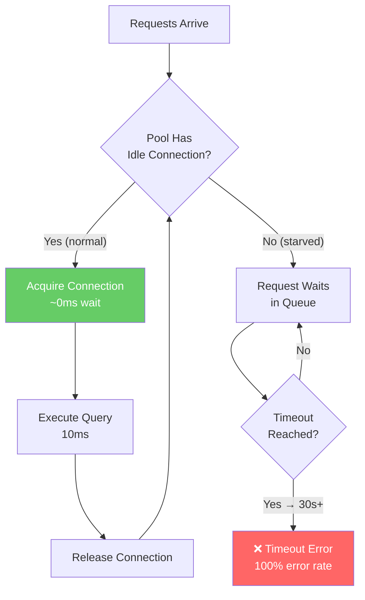

# Connection Pool Starvation - The Silent System Killer

> **Category:** Performance
> **Frequency:** Top 3 production incident cause
> **Detection Difficulty:** Hard (metrics look normal)
> **Impact:** Complete system freeze

## 🗺️ Quick Overview



*Normal path recycles connections in milliseconds; starved path queues requests until timeout causes a full outage.*

## The Incident: When Everything Looks Fine But Nothing Works

**3:47 AM Alert:** "Application not responding"

```
Dashboard readings:
├── CPU: 8% (normal ✅)
├── Memory: 42% (normal ✅)
├── Disk I/O: minimal (normal ✅)
├── Network: normal ✅
├── Database CPU: 12% (normal ✅)
└── Database queries/sec: 0 (wait, what? 🔴)

Application logs:
├── "Timeout waiting for connection" (repeated 10,000x)
├── "Connection pool exhausted"
└── "Cannot acquire connection within timeout"

Response times:
├── Before: 50ms average
├── During incident: 30,000ms (30 seconds!)
└── Error rate: 100%
```

**The paradox:** Everything looks healthy, but the system is completely frozen.

---

## Real-World Incidents

### Incident 1: Uber's Black Friday (2022)

```
Scenario: Surge pricing service
Timeline:
- 6:00 PM: Traffic 5x normal
- 6:15 PM: First connection timeouts
- 6:30 PM: Surge pricing stops updating
- 6:45 PM: Drivers can't see surge, leave high-demand areas
- 7:00 PM: Manual intervention, pool size increased
- 7:15 PM: Recovery

Root cause: Pool sized for 2x traffic, not 5x
Impact: $2M estimated lost revenue
Fix time: 45 minutes (once identified)
```

### Incident 2: Stripe Payment Processing (2021)

```
Scenario: Payment authorization service
Timeline:
- Peak traffic during flash sale
- Connection pool exhausted in 3 minutes
- Payments failing silently (timeout looks like decline)
- Merchants losing sales, customers leaving

Root cause: New endpoint with connection leak
Impact: $500K in failed transactions
Detection time: 15 minutes
Recovery: Code rollback
```

### Incident 3: Instagram Stories (2023)

```
Scenario: Stories upload service
Symptoms:
- Stories not appearing
- Users re-uploading (making it worse)
- Pool exhausted across all pods

Root cause:
- Upload service holds connection during S3 upload
- S3 latency spike (500ms → 5s)
- Connections held 10x longer than normal
- Pool exhausted

Impact: 30 minutes of degraded service
Fix: Separate connections for quick vs slow operations
```

---

## Why This Happens

### The Connection Pool Mental Model

```
Normal Operation:
┌─────────────────────────────────────────┐
│          Connection Pool (20)           │
├─────────────────────────────────────────┤
│ [BUSY][BUSY][IDLE][IDLE][IDLE]...      │
│                                         │
│ Request arrives → Gets IDLE connection  │
│ Query executes (10ms)                   │
│ Connection returns to IDLE              │
│                                         │
│ Throughput: 20 connections × 100 q/sec  │
│           = 2000 queries/second ✅      │
└─────────────────────────────────────────┘

Starvation:
┌─────────────────────────────────────────┐
│          Connection Pool (20)           │
├─────────────────────────────────────────┤
│ [BUSY][BUSY][BUSY][BUSY][BUSY]...      │
│ ALL CONNECTIONS BUSY                    │
│                                         │
│ Request arrives → Waits...              │
│ Waits... Waits... Waits...              │
│ TIMEOUT! ❌                             │
│                                         │
│ Meanwhile: connections doing nothing    │
│ (leak, slow query, or held too long)   │
└─────────────────────────────────────────┘
```

### Common Causes

```
1. CONNECTION LEAKS (Most Common)
   ├── Missing client.release() in error paths
   ├── Early returns without cleanup
   └── Try block without finally

2. SLOW QUERIES
   ├── Missing indexes (full table scan)
   ├── Lock contention (waiting for locks)
   └── Large result sets (memory pressure)

3. EXTERNAL DEPENDENCY DELAYS
   ├── Holding connection during HTTP calls
   ├── Holding connection during file I/O
   └── Holding connection during message queue ops

4. POOL MISCONFIGURATION
   ├── Pool too small for traffic
   ├── No connection timeout (waits forever)
   └── No query timeout (queries run forever)

5. TRAFFIC SPIKES
   ├── Flash sales
   ├── Viral content
   └── DDoS (legitimate or attack)
```

---

## Detection Patterns

### Metrics That Reveal Starvation

```
HEALTHY POOL:
├── pool.idle: 10-15 (connections available)
├── pool.waiting: 0 (no requests waiting)
├── pool.total: 20 (configured size)
├── avg_query_time: 10ms
└── connection_wait_time: 0-1ms

STARVING POOL:
├── pool.idle: 0 ⚠️ (no connections available)
├── pool.waiting: 50+ 🔴 (requests queued)
├── pool.total: 20 (still at configured size)
├── avg_query_time: 10ms (queries are fast!)
└── connection_wait_time: 5000ms+ 🔴

Key insight: Query time is normal, but WAIT time is huge
```

### The "Everything Looks Fine" Trap

```javascript
// Why traditional monitoring misses this:

// CPU monitoring sees:
cpu_usage: 8%  // ✅ Looks fine
// Reality: Threads are WAITING, not computing

// Database monitoring sees:
queries_per_second: 500  // Looks fine (but was 5000)
query_latency_avg: 10ms  // ✅ Queries are fast

// What's missing:
connection_wait_time: 25000ms  // 🔴 THE REAL PROBLEM
pool_utilization: 100%          // 🔴 NO AVAILABLE CONNECTIONS
requests_waiting: 200           // 🔴 QUEUE GROWING
```

---

## Prevention Strategies

### 1. Proper Pool Configuration

```javascript
const pool = new Pool({
  max: 20,  // Calculated, not guessed

  // CRITICAL: Connection timeout
  connectionTimeoutMillis: 5000,  // Fail after 5s, don't wait forever

  // CRITICAL: Query timeout
  statement_timeout: 30000,  // Kill queries over 30s

  // Idle management
  idleTimeoutMillis: 30000,  // Release idle connections

  // Minimum connections (keep warm)
  min: 5
});
```

### 2. Always Use Try/Finally

```javascript
// ❌ WRONG: Leaks on error
async function riskyQuery() {
  const client = await pool.connect();
  const result = await client.query('SELECT...');  // If this throws...
  client.release();  // This never runs = LEAK
  return result;
}

// ✅ CORRECT: Always releases
async function safeQuery() {
  const client = await pool.connect();
  try {
    return await client.query('SELECT...');
  } finally {
    client.release();  // Always runs, even on error
  }
}

// ✅ BETTER: Use pool.query() for simple queries
async function simpleQuery() {
  return pool.query('SELECT...');  // Auto-manages connection
}
```

### 3. Don't Hold Connections During External Calls

```javascript
// ❌ WRONG: Holds connection during HTTP call
async function badPattern() {
  const client = await pool.connect();
  try {
    const user = await client.query('SELECT * FROM users WHERE id = $1', [id]);
    // Connection held during entire HTTP call!
    const enrichedData = await fetch(`https://api.example.com/enrich/${user.id}`);
    await client.query('UPDATE users SET data = $1 WHERE id = $2', [enrichedData, id]);
    return user;
  } finally {
    client.release();
  }
}

// ✅ CORRECT: Release connection before external call
async function goodPattern() {
  // First DB call
  const user = await pool.query('SELECT * FROM users WHERE id = $1', [id]);

  // External call (no connection held)
  const enrichedData = await fetch(`https://api.example.com/enrich/${user.id}`);

  // Second DB call
  await pool.query('UPDATE users SET data = $1 WHERE id = $2', [enrichedData, id]);

  return user;
}
```

### 4. Implement Circuit Breakers

```javascript
class PoolCircuitBreaker {
  constructor(pool, threshold = 0.5) {
    this.pool = pool;
    this.threshold = threshold;  // Open if >50% utilization for too long
    this.state = 'CLOSED';
  }

  async query(text, params) {
    const utilization = (this.pool.totalCount - this.pool.idleCount) / this.pool.totalCount;

    if (this.state === 'OPEN') {
      throw new Error('Circuit breaker open - database pool exhausted');
    }

    if (utilization > this.threshold && this.pool.waitingCount > 0) {
      this.state = 'OPEN';
      setTimeout(() => this.state = 'HALF_OPEN', 5000);  // Try again in 5s
      throw new Error('Pool under pressure - rejecting request');
    }

    return this.pool.query(text, params);
  }
}
```

---

## Recovery Procedures

### Immediate Actions (When It Happens)

```bash
# 1. Identify the problem
# Check pool metrics (if available)
curl localhost:3000/health/db

# 2. Check database connections
psql -c "SELECT count(*) FROM pg_stat_activity WHERE state = 'active';"
psql -c "SELECT count(*) FROM pg_stat_activity WHERE state = 'idle';"
psql -c "SELECT query, state, wait_event FROM pg_stat_activity WHERE state != 'idle' LIMIT 10;"

# 3. Kill long-running queries (if that's the cause)
psql -c "SELECT pg_terminate_backend(pid) FROM pg_stat_activity WHERE duration > interval '5 minutes';"

# 4. Restart affected pods (last resort)
kubectl rollout restart deployment/my-app
```

### Post-Incident Analysis

```markdown
## Connection Pool Starvation Post-Mortem Template

### Timeline
- [TIME]: First alert
- [TIME]: Investigation started
- [TIME]: Root cause identified
- [TIME]: Mitigation applied
- [TIME]: Recovery confirmed

### Root Cause
- [ ] Connection leak in code
- [ ] Slow query / missing index
- [ ] External dependency timeout
- [ ] Pool undersized for traffic
- [ ] Configuration error

### Impact
- Duration: X minutes
- Requests affected: X
- Revenue impact: $X

### Action Items
- [ ] Add pool utilization monitoring
- [ ] Add connection wait time alerts
- [ ] Fix identified leak/slow query
- [ ] Review pool sizing
- [ ] Add circuit breaker
```

---

## Monitoring Setup

### Key Metrics to Track

```javascript
// Expose these metrics to your monitoring system

const metrics = {
  // Pool state
  'db.pool.total': pool.totalCount,
  'db.pool.idle': pool.idleCount,
  'db.pool.waiting': pool.waitingCount,
  'db.pool.utilization': (pool.totalCount - pool.idleCount) / pool.totalCount * 100,

  // Timing
  'db.connection.wait_time_p99': getPercentile(connectionWaitTimes, 99),
  'db.query.duration_p99': getPercentile(queryDurations, 99),

  // Errors
  'db.connection.timeouts': connectionTimeoutCount,
  'db.pool.exhausted_events': poolExhaustedCount
};
```

### Alert Thresholds

```yaml
alerts:
  - name: PoolHighUtilization
    condition: db.pool.utilization > 80
    for: 2m
    severity: warning

  - name: PoolExhausted
    condition: db.pool.idle == 0 AND db.pool.waiting > 0
    for: 30s
    severity: critical

  - name: ConnectionWaitHigh
    condition: db.connection.wait_time_p99 > 1000
    for: 1m
    severity: warning

  - name: ConnectionTimeout
    condition: rate(db.connection.timeouts) > 1
    for: 1m
    severity: critical
```

---

## Key Takeaways

### The Pattern

```
Normal: Request → Get connection (0ms) → Query (10ms) → Release → Response
Starved: Request → Wait for connection (30s) → Timeout → Error
```

### Prevention Checklist

- [ ] Pool size calculated from formula, not guessed
- [ ] connectionTimeoutMillis set (3-5 seconds)
- [ ] All database code uses try/finally for release
- [ ] No connections held during external calls
- [ ] Pool utilization monitored and alerted
- [ ] Connection wait time monitored and alerted
- [ ] Circuit breaker for graceful degradation

### Quick Fixes (In Order of Priority)

1. **Increase connection timeout** - Fail fast instead of waiting forever
2. **Fix connection leaks** - Check error handling paths
3. **Add query timeouts** - Kill runaway queries
4. **Increase pool size** - If genuinely undersized
5. **Add read replicas** - If hitting database limits

---

## Related Content

- [Connection Pool Management](/system-design/performance/connection-pool-management) - Prevention guide
- [POC #71: Connection Pool Sizing](/12-interview-prep/practice-pocs/connection-pool-sizing) - Find optimal size
- [POC #72: Connection Leak Detection](/12-interview-prep/practice-pocs/connection-leak-detection) - Find leaks

---

**Remember:** Connection pool starvation is insidious because traditional metrics (CPU, memory, disk) look normal. The only way to catch it is to monitor pool-specific metrics: utilization, idle count, waiting count, and connection wait time.
