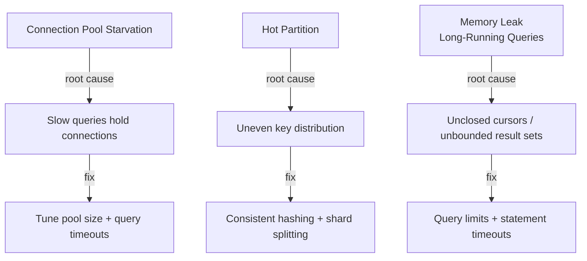

# Database Failure Modes

Real production database failures — what happened, why, and how to prevent them.

```mermaid
graph TD
    CP[Connection Pool Starvation] -->|root cause| SLOW[Slow queries hold connections]
    SLOW -->|fix| POOL[Tune pool size + query timeouts]
    HP[Hot Partition] -->|root cause| SKEW[Uneven key distribution]
    SKEW -->|fix| HASH[Consistent hashing + shard splitting]
    ML[Memory Leak\nLong-Running Queries] -->|root cause| CURSOR[Unclosed cursors / unbounded result sets]
    CURSOR -->|fix| LIMIT[Query limits + statement timeouts]
```
