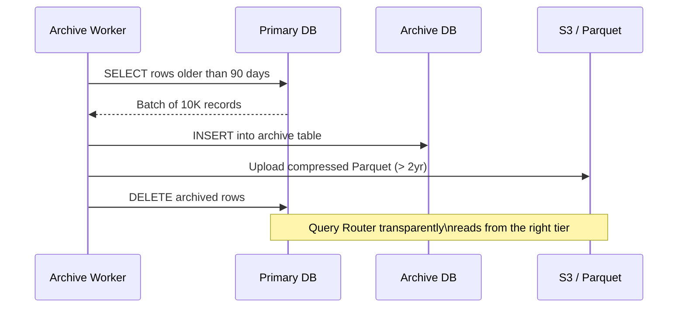
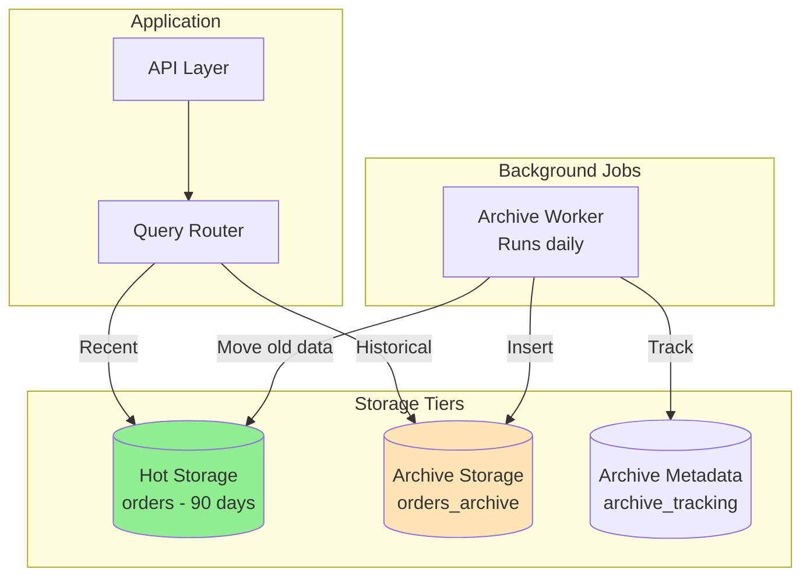

# POC #101: Database Archival Strategies

**Difficulty**: 🟡 Intermediate
**Time**: 45 minutes
**Prerequisites**: PostgreSQL basics, Python/Node.js

> **Runnable Code**: This POC includes complete runnable scripts in the
> [`database-archival-poc/`](https://github.com/your-repo/system-design/tree/main/docs-site/pages/interview-prep/practice-pocs/database-archival-poc) folder.
> Run `docker-compose up -d` to start the infrastructure, then execute the Python/Node.js scripts.

## 🗺️ Quick Overview



*This POC builds a tiered archival pipeline: old rows move from the hot primary to a cheaper archive store and eventually to object storage, while a query router keeps reads transparent.*

---

## What You'll Build

A complete data archival system that:
1. Automatically moves old data to archive tables
2. Routes queries to appropriate storage tier
3. Restores archived data on demand
4. Tracks archival metrics

---

## The Problem

Your `orders` table has 50 million rows. 90% are older than 90 days and rarely accessed. This causes:
- Slow queries (large index scans)
- Expensive storage (hot storage for cold data)
- Long backup times

**Solution**: Archive old data, query transparently across tiers.

---

## Architecture



---

## Step 1: Database Schema

Create the tables for our archival system.

```sql
-- schema.sql
-- Run this to set up the archival system

-- Active orders table (optimized for writes)
CREATE TABLE IF NOT EXISTS orders (
    id BIGSERIAL PRIMARY KEY,
    user_id BIGINT NOT NULL,
    product_id BIGINT NOT NULL,
    quantity INTEGER NOT NULL DEFAULT 1,
    total_amount DECIMAL(10,2) NOT NULL,
    status VARCHAR(20) NOT NULL DEFAULT 'pending',
    created_at TIMESTAMP NOT NULL DEFAULT NOW(),
    updated_at TIMESTAMP NOT NULL DEFAULT NOW()
);

-- Indexes for active queries
CREATE INDEX IF NOT EXISTS idx_orders_user_date
    ON orders(user_id, created_at DESC);
CREATE INDEX IF NOT EXISTS idx_orders_status
    ON orders(status) WHERE status IN ('pending', 'processing');
CREATE INDEX IF NOT EXISTS idx_orders_created
    ON orders(created_at DESC);

-- Archive orders table (optimized for reads)
CREATE TABLE IF NOT EXISTS orders_archive (
    id BIGINT PRIMARY KEY,  -- No SERIAL, we copy IDs
    user_id BIGINT NOT NULL,
    product_id BIGINT NOT NULL,
    quantity INTEGER NOT NULL,
    total_amount DECIMAL(10,2) NOT NULL,
    status VARCHAR(20) NOT NULL,
    created_at TIMESTAMP NOT NULL,
    updated_at TIMESTAMP NOT NULL,
    archived_at TIMESTAMP NOT NULL DEFAULT NOW()
);

-- Minimal indexes for archive (read-heavy, no updates)
CREATE INDEX IF NOT EXISTS idx_archive_user_date
    ON orders_archive(user_id, created_at DESC);
CREATE INDEX IF NOT EXISTS idx_archive_created
    ON orders_archive(created_at DESC);

-- Archive tracking metadata
CREATE TABLE IF NOT EXISTS archive_tracking (
    id BIGSERIAL PRIMARY KEY,
    table_name VARCHAR(100) NOT NULL,
    record_id BIGINT NOT NULL,
    storage_tier VARCHAR(20) NOT NULL DEFAULT 'archive',
    archived_at TIMESTAMP NOT NULL DEFAULT NOW(),
    archive_location TEXT,  -- S3 path for cold storage
    UNIQUE(table_name, record_id)
);

CREATE INDEX IF NOT EXISTS idx_tracking_table_record
    ON archive_tracking(table_name, record_id);

-- Archival job history
CREATE TABLE IF NOT EXISTS archive_jobs (
    id BIGSERIAL PRIMARY KEY,
    table_name VARCHAR(100) NOT NULL,
    records_archived INTEGER NOT NULL,
    started_at TIMESTAMP NOT NULL,
    completed_at TIMESTAMP,
    status VARCHAR(20) NOT NULL DEFAULT 'running',
    error_message TEXT
);
```

---

## Step 2: Seed Test Data

Generate realistic test data spanning multiple years.

```sql
-- seed_data.sql
-- Generate 1M orders across 2 years

INSERT INTO orders (user_id, product_id, quantity, total_amount, status, created_at, updated_at)
SELECT
    (random() * 10000)::BIGINT + 1 as user_id,
    (random() * 1000)::BIGINT + 1 as product_id,
    (random() * 5)::INTEGER + 1 as quantity,
    (random() * 500 + 10)::DECIMAL(10,2) as total_amount,
    CASE (random() * 4)::INTEGER
        WHEN 0 THEN 'pending'
        WHEN 1 THEN 'processing'
        WHEN 2 THEN 'shipped'
        WHEN 3 THEN 'delivered'
        ELSE 'cancelled'
    END as status,
    NOW() - (random() * 730)::INTEGER * INTERVAL '1 day' as created_at,
    NOW() - (random() * 730)::INTEGER * INTERVAL '1 day' as updated_at
FROM generate_series(1, 1000000);

-- Verify distribution
SELECT
    CASE
        WHEN created_at > NOW() - INTERVAL '90 days' THEN 'Hot (< 90 days)'
        WHEN created_at > NOW() - INTERVAL '365 days' THEN 'Warm (90-365 days)'
        ELSE 'Cold (> 1 year)'
    END as tier,
    COUNT(*) as order_count,
    ROUND(COUNT(*) * 100.0 / SUM(COUNT(*)) OVER(), 1) as percentage
FROM orders
GROUP BY 1
ORDER BY 1;
```

---

## Step 3: Archive Worker (Python)

Background job that moves old data to archive.

```python
# archive_worker.py
"""
Data Archival Worker
Moves old records from active to archive tables.
"""

import asyncio
import asyncpg
from datetime import datetime, timedelta
from dataclasses import dataclass
from typing import Optional
import logging

logging.basicConfig(level=logging.INFO)
logger = logging.getLogger(__name__)


@dataclass
class ArchivalConfig:
    """Configuration for archival job."""
    table_name: str
    archive_table: str
    date_column: str = 'created_at'
    retention_days: int = 90
    batch_size: int = 10000
    exclude_statuses: tuple = ('pending', 'processing')


class ArchiveWorker:
    """
    Moves old data from active tables to archive tables.

    Features:
    - Batch processing to avoid locks
    - Tracks archived records
    - Supports restoration
    """

    def __init__(self, db_url: str):
        self.db_url = db_url
        self.pool: Optional[asyncpg.Pool] = None

    async def connect(self):
        """Initialize database connection pool."""
        self.pool = await asyncpg.create_pool(
            self.db_url,
            min_size=2,
            max_size=10
        )
        logger.info("Connected to database")

    async def close(self):
        """Close database connections."""
        if self.pool:
            await self.pool.close()

    async def run_archival(self, config: ArchivalConfig) -> dict:
        """
        Run archival job for a table.

        Returns:
            dict with job statistics
        """
        job_id = await self._start_job(config.table_name)

        try:
            total_archived = 0
            cutoff_date = datetime.utcnow() - timedelta(days=config.retention_days)

            logger.info(
                f"Starting archival for {config.table_name}, "
                f"cutoff: {cutoff_date}, batch_size: {config.batch_size}"
            )

            while True:
                archived_count = await self._archive_batch(config, cutoff_date)

                if archived_count == 0:
                    break

                total_archived += archived_count
                logger.info(f"Archived {total_archived} records so far...")

                # Small delay to reduce database load
                await asyncio.sleep(0.1)

            await self._complete_job(job_id, total_archived)

            return {
                'job_id': job_id,
                'table': config.table_name,
                'records_archived': total_archived,
                'cutoff_date': cutoff_date.isoformat()
            }

        except Exception as e:
            await self._fail_job(job_id, str(e))
            raise

    async def _archive_batch(
        self,
        config: ArchivalConfig,
        cutoff_date: datetime
    ) -> int:
        """Archive a single batch of records."""
        async with self.pool.acquire() as conn:
            # Use a transaction for atomicity
            async with conn.transaction():
                # Select records to archive (with row locking)
                records = await conn.fetch(f"""
                    SELECT * FROM {config.table_name}
                    WHERE {config.date_column} < $1
                      AND status NOT IN {config.exclude_statuses}
                    ORDER BY {config.date_column}
                    LIMIT $2
                    FOR UPDATE SKIP LOCKED
                """, cutoff_date, config.batch_size)

                if not records:
                    return 0

                record_ids = [r['id'] for r in records]

                # Insert into archive table
                columns = list(records[0].keys())
                column_list = ', '.join(columns)
                placeholders = ', '.join(f'${i+1}' for i in range(len(columns)))

                for record in records:
                    await conn.execute(f"""
                        INSERT INTO {config.archive_table} ({column_list})
                        VALUES ({placeholders})
                        ON CONFLICT (id) DO NOTHING
                    """, *[record[col] for col in columns])

                # Track archival
                await conn.executemany("""
                    INSERT INTO archive_tracking (table_name, record_id, storage_tier)
                    VALUES ($1, $2, 'archive')
                    ON CONFLICT (table_name, record_id) DO NOTHING
                """, [(config.table_name, rid) for rid in record_ids])

                # Delete from active table
                await conn.execute(f"""
                    DELETE FROM {config.table_name}
                    WHERE id = ANY($1)
                """, record_ids)

                return len(records)

    async def _start_job(self, table_name: str) -> int:
        """Record job start."""
        async with self.pool.acquire() as conn:
            job_id = await conn.fetchval("""
                INSERT INTO archive_jobs (table_name, records_archived, started_at, status)
                VALUES ($1, 0, NOW(), 'running')
                RETURNING id
            """, table_name)
            return job_id

    async def _complete_job(self, job_id: int, records_archived: int):
        """Record job completion."""
        async with self.pool.acquire() as conn:
            await conn.execute("""
                UPDATE archive_jobs
                SET records_archived = $2,
                    completed_at = NOW(),
                    status = 'completed'
                WHERE id = $1
            """, job_id, records_archived)

    async def _fail_job(self, job_id: int, error: str):
        """Record job failure."""
        async with self.pool.acquire() as conn:
            await conn.execute("""
                UPDATE archive_jobs
                SET completed_at = NOW(),
                    status = 'failed',
                    error_message = $2
                WHERE id = $1
            """, job_id, error)


async def main():
    """Run archival for orders table."""
    worker = ArchiveWorker('postgresql://localhost/archival_poc')

    await worker.connect()

    try:
        # Archive orders older than 90 days
        config = ArchivalConfig(
            table_name='orders',
            archive_table='orders_archive',
            retention_days=90,
            batch_size=10000
        )

        result = await worker.run_archival(config)

        logger.info(f"Archival complete: {result}")

    finally:
        await worker.close()


if __name__ == '__main__':
    asyncio.run(main())
```

---

## Step 4: Query Router (Python)

Routes queries to appropriate storage tier.

```python
# query_router.py
"""
Smart Query Router
Routes queries to hot or archive storage based on date range.
"""

import asyncio
import asyncpg
from datetime import datetime, timedelta
from typing import List, Dict, Optional, Tuple
from enum import Enum
import logging

logging.basicConfig(level=logging.INFO)
logger = logging.getLogger(__name__)


class StorageTier(Enum):
    HOT = "hot"
    ARCHIVE = "archive"
    BOTH = "both"


class QueryRouter:
    """
    Routes queries to appropriate storage tier.

    Rules:
    - Date range entirely within 90 days -> HOT only
    - Date range entirely before 90 days -> ARCHIVE only
    - Date range spans both -> Query BOTH and merge
    """

    def __init__(self, db_url: str, archive_cutoff_days: int = 90):
        self.db_url = db_url
        self.archive_cutoff_days = archive_cutoff_days
        self.pool: Optional[asyncpg.Pool] = None

    async def connect(self):
        """Initialize connection pool."""
        self.pool = await asyncpg.create_pool(self.db_url, min_size=2, max_size=10)

    async def close(self):
        """Close connections."""
        if self.pool:
            await self.pool.close()

    def _determine_tier(
        self,
        start_date: Optional[datetime],
        end_date: Optional[datetime]
    ) -> StorageTier:
        """
        Determine which storage tier(s) to query.
        """
        now = datetime.utcnow()
        cutoff = now - timedelta(days=self.archive_cutoff_days)

        # No date filter - query both
        if not start_date and not end_date:
            return StorageTier.HOT  # Default to hot for unbounded queries

        # Only start date
        if start_date and not end_date:
            end_date = now

        # Only end date
        if end_date and not start_date:
            start_date = datetime.min

        # Determine tier
        if start_date >= cutoff:
            return StorageTier.HOT
        elif end_date < cutoff:
            return StorageTier.ARCHIVE
        else:
            return StorageTier.BOTH

    async def get_orders(
        self,
        user_id: Optional[int] = None,
        start_date: Optional[datetime] = None,
        end_date: Optional[datetime] = None,
        status: Optional[str] = None,
        limit: int = 100
    ) -> Dict:
        """
        Get orders with automatic tier routing.

        Returns:
            Dict with results and metadata about which tiers were queried
        """
        tier = self._determine_tier(start_date, end_date)

        logger.info(f"Query routing to tier: {tier.value}")

        results = []
        tiers_queried = []

        if tier in (StorageTier.HOT, StorageTier.BOTH):
            hot_results = await self._query_hot(
                user_id, start_date, end_date, status, limit
            )
            results.extend(hot_results)
            tiers_queried.append('hot')

        if tier in (StorageTier.ARCHIVE, StorageTier.BOTH):
            archive_results = await self._query_archive(
                user_id, start_date, end_date, status, limit
            )
            results.extend(archive_results)
            tiers_queried.append('archive')

        # Sort combined results by date descending
        results.sort(key=lambda x: x['created_at'], reverse=True)

        # Apply limit after merge
        results = results[:limit]

        return {
            'orders': results,
            'count': len(results),
            'tiers_queried': tiers_queried,
            'query_metadata': {
                'start_date': start_date.isoformat() if start_date else None,
                'end_date': end_date.isoformat() if end_date else None,
                'routing_decision': tier.value
            }
        }

    async def _query_hot(
        self,
        user_id: Optional[int],
        start_date: Optional[datetime],
        end_date: Optional[datetime],
        status: Optional[str],
        limit: int
    ) -> List[Dict]:
        """Query active orders table."""
        query = """
            SELECT id, user_id, product_id, quantity, total_amount,
                   status, created_at, updated_at,
                   'hot' as storage_tier
            FROM orders
            WHERE 1=1
        """
        params = []
        param_idx = 1

        if user_id:
            query += f" AND user_id = ${param_idx}"
            params.append(user_id)
            param_idx += 1

        if start_date:
            query += f" AND created_at >= ${param_idx}"
            params.append(start_date)
            param_idx += 1

        if end_date:
            query += f" AND created_at <= ${param_idx}"
            params.append(end_date)
            param_idx += 1

        if status:
            query += f" AND status = ${param_idx}"
            params.append(status)
            param_idx += 1

        query += f" ORDER BY created_at DESC LIMIT ${param_idx}"
        params.append(limit)

        async with self.pool.acquire() as conn:
            rows = await conn.fetch(query, *params)
            return [dict(row) for row in rows]

    async def _query_archive(
        self,
        user_id: Optional[int],
        start_date: Optional[datetime],
        end_date: Optional[datetime],
        status: Optional[str],
        limit: int
    ) -> List[Dict]:
        """Query archive orders table."""
        query = """
            SELECT id, user_id, product_id, quantity, total_amount,
                   status, created_at, updated_at,
                   'archive' as storage_tier
            FROM orders_archive
            WHERE 1=1
        """
        params = []
        param_idx = 1

        if user_id:
            query += f" AND user_id = ${param_idx}"
            params.append(user_id)
            param_idx += 1

        if start_date:
            query += f" AND created_at >= ${param_idx}"
            params.append(start_date)
            param_idx += 1

        if end_date:
            query += f" AND created_at <= ${param_idx}"
            params.append(end_date)
            param_idx += 1

        if status:
            query += f" AND status = ${param_idx}"
            params.append(status)
            param_idx += 1

        query += f" ORDER BY created_at DESC LIMIT ${param_idx}"
        params.append(limit)

        async with self.pool.acquire() as conn:
            rows = await conn.fetch(query, *params)
            return [dict(row) for row in rows]


async def demo():
    """Demonstrate query routing."""
    router = QueryRouter('postgresql://localhost/archival_poc')
    await router.connect()

    try:
        print("\n" + "="*60)
        print("Query Router Demo")
        print("="*60)

        # Test 1: Recent data (hot only)
        print("\n--- Test 1: Last 30 days (should query HOT only) ---")
        result = await router.get_orders(
            start_date=datetime.utcnow() - timedelta(days=30),
            limit=5
        )
        print(f"Tiers queried: {result['tiers_queried']}")
        print(f"Results: {result['count']} orders")

        # Test 2: Old data (archive only)
        print("\n--- Test 2: 6-12 months ago (should query ARCHIVE only) ---")
        result = await router.get_orders(
            start_date=datetime.utcnow() - timedelta(days=365),
            end_date=datetime.utcnow() - timedelta(days=180),
            limit=5
        )
        print(f"Tiers queried: {result['tiers_queried']}")
        print(f"Results: {result['count']} orders")

        # Test 3: Spanning both (queries both tiers)
        print("\n--- Test 3: Last 6 months (should query BOTH) ---")
        result = await router.get_orders(
            start_date=datetime.utcnow() - timedelta(days=180),
            limit=5
        )
        print(f"Tiers queried: {result['tiers_queried']}")
        print(f"Results: {result['count']} orders")
        for order in result['orders'][:3]:
            print(f"  - Order {order['id']}: {order['storage_tier']} tier")

        # Test 4: User-specific query
        print("\n--- Test 4: Specific user, all time ---")
        result = await router.get_orders(user_id=1234, limit=10)
        print(f"Tiers queried: {result['tiers_queried']}")
        print(f"Results: {result['count']} orders for user 1234")

    finally:
        await router.close()


if __name__ == '__main__':
    asyncio.run(demo())
```

---

## Step 5: Restore Service (Python)

Restore archived data back to hot storage.

```python
# restore_service.py
"""
Archive Restoration Service
Restores archived records back to active storage on demand.
"""

import asyncio
import asyncpg
from datetime import datetime
from typing import Optional, List, Dict
import logging

logging.basicConfig(level=logging.INFO)
logger = logging.getLogger(__name__)


class RestoreService:
    """
    Restores archived records to hot storage.

    Use cases:
    - User requests historical data
    - Compliance/audit requirements
    - Data recovery
    """

    def __init__(self, db_url: str):
        self.db_url = db_url
        self.pool: Optional[asyncpg.Pool] = None

    async def connect(self):
        self.pool = await asyncpg.create_pool(self.db_url, min_size=2, max_size=10)

    async def close(self):
        if self.pool:
            await self.pool.close()

    async def restore_record(
        self,
        table_name: str,
        record_id: int,
        keep_in_archive: bool = True
    ) -> Dict:
        """
        Restore a single record from archive to hot storage.

        Args:
            table_name: Base table name (e.g., 'orders')
            record_id: ID of record to restore
            keep_in_archive: If True, keep copy in archive

        Returns:
            Restored record
        """
        archive_table = f"{table_name}_archive"

        async with self.pool.acquire() as conn:
            async with conn.transaction():
                # Fetch from archive
                record = await conn.fetchrow(f"""
                    SELECT * FROM {archive_table}
                    WHERE id = $1
                """, record_id)

                if not record:
                    raise ValueError(f"Record {record_id} not found in archive")

                record = dict(record)

                # Remove archive-specific columns
                record.pop('archived_at', None)

                # Insert into hot storage
                columns = list(record.keys())
                column_list = ', '.join(columns)
                placeholders = ', '.join(f'${i+1}' for i in range(len(columns)))

                await conn.execute(f"""
                    INSERT INTO {table_name} ({column_list})
                    VALUES ({placeholders})
                    ON CONFLICT (id) DO UPDATE SET
                        updated_at = EXCLUDED.updated_at
                """, *[record[col] for col in columns])

                # Optionally remove from archive
                if not keep_in_archive:
                    await conn.execute(f"""
                        DELETE FROM {archive_table}
                        WHERE id = $1
                    """, record_id)

                # Update tracking
                await conn.execute("""
                    UPDATE archive_tracking
                    SET storage_tier = $1
                    WHERE table_name = $2 AND record_id = $3
                """, 'hot' if not keep_in_archive else 'both', table_name, record_id)

                logger.info(f"Restored record {record_id} from {archive_table}")

                return record

    async def restore_user_data(
        self,
        user_id: int,
        table_names: List[str]
    ) -> Dict[str, int]:
        """
        Restore all archived data for a user.
        Useful for GDPR data requests or account reactivation.
        """
        restored_counts = {}

        for table in table_names:
            archive_table = f"{table}_archive"

            async with self.pool.acquire() as conn:
                # Find all archived records for user
                records = await conn.fetch(f"""
                    SELECT id FROM {archive_table}
                    WHERE user_id = $1
                """, user_id)

                count = 0
                for record in records:
                    try:
                        await self.restore_record(table, record['id'])
                        count += 1
                    except Exception as e:
                        logger.error(f"Failed to restore {record['id']}: {e}")

                restored_counts[table] = count

        return restored_counts

    async def get_archive_stats(self) -> Dict:
        """Get statistics about archived data."""
        async with self.pool.acquire() as conn:
            stats = {}

            # Count by table
            table_counts = await conn.fetch("""
                SELECT table_name, COUNT(*) as count
                FROM archive_tracking
                GROUP BY table_name
            """)
            stats['by_table'] = {r['table_name']: r['count'] for r in table_counts}

            # Count by tier
            tier_counts = await conn.fetch("""
                SELECT storage_tier, COUNT(*) as count
                FROM archive_tracking
                GROUP BY storage_tier
            """)
            stats['by_tier'] = {r['storage_tier']: r['count'] for r in tier_counts}

            # Recent archival jobs
            recent_jobs = await conn.fetch("""
                SELECT table_name, records_archived, status,
                       started_at, completed_at
                FROM archive_jobs
                ORDER BY started_at DESC
                LIMIT 5
            """)
            stats['recent_jobs'] = [dict(j) for j in recent_jobs]

            return stats


async def demo():
    """Demonstrate restore functionality."""
    service = RestoreService('postgresql://localhost/archival_poc')
    await service.connect()

    try:
        print("\n" + "="*60)
        print("Restore Service Demo")
        print("="*60)

        # Get archive stats
        print("\n--- Archive Statistics ---")
        stats = await service.get_archive_stats()
        print(f"Records by table: {stats.get('by_table', {})}")
        print(f"Records by tier: {stats.get('by_tier', {})}")

        # Restore a single record (find one first)
        print("\n--- Restore Single Record ---")
        # In real usage, you'd have a specific record ID
        # For demo, we'll just show the API

        print("To restore a record:")
        print("  await service.restore_record('orders', record_id=12345)")
        print("\nTo restore all user data:")
        print("  await service.restore_user_data(user_id=1234, table_names=['orders'])")

    finally:
        await service.close()


if __name__ == '__main__':
    asyncio.run(demo())
```

---

## Step 6: Node.js Implementation

For JavaScript/TypeScript projects.

```javascript
// archival-system.js
/**
 * Complete archival system in Node.js
 */

const { Pool } = require('pg');

class ArchivalSystem {
  constructor(connectionString) {
    this.pool = new Pool({ connectionString });
    this.archiveCutoffDays = 90;
  }

  async close() {
    await this.pool.end();
  }

  // ===== ARCHIVAL WORKER =====

  async runArchival(tableName, batchSize = 10000) {
    const cutoffDate = new Date();
    cutoffDate.setDate(cutoffDate.getDate() - this.archiveCutoffDays);

    console.log(`Starting archival for ${tableName}, cutoff: ${cutoffDate}`);

    let totalArchived = 0;
    const archiveTable = `${tableName}_archive`;

    while (true) {
      const client = await this.pool.connect();

      try {
        await client.query('BEGIN');

        // Select old records
        const selectResult = await client.query(`
          SELECT * FROM ${tableName}
          WHERE created_at < $1
            AND status NOT IN ('pending', 'processing')
          ORDER BY created_at
          LIMIT $2
          FOR UPDATE SKIP LOCKED
        `, [cutoffDate, batchSize]);

        if (selectResult.rows.length === 0) {
          await client.query('ROLLBACK');
          break;
        }

        const records = selectResult.rows;
        const recordIds = records.map(r => r.id);

        // Insert into archive
        for (const record of records) {
          const columns = Object.keys(record);
          const values = Object.values(record);
          const placeholders = columns.map((_, i) => `$${i + 1}`);

          await client.query(`
            INSERT INTO ${archiveTable} (${columns.join(', ')})
            VALUES (${placeholders.join(', ')})
            ON CONFLICT (id) DO NOTHING
          `, values);
        }

        // Delete from active
        await client.query(`
          DELETE FROM ${tableName}
          WHERE id = ANY($1)
        `, [recordIds]);

        await client.query('COMMIT');

        totalArchived += records.length;
        console.log(`Archived ${totalArchived} records...`);

        // Small delay
        await new Promise(r => setTimeout(r, 100));

      } catch (err) {
        await client.query('ROLLBACK');
        throw err;
      } finally {
        client.release();
      }
    }

    console.log(`Archival complete: ${totalArchived} records`);
    return { tableName, recordsArchived: totalArchived };
  }

  // ===== QUERY ROUTER =====

  determineTier(startDate, endDate) {
    const now = new Date();
    const cutoff = new Date(now);
    cutoff.setDate(cutoff.getDate() - this.archiveCutoffDays);

    if (!startDate && !endDate) return 'hot';
    if (!endDate) endDate = now;
    if (!startDate) startDate = new Date(0);

    if (startDate >= cutoff) return 'hot';
    if (endDate < cutoff) return 'archive';
    return 'both';
  }

  async getOrders({ userId, startDate, endDate, status, limit = 100 } = {}) {
    const tier = this.determineTier(startDate, endDate);
    console.log(`Query routing to tier: ${tier}`);

    let results = [];
    const tiersQueried = [];

    if (tier === 'hot' || tier === 'both') {
      const hotResults = await this.queryTable('orders', {
        userId, startDate, endDate, status, limit
      });
      results.push(...hotResults.map(r => ({ ...r, storage_tier: 'hot' })));
      tiersQueried.push('hot');
    }

    if (tier === 'archive' || tier === 'both') {
      const archiveResults = await this.queryTable('orders_archive', {
        userId, startDate, endDate, status, limit
      });
      results.push(...archiveResults.map(r => ({ ...r, storage_tier: 'archive' })));
      tiersQueried.push('archive');
    }

    // Sort by date descending
    results.sort((a, b) => new Date(b.created_at) - new Date(a.created_at));

    return {
      orders: results.slice(0, limit),
      count: results.length,
      tiersQueried,
      routingDecision: tier
    };
  }

  async queryTable(tableName, { userId, startDate, endDate, status, limit }) {
    let query = `SELECT * FROM ${tableName} WHERE 1=1`;
    const params = [];
    let paramIdx = 1;

    if (userId) {
      query += ` AND user_id = $${paramIdx++}`;
      params.push(userId);
    }
    if (startDate) {
      query += ` AND created_at >= $${paramIdx++}`;
      params.push(startDate);
    }
    if (endDate) {
      query += ` AND created_at <= $${paramIdx++}`;
      params.push(endDate);
    }
    if (status) {
      query += ` AND status = $${paramIdx++}`;
      params.push(status);
    }

    query += ` ORDER BY created_at DESC LIMIT $${paramIdx}`;
    params.push(limit);

    const result = await this.pool.query(query, params);
    return result.rows;
  }

  // ===== RESTORE SERVICE =====

  async restoreRecord(tableName, recordId, keepInArchive = true) {
    const archiveTable = `${tableName}_archive`;
    const client = await this.pool.connect();

    try {
      await client.query('BEGIN');

      // Fetch from archive
      const result = await client.query(
        `SELECT * FROM ${archiveTable} WHERE id = $1`,
        [recordId]
      );

      if (result.rows.length === 0) {
        throw new Error(`Record ${recordId} not found in archive`);
      }

      const record = { ...result.rows[0] };
      delete record.archived_at;

      // Insert into hot storage
      const columns = Object.keys(record);
      const values = Object.values(record);
      const placeholders = columns.map((_, i) => `$${i + 1}`);

      await client.query(`
        INSERT INTO ${tableName} (${columns.join(', ')})
        VALUES (${placeholders.join(', ')})
        ON CONFLICT (id) DO UPDATE SET updated_at = EXCLUDED.updated_at
      `, values);

      // Optionally remove from archive
      if (!keepInArchive) {
        await client.query(
          `DELETE FROM ${archiveTable} WHERE id = $1`,
          [recordId]
        );
      }

      await client.query('COMMIT');

      console.log(`Restored record ${recordId} from ${archiveTable}`);
      return record;

    } catch (err) {
      await client.query('ROLLBACK');
      throw err;
    } finally {
      client.release();
    }
  }
}

// Demo
async function main() {
  const system = new ArchivalSystem('postgresql://localhost/archival_poc');

  try {
    console.log('\n' + '='.repeat(60));
    console.log('Archival System Demo');
    console.log('='.repeat(60));

    // Test query routing
    console.log('\n--- Query Routing Tests ---');

    // Recent data
    const recent = await system.getOrders({
      startDate: new Date(Date.now() - 30 * 24 * 60 * 60 * 1000),
      limit: 5
    });
    console.log(`Recent query: tiers=${recent.tiersQueried}, count=${recent.count}`);

    // Old data
    const old = await system.getOrders({
      startDate: new Date(Date.now() - 365 * 24 * 60 * 60 * 1000),
      endDate: new Date(Date.now() - 180 * 24 * 60 * 60 * 1000),
      limit: 5
    });
    console.log(`Old query: tiers=${old.tiersQueried}, count=${old.count}`);

    // Spanning both
    const spanning = await system.getOrders({
      startDate: new Date(Date.now() - 180 * 24 * 60 * 60 * 1000),
      limit: 5
    });
    console.log(`Spanning query: tiers=${spanning.tiersQueried}, count=${spanning.count}`);

  } finally {
    await system.close();
  }
}

main().catch(console.error);
```

---

## Step 7: SQL Utility Functions

Helpful functions for managing archives.

```sql
-- utility_functions.sql

-- Get table sizes
CREATE OR REPLACE FUNCTION get_table_sizes()
RETURNS TABLE (
    table_name TEXT,
    row_count BIGINT,
    total_size TEXT,
    index_size TEXT
) AS $$
BEGIN
    RETURN QUERY
    SELECT
        t.tablename::TEXT,
        c.reltuples::BIGINT,
        pg_size_pretty(pg_total_relation_size(t.tablename::regclass)),
        pg_size_pretty(pg_indexes_size(t.tablename::regclass))
    FROM pg_tables t
    JOIN pg_class c ON c.relname = t.tablename
    WHERE t.schemaname = 'public'
      AND t.tablename IN ('orders', 'orders_archive', 'archive_tracking')
    ORDER BY pg_total_relation_size(t.tablename::regclass) DESC;
END;
$$ LANGUAGE plpgsql;

-- Get archival status
CREATE OR REPLACE FUNCTION get_archival_status()
RETURNS TABLE (
    tier TEXT,
    record_count BIGINT,
    oldest_record TIMESTAMP,
    newest_record TIMESTAMP
) AS $$
BEGIN
    RETURN QUERY
    SELECT 'hot'::TEXT, COUNT(*), MIN(created_at), MAX(created_at)
    FROM orders

    UNION ALL

    SELECT 'archive'::TEXT, COUNT(*), MIN(created_at), MAX(created_at)
    FROM orders_archive;
END;
$$ LANGUAGE plpgsql;

-- Unified query function
CREATE OR REPLACE FUNCTION get_orders_unified(
    p_user_id BIGINT DEFAULT NULL,
    p_start_date TIMESTAMP DEFAULT NULL,
    p_end_date TIMESTAMP DEFAULT NULL,
    p_limit INTEGER DEFAULT 100
)
RETURNS TABLE (
    id BIGINT,
    user_id BIGINT,
    total_amount DECIMAL,
    status VARCHAR,
    created_at TIMESTAMP,
    storage_tier VARCHAR
) AS $$
DECLARE
    cutoff TIMESTAMP := NOW() - INTERVAL '90 days';
    needs_hot BOOLEAN := (p_end_date IS NULL OR p_end_date >= cutoff);
    needs_archive BOOLEAN := (p_start_date IS NULL OR p_start_date < cutoff);
BEGIN
    IF needs_hot AND needs_archive THEN
        -- Query both
        RETURN QUERY
        SELECT o.id, o.user_id, o.total_amount, o.status, o.created_at, 'hot'::VARCHAR
        FROM orders o
        WHERE (p_user_id IS NULL OR o.user_id = p_user_id)
          AND (p_start_date IS NULL OR o.created_at >= p_start_date)
          AND (p_end_date IS NULL OR o.created_at <= p_end_date)

        UNION ALL

        SELECT a.id, a.user_id, a.total_amount, a.status, a.created_at, 'archive'::VARCHAR
        FROM orders_archive a
        WHERE (p_user_id IS NULL OR a.user_id = p_user_id)
          AND (p_start_date IS NULL OR a.created_at >= p_start_date)
          AND (p_end_date IS NULL OR a.created_at <= p_end_date)

        ORDER BY created_at DESC
        LIMIT p_limit;

    ELSIF needs_hot THEN
        -- Hot only
        RETURN QUERY
        SELECT o.id, o.user_id, o.total_amount, o.status, o.created_at, 'hot'::VARCHAR
        FROM orders o
        WHERE (p_user_id IS NULL OR o.user_id = p_user_id)
          AND (p_start_date IS NULL OR o.created_at >= p_start_date)
          AND (p_end_date IS NULL OR o.created_at <= p_end_date)
        ORDER BY created_at DESC
        LIMIT p_limit;

    ELSE
        -- Archive only
        RETURN QUERY
        SELECT a.id, a.user_id, a.total_amount, a.status, a.created_at, 'archive'::VARCHAR
        FROM orders_archive a
        WHERE (p_user_id IS NULL OR a.user_id = p_user_id)
          AND (p_start_date IS NULL OR a.created_at >= p_start_date)
          AND (p_end_date IS NULL OR a.created_at <= p_end_date)
        ORDER BY created_at DESC
        LIMIT p_limit;
    END IF;
END;
$$ LANGUAGE plpgsql;

-- Usage examples:
-- SELECT * FROM get_table_sizes();
-- SELECT * FROM get_archival_status();
-- SELECT * FROM get_orders_unified(p_user_id := 1234, p_limit := 10);
-- SELECT * FROM get_orders_unified(p_start_date := NOW() - INTERVAL '1 year');
```

---

## Step 8: Run the POC

```bash
# 1. Create database
createdb archival_poc

# 2. Run schema
psql archival_poc < schema.sql

# 3. Seed test data
psql archival_poc < seed_data.sql

# 4. Install Python dependencies
pip install asyncpg

# 5. Run archival worker
python archive_worker.py

# 6. Test query routing
python query_router.py

# 7. Test restore service
python restore_service.py

# 8. Check results
psql archival_poc -c "SELECT * FROM get_archival_status();"
psql archival_poc -c "SELECT * FROM get_table_sizes();"
```

---

## Expected Output

```
=== Before Archival ===
Tier     | Count    | Oldest        | Newest
hot      | 1000000  | 2022-01-24    | 2024-01-24
archive  | 0        | NULL          | NULL

=== After Archival ===
Tier     | Count    | Oldest        | Newest
hot      | 123456   | 2023-10-26    | 2024-01-24
archive  | 876544   | 2022-01-24    | 2023-10-25

=== Table Sizes ===
Table            | Rows    | Total Size | Index Size
orders           | 123456  | 45 MB      | 12 MB
orders_archive   | 876544  | 280 MB     | 35 MB
```

---

## Key Learnings

1. **Archive by date** - Time-based cutoffs are simple and predictable
2. **Batch operations** - Use `FOR UPDATE SKIP LOCKED` to avoid blocking
3. **Track archival** - Know where every record lives
4. **Route queries smartly** - Only query tiers that have relevant data
5. **Support restoration** - Archives aren't permanent tombs

---

## Further Reading

- [Data Archival Strategies](/01-databases/concepts/data-archival-strategies)
- [Storage Bloat Solutions](/problems-at-scale/cost-optimization/storage-bloat)
- [Table Partitioning POC](/12-interview-prep/practice-pocs/database-partitioning)
