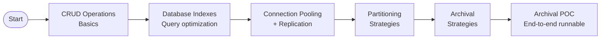

# Database Hands-On

Practical proof-of-concepts with working code for every major database topic.

```mermaid
graph LR
    Start([Start]) --> P1[CRUD Operations\nBasics]
    P1 --> P2[Database Indexes\nQuery optimization]
    P2 --> P3[Connection Pooling\n+ Replication]
    P3 --> P4[Partitioning\nStrategies]
    P4 --> P5[Archival\nStrategies]
    P5 --> P6[Archival POC\nEnd-to-end runnable]
```
