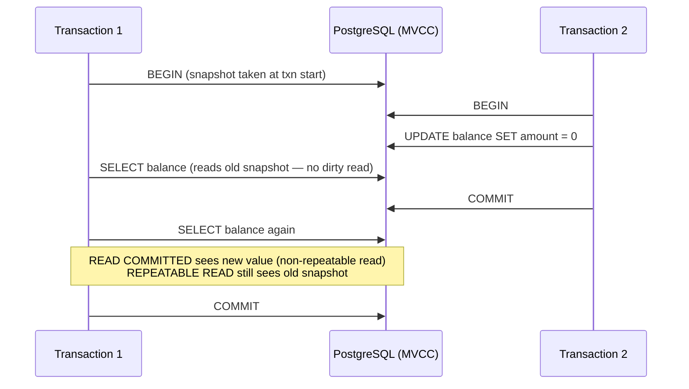

# POC: MVCC & Transaction Isolation Levels

## 🗺️ Quick Overview



*Two concurrent transactions reading and writing the same row — MVCC serves each transaction its own consistent snapshot without locking readers.*

## What You'll Build

Two terminal sessions (split screen) running concurrent PostgreSQL transactions against a shared `accounts` table. You will trigger all four classic concurrency anomalies — dirty read, non-repeatable read, phantom read, and write skew — and then demonstrate exactly which isolation level prevents each one.

## Why This Matters

- **Stripe**: Runs financial ledger operations under `SERIALIZABLE` to prevent write skew on double-charge scenarios; accepts the ~15% throughput cost in exchange for correctness guarantees.
- **Booking.com**: Uses `REPEATABLE READ` for seat/room availability checks so a read-then-write sequence sees a stable snapshot, avoiding double-booking without full serializable overhead.
- **GitHub**: Ships `READ COMMITTED` (PostgreSQL default) for most metadata reads because dirty reads are already impossible in Postgres; uses advisory locks only where write skew is a risk.

---

## Prerequisites

- Docker Desktop installed and running
- `psql` client (installed via `brew install libpq` on macOS, or inside the container)
- Two terminal windows / a terminal multiplexer (tmux, iTerm split pane)
- 10 minutes

## Setup

```yaml
# docker-compose.yml
version: '3.8'
services:
  postgres:
    image: postgres:16-alpine
    container_name: mvcc_demo
    environment:
      POSTGRES_USER: demo
      POSTGRES_PASSWORD: demo
      POSTGRES_DB: isolation_demo
    ports:
      - "5432:5432"
    command: >
      postgres
        -c log_min_messages=WARNING
        -c log_line_prefix='[%p] '
```

```bash
# Start the container
docker-compose up -d

# Verify it is healthy
docker exec mvcc_demo pg_isready -U demo
# Output: /var/run/postgresql:5432 - accepting connections
```

### Seed Data

Connect once to create the schema:

```bash
docker exec -it mvcc_demo psql -U demo -d isolation_demo
```

```sql
-- Run inside psql
CREATE TABLE accounts (
    id   SERIAL PRIMARY KEY,
    name TEXT        NOT NULL,
    balance NUMERIC(12,2) NOT NULL CHECK (balance >= 0)
);

INSERT INTO accounts (name, balance) VALUES
  ('Alice', 1000.00),
  ('Bob',   1000.00);

-- Verify
SELECT * FROM accounts;
--  id | name  | balance
-- ----+-------+---------
--   1 | Alice | 1000.00
--   2 | Bob   | 1000.00
```

Exit psql (`\q`) and open **two terminal windows** — label them **Session A** and **Session B**.

Connect each to the same database:

```bash
# Both Session A and Session B run this command
docker exec -it mvcc_demo psql -U demo -d isolation_demo
```

---

## Step-by-Step

### Step 1: Baseline — READ COMMITTED (PostgreSQL Default)

**Session A** — start a transaction and update Alice's balance without committing:

```sql
-- SESSION A
BEGIN;
UPDATE accounts SET balance = 0 WHERE name = 'Alice';
-- (do NOT commit yet)
```

**Session B** — read Alice's balance:

```sql
-- SESSION B
BEGIN;
SELECT balance FROM accounts WHERE name = 'Alice';
--  balance
-- ---------
--  1000.00   ← sees original value, NOT the 0 from Session A
-- (1 row)
```

**Observation**: PostgreSQL does NOT support `READ UNCOMMITTED`. Even if you try to set it, the engine silently upgrades to `READ COMMITTED`. Dirty reads are impossible in PostgreSQL by design.

```sql
-- SESSION A — roll back to restore state
ROLLBACK;

-- SESSION B
ROLLBACK;
```

---

### Step 2: Non-Repeatable Read under READ COMMITTED

**Session A** — open a transaction and read Alice twice with a gap:

```sql
-- SESSION A
BEGIN; -- isolation: READ COMMITTED (default)
SELECT balance FROM accounts WHERE name = 'Alice';
--  balance
-- ---------
--  1000.00
-- (keep this transaction open — do NOT commit yet)
```

**Session B** — update Alice and commit:

```sql
-- SESSION B
BEGIN;
UPDATE accounts SET balance = 500.00 WHERE name = 'Alice';
COMMIT; -- fully committed before Session A re-reads
```

**Session A** — read Alice again inside the same transaction:

```sql
-- SESSION A (still in the same BEGIN block)
SELECT balance FROM accounts WHERE name = 'Alice';
--  balance
-- ---------
--  500.00   ← DIFFERENT from the first read — non-repeatable read!

ROLLBACK;
```

**Observation**: Under `READ COMMITTED`, each statement gets a fresh snapshot. The same `SELECT` returned two different values within one transaction because another transaction committed in between.

---

### Step 3: REPEATABLE READ Prevents Non-Repeatable Read

Reset Alice's balance first:

```sql
-- Run in any session
UPDATE accounts SET balance = 1000.00 WHERE name = 'Alice';
```

**Session A** — open with `REPEATABLE READ`:

```sql
-- SESSION A
BEGIN TRANSACTION ISOLATION LEVEL REPEATABLE READ;
SELECT balance FROM accounts WHERE name = 'Alice';
--  balance
-- ---------
--  1000.00
```

**Session B** — update and commit again:

```sql
-- SESSION B
BEGIN;
UPDATE accounts SET balance = 250.00 WHERE name = 'Alice';
COMMIT;
```

**Session A** — re-read inside the same transaction:

```sql
-- SESSION A
SELECT balance FROM accounts WHERE name = 'Alice';
--  balance
-- ---------
--  1000.00   ← same as before — snapshot is frozen at transaction start

ROLLBACK;
```

**Observation**: `REPEATABLE READ` takes a snapshot at the start of the first statement in the transaction. All reads within that transaction see a consistent view, regardless of commits happening concurrently. This uses MVCC version chains — no shared locks are held.

---

### Step 4: Phantom Read under READ COMMITTED

```sql
-- Ensure clean state
DELETE FROM accounts WHERE name NOT IN ('Alice', 'Bob');
UPDATE accounts SET balance = 1000.00;
```

**Session A** — count rows:

```sql
-- SESSION A
BEGIN;
SELECT COUNT(*) FROM accounts WHERE balance >= 500;
--  count
-- -------
--      2
```

**Session B** — insert a new qualifying row and commit:

```sql
-- SESSION B
BEGIN;
INSERT INTO accounts (name, balance) VALUES ('Charlie', 800.00);
COMMIT;
```

**Session A** — count again in the same transaction:

```sql
-- SESSION A
SELECT COUNT(*) FROM accounts WHERE balance >= 500;
--  count
-- -------
--      3   ← phantom row appeared!

ROLLBACK;
```

**Observation**: A phantom read is when a range query returns a different set of rows (not just different values) because another transaction inserted or deleted rows that match the predicate.

---

### Step 5: REPEATABLE READ Prevents Phantom Read (PostgreSQL-specific)

```sql
-- Clean up Charlie
DELETE FROM accounts WHERE name = 'Charlie';
```

**Session A** — count rows under `REPEATABLE READ`:

```sql
-- SESSION A
BEGIN TRANSACTION ISOLATION LEVEL REPEATABLE READ;
SELECT COUNT(*) FROM accounts WHERE balance >= 500;
--  count
-- -------
--      2
```

**Session B** — insert Charlie again and commit:

```sql
-- SESSION B
BEGIN;
INSERT INTO accounts (name, balance) VALUES ('Charlie', 800.00);
COMMIT;
```

**Session A** — count again:

```sql
-- SESSION A
SELECT COUNT(*) FROM accounts WHERE balance >= 500;
--  count
-- -------
--      2   ← snapshot still shows only the original 2 rows

ROLLBACK;
```

**Key insight**: SQL standard says `REPEATABLE READ` does NOT prevent phantom reads — only `SERIALIZABLE` does. PostgreSQL is stronger: its snapshot-based `REPEATABLE READ` eliminates phantom reads too, because the snapshot is taken once and never refreshed.

---

### Step 6: Write Skew (Serialization Anomaly) — the Hard One

Write skew occurs when two transactions each read data, make a decision based on what they read, and each write a non-overlapping row. Neither write conflicts at the row level, yet the combined result violates a business invariant.

**Scenario**: A doctor scheduling system. Rule: at least one doctor must be on call at all times.

```sql
-- Setup
DROP TABLE IF EXISTS doctors;
CREATE TABLE doctors (
    name      TEXT PRIMARY KEY,
    on_call   BOOLEAN NOT NULL DEFAULT TRUE
);
INSERT INTO doctors VALUES ('Alice', TRUE), ('Bob', TRUE);
```

**Session A** — Alice checks and decides to go off call:

```sql
-- SESSION A
BEGIN TRANSACTION ISOLATION LEVEL REPEATABLE READ;
SELECT COUNT(*) FROM doctors WHERE on_call = TRUE;
--  count
-- -------
--      2   ← 2 on call, safe to take one off
```

**Session B** — Bob simultaneously checks and also decides to go off call:

```sql
-- SESSION B
BEGIN TRANSACTION ISOLATION LEVEL REPEATABLE READ;
SELECT COUNT(*) FROM doctors WHERE on_call = TRUE;
--  count
-- -------
--      2   ← Bob also sees 2 on call
```

**Both** write their own row (no row-level conflict):

```sql
-- SESSION A
UPDATE doctors SET on_call = FALSE WHERE name = 'Alice';
COMMIT; -- succeeds

-- SESSION B
UPDATE doctors SET on_call = FALSE WHERE name = 'Bob';
COMMIT; -- also succeeds under REPEATABLE READ
```

Check the result:

```sql
SELECT * FROM doctors;
--  name  | on_call
-- -------+---------
--  Alice | f
--  Bob   | f       ← 0 doctors on call — business rule violated!
```

**Fix: Use SERIALIZABLE**

```sql
-- Reset
UPDATE doctors SET on_call = TRUE;
```

**Session A**:

```sql
-- SESSION A
BEGIN TRANSACTION ISOLATION LEVEL SERIALIZABLE;
SELECT COUNT(*) FROM doctors WHERE on_call = TRUE;
--  count: 2
UPDATE doctors SET on_call = FALSE WHERE name = 'Alice';
COMMIT; -- succeeds (first writer wins)
```

**Session B**:

```sql
-- SESSION B
BEGIN TRANSACTION ISOLATION LEVEL SERIALIZABLE;
SELECT COUNT(*) FROM doctors WHERE on_call = TRUE;
--  count: 2
UPDATE doctors SET on_call = FALSE WHERE name = 'Bob';
COMMIT;
-- ERROR:  could not serialize access due to read/write dependencies among transactions
-- DETAIL:  Processes ... deadlock.
-- HINT:   The transaction might succeed if retried.
```

**Observation**: PostgreSQL's Serializable Snapshot Isolation (SSI) detects the read/write dependency cycle and aborts one transaction. The application must catch `SQLSTATE 40001` and retry.

---

### Step 7: Isolation Level Comparison Table

| Anomaly | READ COMMITTED | REPEATABLE READ | SERIALIZABLE |
|---------|:--------------:|:---------------:|:------------:|
| Dirty read | Prevented | Prevented | Prevented |
| Non-repeatable read | Possible | Prevented | Prevented |
| Phantom read | Possible | **Prevented (PG)** | Prevented |
| Write skew | Possible | Possible | **Prevented** |

```sql
-- Check your session's current isolation level
SHOW transaction_isolation;

-- Check the database default
SHOW default_transaction_isolation;
-- read committed   ← PostgreSQL default
```

---

## What to Observe

1. **MVCC version chains**: Run `SELECT txid_current();` inside a transaction — each transaction gets a unique ID. MVCC stores row versions tagged with these IDs.

   ```sql
   BEGIN;
   SELECT txid_current();
   -- 742   (your number will differ)
   ROLLBACK;
   ```

2. **pg_stat_activity** — watch concurrent transactions live:

   ```sql
   SELECT pid, state, wait_event_type, wait_event, query
   FROM pg_stat_activity
   WHERE datname = 'isolation_demo';
   ```

3. **Dead tuples from MVCC**: After running the experiments, old row versions accumulate:

   ```sql
   SELECT n_dead_tup, n_live_tup, last_autovacuum
   FROM pg_stat_user_tables
   WHERE relname = 'accounts';
   ```

4. **Serialization failures**: Under `SERIALIZABLE` with write skew, you will see `ERROR: could not serialize access`. Log these in your application and add a retry loop — they are expected, not bugs.

---

## What Breaks It

### Trigger a blocking write under READ COMMITTED

```sql
-- SESSION A: hold an explicit row lock
BEGIN;
SELECT * FROM accounts WHERE name = 'Alice' FOR UPDATE;
-- (do NOT commit)
```

```sql
-- SESSION B: try to update the same row
BEGIN;
UPDATE accounts SET balance = 999 WHERE name = 'Alice';
-- SESSION B hangs here — blocked waiting for Session A's lock
```

```sql
-- SESSION A: now commit — Session B immediately unblocks
COMMIT;
```

**Key insight**: MVCC means readers never block writers and writers never block readers. But writers DO block other writers on the same row (standard row-level locking). FOR UPDATE also blocks other readers using FOR UPDATE/SHARE.

### Cause a serialization storm

```bash
# Use pgbench to hammer SERIALIZABLE with concurrent updates
docker exec mvcc_demo pgbench -U demo -d isolation_demo \
  --client=20 --jobs=4 --transactions=500 \
  --file=- <<'SQL'
BEGIN TRANSACTION ISOLATION LEVEL SERIALIZABLE;
SELECT balance FROM accounts WHERE name = 'Alice';
UPDATE accounts SET balance = balance - 10 WHERE name = 'Alice';
COMMIT;
SQL
```

Watch the error rate in pgbench output. Under high contention, serialization failures (`40001`) can hit 10–40%. Production code must implement exponential backoff retry.

---

## Extend It

1. **Retry loop in application code**: Write a Python or Node.js script that catches `psycopg2.errors.SerializationFailure` (SQLSTATE `40001`) and retries up to 5 times with jitter. Measure the effective throughput vs. non-retrying code.

2. **Advisory locks as an alternative**: For the doctor on-call scenario, replace `SERIALIZABLE` with `pg_try_advisory_xact_lock(1)` under `READ COMMITTED`. Compare throughput — advisory locks have near-zero serialization failure overhead.

3. **Measure MVCC bloat**: Run 10,000 updates without VACUUM, then query `pg_stat_user_tables.n_dead_tup`. Watch dead tuple count grow. Trigger manual `VACUUM ANALYZE accounts` and observe the drop.

4. **Compare with MySQL InnoDB**: MySQL's `REPEATABLE READ` uses gap locks for phantom prevention (different from PostgreSQL's snapshot approach). Run the phantom read test against a MySQL 8 container — notice MySQL acquires a gap lock that blocks the insert in Session B.

---

## Key Takeaways

- **PostgreSQL default is `READ COMMITTED`**, not `SERIALIZABLE`. Most applications live with non-repeatable reads and phantoms — and that is often fine.
- **MVCC gives you reads for free**: Under `READ COMMITTED` and `REPEATABLE READ`, reads never acquire shared locks and never block concurrent writes. A SELECT on a hot row costs zero contention overhead.
- **`REPEATABLE READ` in PostgreSQL prevents phantoms** (unlike the SQL standard). It takes a single snapshot at first-statement time and holds it for the entire transaction — stronger than the spec requires.
- **`SERIALIZABLE` is the only level that prevents write skew**. It uses Serializable Snapshot Isolation (SSI) — detecting dangerous read/write dependency cycles rather than locking. Expect 10–20% throughput reduction and mandatory retry logic for `SQLSTATE 40001` errors.
- **Dead tuples are the MVCC tax**: Every UPDATE or DELETE leaves an old row version. VACUUM reclaims them. Monitor `n_dead_tup` in `pg_stat_user_tables`; autovacuum triggers at 20% bloat by default.

---

## References

- 📚 [PostgreSQL Docs — Transaction Isolation](https://www.postgresql.org/docs/current/transaction-iso.html)
- 📖 [A Critique of ANSI SQL Isolation Levels (Berenson et al.)](https://www.microsoft.com/en-us/research/publication/a-critique-of-ansi-sql-isolation-levels/) — the paper that defined write skew
- 📖 [Serializable Snapshot Isolation in PostgreSQL](https://wiki.postgresql.org/wiki/Serializable)
- 📺 [MVCC Unmasked — Bruce Momjian (PGConf)](https://momjian.us/main/presentations/internals.html)
- 📖 [How Stripe uses Serializable Transactions](https://stripe.com/blog/idempotency)
