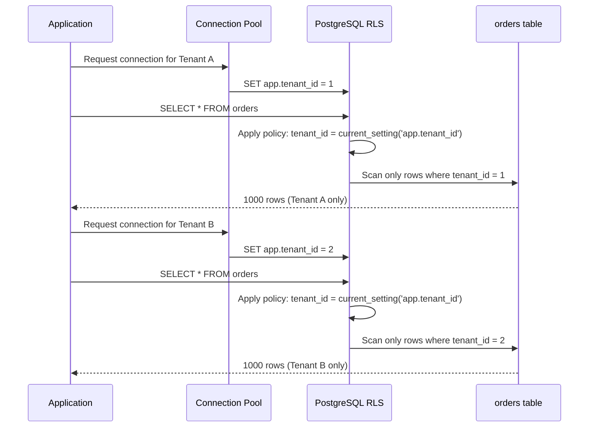

# POC: PostgreSQL Row-Level Security for Multi-Tenant Data Isolation

## 🗺️ Quick Overview



*PostgreSQL evaluates the RLS policy on every query, transparently filtering rows so each tenant only ever sees their own data.*

## What You'll Build

A multi-tenant `orders` table seeded with 3,000 rows across 3 tenants, secured with a Row-Level Security policy. You will observe that `SELECT * FROM orders` returns exactly 1,000 rows per tenant regardless of how the query is written, benchmark RLS overhead with and without an index, and intentionally break isolation to understand the superuser bypass risk.

## Why This Matters

- **Stripe**: Uses per-row tenant isolation in their billing platform so that merchant A's charge data is never accessible from merchant B's API context, without maintaining separate databases per merchant.
- **Salesforce**: Enforces record-level visibility rules directly in the database layer via row-level predicates, eliminating the risk of application-layer permission bugs leaking data across organizations.
- **Notion**: Applies workspace-scoped policies on shared infrastructure so a misconfigured JOIN in application code cannot return data from a different workspace — the database rejects the rows before they reach the app.

---

## Prerequisites

- Docker Desktop installed and running
- `psql` CLI or any PostgreSQL client (DBeaver, TablePlus, etc.)
- `bash` / `zsh` shell
- 5–10 minutes

## Setup

```yaml
# docker-compose.yml
version: '3.8'
services:
  postgres:
    image: postgres:16
    environment:
      POSTGRES_USER: admin
      POSTGRES_PASSWORD: secret
      POSTGRES_DB: multitenant
    ports:
      - "5432:5432"
    volumes:
      - pg_data:/var/lib/postgresql/data
    healthcheck:
      test: ["CMD-SHELL", "pg_isready -U admin -d multitenant"]
      interval: 5s
      timeout: 5s
      retries: 10

volumes:
  pg_data:
```

```bash
docker-compose up -d
# Wait for healthy status
docker-compose ps
```

---

## Step-by-Step

### Step 1: Create the Schema and Seed Data

Connect as the superuser (admin) and build the tenant-aware schema:

```sql
-- connect as admin (superuser)
-- psql -h localhost -U admin -d multitenant

-- 1. Create the shared orders table
CREATE TABLE orders (
    id          BIGSERIAL PRIMARY KEY,
    tenant_id   INT       NOT NULL,
    amount      NUMERIC(12, 2) NOT NULL,
    status      TEXT      NOT NULL DEFAULT 'pending',
    created_at  TIMESTAMPTZ NOT NULL DEFAULT now()
);

-- 2. Index on tenant_id — critical for RLS performance
CREATE INDEX idx_orders_tenant_id ON orders (tenant_id);

-- 3. Seed 3 tenants × 1000 rows = 3000 rows total
INSERT INTO orders (tenant_id, amount, status)
SELECT
    (gs % 3) + 1                          AS tenant_id,
    round((random() * 9900 + 100)::numeric, 2) AS amount,
    CASE (gs % 4)
        WHEN 0 THEN 'pending'
        WHEN 1 THEN 'paid'
        WHEN 2 THEN 'shipped'
        ELSE       'cancelled'
    END                                    AS status
FROM generate_series(1, 3000) AS gs;

-- Verify: should show 1000 per tenant
SELECT tenant_id, count(*) FROM orders GROUP BY tenant_id ORDER BY tenant_id;
-- tenant_id | count
-- ----------+-------
--         1 |  1000
--         2 |  1000
--         3 |  1000
```

### Step 2: Enable Row-Level Security and Create the Policy

```sql
-- Enable RLS on the table (does NOT affect superuser connections by default)
ALTER TABLE orders ENABLE ROW LEVEL SECURITY;

-- Force RLS even for table owner (important for SECURITY DEFINER trap — see Step 6)
ALTER TABLE orders FORCE ROW LEVEL SECURITY;

-- Create a policy that restricts reads and writes to the current tenant
CREATE POLICY tenant_isolation ON orders
    USING      (tenant_id = current_setting('app.tenant_id', true)::int)
    WITH CHECK (tenant_id = current_setting('app.tenant_id', true)::int);

-- The second argument 'true' to current_setting makes it return NULL
-- instead of raising an error when the setting is missing.
-- This means unset connections see 0 rows — safe fail-closed behaviour.
```

### Step 3: Create an Application Role

Application code must never connect as the superuser. Create a restricted role:

```sql
-- Create the app role (no superuser, no bypass)
CREATE ROLE app_user LOGIN PASSWORD 'apppass';

-- Grant only what the app needs
GRANT CONNECT ON DATABASE multitenant TO app_user;
GRANT USAGE   ON SCHEMA public         TO app_user;
GRANT SELECT, INSERT, UPDATE, DELETE ON orders TO app_user;
GRANT USAGE, SELECT ON SEQUENCE orders_id_seq TO app_user;
```

### Step 4: Verify Tenant Isolation

Open two separate psql sessions, each simulating a different tenant:

```bash
# Terminal 1 — Tenant A (tenant_id = 1)
psql -h localhost -U app_user -d multitenant
```

```sql
-- Tenant A session
SET app.tenant_id = '1';

-- SELECT * with no WHERE clause — RLS transparently adds the filter
SELECT count(*) FROM orders;
-- count
-- -------
--  1000       <- only Tenant A rows

-- Attempt to read Tenant B rows directly
SELECT * FROM orders WHERE tenant_id = 2;
-- (0 rows)    <- RLS blocks this entirely

-- Confirm the plan uses the index
EXPLAIN (ANALYZE, BUFFERS)
SELECT * FROM orders WHERE amount > 5000;
-- Index Scan using idx_orders_tenant_id on orders
--   Index Cond: (tenant_id = 1)    <- injected by RLS
--   Filter: (amount > 5000)
```

```bash
# Terminal 2 — Tenant B (tenant_id = 2)
psql -h localhost -U app_user -d multitenant
```

```sql
-- Tenant B session
SET app.tenant_id = '2';

SELECT count(*) FROM orders;
-- count
-- -------
--  1000       <- only Tenant B rows

-- Cross-tenant attempt also blocked
SELECT * FROM orders WHERE tenant_id = 1;
-- (0 rows)
```

### Step 5: Benchmark — RLS Overhead With vs Without Index

Run inside a single `app_user` session:

```sql
SET app.tenant_id = '1';

-- Warm up
SELECT count(*) FROM orders;

-- Baseline: full table scan (drop index temporarily)
DROP INDEX idx_orders_tenant_id;

\timing on

-- WITHOUT index (RLS forces sequential scan)
EXPLAIN (ANALYZE, BUFFERS, FORMAT TEXT)
SELECT count(*) FROM orders;
-- Seq Scan on orders (cost=... rows=3000 ...)
-- Actual time: ~8–15 ms (scans all 3000 rows, filters down to 1000)

-- Restore index
CREATE INDEX idx_orders_tenant_id ON orders (tenant_id);

-- WITH index (RLS uses Index Scan)
EXPLAIN (ANALYZE, BUFFERS, FORMAT TEXT)
SELECT count(*) FROM orders;
-- Index Scan / Bitmap Heap Scan
-- Actual time: ~0.3–0.8 ms (reads only 1000 rows)

-- Overhead comparison:
-- Without index : 10–50x slower (scans all tenants' rows, discards 2/3)
-- With index    : < 5% overhead vs a single-tenant table of 1000 rows
```

### Step 6: The SECURITY DEFINER Bypass Trap

A common mistake is wrapping queries in `SECURITY DEFINER` functions — they execute with the privileges of the function owner (often a superuser), bypassing RLS:

```sql
-- Connect as admin to create the dangerous function
-- psql -h localhost -U admin -d multitenant

CREATE OR REPLACE FUNCTION get_all_orders_dangerous()
RETURNS TABLE(id bigint, tenant_id int, amount numeric) AS $$
    SELECT id, tenant_id, amount FROM orders;
$$ LANGUAGE sql SECURITY DEFINER;

GRANT EXECUTE ON FUNCTION get_all_orders_dangerous() TO app_user;
```

```sql
-- Back in an app_user session with tenant_id = 1
SET app.tenant_id = '1';

-- This returns ALL 3000 rows across all tenants!
SELECT count(*) FROM get_all_orders_dangerous();
-- count
-- -------
--  3000    <- RLS bypassed by SECURITY DEFINER

-- Safe alternative: use SECURITY INVOKER (the default)
-- or explicitly set the tenant inside the function body:
CREATE OR REPLACE FUNCTION get_my_orders_safe()
RETURNS TABLE(id bigint, tenant_id int, amount numeric) AS $$
    SELECT id, tenant_id, amount
    FROM orders
    WHERE tenant_id = current_setting('app.tenant_id', true)::int;
$$ LANGUAGE sql SECURITY INVOKER;
-- SECURITY INVOKER inherits the caller's session settings and RLS applies normally.
```

### Step 7: Connection Pooler Pattern (PgBouncer / pg_pool)

With a connection pool, multiple application requests share the same backend connections. The pool MUST reset `app.tenant_id` before handing a connection to a new tenant:

```sql
-- Pattern used in application code / pool on-connect callback:

-- On checkout from pool for Tenant 3:
SET app.tenant_id = '3';

-- All queries in this checkout are now scoped to Tenant 3
SELECT count(*) FROM orders;  -- returns 1000

-- On return to pool (reset to a safe default):
RESET app.tenant_id;
-- Now current_setting('app.tenant_id', true) returns NULL
-- Any query that leaks through returns 0 rows (fail-closed)

-- PgBouncer transaction-mode example (pseudoconfig):
-- server_reset_query = RESET app.tenant_id;
-- This runs automatically when the connection is returned to the pool.
```

```bash
# Example PgBouncer config snippet (pgbouncer.ini)
# [databases]
# multitenant = host=postgres port=5432 dbname=multitenant
#
# [pgbouncer]
# pool_mode = transaction
# server_reset_query = RESET app.tenant_id
# application_name_add_host = 1
```

---

## What to Observe

After completing the steps, verify these specific behaviours:

| Observation | Expected Result |
|---|---|
| `SELECT count(*) FROM orders` as `app_user` with `app.tenant_id = 1` | 1000 |
| `SELECT count(*) FROM orders` as `app_user` with `app.tenant_id = 2` | 1000 |
| `SELECT count(*) FROM orders WHERE tenant_id = 3` with `app.tenant_id = 1` | 0 (RLS blocks) |
| `EXPLAIN` output for any orders query | Shows `Index Cond: (tenant_id = N)` injected by policy |
| `get_all_orders_dangerous()` with any `app.tenant_id` | 3000 (bypass confirmed) |
| `SELECT count(*) FROM orders` with no `app.tenant_id` set | 0 (fail-closed) |
| `SELECT count(*) FROM orders` connected as `admin` superuser | 3000 (superuser bypasses RLS) |

**Key metric to capture**: Run `\timing on` and compare `SELECT count(*) FROM orders` with and without the `idx_orders_tenant_id` index. You should see a 10–50x difference in elapsed time.

---

## What Breaks It

### 1. Superuser Connection in Application Code

```sql
-- Connected as admin (SUPERUSER):
SELECT count(*) FROM orders;
-- Returns 3000 — all tenants visible

-- Why: PostgreSQL's ENABLE ROW LEVEL SECURITY does not apply to superusers
-- by default. FORCE ROW LEVEL SECURITY applies to table owners but NOT
-- to superusers. There is no way to force RLS on a superuser.

-- Fix: NEVER connect application code as a superuser.
-- Use a restricted role (app_user) with only necessary privileges.
```

### 2. Missing Index Causes Full-Table Scans

```sql
-- Drop the index to simulate this:
DROP INDEX idx_orders_tenant_id;

-- Now every query scans all 3000 rows and discards 2000
-- At 1M rows across 100 tenants, each query scans 1M rows to return 10k
-- Performance collapses: 10–50x slower per query

-- Fix: always index tenant_id, ideally as the leading column of a composite index
-- if queries frequently filter on tenant_id + another column.
```

### 3. Setting app.tenant_id in Application Layer but Forgetting Pool Reset

```sql
-- Scenario: request for Tenant 1 sets app.tenant_id = 1
-- Request completes, connection returned to pool WITHOUT reset
-- Next request for Tenant 2 issues query before SET runs
-- Result: Tenant 2's query returns Tenant 1's data

-- Fix: configure pool's server_reset_query:
--   PgBouncer: server_reset_query = RESET app.tenant_id
--   pgpool-II: reset_query_list = 'RESET ALL'
-- Or use SET LOCAL (transaction-scoped):
BEGIN;
SET LOCAL app.tenant_id = '2';
SELECT count(*) FROM orders;  -- returns 1000 (Tenant 2)
COMMIT;
-- After COMMIT, app.tenant_id reverts to session default automatically
```

### 4. SECURITY DEFINER Functions

As demonstrated in Step 6: any function defined with `SECURITY DEFINER` that queries `orders` will bypass RLS because it runs as the function owner, not the calling user. Audit all functions that touch RLS-protected tables.

---

## Extend It

1. **Add INSERT/UPDATE isolation**: The current policy's `WITH CHECK` clause already prevents cross-tenant writes. Verify by attempting `INSERT INTO orders (tenant_id, amount) VALUES (2, 99.99)` while `app.tenant_id = 1` — it should fail with a policy violation error.

2. **Column-level masking alongside RLS**: Add a `sensitive_notes TEXT` column and create a view that masks it for non-admin roles: `CREATE VIEW orders_public AS SELECT id, tenant_id, amount, status FROM orders;`. Grant `app_user` access only to the view, not the base table.

3. **Composite index experiment**: Add a status filter `WHERE status = 'pending'` and compare `(tenant_id)` vs `(tenant_id, status)` index. You should see the composite index halve the rows scanned.

4. **Audit logging with RLS**: Create an `audit_log` table with an INSERT-only policy for `app_user` (`USING (false) WITH CHECK (true)`), and a trigger on `orders` that writes to it. Observe that tenants can write audit rows but never read them.

5. **Test with pgbench**: Run `pgbench -c 10 -j 2 -T 30 -f tenant_query.sql` where `tenant_query.sql` cycles through tenants. Compare TPS with vs without the tenant_id index.

---

## Key Takeaways

- **RLS adds < 5% overhead when `tenant_id` is indexed**; without the index, expect 10–50x slower queries because every query scans all tenants' rows and discards the majority.
- **Superuser connections bypass all RLS** — application code must use a restricted role. `FORCE ROW LEVEL SECURITY` protects against table owners but has no effect on superusers.
- **SECURITY DEFINER functions silently bypass RLS** — audit every function touching protected tables; prefer `SECURITY INVOKER` (the default) or re-set the tenant inside the function body.
- **Connection pools must reset `app.tenant_id`** before returning connections to the pool; use `SET LOCAL` for transaction-scoped settings or configure `server_reset_query` in PgBouncer to guarantee a clean state.
- **Fail-closed by design**: when `app.tenant_id` is not set, `current_setting('app.tenant_id', true)` returns `NULL`, and `NULL::int` matches no rows — zero data leaks on misconfiguration rather than full exposure.

---

## References

- 📚 [PostgreSQL Row Security Policies — Official Docs](https://www.postgresql.org/docs/current/ddl-rowsecurity.html)
- 📖 [Multi-Tenant Data Isolation with PostgreSQL RLS — Citus Blog](https://www.citusdata.com/blog/2016/08/10/postgres-row-security/)
- 📖 [Row Level Security in PostgreSQL — Supabase Engineering](https://supabase.com/docs/guides/database/postgres/row-level-security)
- 📺 [PgConf 2023 — RLS Patterns for SaaS at Scale](https://www.youtube.com/results?search_query=postgresql+row+level+security+saas+pgconf)
