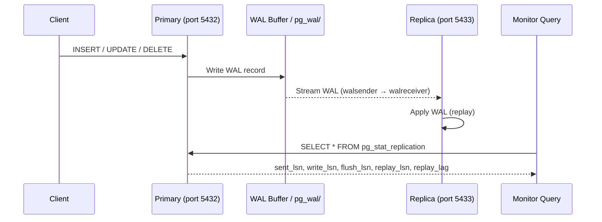

# POC: WAL Streaming Replication & Lag Monitoring

## Quick Overview



*A write on the primary flows through the WAL buffer to the streaming replica; `pg_stat_replication` on the primary exposes every stage of the pipeline as measurable LSN positions.*

## What You'll Build

A local two-node PostgreSQL cluster (primary + one streaming replica) where you:

1. Observe real-time replication lag across all four LSN positions.
2. Generate write load with `pgbench` and watch lag grow and recover.
3. Artificially accumulate lag by switching to `synchronous_commit = off`.
4. Inspect WAL segment files on disk.
5. Promote the replica to primary and confirm zero data loss.
6. Trigger the hard failure mode: replica disconnects when primary recycles WAL it needed.

## Why This Matters

- **Netflix**: Operates hundreds of PostgreSQL streaming replicas for read scale; monitors `replay_lag` in Prometheus and pages when it exceeds 30 seconds.
- **GitLab**: Publishes runbooks for manual replica promotion; the same `pg_ctl promote` command used here is their failover step.
- **Shopify**: Uses `wal_keep_size` tuning as a first-line defense against replica disconnection during flash-sale write spikes.

---

## Prerequisites

- Docker Desktop (or Docker Engine + Docker Compose v2)
- `psql` client (`brew install libpq` on macOS, or run via `docker exec`)
- 5–10 minutes

---

## Setup

### docker-compose.yml

```yaml
# docker-compose.yml
version: '3.8'

services:
  primary:
    image: postgres:16
    container_name: pg_primary
    environment:
      POSTGRES_USER: replicator
      POSTGRES_PASSWORD: replicatorpass
      POSTGRES_DB: demo
    ports:
      - "5432:5432"
    volumes:
      - pg_primary_data:/var/lib/postgresql/data
      - ./primary-init.sh:/docker-entrypoint-initdb.d/primary-init.sh
    command: >
      postgres
        -c wal_level=replica
        -c max_wal_senders=5
        -c wal_keep_size=64
        -c synchronous_commit=on
        -c synchronous_standby_names=''
        -c log_replication_commands=on

  replica:
    image: postgres:16
    container_name: pg_replica
    environment:
      POSTGRES_USER: replicator
      POSTGRES_PASSWORD: replicatorpass
      POSTGRES_DB: demo
      # pg_basebackup runs before the replica starts
      PGPASSWORD: replicatorpass
    ports:
      - "5433:5432"
    depends_on:
      - primary
    volumes:
      - pg_replica_data:/var/lib/postgresql/data
      - ./replica-init.sh:/replica-init.sh
    entrypoint: ["/bin/bash", "/replica-init.sh"]

volumes:
  pg_primary_data:
  pg_replica_data:
```

### primary-init.sh

```bash
#!/bin/bash
# primary-init.sh — runs once when the primary initialises its data dir

set -e

# Allow the replication user to connect for streaming replication
cat >> "$PGDATA/pg_hba.conf" <<EOF
host replication replicator all md5
EOF

# Create a dedicated replication slot (optional but demonstrates the concept)
psql -v ON_ERROR_STOP=1 --username "$POSTGRES_USER" --dbname "$POSTGRES_DB" <<-EOSQL
  SELECT pg_reload_conf();
EOSQL
```

### replica-init.sh

```bash
#!/bin/bash
# replica-init.sh — bootstraps the replica data dir via pg_basebackup

set -e

PGDATA=/var/lib/postgresql/data
PRIMARY_HOST=primary
PRIMARY_PORT=5432
REPL_USER=replicator
REPL_PASS=replicatorpass

# Wait for primary to be ready
echo "Waiting for primary..."
until pg_isready -h "$PRIMARY_HOST" -p "$PRIMARY_PORT" -U "$REPL_USER"; do
  sleep 1
done

# Only run pg_basebackup if data dir is empty
if [ -z "$(ls -A $PGDATA)" ]; then
  echo "Running pg_basebackup..."
  PGPASSWORD="$REPL_PASS" pg_basebackup \
    -h "$PRIMARY_HOST" \
    -p "$PRIMARY_PORT" \
    -U "$REPL_USER" \
    -D "$PGDATA" \
    -Fp -Xs -P -R   # -R writes postgresql.auto.conf with primary_conninfo

  chown -R postgres:postgres "$PGDATA"
fi

# Start the replica (postgres user)
exec gosu postgres postgres \
  -c hot_standby=on \
  -c hot_standby_feedback=on
```

### Start the cluster

```bash
chmod +x primary-init.sh replica-init.sh
docker-compose up -d

# Give the replica ~10 seconds to finish pg_basebackup
sleep 10
docker-compose logs replica | tail -20
# Expected: "LOG:  started streaming WAL from primary"
```

---

## Step-by-Step

### Step 1: Confirm streaming replication is active

```bash
# Connect to primary and inspect pg_stat_replication
docker exec -it pg_primary \
  psql -U replicator -d demo -c "
    SELECT
      application_name,
      state,
      sent_lsn,
      write_lsn,
      flush_lsn,
      replay_lsn,
      (sent_lsn - replay_lsn)   AS total_lag_bytes,
      write_lag,
      flush_lag,
      replay_lag,
      sync_state
    FROM pg_stat_replication;
  "
```

Expected output (abridged):

```
 application_name | state  | sent_lsn  | replay_lsn | total_lag_bytes | replay_lag | sync_state
------------------+--------+-----------+------------+-----------------+------------+------------
 walreceiver      | streaming | 0/5000060 | 0/5000060 |               0 | 00:00:00   | async
```

`total_lag_bytes = 0` and `replay_lag = 00:00:00` confirm the replica is fully caught up.

### Step 2: Generate write load with pgbench

Open a second terminal and run pgbench against the **primary**:

```bash
# Initialise pgbench schema (scale factor 10 → ~1.5 million rows)
docker exec -it pg_primary \
  pgbench -U replicator -d demo -i -s 10

# Run 60-second benchmark: 10 clients, 2 threads
docker exec -it pg_primary \
  pgbench -U replicator -d demo -c 10 -j 2 -T 60 -P 5
# -P 5 prints progress every 5 seconds
```

While pgbench is running, poll `pg_stat_replication` in the **first terminal** every 2 seconds:

```bash
watch -n 2 "docker exec pg_primary \
  psql -U replicator -d demo -c \
  \"SELECT replay_lag, flush_lag, write_lag, (sent_lsn - replay_lsn) AS lag_bytes \
    FROM pg_stat_replication;\""
```

You should see `lag_bytes` rise to a few hundred KB and `replay_lag` fluctuate between `00:00:00.05` and `00:00:00.20` (50–200 ms) under this load level.

### Step 3: Inspect WAL segment files on disk

```bash
# List WAL segments on the primary
docker exec pg_primary ls -lh /var/lib/postgresql/data/pg_wal/

# Count segments (each is 16 MB by default)
docker exec pg_primary bash -c \
  "ls /var/lib/postgresql/data/pg_wal/ | grep -v '\.history' | wc -l"
```

Each file is named as a 24-hex-digit LSN range (e.g. `000000010000000000000001`). New segments are created as writes advance the WAL pointer. The number on disk is bounded by `wal_keep_size` (set to 64 MB = 4 segments in this POC).

### Step 4: Force artificial lag — switch to async and flood writes

```bash
# On the primary: disable synchronous commit so writes return immediately
docker exec -it pg_primary \
  psql -U replicator -d demo -c \
    "ALTER SYSTEM SET synchronous_commit = off; SELECT pg_reload_conf();"

# Burst-write 200,000 rows as fast as possible
docker exec -it pg_primary \
  psql -U replicator -d demo -c "
    INSERT INTO pgbench_history (tid, bid, aid, delta, mtime)
    SELECT
      (random()*10)::int,
      (random()*10)::int,
      (random()*1000000)::int,
      (random()*1000)::int,
      now()
    FROM generate_series(1, 200000);
  "
```

Immediately query lag:

```bash
docker exec pg_primary \
  psql -U replicator -d demo -c \
  "SELECT replay_lag, (sent_lsn - replay_lsn) AS lag_bytes FROM pg_stat_replication;"
```

You will see `lag_bytes` jump to several MB and `replay_lag` to `00:00:01`–`00:00:03`. The replica catches up within a few seconds as it replays the burst.

**Reset** synchronous commit when done:

```bash
docker exec -it pg_primary \
  psql -U replicator -d demo -c \
    "ALTER SYSTEM SET synchronous_commit = on; SELECT pg_reload_conf();"
```

### Step 5: Verify data on the replica

```bash
# Count rows on primary
docker exec pg_primary \
  psql -U replicator -d demo -c "SELECT COUNT(*) FROM pgbench_history;"

# Count rows on replica (should match within seconds)
docker exec pg_replica \
  psql -U replicator -d demo -c "SELECT COUNT(*) FROM pgbench_history;"
```

### Step 6: Promote the replica to primary

```bash
# Confirm replica is a standby
docker exec pg_replica \
  psql -U replicator -d demo -c "SELECT pg_is_in_recovery();"
# → t (true)

# Promote
docker exec pg_replica \
  pg_ctl promote -D /var/lib/postgresql/data

# Wait 2 seconds, then confirm it is now a read-write primary
sleep 2
docker exec pg_replica \
  psql -U replicator -d demo -c "SELECT pg_is_in_recovery();"
# → f (false)

# Write to the promoted node
docker exec pg_replica \
  psql -U replicator -d demo -c \
    "INSERT INTO pgbench_history (tid, bid, aid, delta, mtime) \
     VALUES (1,1,1,100, now()) RETURNING *;"
```

The write succeeds, confirming the promoted replica is now fully writable. The original primary should be fenced (or left running in isolation — do not reconnect it without a proper timeline divergence check).

---

## What to Observe

| Metric | Normal (idle) | Under pgbench load | Async burst |
|--------|--------------|-------------------|-------------|
| `replay_lag` | `00:00:00` | 50–200 ms | 1–3 s |
| `lag_bytes` (`sent_lsn - replay_lsn`) | 0 | 100 KB – 1 MB | 5–20 MB |
| WAL segments in `pg_wal/` | 3–5 | 4–8 (bounded by `wal_keep_size`) | spikes then drops |
| `state` in `pg_stat_replication` | `streaming` | `streaming` | `streaming` |

Key signals:
- `write_lag` measures how long until the replica **wrote** the WAL to disk.
- `flush_lag` measures how long until the replica **flushed** it (fsync).
- `replay_lag` measures how long until the replica **applied** it to its data files — the number that matters for read freshness.

---

## What Breaks It

### Scenario: Replica falls too far behind — WAL recycled before replica can fetch it

```bash
# Shrink wal_keep_size to just 1 MB so the primary recycles WAL aggressively
docker exec -it pg_primary \
  psql -U replicator -d demo -c \
    "ALTER SYSTEM SET wal_keep_size = 1; SELECT pg_reload_conf();"

# Pause the replica (simulate network partition)
docker pause pg_replica

# Generate a large amount of WAL on the primary (>1 MB worth)
docker exec -it pg_primary \
  psql -U replicator -d demo -c "
    INSERT INTO pgbench_history (tid, bid, aid, delta, mtime)
    SELECT (random()*10)::int,(random()*10)::int,(random()*1000000)::int,
           (random()*1000)::int, now()
    FROM generate_series(1, 500000);
  "

# Unpause the replica
docker unpause pg_replica

# Watch the replica logs — you will see the fatal error
docker logs pg_replica --follow 2>&1 | grep -E "FATAL|ERROR|requested"
```

Expected fatal message:

```
FATAL:  could not receive data from WAL stream:
ERROR:  requested WAL segment 000000010000000000000003 has already been removed
```

The replica enters a stopped state. Recovery requires a fresh `pg_basebackup`. This is the operational nightmare that `wal_keep_size` (or replication slots) prevents.

**Fix**: Set `wal_keep_size` high enough to cover your longest expected network outage, or use a **replication slot** which prevents WAL from being recycled until the slot consumer confirms it:

```sql
-- On primary (before the replica connects)
SELECT pg_create_physical_replication_slot('replica_slot');
```

Then add `primary_slot_name = 'replica_slot'` to the replica's `postgresql.auto.conf`.

---

## Extend It

1. **Add a second replica and test cascading replication**: Set `primary_conninfo` on replica-2 to point at replica-1 (`cascade_replication_sources`). Observe a two-hop `replay_lag`.

2. **Enable synchronous replication**: Set `synchronous_standby_names = '*'` on the primary and rerun the pgbench benchmark. Measure the TPS drop — expect synchronous replication to add ~5 ms per commit RTT, reducing TPS by 30–50% on a local network.

3. **Use replication slots**: Replace `wal_keep_size` with a physical replication slot. Show that the slot holds WAL indefinitely and that `pg_replication_slots.retained_wal_size` grows when the replica is paused.

4. **Monitor with pg_stat_wal**: Query `SELECT * FROM pg_stat_wal;` on the primary to see total WAL bytes generated, WAL writes, and sync counts — useful for capacity planning.

5. **Logical replication subset**: Replace the streaming replica setup with a `CREATE PUBLICATION` / `CREATE SUBSCRIPTION` pair to replicate only one table. Observe that `pg_stat_subscription` exposes its own lag view.

---

## Key Takeaways

- **Async replication typically stays under 100 ms** in healthy conditions; anything above 1 second warrants investigation.
- **Synchronous replication adds ~5 ms latency per commit** on a local network (~20–50 ms over WAN) and can cut throughput by 30–50% — use it only for RPO = 0 requirements.
- **`wal_keep_size` is a hard guard-rail**: if the replica falls behind by more bytes than this value, the primary recycles those WAL segments and the replica must be rebuilt from scratch — a multi-hour outage on large databases.
- **Replication slots eliminate WAL recycling risk** but introduce a new risk: an abandoned slot can fill your disk with retained WAL. Always set `max_slot_wal_keep_size` as a safety cap.
- **Promotion is instantaneous**: `pg_ctl promote` completes in milliseconds; the former replica applies any buffered WAL before accepting writes, giving you zero data loss for transactions already flushed to the replica.

---

## References

- 📚 [PostgreSQL 16 — Streaming Replication](https://www.postgresql.org/docs/16/warm-standby.html)
- 📚 [pg_stat_replication view](https://www.postgresql.org/docs/16/monitoring-stats.html#MONITORING-PG-STAT-REPLICATION-VIEW)
- 📖 [GitLab PostgreSQL Replication Runbook](https://gitlab.com/gitlab-com/runbooks/-/blob/master/docs/patroni/postgres.md)
- 📖 [Shopify Engineering — Scaling PostgreSQL at Shopify](https://shopify.engineering/postgresql-at-shopify)
- 📺 [Citus Data — Understanding WAL in PostgreSQL (PGConf)](https://www.youtube.com/watch?v=pJ6SBt3_-vE)
