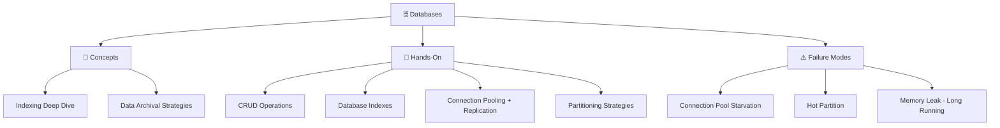

# Databases

Databases are the foundation of nearly every system. This section covers everything from replication basics to advanced topics like MVCC, write-ahead logging, and zero-downtime migrations.

## What You'll Learn

- **Concepts**: Core database design theory — replication, sharding, indexing, transactions
- **Hands-On**: Practical POCs with real working code you can run
- **Failure Modes**: Real production failures and how to prevent them

## Where to Start

1. [Replication Basics](/01-databases/concepts/replication-basics) — How data is copied across nodes
2. [Indexing Strategies](/01-databases/concepts/indexing-strategies) — The single biggest lever for query performance
3. [Sharding Strategies](/01-databases/concepts/sharding-strategies) — Horizontal scaling for write-heavy workloads
4. [CRUD Operations](/01-databases/hands-on/database-crud) — Start building with real code

## Topic Map

| Topic | Concepts | Hands-On | Problems at Scale | Interview Prep |
|-------|----------|----------|-------------------|----------------|
| Replication | [replication-basics](/01-databases/concepts/replication-basics) | — | — | [database-replication](/12-interview-prep/system-design/storage-and-databases/database-replication) |
| Read scaling | [read-replicas](/01-databases/concepts/read-replicas) | [database-read-replicas](/01-databases/hands-on/database-read-replicas) | [database-hotspots](/problems-at-scale/performance/database-hotspots) | [database-sharding](/12-interview-prep/system-design/storage-and-databases/database-sharding) |
| Sharding | [sharding-strategies](/01-databases/concepts/sharding-strategies) | [database-sharding](/01-databases/hands-on/database-sharding) | [database-hotspots](/problems-at-scale/performance/database-hotspots) | [database-sharding](/12-interview-prep/system-design/storage-and-databases/database-sharding) |
| Indexing | [indexing-strategies](/01-databases/concepts/indexing-strategies), [indexing-deep-dive](/01-databases/concepts/indexing-deep-dive) | [database-indexes](/01-databases/hands-on/database-indexes), [postgresql-btree-hash-indexes](/01-databases/hands-on/postgresql-btree-hash-indexes) | — | [database-indexing-deep-dive](/12-interview-prep/system-design/storage-and-databases/database-indexing-deep-dive) |
| Archival | [data-archival-strategies](/01-databases/concepts/data-archival-strategies) | [database-archival-strategies](/01-databases/hands-on/database-archival-strategies) | — | — |
| Transactions | — | [database-transactions](/01-databases/hands-on/database-transactions) | — | — |
