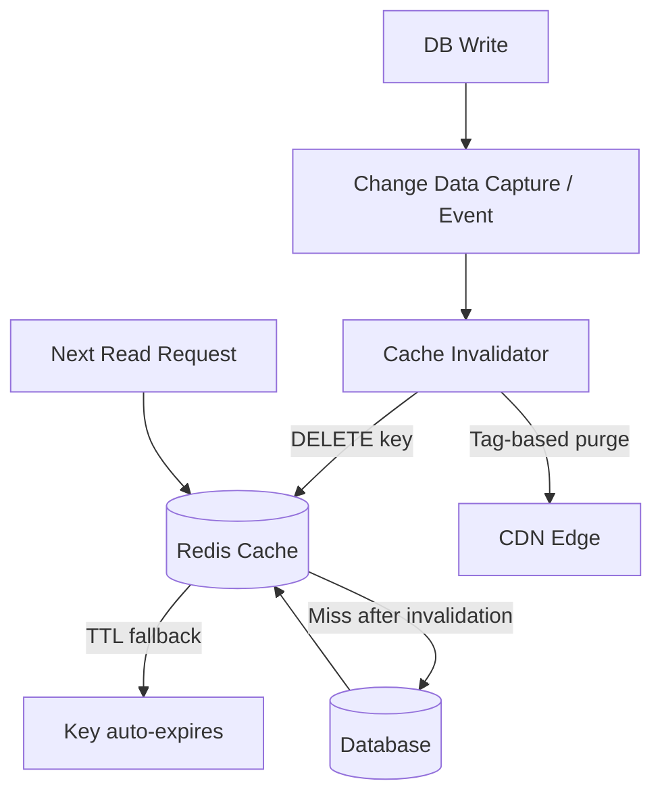
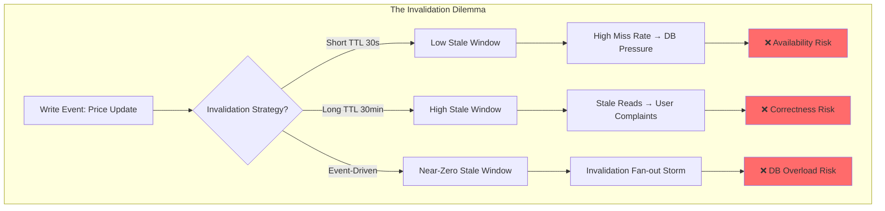
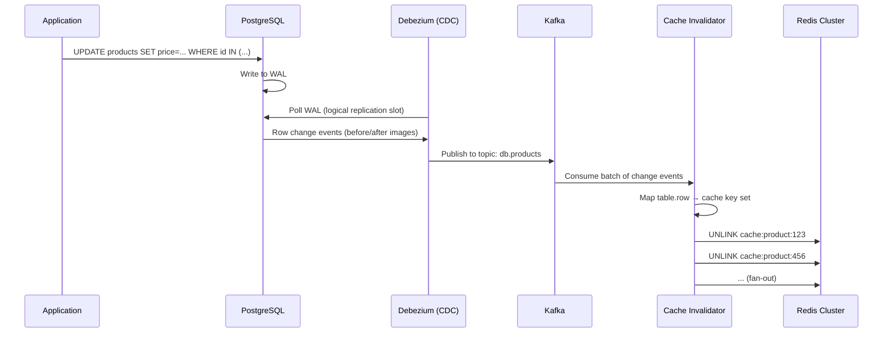
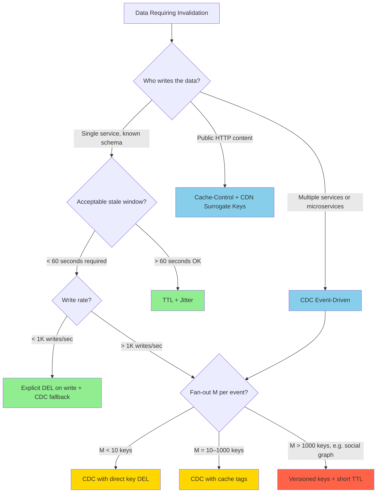

# Cache Invalidation: TTL, Event-Driven Purging, and Consistency Windows

## 🗺️ Quick Overview



*Writes trigger CDC events that proactively delete or tag-purge cached entries; TTL acts as a safety net for any invalidation events that are missed.*

**Phil Karlton's axiom holds: cache invalidation remains one of the two hard problems in computer science. TTL is the escape hatch most engineers reach for — but at scale it either leaves you serving stale data for minutes or triggering invalidation storms that DDoS your own database.**

---

## The Problem Class `[Mid]`

You have a product catalog service. 2 million SKUs cached in Redis. Each cached for 5 minutes. A flash sale begins: prices change for 50,000 SKUs simultaneously. Your write burst hits at 14:00:00.

Within 60 seconds:
- 50,000 cache keys need invalidation
- Each invalidation triggers a cache miss
- Each cache miss hits PostgreSQL
- PostgreSQL connections pool is 500 deep
- 50,000 concurrent DB reads at T+60s

This is the **invalidation storm** — a self-inflicted thundering herd caused by synchronized TTL expiry combined with a bulk write event.

The opposite failure: you set TTL to 30 minutes to absorb write bursts. A customer updates their shipping address. They refresh their profile page and see the old address for up to 29 minutes. They call support. This is the **stale data window** — a consistency gap your product owner calls a bug.



The question isn't which strategy to use — it's which failure mode is acceptable for each data class.

---

## Why the Obvious Solution Fails `[Senior]`

**Pure TTL** seems simple: set TTL=300, forget about invalidation. In practice:

1. **Synchronized expiry storms**: If you cache 100K keys at the same moment (batch load on startup), all 100K expire at the same second. The resulting miss storm overwhelms your database. This pattern is called the "dog pile" — see also `cache-stampede-prevention.md`.

2. **TTL does not know about writes**: A user changes their profile. The cache TTL is 10 minutes. The user sees stale data for up to 10 minutes. You can't "short-circuit" a TTL from the write path without additional plumbing.

3. **TTL jitter helps but doesn't solve**: Adding `random(0, 30)` seconds to TTL spreads expiry — but it's a blunt instrument. It reduces storm severity, it doesn't prevent it.

**Explicit delete on write** is the next step:
```
PUT /users/:id → update DB → DELETE cache:user:{id}
```
This works for single-writer, single-key scenarios. It breaks under:
- **Multiple writers**: Two services update the same user independently, neither knows what the other cached
- **Derived keys**: Update user → invalidate `user:{id}`, but also `user:profile:{id}`, `user:settings:{id}`, `feed:authored:{id}` — any key derived from user state
- **Cross-service caches**: Service A caches data from Service B. Service B writes don't know Service A's cache keys

**Write-through** (update cache and DB in the same write path) solves the stale window but introduces write coupling — your write latency now includes cache write latency, and you've added a consistency failure mode if the cache write succeeds but the DB write fails (or vice versa).

---

## The Solution Landscape `[Senior]`

### Solution 1: TTL with Jitter and Staggered Population

**What it is**: Add random TTL jitter to prevent synchronized expiry. Stagger cache population during bulk loads.

**How it actually works at depth**: For each key, TTL = base_ttl + random(0, jitter_window). During bulk loads (e.g., warming 100K keys after deploy), impose a rate limit on population — e.g., 5,000 keys/second — so expiry is distributed over `100K / 5K = 20 seconds` of natural spread, rather than a single second.

**Sizing guidance** `[Staff+]`:
- Jitter window: 10-20% of base TTL. At TTL=300s, jitter=30-60s.
- For N=100K keys with TTL=300s and jitter=60s: expected simultaneous expiry per second = 100K / (300 + 60/2) = ~300 keys/sec. Manageable vs the 100K/sec storm without jitter.
- Cache-miss DB query cost: at 300 misses/sec × 5ms average query = 1,500 ms of DB time per second, well within a 500-connection pool.

**Configuration decisions that matter** `[Staff+]`:
- Use `EXPIREAT` (absolute timestamp) rather than `EXPIRE` (relative TTL) for bulk loads — lets you pre-compute a distribution of expiry timestamps.
- Apply jitter at the cache setter level, not the caller level, so all writers use consistent jitter policy.

**Failure modes** `[Staff+]`:
- Jitter does not help if writes are bursty: if 50K keys are all updated at 14:00:00 and re-cached immediately, they all expire at 14:05:00 ± jitter. The write burst resets the expiry distribution.
- Staggered population increases cold-start time: warming 1M keys at 5K/sec takes 200 seconds of partial cache state.

**Observability** `[Staff+]`:
- Track `cache_miss_rate` per data class. Spike in miss rate is the leading indicator of an expiry storm.
- Alert on: `cache_miss_rate > 5× baseline for > 30 seconds`
- Histogram of key TTL remaining at time of eviction — if P50 TTL remaining is near 0, TTL is well-calibrated. If P50 TTL remaining is 60% of base TTL, keys are being evicted by memory pressure before natural expiry (separate problem).

---

### Solution 2: Event-Driven Invalidation via Change Data Capture (CDC)

**What it is**: Tap the database's replication log (Postgres WAL, MySQL binlog) and emit invalidation events for every committed write. A consumer service reads these events and deletes or updates affected cache keys.

**How it actually works at depth**:



The key insight: CDC reads from the WAL *after* commit. You never invalidate data that wasn't durably written. This eliminates the race condition in application-level cache invalidation (where you might delete the cache key before the DB write commits).

**Key mapping layer** is the hard part: `products.row_id → {cache:product:{id}, cache:category:{category_id}, cache:search:*}`. You need a registry that maps database row changes to the set of cache keys that must be invalidated. This registry is the operational burden of CDC-based invalidation.

**Sizing guidance** `[Staff+]`:

Fan-out calculation:
- N = cache nodes in cluster
- M = cache keys invalidated per DB row change event
- R = DB write rate (events/sec)
- Total invalidation operations/sec = R × M
- At R=1,000 writes/sec and M=5 derived keys per write: 5,000 Redis DEL operations/sec. A single Redis node handles 100K+ ops/sec. This is fine.

Where it breaks: M is unbounded for denormalized schemas. A user update might invalidate: `user:{id}`, `feed:{user_id}`, `followers:{user_id}`, `suggested_users:{follower_id}` for each of N followers. If user has 1M followers, M=1M+3. Fan-out = 1,000 × 1,000,003. That's 10^9 Redis ops/sec — impossible.

**Solution for high-fan-out**: Use **cache tags** / **surrogate keys** instead of explicit key enumeration. Tag every cache entry for user `{id}` with tag `user-{id}`. On user update, invalidate tag `user-{id}` — which removes all entries bearing that tag. Redis 7.x doesn't support tags natively; implement via a secondary index: `SET cache:product:123 ... → SADD tag:category:electronics cache:product:123`. On category update: `SMEMBERS tag:category:electronics → DEL each member`.

**Configuration decisions that matter** `[Staff+]`:
- Debezium replication slot lag: monitor `pg_replication_slots.lag` — if the CDC consumer falls behind, your invalidation events are delayed, widening the consistency window temporarily.
- Kafka consumer group lag: CDC events must be processed in order. Use a single-partition topic per table, or key the Kafka topic by primary key to maintain per-row ordering.
- Idempotent invalidation: DEL on a key that doesn't exist is a no-op in Redis. CDC events may be replayed (Kafka at-least-once). Idempotency is free.

**Failure modes** `[Staff+]`:
- **Consumer lag spike**: Kafka consumer falls behind under write burst. During lag period, stale data lives in cache. Mitigate: consumer auto-scaling triggered on consumer group lag metric.
- **Replication slot accumulation**: If Debezium consumer is down, Postgres WAL accumulates (replication slot holds WAL back). At high write rates, this can fill disk. Set `max_slot_wal_keep_size` in Postgres 13+. Alert on: `pg_replication_slots.lag > 1GB`.
- **Key mapping drift**: A new cache key pattern is added to the application but not registered in the CDC key mapping. That key is never invalidated. Silent correctness bug.

**Observability** `[Staff+]`:
- `cdc_invalidation_lag_seconds`: Time from WAL event to cache DEL completion. Target: < 500ms P99.
- `invalidation_fan_out_ratio`: Average M (keys invalidated per event). Alert if M spikes — indicates schema or access pattern change.
- `missed_invalidation_rate`: Sample cache reads and compare to DB value. Measure disagreement rate.

---

### Solution 3: Versioned Cache Keys

**What it is**: Encode a version number into the cache key. On invalidation, increment the version — old keys become orphaned (never read again) and eventually evicted by TTL or LRU. No explicit DEL required.

**How it actually works at depth**:
```
# Instead of: GET cache:user:123
# Use: GET cache:user:123:v{version}

version = GET user:123:version  # e.g., returns "7"
data    = GET cache:user:123:v7

# On invalidation:
INCR user:123:version           # now "8"
# Old key cache:user:123:v7 naturally expires
```

For global invalidation (e.g., "invalidate all product cache after a schema migration"):
```
version = GET global:product:version  # "42"
data    = GET cache:product:123:global42
# On global invalidation: INCR global:product:version → 43
```

**Sizing guidance** `[Staff+]`:
- Version lookup adds one Redis GET per cache read. At 100K reads/sec, that's 100K extra Redis ops/sec — Redis handles this easily, but it doubles your cache roundtrips. Mitigate: embed version in app config for global versions (hot-reload on change); use a short-TTL local cache (5s) for per-entity versions.
- Orphaned keys accumulate until LRU eviction or TTL expiry. Capacity plan: at version churn rate V/sec and key count K, orphaned key accumulation = K × avg_eviction_wait. Set explicit TTL on versioned keys.

**Failure modes** `[Staff+]`:
- Version key eviction: if `user:123:version` is evicted from Redis (LRU pressure), all readers fall back to version 0 or treat the key as missing. This results in either a cache miss (safe) or reading version-0 data (potentially stale). Never store version keys without `PERSIST` or a very long TTL.
- Race: two writers increment the version concurrently. Both succeed (`INCR` is atomic in Redis). Only one writer's cache value survives under the new version — the other is orphaned. This is correct behavior but can confuse debugging.

---

### Solution 4: Cache-Control Headers for HTTP-Layer Invalidation

**What it is**: Use HTTP `Cache-Control` semantics to drive invalidation at the CDN and reverse proxy layer. Canonical for read-heavy, publicly cacheable content.

**Key directives**:
- `max-age=300`: Cache for 5 minutes at client and CDN
- `s-maxage=3600`: CDN caches for 1 hour; clients use `max-age`
- `stale-while-revalidate=60`: Serve stale for up to 60s while fetching fresh in background
- `stale-if-error=86400`: Serve stale for 24h if origin is unavailable
- `Surrogate-Key: product-123 category-electronics`: CDN tags (Fastly/Varnish) for purge-by-tag

**Sizing guidance** `[Staff+]`:
- Purge-by-tag at Fastly: `POST /service/{id}/purge` with `Surrogate-Key: category-electronics` removes all tagged objects across all PoPs. Fastly handles ~150ms propagation globally.
- Purge fan-out: If 10K objects carry the `category-electronics` tag and you purge the tag, 10K objects are simultaneously purged across 200 PoPs = 2M eviction operations. If tag purge triggers origin revalidation for all 10K objects simultaneously — that's the CDN-layer invalidation storm.

**Failure modes** `[Staff+]`:
- **Purge race**: Content changes at T=0. CDN purge sent at T=0. CDN PoP A processes purge at T=100ms. User request hits PoP B at T=50ms (purge not yet received). PoP B caches the new content. PoP A purge then hits PoP B *after* it just cached new content — purging fresh data. Use versioned URLs for critical content to avoid this race.
- **Stale-while-revalidate thundering herd**: If stale-while-revalidate expires for 10K CDN nodes simultaneously (because all cached the same object at the same time), 10K revalidation requests hit the origin simultaneously.

---

## Trade-off Matrix `[Senior]` → `[Staff+]`

| Dimension | TTL + Jitter | CDC Event-Driven | Versioned Keys | Cache-Control |
|---|---|---|---|---|
| Stale window | TTL-bounded (seconds–minutes) | Near-zero (< 500ms) | Near-zero (on INCR) | `s-maxage`-bounded |
| Invalidation storm risk | Medium (jitter mitigates) | Low (async, throttleable) | None (no explicit DEL) | High on mass purge |
| Write path coupling | None | None (async, out-of-band) | None | None |
| Operational complexity | Low | High (CDC pipeline) | Medium (version keys) | Low–Medium |
| Consistency guarantee | Eventual (TTL-bounded) | Eventual (< lag time) | Eventual (on INCR) | Eventual |
| Fan-out at high M | N/A | Critical bottleneck | N/A | Tag-purge bottleneck |
| Works across services | No (requires shared key schema) | Yes (DB is source of truth) | No (requires shared version key) | Yes (HTTP is universal) |
| Memory overhead | None | None | Orphaned key accumulation | None |
| 2026 tooling | Redis TTL native | Debezium + Kafka | Redis INCR | Fastly/CloudFront APIs |

---

## Decision Framework `[Senior]` → `[Staff+]`



---

## Production Failure Story `[Staff+]`

**The Flash Sale Invalidation Storm — E-Commerce Platform, 2024**

Platform: 8M product SKUs, Redis Cluster (12 nodes), PostgreSQL primary + 3 replicas, 400K peak concurrent users.

**Setup**: Prices for 85,000 flash-sale items updated at 18:00:00 via bulk UPDATE. Application used write-through caching: on each UPDATE, app deleted the corresponding Redis key.

**What happened**:
- 18:00:00: Bulk UPDATE in PostgreSQL takes 22 seconds (85K rows, index updates)
- 18:00:00–18:00:22: Application fires 85,000 `DEL` commands to Redis. Redis handled them fine (< 2ms each).
- 18:00:22: Bulk update commits. Users start hitting the updated prices via the site.
- 18:00:22–18:01:00: 85,000 cache misses in 38 seconds. Each triggers a DB read. PostgreSQL connection pool (300 connections) saturates at 18:00:31.
- 18:00:31–18:02:15: Connection pool queue depth hits 5,000. Application timeouts begin. Error rate spikes to 34%.
- 18:02:15: On-call engineer increases connection pool to 800. Error rate drops.
- 18:04:00: Cache re-warms. System stabilizes.

**Root cause**: Invalidating 85K keys simultaneously before the corresponding read traffic had re-populated the cache. The invalidation was correct; the re-population caused the storm.

**Fix implemented**:
1. Stagger invalidations: throttle DEL operations at 2,000/sec → 85K keys take 42.5 seconds to invalidate. Storm distributes across 42.5 seconds instead of 38.
2. Background refresh: on cache miss, instead of blocking the user request on a DB read, return stale data immediately and schedule async refresh.
3. Read replica routing: cache miss DB reads route to replicas, not primary.

**Result**: Next flash sale (2 weeks later) — 98,000 SKUs updated. Zero error rate spike. P99 latency stable.

---

## Observability Playbook `[Staff+]`

**Core metrics to instrument**:

```
# Cache behavior
cache_hit_rate{data_class="product", region="us-east-1"}
cache_miss_rate{data_class="product", region="us-east-1"}
cache_stale_rate{data_class="product"}          # reads returning stale data

# Invalidation pipeline
invalidation_events_total{source="CDC", table="products"}
invalidation_lag_seconds{source="CDC"}          # WAL event → cache DEL
invalidation_fan_out{table="products"}          # keys per event
invalidation_failures_total{reason="timeout"}

# Consistency
stale_read_disagreement_rate                    # sampled cache vs DB comparison
consistency_window_p99_seconds                  # time from write to cache reflecting write
```

**Alert thresholds**:
- `cache_miss_rate > 3× 7-day baseline` for 60s → PagerDuty (possible expiry storm)
- `invalidation_lag_seconds P99 > 5s` → warning (CDC consumer falling behind)
- `pg_replication_slots.lag > 500MB` → critical (WAL accumulation risk)
- `stale_read_disagreement_rate > 0.1%` → investigation needed

**Runbook for invalidation storm**:
1. Check `invalidation_fan_out` — is M unusually high?
2. Check Kafka consumer group lag for CDC topic
3. Check Redis `SLOWLOG GET 25` — are DEL operations slow (large key-space scans)?
4. Throttle invalidation consumer if DB is overloaded; accept wider consistency window temporarily
5. Enable background refresh on cache miss to stop user-facing latency impact

---

## Architectural Evolution `[Staff+]`

**2020–2022**: Application-layer DELETE on write. Simple, tightly coupled.

**2022–2024**: CDC with Debezium + Kafka became mainstream. Decoupled invalidation pipeline. Teams adopted this at scale.

**2025–2026 patterns**:
- **Redis 8.x keyspace notifications over Redis Streams**: Instead of Kafka CDC, use Redis Streams as the invalidation event bus. Writes to Redis itself can trigger stream events. Tighter integration but creates circular dependency risk.
- **DragonflyDB and KeyDB**: Multi-threaded Redis replacements that handle invalidation fan-out without the single-threaded bottleneck of Redis 7 on individual hot keys.
- **Turso / Neon CDC**: Serverless Postgres offerings now expose CDC streams natively via their APIs — no Debezium required.
- **Cloudflare Cache Rules 2.0**: Programmatic cache tag invalidation via Workers without round-tripping to origin. Sub-100ms global purge propagation.
- **Materialized view invalidation frameworks**: Products like ReadySet and Materialize sit between your DB and cache layer, maintaining materialized views and invalidating them automatically on upstream changes.

**The 2026 recommendation**: For new systems, evaluate ReadySet (or similar query cache with built-in CDC) before rolling a custom CDC invalidation pipeline. The operational burden of maintaining Debezium + Kafka + key mapping registry is significant. Query-level materialized caches reduce that operational surface considerably.

---

## Decision Framework Checklist `[All Levels]`

- [ ] **Classify data by stale tolerance**: Product catalog (60s OK), inventory count (5s max), financial balance (0s — no caching or write-through only)
- [ ] **Calculate fan-out M for each invalidation event**: If M > 1,000, versioned keys or cache tags required
- [ ] **Calculate write burst R**: At peak R × M — can your Redis cluster absorb that invalidation rate?
- [ ] **Check for multiple writers**: If > 1 service writes a data entity, CDC is required; application-layer DEL misses cross-service writes
- [ ] **Set up consistency measurement**: Periodically sample cache vs DB; alert on divergence > 0.1%
- [ ] **Plan for CDC consumer lag**: What is acceptable consistency window during a Kafka lag spike?
- [ ] **Instrument invalidation lag end-to-end**: WAL commit → cache DEL is your true consistency window
- [ ] **Throttle invalidation during write bursts**: Rate-limit DEL operations; accept wider consistency window vs DB overload
- [ ] **Test cold start**: What happens when 100% of cache is invalidated simultaneously? Is your DB protected?
- [ ] **Review CDC replication slot hygiene**: Set `max_slot_wal_keep_size`; monitor slot lag continuously

---
*Written by Gaurav Porwal — 10+ Year Engineer | Tech Lead | Product Owner | Business-Minded Builder*
*Last updated: 2026-03-18*
