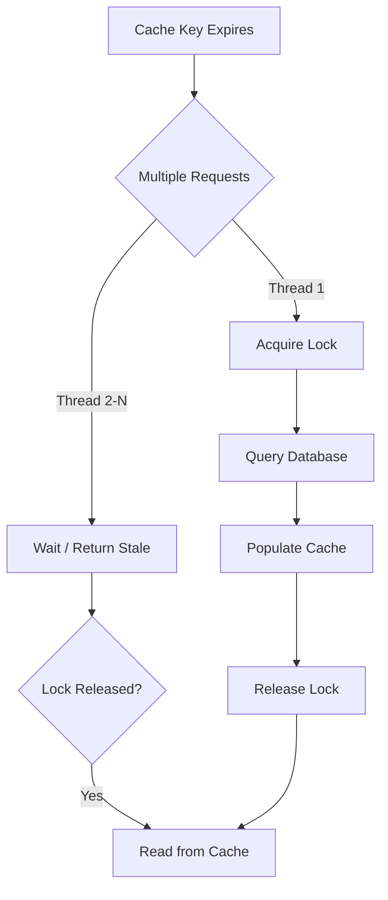
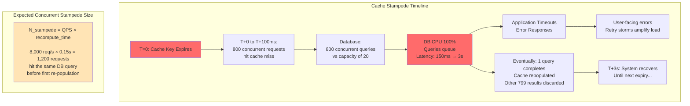
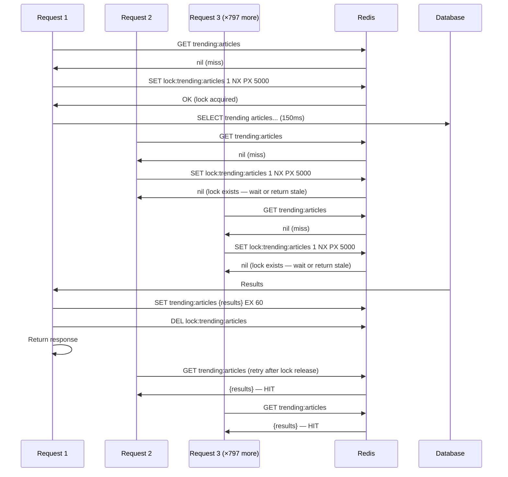
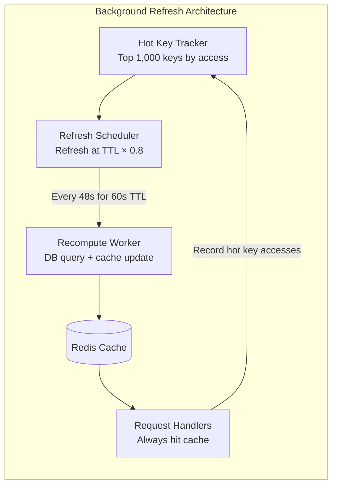
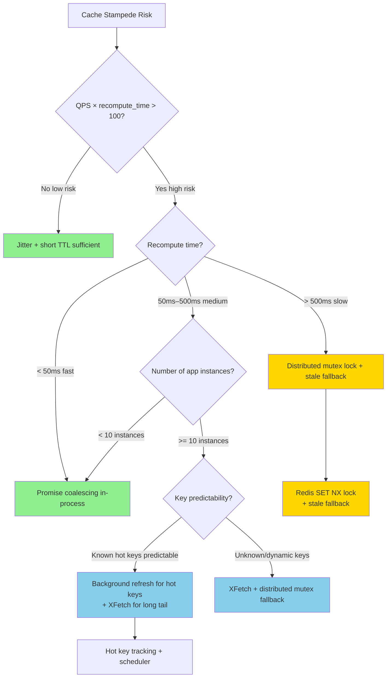

# Cache Stampede: Dog-Pile Prevention and Probabilistic Early Expiration

## 🗺️ Quick Overview



*When a popular key expires, only one thread is allowed to recompute while others serve stale data or wait — preventing the database from being hit by every concurrent request simultaneously.*

**The cache stampede is a self-inflicted DoS: your own traffic overwhelms your own database the instant a popular cache key expires. Preventing it requires combining lock mechanics, probabilistic expiry, and background refresh — each with distinct failure modes you must design around.**

---

## The Problem Class `[Mid]`

Your homepage shows trending articles. You cache the trending list for 60 seconds. At peak: 8,000 requests/second hit the homepage.

At T=0, the cache key expires. In the next 100ms, before any single request re-populates the cache:
- 800 requests (8,000/sec × 100ms) all experience a cache miss
- All 800 requests concurrently query the database for trending articles
- Each query takes 150ms to compute (aggregation over 10M events)
- Database goes from ~10 concurrent queries to 800 simultaneously
- Database CPU spikes to 100%. Queries queue. Timeouts begin.
- Cascading: database slowdown causes cache re-population to take longer → more concurrent queries pile up → positive feedback loop



**Formula**: Expected stampede size = `QPS × recompute_time_seconds`. At 8,000 QPS and 150ms recompute: `8,000 × 0.15 = 1,200 concurrent DB hits`. This is the threat model.

---

## Why the Obvious Solution Fails `[Senior]`

**"Just set a longer TTL"**: Reduces stampede frequency but doesn't eliminate it. When the 10-minute TTL expires, the stampede is even larger because more traffic has accumulated. At 8,000 QPS, a 10-minute TTL means 72,000 requests per stampede (8,000 × 0.15s = 1,200, but the key was stale 600 seconds — you've been serving stale data). And the next stampede is now 10 minutes away, not 1 — giving you false security.

**"Use database read replicas"**: Replicas share the same CPU and I/O bottleneck under 800+ concurrent queries. Replication lag means replicas may return stale data; doesn't actually prevent the stampede, just distributes it.

**"Add a circuit breaker"**: A circuit breaker opens when DB fails — but the stampede causes the failure, and opening the circuit means serving errors or cached errors. This addresses the symptom not the cause.

**"Pre-warm before expiry"**: How do you know when to pre-warm? You'd need to track all cache keys and their expiry times. At 10M keys, that's 10M timers. This is what the XFetch algorithm solves probabilistically.

---

## The Solution Landscape `[Senior]`

### Solution 1: Mutex Lock on Cache Miss (Distributed Lock)

**What it is**: When a cache miss occurs, acquire a distributed lock before querying the database. All other concurrent misses for the same key wait (or return stale) while the lock holder recomputes the value.

**How it actually works at depth**:



Two strategies for waiting requests:
1. **Block and retry**: Spin-wait with backoff (10ms → 20ms → 40ms). Adds latency to waiting requests.
2. **Return stale immediately**: Check for a "stale" version before acquiring lock. If stale value exists, return it to all waiting requests while lock holder recomputes.

The stale-return strategy is almost always correct: better to return 60-second-old trending articles than to make the user wait 150ms for fresh ones.

**Implementation with stale fallback**:
```redis
# Cache key: trending:articles
# Stale key: trending:articles:stale  (longer TTL, same value)

# On write:
SET trending:articles {value} EX 60      # fresh key, expires in 60s
SET trending:articles:stale {value} EX 600  # stale key, expires in 10min

# On miss of fresh key:
1. Acquire lock: SET lock:trending NX EX 5
2. If lock acquired: recompute, update both keys, release lock
3. If lock NOT acquired: GET trending:articles:stale → return stale value
```

**Sizing guidance** `[Staff+]`:

Lock contention analysis:
```
lock_wait_time = max(0, recompute_time - time_in_queue)
max_concurrent_lock_waiters = QPS × recompute_time = 8,000 × 0.15 = 1,200

With stale fallback (no waiting):
- Concurrent DB queries reduced from 1,200 to 1
- All 1,200 waiting requests get stale response immediately
- Stale response latency: ~1ms (Redis GET)
- Fresh response latency: ~150ms (for the 1 lock holder)

Without stale fallback (spin-wait with 10ms backoff):
- 1,200 requests waiting with 10ms spin
- Memory: 1,200 goroutines/threads blocked = significant
- Risk of timeout cascade if recompute > configured timeout
```

**Configuration decisions that matter** `[Staff+]`:
- Lock TTL must be > recompute time: if recompute takes 150ms, set lock TTL to 500ms (3× margin). If lock TTL < recompute time, lock expires while recompute is in progress, allowing another stampede.
- Use `SET NX` + `Lua script` for atomic check-and-set to avoid race between checking lock and acquiring it.
- Per-key locks, not global locks: `lock:{key}`, not `lock:all`. Global lock serializes all cache misses — catastrophic for different keys.

**Failure modes** `[Staff+]`:
- **Lock holder crashes**: Lock holder acquires lock, queries DB, crashes before writing to cache, never releases lock. All waiters block until lock TTL expires (500ms). After TTL, lock is released, next requester acquires and recomputes. Acceptable if lock TTL is short.
- **Lock TTL too short**: Recompute takes 200ms. Lock TTL is 150ms. Lock expires during recompute. Second requester acquires lock. Both now query DB simultaneously. Partial stampede of 2. Increase lock TTL to 5× expected recompute time.
- **Redis lock not atomic**: Using `GET + SET` (non-atomic) allows race: two requesters both check, both see no lock, both set, both query DB. Always use `SET key value NX PX ttl` (atomic).

**Observability** `[Staff+]`:
- `cache_lock_acquisition_rate{key_pattern}` — how often are locks acquired (= recompute rate)
- `cache_lock_contention_rate` — lock failures (others waiting)
- `cache_stale_served_rate` — fraction of requests getting stale response during lock window

---

### Solution 2: Promise-Based Coalescing

**What it is**: Instead of a distributed lock, use an in-process promise/future that all concurrent requesters share. The first requester starts the DB query and stores the in-flight promise. Subsequent requesters receive the same promise and await it.

**How it actually works at depth**:

```javascript
// Node.js implementation
const inFlight = new Map();

async function getCachedTrending() {
  // Check cache first
  const cached = await redis.get('trending:articles');
  if (cached) return JSON.parse(cached);

  // Check if recompute is already in-flight
  if (inFlight.has('trending:articles')) {
    return inFlight.get('trending:articles');  // share the promise
  }

  // Start new recompute
  const promise = db.query('SELECT...').then(result => {
    redis.setex('trending:articles', 60, JSON.stringify(result));
    inFlight.delete('trending:articles');
    return result;
  }).catch(err => {
    inFlight.delete('trending:articles');
    throw err;
  });

  inFlight.set('trending:articles', promise);
  return promise;
}
```

**Vs mutex lock**:
- Promise coalescing is in-process only: all concurrent requesters on the *same application instance* share the promise.
- Mutex lock via Redis is cross-instance: all application instances share the lock.

For a cluster of 50 app servers, promise coalescing reduces DB queries from `1,200` to `50` (1 per app instance). Distributed lock reduces it to `1`. For most applications, 50 is acceptable; for very expensive recompute (> 500ms), use distributed lock.

**Sizing guidance** `[Staff+]`:

DB query reduction:
```
With N app instances and promise coalescing:
concurrent_db_queries = N (one per instance, not 1,200)

With distributed Redis lock + stale fallback:
concurrent_db_queries = 1

At N=50 instances, recompute=150ms:
Promise coalescing: 50 × 150ms = 7.5 seconds of DB time consumed
Distributed lock: 1 × 150ms = 150ms of DB time consumed

For cheap recompute (< 50ms): promise coalescing is sufficient
For expensive recompute (> 100ms) or limited DB connections: distributed lock required
```

**Failure modes** `[Staff+]`:
- **Error propagation**: If DB query fails, all 100 waiters on the same promise receive the error. Implement fallback in the promise rejection handler (return stale if available).
- **Memory leak**: Promise stored in Map but never cleaned up (e.g., on unhandled rejection). Always use `.finally()` to clean up.
- **Not cross-process**: Adding a new application instance means it has no knowledge of in-flight requests on other instances. Deploy a new instance under traffic spike → that instance immediately stampedes independently. Combine with distributed lock for full protection.

---

### Solution 3: XFetch — Probabilistic Early Expiration

**What it is**: An algorithm that proactively recomputes cache values *before* they expire, based on probabilistic sampling. The probability of recomputing increases as the TTL approaches zero, so the cache is refreshed by one of the requests that happens to be "early" — preventing any request from experiencing a miss-triggered stampede.

**How it actually works at depth**:

XFetch (Vattani et al., 2015 — the canonical algorithm):

```python
import math, random, time

def xfetch_get(redis_client, key, beta=1.0):
    """
    beta: controls aggressiveness of early recompute.
    beta=1: standard. beta=2: more aggressive early recompute.
    """
    value, delta, expiry = redis_client.get_with_metadata(key)

    if value is None:
        return None  # genuine cache miss

    # Time remaining until expiry
    ttl_remaining = expiry - time.time()

    # Probabilistic recompute decision:
    # As TTL approaches 0, random() < probability increases
    # delta = last recompute duration (in seconds)
    # When ttl_remaining ≤ 0: always recompute (actual expiry)
    # When ttl_remaining >> delta: very rarely recompute
    if time.time() - delta * beta * math.log(random.random()) >= expiry:
        return None  # trigger recompute (probabilistic early expiry)

    return value
```

The mathematical insight: `P(recompute) = P(current_time - delta × beta × log(U) ≥ expiry)` where U is uniform(0,1). As `expiry - current_time → 0`, `P(recompute) → 1`. The recompute is triggered by a single request "early" — before the TTL actually expires.

In practice:
- delta = last measured recompute time (e.g., 150ms → delta=0.15)
- beta=1 gives expected early recompute at ~1 recompute-time before expiry
- Result: 1 request out of N triggers early recompute ~150ms before expiry
- Cache is fresh before any request sees an actual miss

**Sizing guidance** `[Staff+]`:

Expected early recompute count:
```
In a 60s TTL with delta=0.15s and beta=1:
Expected number of recompute triggers per TTL cycle:
= integral of P(recompute) over TTL window
≈ 1 (by design — algorithm fires exactly once on average)

At 8,000 QPS and 60s TTL:
- With XFetch: 1 recompute per 60s = 1/60 = 0.017 DB queries/sec for this key
- Without XFetch (after miss): 1,200 concurrent DB queries
- Load reduction: 70,000× for this key
```

**Configuration decisions that matter** `[Staff+]`:
- Store delta (recompute time) in cache metadata alongside value. Measure actual DB query time and update delta on each recompute. If recompute time changes (e.g., DB gets slower), delta self-adjusts.
- Store TTL alongside value so XFetch can compute `ttl_remaining`. In Redis, use `EXPIRETIME` command (Redis 7.0+) or store expiry timestamp as metadata.
- Beta tuning: beta=1 is theoretical optimum. In practice, use beta=2 for safety margin (triggers recompute twice as early on average).

**Failure modes** `[Staff+]`:
- **Stale delta**: If cached delta=0.05s (50ms from a fast DB period) but DB is now slow (300ms), XFetch triggers too late. The early recompute takes 300ms but was triggered only 50ms before expiry. Cache expires during recompute → brief stampede. Update delta on every recompute.
- **XFetch cascades**: Multiple cache keys with similar TTLs and delta values all trigger early recompute simultaneously (XFetch fires at T-delta before expiry for all). If 100 keys all have TTL=60s and delta=0.15s, all fire at T=59.85s — a small stampede of 100 queries instead of 1,200 per key. Acceptable.

---

### Solution 4: Background Refresh with Active TTL Management

**What it is**: A background task periodically refreshes cache keys before they expire. No request ever experiences a cache miss for hot keys.

**How it actually works at depth**:



**Sizing guidance** `[Staff+]`:

Background refresh load:
```
keys_refreshed_per_second = hot_key_count / (TTL × 0.8)
At 1,000 hot keys and TTL=60s: 1,000 / 48s = 20.8 refreshes/sec
At 10,000 hot keys and TTL=60s: 208 refreshes/sec

Compare to on-demand recompute:
On-demand: 1,200 concurrent queries per stampede (4× per minute for 60s TTL)
Background: 21 steady-state queries/sec

Background refresh has lower peak load but higher steady-state load.
```

**Failure modes** `[Staff+]`:
- **Background refresh lag**: If 10,000 keys need refresh but the refresh worker processes only 500/sec, some keys expire before being refreshed. Horizontal scale the refresh workers.
- **Cold restart**: On application restart, the hot key tracker is empty. All keys must be re-discovered through actual access. Brief period where popular keys may stampede. Persist hot key list to a durable store (Redis sorted set with scores = last access timestamp).
- **Refresh amplification**: Background refresh uses the same DB queries as user requests. During a DB incident, background refresh keeps querying the struggling DB. Implement circuit breaker in refresh worker; pause refresh when DB is unhealthy.

---

## Trade-off Matrix `[Senior]` → `[Staff+]`

| Dimension | Mutex Lock | Promise Coalescing | XFetch | Background Refresh |
|---|---|---|---|---|
| DB queries at stampede | 1 (global) | N (per instance) | ~1 (early, pre-expiry) | 0 (pre-populated) |
| User-visible latency on miss | Lock wait time | Shared wait | None (key pre-refreshed) | None (key pre-refreshed) |
| Complexity | Medium | Low | Medium (algorithm) | High (scheduler) |
| Works across app instances | Yes (Redis lock) | No (in-process) | Yes | Yes |
| Memory overhead | Low (lock key) | Low (in-process map) | Low (metadata) | Medium (refresh workers) |
| Handles cold start | No | No | No | Requires warm-up |
| Implementation effort | Medium | Low | Medium | High |
| Correct for all key patterns | Yes | Yes | Yes | Only for hot keys |

---

## Decision Framework `[Senior]` → `[Staff+]`



---

## Production Failure Story `[Staff+]`

**The 2 AM Trending Feed Stampede — Video Platform, 2023**

**Context**: Video platform. Trending feed cached with 30s TTL. 15,000 req/sec at peak. Trending query joins 5 tables, runs for 400ms on primary DB.

**Expected stampede size**: `15,000 × 0.4 = 6,000 concurrent DB queries` at each 30s expiry.

**Why it wasn't caught earlier**: During normal traffic (09:00–22:00), DB connection pool (100 connections) was saturated but queries queued. P99 latency on homepage was 800ms — high but acceptable. Team assumed this was "normal DB load."

**The incident**: At 02:00, a viral video drove traffic to 22,000 req/sec (50% above normal peak). Stampede size: `22,000 × 0.4 = 8,800`. DB connection pool (100) couldn't queue 8,800 concurrent queries — connection rejections began. Application saw `connection refused`, caught exceptions, returned HTTP 503. 503 rate: 34%. Monitors woke on-call at 02:08.

**What was found**: DB SHOW PROCESSLIST showed 97 identical `SELECT trending...` queries all running simultaneously. Cache had expired 8 seconds earlier. Connection pool queue was full.

**Resolution during incident**: Set TTL to 120s (immediate config change). Stampede frequency dropped from every 30s to every 120s. DB recovered. Traffic handled.

**Post-incident fixes implemented**:
1. XFetch algorithm added to trending feed cache getter. Measured delta=400ms, beta=2.
2. Stale fallback: trending query always writes to `trending:stale` key with TTL=600s
3. Connection pool sized to handle 2× expected peak concurrent queries (was 100, now 200)
4. Recompute moved to async background worker; user requests return stale while worker updates

**Result after fix**: Next peak traffic event (3 weeks later, 28,000 req/sec): zero DB spike on trending query. XFetch pre-recomputed once every 120s. Users always got near-fresh trending (< 2s stale on average).

---

## Observability Playbook `[Staff+]`

**Key metrics**:
```
# Stampede detection
cache_miss_spike_ratio{key}                    # current miss rate / baseline. Alert > 5×
concurrent_db_queries{query_type}              # spike = stampede in progress
cache_lock_wait_duration_p99{key}              # for mutex implementation

# XFetch metrics
xfetch_early_recompute_rate{key}               # should be ~1 per TTL cycle
xfetch_genuine_miss_rate{key}                  # should be ~0 with healthy XFetch

# Background refresh metrics
hot_key_refresh_lag_seconds{key}               # time since last refresh. Alert > 0.9 × TTL
refresh_worker_queue_depth                     # backlog of pending refreshes

# DB impact
db_query_rate_by_source{source=cache_miss}     # isolate cache-miss-driven DB load
db_connection_pool_wait_time_p99               # leading indicator of stampede
```

**Runbook for active stampede**:
1. Identify stampeding key via `cache_miss_spike_ratio` alert
2. Manually set key with stale data + extended TTL: `SET key {last_known_value} EX 300`
3. This immediately unblocks all waiting requests (serving stale but unblocked)
4. Verify DB query rate drops
5. In background, root-cause the recompute time (too slow? too frequent? large TTL relative to query time?)

---

## Architectural Evolution `[Staff+]`

**2015–2018**: Mutex lock was the standard solution. Teams reinvented it independently. Redis `SET NX` was the universal primitive.

**2015**: XFetch algorithm published. Slow adoption due to complexity.

**2019–2022**: Promise coalescing became idiomatic in Node.js/Go async codebases. Reduced stampedes for single-process workloads.

**2022–2024**: Background refresh with hot key tracking matured. Libraries like `go-cache-stampede`, Python `aiocache`, and Java's Caffeine (with async refresh) implemented these patterns natively.

**2025–2026 patterns**:
- **Redis 8.x client-side caching with tracking**: Redis 7+ supports server-assisted client-side caching via the `CLIENT TRACKING` command. Redis notifies clients when tracked keys change, enabling cache invalidation without polling. Combines with in-process cache to eliminate stampede entirely for hot keys.
- **Momento + automatic stampede protection**: Momento's serverless cache implements mutex lock + stale fallback as a platform feature. No application-level lock code required.
- **DragonflyDB background eviction**: DragonflyDB supports configurable pre-expiry callbacks — allowing application-level XFetch-style recompute without library support.
- **Singleflight in service meshes**: Envoy proxy's experimental "request coalescing" feature coalesces identical upstream requests at the proxy layer — stampede prevention without application code changes.
- **ML-predicted TTL**: Emerging pattern — predict optimal TTL based on key access patterns and upstream data change frequency. Reduces manual TTL tuning. Used internally at Cloudflare (2025).

---

## Decision Framework Checklist `[All Levels]`

- [ ] **Calculate expected stampede size**: `QPS × recompute_time`. If > 50, implement prevention.
- [ ] **Always implement stale fallback**: Before returning a cache miss, check for stale version. Return stale while one request recomputes. No user should block on recompute.
- [ ] **Add jitter to TTL**: Spread expiry of keys that are populated in bulk to avoid synchronized expiry.
- [ ] **Measure actual recompute time** (delta) for XFetch implementation — use real p95 DB query time.
- [ ] **Per-key locks, not global locks**: Ensure each cache key gets its own lock. Global locks serialize all misses.
- [ ] **Set lock TTL to 5× recompute time**: Handles slow DB periods without blocking.
- [ ] **Persist hot key list across restarts**: Avoids cold-start stampede after deploy.
- [ ] **Monitor DB queries per second split by source**: Isolate cache-miss-driven load. This is your stampede early warning.
- [ ] **Test stampede scenarios in staging**: Deliberately expire a hot key under load. Verify DB query spike is bounded.
- [ ] **Size DB connection pool for stampede**: Pool size = max tolerable concurrent recompute queries, not just steady-state.

---
*Written by Gaurav Porwal — 10+ Year Engineer | Tech Lead | Product Owner | Business-Minded Builder*
*Last updated: 2026-03-18*
