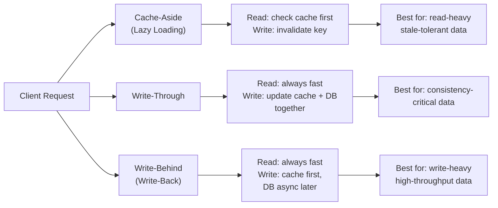

# Caching Strategies - From 500ms to 5ms Response Times

> **Reading Time:** 20 minutes
> **Difficulty:** 🟡 Intermediate
> **Impact:** 10-100x performance improvement, 80%+ database load reduction

## 🗺️ Quick Overview



*The three core strategies trade off consistency, write latency, and complexity — choose based on how stale your data can be.*

## The Instagram Problem: 2 Billion Daily Active Users

**How Instagram serves 2B users with sub-50ms response times:**

```
Without caching:
├── Database query per request: 50ms
├── 500M requests/second peak
├── Required database capacity: 25M QPS
├── Cost: Impossible (no database can do this)
└── Result: Instagram doesn't exist

With multi-layer caching:
├── CDN cache (static assets): 95% hit rate, 5ms
├── Application cache (Redis): 99% hit rate, 2ms
├── Local cache (in-memory): 99.9% hit rate, 0.1ms
├── Database queries: Only 0.1% of requests
└── Result: 500M RPS with 5ms average latency

Cache hit breakdown:
├── 95% of requests: Never leave CDN
├── 4% of requests: Served from Redis
├── 0.9% of requests: Served from local cache
└── 0.1% of requests: Actually hit database
```

**The lesson:** The fastest query is one that never reaches your database.

---

## The Problem: Databases Don't Scale to User Expectations

### Modern User Expectations

```
Response Time        User Perception
< 100ms              "Instant"
100-300ms            "Fast"
300-1000ms           "Noticeable delay"
> 1000ms             "Slow, frustrating"
> 3000ms             "Broken, leave site"

Reality check:
├── PostgreSQL simple query: 5-20ms
├── PostgreSQL complex join: 50-500ms
├── Network latency to DB: 1-5ms
├── DB connection overhead: 5-10ms
└── Total: 60-535ms per request

Without caching: Every request = database query = slow
```

### The Math: Why Caching Is Essential

```
Scenario: E-commerce product page

Without cache:
├── 10,000 visitors/hour viewing same product
├── Each view: 3 DB queries × 20ms = 60ms
├── Total DB time: 10,000 × 60ms = 600 seconds/hour
├── Database CPU: Constantly stressed
└── Response time: 60-200ms

With cache:
├── First view: Populate cache (60ms)
├── Next 9,999 views: Cache hit (2ms)
├── Total DB time: 60ms (just first request)
├── Database CPU: Nearly idle
└── Response time: 2-5ms

Improvement: 99.99% reduction in database load
```

---

## Caching Patterns

### Pattern 1: Cache-Aside (Lazy Loading)

```
Application controls cache population

READ:
┌─────────┐     ┌───────┐     ┌──────────┐
│  App    │────►│ Cache │────►│ Database │
└─────────┘     └───────┘     └──────────┘
     │              │              │
     │   1. Check   │              │
     │─────────────►│              │
     │              │              │
     │   2. Miss    │              │
     │◄─────────────│              │
     │              │              │
     │   3. Query   │              │
     │───────────────────────────►│
     │              │              │
     │   4. Result  │              │
     │◄──────────────────────────│
     │              │              │
     │   5. Store   │              │
     │─────────────►│              │
```

```javascript
class CacheAsideRepository {
  constructor(cache, db) {
    this.cache = cache;
    this.db = db;
    this.ttl = 3600; // 1 hour
  }

  async getUser(userId) {
    const cacheKey = `user:${userId}`;

    // 1. Check cache
    const cached = await this.cache.get(cacheKey);
    if (cached) {
      return JSON.parse(cached);
    }

    // 2. Cache miss - query database
    const user = await this.db.query(
      'SELECT * FROM users WHERE id = $1',
      [userId]
    );

    if (user) {
      // 3. Store in cache
      await this.cache.set(cacheKey, JSON.stringify(user), 'EX', this.ttl);
    }

    return user;
  }

  async updateUser(userId, data) {
    // Update database
    await this.db.query(
      'UPDATE users SET name = $1, email = $2 WHERE id = $3',
      [data.name, data.email, userId]
    );

    // Invalidate cache
    await this.cache.del(`user:${userId}`);
  }
}
```

**Pros:**
- Application controls what gets cached
- Cache only contains requested data
- Resilient to cache failures

**Cons:**
- Cache miss penalty (extra latency)
- Potential for stale data
- N+1 cache problem

### Pattern 2: Write-Through

```
Every write updates cache and database together

WRITE:
┌─────────┐     ┌───────┐     ┌──────────┐
│  App    │────►│ Cache │────►│ Database │
└─────────┘     └───────┘     └──────────┘
     │              │              │
     │   1. Write   │              │
     │─────────────►│              │
     │              │   2. Write   │
     │              │─────────────►│
     │              │              │
     │              │   3. ACK     │
     │              │◄─────────────│
     │   4. ACK     │              │
     │◄─────────────│              │
```

```javascript
class WriteThroughRepository {
  constructor(cache, db) {
    this.cache = cache;
    this.db = db;
  }

  async createUser(userData) {
    // 1. Write to database
    const user = await this.db.query(
      'INSERT INTO users (name, email) VALUES ($1, $2) RETURNING *',
      [userData.name, userData.email]
    );

    // 2. Write to cache (synchronous with DB write)
    await this.cache.set(
      `user:${user.id}`,
      JSON.stringify(user),
      'EX',
      3600
    );

    return user;
  }

  async updateUser(userId, data) {
    // 1. Update database
    const user = await this.db.query(
      'UPDATE users SET name = $1, email = $2 WHERE id = $3 RETURNING *',
      [data.name, data.email, userId]
    );

    // 2. Update cache
    await this.cache.set(
      `user:${userId}`,
      JSON.stringify(user),
      'EX',
      3600
    );

    return user;
  }
}
```

**Pros:**
- Cache always consistent with database
- No stale data on reads
- Simple read path

**Cons:**
- Write latency increased
- Cache contains unread data
- Higher cache storage usage

### Pattern 3: Write-Behind (Write-Back)

```
Writes go to cache immediately, database updated asynchronously

WRITE:
┌─────────┐     ┌───────┐ - - - ┌──────────┐
│  App    │────►│ Cache │ async │ Database │
└─────────┘     └───────┘ - - - └──────────┘
     │              │              │
     │   1. Write   │              │
     │─────────────►│              │
     │              │              │
     │   2. ACK     │   (later)    │
     │◄─────────────│─ ─ ─ ─ ─ ─ ►│
     │              │              │
```

```javascript
class WriteBehindRepository {
  constructor(cache, queue, db) {
    this.cache = cache;
    this.queue = queue;  // Redis Stream or message queue
    this.db = db;
  }

  async updateUser(userId, data) {
    const user = { id: userId, ...data, updatedAt: Date.now() };

    // 1. Write to cache immediately
    await this.cache.set(
      `user:${userId}`,
      JSON.stringify(user),
      'EX',
      3600
    );

    // 2. Queue for async database write
    await this.queue.add('user-updates', {
      operation: 'UPDATE',
      table: 'users',
      id: userId,
      data: user
    });

    return user; // Return immediately (fast!)
  }

  // Background worker
  async processWriteQueue() {
    while (true) {
      const job = await this.queue.take('user-updates');

      try {
        await this.db.query(
          'UPDATE users SET name = $1, email = $2, updated_at = $3 WHERE id = $4',
          [job.data.name, job.data.email, job.data.updatedAt, job.data.id]
        );
      } catch (error) {
        // Retry or dead-letter
        await this.queue.add('user-updates-retry', job);
      }
    }
  }
}
```

**Pros:**
- Fastest write latency
- Batching opportunities
- Absorbs write spikes

**Cons:**
- Data loss risk on cache failure
- Complexity of async processing
- Eventual consistency

### Pattern Comparison

| Pattern | Read Latency | Write Latency | Consistency | Complexity |
|---------|--------------|---------------|-------------|------------|
| Cache-Aside | Miss: High, Hit: Low | Low | Eventual | Low |
| Write-Through | Always Low | High | Strong | Medium |
| Write-Behind | Always Low | Very Low | Eventual | High |

---

## Cache Invalidation Strategies

### Strategy 1: TTL-Based Expiration

```javascript
// Simple TTL
await cache.set('product:123', JSON.stringify(product), 'EX', 3600);

// Different TTLs for different data types
const TTL_CONFIG = {
  'user:profile': 3600,        // 1 hour - changes rarely
  'product:details': 300,      // 5 min - inventory changes
  'session': 86400,            // 24 hours
  'search:results': 60,        // 1 min - freshness important
  'config': 600                // 10 min - admin configurable
};

async function cacheWithTTL(type, key, data) {
  const ttl = TTL_CONFIG[type] || 300;
  await cache.set(`${type}:${key}`, JSON.stringify(data), 'EX', ttl);
}
```

### Strategy 2: Event-Based Invalidation

```javascript
// Pub/Sub for cache invalidation
class EventDrivenCache {
  constructor(cache, pubsub) {
    this.cache = cache;
    this.pubsub = pubsub;
    this.setupSubscriptions();
  }

  setupSubscriptions() {
    // Listen for invalidation events
    this.pubsub.subscribe('cache:invalidate', async (message) => {
      const { pattern, keys } = JSON.parse(message);

      if (pattern) {
        // Invalidate by pattern
        const matchingKeys = await this.cache.keys(pattern);
        if (matchingKeys.length > 0) {
          await this.cache.del(...matchingKeys);
        }
      } else if (keys) {
        // Invalidate specific keys
        await this.cache.del(...keys);
      }
    });
  }

  async invalidate(keys) {
    // Publish to all cache instances
    await this.pubsub.publish('cache:invalidate', JSON.stringify({ keys }));
  }

  async invalidatePattern(pattern) {
    await this.pubsub.publish('cache:invalidate', JSON.stringify({ pattern }));
  }
}

// Usage
cache.invalidate(['user:123', 'user:123:orders']);
cache.invalidatePattern('product:*');  // Invalidate all products
```

### Strategy 3: Version-Based Invalidation

```javascript
// Use version in cache key - change version to invalidate all
class VersionedCache {
  constructor(cache, versionStore) {
    this.cache = cache;
    this.versionStore = versionStore;
  }

  async getVersion(namespace) {
    return await this.versionStore.get(`version:${namespace}`) || '1';
  }

  async incrementVersion(namespace) {
    return await this.versionStore.incr(`version:${namespace}`);
  }

  async get(namespace, key) {
    const version = await this.getVersion(namespace);
    const versionedKey = `${namespace}:v${version}:${key}`;
    return await this.cache.get(versionedKey);
  }

  async set(namespace, key, value, ttl) {
    const version = await this.getVersion(namespace);
    const versionedKey = `${namespace}:v${version}:${key}`;
    await this.cache.set(versionedKey, value, 'EX', ttl);
  }

  async invalidateNamespace(namespace) {
    // Simply increment version - old keys expire naturally
    await this.incrementVersion(namespace);
    // No need to delete keys - they become orphaned and expire via TTL
  }
}

// Usage
await versionedCache.set('products', '123', productData, 3600);
await versionedCache.invalidateNamespace('products'); // All products invalidated
```

---

## Multi-Layer Caching

### The Cache Hierarchy

```
┌─────────────────────────────────────────────────────────────┐
│                    Client Request                            │
└─────────────────────────────────────────────────────────────┘
                            │
                            ▼
┌─────────────────────────────────────────────────────────────┐
│                 Layer 1: CDN Cache                           │
│                 (Cloudflare, CloudFront)                     │
│                 Latency: 5-20ms                              │
│                 Hit Rate: 70-90% for static                  │
└─────────────────────────────────────────────────────────────┘
                            │ Miss
                            ▼
┌─────────────────────────────────────────────────────────────┐
│                 Layer 2: API Gateway Cache                   │
│                 (Kong, NGINX)                                │
│                 Latency: 1-5ms                               │
│                 Hit Rate: 40-60%                             │
└─────────────────────────────────────────────────────────────┘
                            │ Miss
                            ▼
┌─────────────────────────────────────────────────────────────┐
│                 Layer 3: Application Local Cache             │
│                 (node-cache, in-memory)                      │
│                 Latency: 0.01-0.1ms                          │
│                 Hit Rate: 60-80%                             │
└─────────────────────────────────────────────────────────────┘
                            │ Miss
                            ▼
┌─────────────────────────────────────────────────────────────┐
│                 Layer 4: Distributed Cache                   │
│                 (Redis, Memcached)                           │
│                 Latency: 0.5-2ms                             │
│                 Hit Rate: 80-99%                             │
└─────────────────────────────────────────────────────────────┘
                            │ Miss
                            ▼
┌─────────────────────────────────────────────────────────────┐
│                 Layer 5: Database                            │
│                 (PostgreSQL, MySQL)                          │
│                 Latency: 5-500ms                             │
└─────────────────────────────────────────────────────────────┘
```

### Implementation

```javascript
class MultiLayerCache {
  constructor({ localCache, redisCache, db }) {
    this.local = localCache;    // node-cache or LRU cache
    this.redis = redisCache;    // Redis client
    this.db = db;
    this.localTTL = 60;         // 1 minute local
    this.redisTTL = 3600;       // 1 hour Redis
  }

  async get(key) {
    // Layer 1: Local cache (fastest)
    const localValue = this.local.get(key);
    if (localValue) {
      return { value: localValue, source: 'local' };
    }

    // Layer 2: Redis (distributed)
    const redisValue = await this.redis.get(key);
    if (redisValue) {
      const parsed = JSON.parse(redisValue);
      // Backfill local cache
      this.local.set(key, parsed, this.localTTL);
      return { value: parsed, source: 'redis' };
    }

    // Layer 3: Database (slowest)
    const dbValue = await this.fetchFromDb(key);
    if (dbValue) {
      // Backfill all cache layers
      await this.redis.set(key, JSON.stringify(dbValue), 'EX', this.redisTTL);
      this.local.set(key, dbValue, this.localTTL);
      return { value: dbValue, source: 'database' };
    }

    return { value: null, source: 'miss' };
  }

  async set(key, value) {
    // Write to all layers
    await this.redis.set(key, JSON.stringify(value), 'EX', this.redisTTL);
    this.local.set(key, value, this.localTTL);
  }

  async invalidate(key) {
    // Invalidate all layers
    await this.redis.del(key);
    this.local.del(key);

    // Publish for other instances
    await this.redis.publish('cache:invalidate', JSON.stringify({ key }));
  }
}
```

---

## Cache Stampede Prevention

### The Problem

```
Cache expires → 1000 concurrent requests → 1000 database queries

Timeline:
T=0: Cache entry expires
T=0.001: Request 1 checks cache → MISS → queries DB
T=0.002: Request 2 checks cache → MISS → queries DB
T=0.003: Request 3 checks cache → MISS → queries DB
...
T=0.100: 1000 requests all querying database
T=0.500: Database overloaded, latency spikes
T=1.000: All requests timeout, users see errors
```

### Solution 1: Lock on Cache Miss

```javascript
class StampedeProtectedCache {
  constructor(cache, db) {
    this.cache = cache;
    this.db = db;
    this.lockTTL = 10; // 10 second lock
  }

  async get(key, fetchFn) {
    // Try cache first
    const cached = await this.cache.get(key);
    if (cached) {
      return JSON.parse(cached);
    }

    // Try to acquire lock
    const lockKey = `lock:${key}`;
    const acquired = await this.cache.set(lockKey, '1', 'NX', 'EX', this.lockTTL);

    if (acquired) {
      // We got the lock - fetch and cache
      try {
        const value = await fetchFn();
        await this.cache.set(key, JSON.stringify(value), 'EX', 3600);
        return value;
      } finally {
        await this.cache.del(lockKey);
      }
    } else {
      // Another process is fetching - wait and retry
      await this.sleep(100);
      return this.get(key, fetchFn);
    }
  }

  sleep(ms) {
    return new Promise(r => setTimeout(r, ms));
  }
}
```

### Solution 2: Probabilistic Early Expiration

```javascript
// XFetch algorithm - probabilistically refresh before expiry
class XFetchCache {
  constructor(cache, db) {
    this.cache = cache;
    this.db = db;
  }

  async get(key, fetchFn, ttl = 3600) {
    const data = await this.cache.get(key);

    if (data) {
      const { value, expiry, delta } = JSON.parse(data);
      const now = Date.now();

      // Probabilistic early refresh
      const timeLeft = expiry - now;
      const random = Math.random();
      const threshold = delta * Math.log(random) * -1;

      if (timeLeft < threshold) {
        // Refresh in background (don't wait)
        this.refresh(key, fetchFn, ttl);
      }

      return value;
    }

    // Cache miss
    return this.refresh(key, fetchFn, ttl);
  }

  async refresh(key, fetchFn, ttl) {
    const start = Date.now();
    const value = await fetchFn();
    const delta = Date.now() - start; // Time to fetch

    const data = {
      value,
      expiry: Date.now() + (ttl * 1000),
      delta
    };

    await this.cache.set(key, JSON.stringify(data), 'EX', ttl);
    return value;
  }
}
```

---

## Real-World: How Tech Giants Cache

### How Facebook Caches

```
Facebook's Memcache Layer:
├── Thousands of memcached servers
├── Consistent hashing for distribution
├── Lease mechanism prevents stampedes
├── Regional pools with invalidation
└── 99% of reads never hit database

Scale:
├── Billions of requests per second
├── Petabytes of cached data
├── < 1ms average latency
└── 99.99% cache hit rate for hot data
```

### How Netflix Caches

```
Netflix's EVCache:
├── Based on Memcached
├── Replicated across zones
├── Client-side consistent hashing
├── Zone-aware routing
└── Fast fallback on failure

Layers:
├── Browser cache: Session data
├── CDN cache: Video segments
├── API cache (EVCache): User preferences, recommendations
├── Database cache: Rarely accessed data
```

---

## Quick Win: Add Caching Today

```javascript
// Express middleware for caching
const NodeCache = require('node-cache');
const cache = new NodeCache({ stdTTL: 300 }); // 5 min default

function cacheMiddleware(keyGenerator, ttl = 300) {
  return async (req, res, next) => {
    const key = keyGenerator(req);

    // Check cache
    const cached = cache.get(key);
    if (cached) {
      return res.json(cached);
    }

    // Store original json method
    const originalJson = res.json.bind(res);

    // Override to cache response
    res.json = (body) => {
      cache.set(key, body, ttl);
      return originalJson(body);
    };

    next();
  };
}

// Usage
app.get('/api/products/:id',
  cacheMiddleware(req => `product:${req.params.id}`, 600),
  async (req, res) => {
    const product = await db.getProduct(req.params.id);
    res.json(product);
  }
);
```

---

## Key Takeaways

### Caching Decision Framework

```
1. WHAT to cache?
   ├── Read-heavy data ✅
   ├── Expensive computations ✅
   ├── Data that changes rarely ✅
   ├── Session data ✅
   └── Real-time data ❌

2. WHICH pattern?
   ├── Read-heavy, tolerant of stale → Cache-Aside
   ├── Consistency critical → Write-Through
   ├── Write-heavy, eventual OK → Write-Behind

3. WHAT TTL?
   ├── Volatile data: 60 seconds
   ├── User preferences: 1 hour
   ├── Product catalog: 5-15 minutes
   └── Static content: 24 hours+
```

### The Rules

| Scenario | Pattern | TTL | Invalidation |
|----------|---------|-----|--------------|
| User profile | Cache-Aside | 1 hour | On update |
| Product catalog | Write-Through | 5 min | Event-based |
| Session | Write-Through | 24 hours | On logout |
| Search results | Cache-Aside | 1 min | TTL only |
| Config/settings | Cache-Aside | 10 min | Version-based |

---

## Related Content

- [Caching Fundamentals](/02-caching/concepts/caching-fundamentals)
- [POC #1: Redis Cache](/03-redis/hands-on/redis-key-value-cache)
- [Thundering Herd Problem](/problems-at-scale/availability/thundering-herd)
- [Stale Read After Write](/problems-at-scale/consistency/stale-read-after-write)

---

**Remember:** Cache everything that's read more than it's written. The best cache is invisible—users just experience fast responses. Start with Cache-Aside, measure your hit rates, and evolve your strategy based on data.
