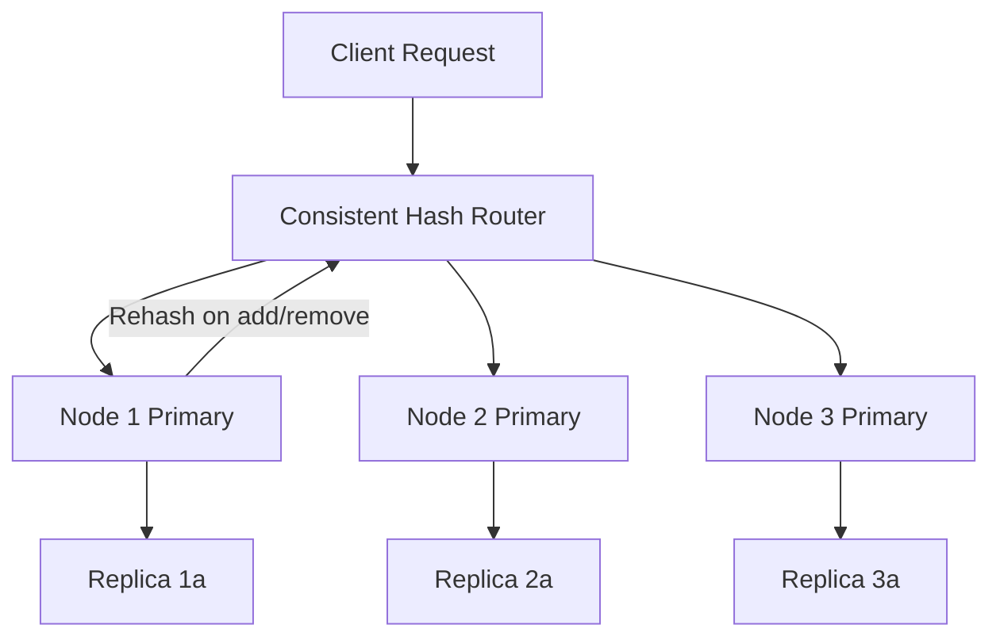
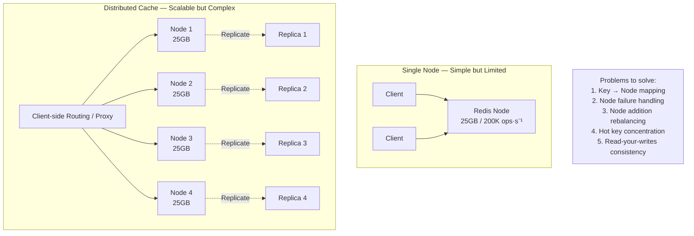
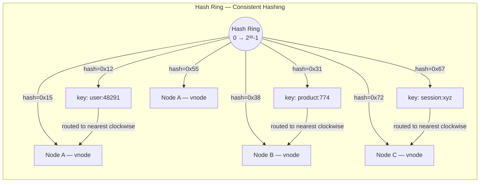
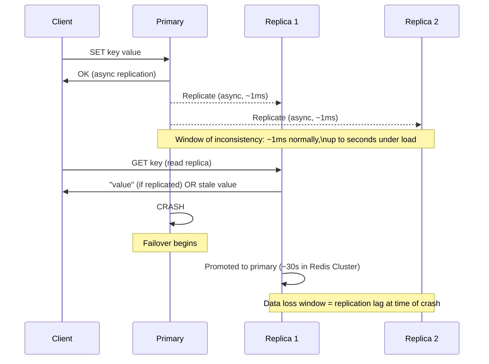
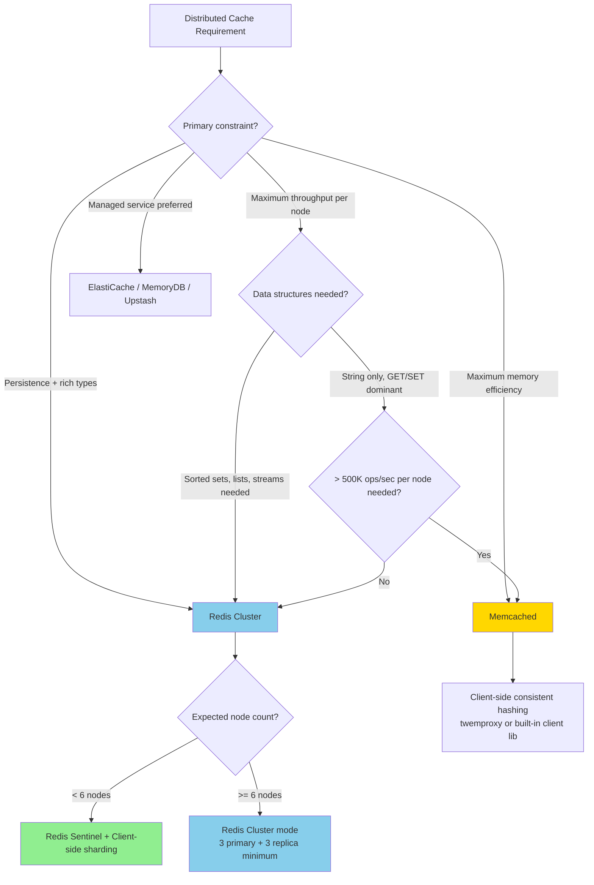

# Distributed Cache Design: Partitioning, Replication, and Consistency

## 🗺️ Quick Overview



*Consistent hashing routes each key to a specific primary node; replicas provide read scale and failover — adding or removing nodes only remaps a fraction of keys.*

**A single Redis node at 25GB RAM and 200K ops/sec is impressive — until it isn't. Distributed caching is not just about adding nodes; partitioning strategy, replication factor, and consistency semantics determine whether your cache saves you or becomes the incident.**

---

## The Problem Class `[Mid]`

You're running a recommendation service at 500K requests/second. Each request reads 20 user-preference keys. That's 10M cache ops/sec. A single Redis node tops out at ~200K ops/sec for mixed workloads. You need at least 50 nodes.

But 50 nodes introduce questions that don't exist with 1 node:
- Which node holds key `user:profile:48291`?
- When node 7 crashes, which node takes over?
- When you add node 51, how many keys move, and at what cost?
- If I write user preferences on node 7, does a read on node 7's replica see it immediately?



The complexity is proportional to the cardinality: 3 nodes is manageable. 50 nodes requires automation. 500 nodes requires architecture.

---

## Why the Obvious Solution Fails `[Senior]`

**Modulo hashing**: `node = hash(key) % N`. Works until N changes. Adding 1 node changes assignment of ~N/(N+1) of all keys. For 1M keys and 50 → 51 nodes: `1M × (50/51) ≈ 980K keys` remapped. All 980K keys become cache misses simultaneously. Your DB absorbs 980K queries in the next few seconds. This is why naive sharding fails at scale.

**Range-based partitioning**: `key[0-f] → node 0`, `key[g-z] → node 1` etc. Hot spots emerge for non-uniform key distributions. If 80% of traffic hits users with IDs starting with `1-3`, two of your nodes are overloaded while others idle.

**Static configuration files**: `config["user:*"] = node_1`. Works until you refactor. Engineers forget to update the config. You now have two code paths mapping the same key to different nodes. Silent data loss.

---

## The Solution Landscape `[Senior]`

### Solution 1: Consistent Hashing with Virtual Nodes

**What it is**: Map both keys and nodes onto a hash ring of size 2^32. Each key is owned by the nearest clockwise node on the ring. Virtual nodes (vnodes) assign each physical node multiple positions on the ring for uniform distribution.

**How it actually works at depth**:



With V virtual nodes per physical node:
- Adding 1 node: only `K / (N+1)` keys remapped (not `K × N/(N+1)`)
- At N=50 nodes, adding 1 node: `1M / 51 ≈ 19,600 keys` remapped — 98% fewer remaps than modulo hashing

Virtual node count V trades uniformity vs rebalancing granularity:
- V=150: Good distribution, fine-grained rebalancing
- V=500: Excellent distribution, higher memory overhead for ring state
- Redis Cluster uses 16,384 hash slots (effectively V=16,384/N vnodes per node)

**Sizing guidance** `[Staff+]`:

Memory per node calculation:
```
total_memory_needed = key_count × avg_value_size × (1 + overhead_factor)
overhead_factor ≈ 0.3 for Redis (metadata, jemalloc fragmentation, replication buffer)

Example:
- 10M keys × 2KB avg value = 20GB raw
- With overhead: 20GB × 1.3 = 26GB
- At 25GB RAM per node: ceil(26 / 25) = 2 nodes minimum
- Add 30% headroom for growth: 3 nodes

With replication factor 2: 6 total nodes (3 primary + 3 replica)
```

Rebalancing cost when adding nodes:
```
keys_to_migrate = total_keys / (N + 1)
migration_rate = depends on network bandwidth and Redis MIGRATE throughput
Redis MIGRATE throughput ≈ 50K keys/sec at 1KB avg value

At 1M total keys, adding 1 node:
keys_to_migrate = 1M / (N+1) ≈ 20K (at N=50)
migration_time = 20K / 50K = 0.4 seconds

At 100M total keys, adding 1 node:
keys_to_migrate = 100M / 51 ≈ 2M
migration_time = 2M / 50K = 40 seconds of elevated latency
```

**Configuration decisions that matter** `[Staff+]`:
- Redis Cluster: use `cluster-migration-barrier` = 1 to prevent a shard from having fewer replicas than others during migration
- Set `cluster-node-timeout` to 15,000ms (15s) in production — lower values cause false failover under network hiccups
- `lazyfree-lazy-expire yes` and `lazyfree-lazy-eviction yes` — use background threads for eviction to avoid blocking the main Redis thread

**Failure modes** `[Staff+]`:
- **Ring imbalance without vnodes**: With low V (< 100), natural hash distribution creates 10–30% imbalance between nodes. One node holds 30% more keys than average → memory pressure → evictions while other nodes are idle.
- **Split-brain during partition**: Redis Cluster requires quorum (majority of primary nodes) to accept writes. If 3 of 6 primaries are partitioned, the minority side rejects writes. Applications must handle `CLUSTERDOWN` errors gracefully.
- **Migration blocking**: During `CLUSTER RESHARD`, key slot migration blocks operations on migrating keys for microseconds. At high throughput, migration creates latency spikes. Schedule reshards during low-traffic windows.

**Observability** `[Staff+]`:
- `redis_cluster_slots_assigned` / 16384 → should be 100%. Alert on < 100%.
- `redis_cluster_slots_ok` → slots with healthy assignment. Alert on < `redis_cluster_slots_assigned`.
- Per-node key count: alert if any node holds > 1.5× average (imbalance indicator)
- `CLUSTER INFO` → `cluster_state: ok` must be true. Alert on `fail` state.

---

### Solution 2: Replication Factor Tradeoffs

**What it is**: Each primary shard has R replicas. Reads can be served by replicas. Replicas take over on primary failure (automatic failover in Redis Cluster, Sentinel, or managed services like ElastiCache).

**How it actually works at depth**:

Redis replication is asynchronous by default. Write to primary → ACK to client → primary replicates to replicas in background. The `WAIT N T` command waits for N replicas to acknowledge, with timeout T ms — this is the mechanism for synchronous replication in Redis.



Replication factor selection:
- RF=1 (no replicas): Maximum capacity per dollar, zero redundancy. Acceptable for ephemeral session caches where loss is tolerable.
- RF=2 (1 replica): Standard production. Survives single node failure. Read throughput doubled.
- RF=3 (2 replicas): For high-availability requirements (99.99%+). Survives 2 simultaneous node failures. Read throughput tripled.

**Sizing guidance** `[Staff+]`:

Read capacity with replicas:
```
total_read_capacity = N × RF × per_node_read_ops
(assuming reads distributed across primaries + replicas)

At N=10 nodes, RF=2, 150K reads/sec per node:
total_read_capacity = 10 × 2 × 150K = 3M reads/sec

Memory cost:
total_memory_used = per_node_memory × N × RF
At 25GB per node, N=10, RF=2: 500GB total RAM
Effective usable cache: 25GB × 10 = 250GB (replicas hold same data, don't add capacity)
```

**Failure modes** `[Staff+]`:
- **Replication lag under write burst**: During a write burst, replication lag can spike from 1ms to 500ms+. Reads from replicas during this window see stale data. `INFO replication → master_repl_offset` vs `slave_repl_offset` shows the lag in bytes.
- **Failover data loss**: Redis Cluster failover takes 10–30 seconds. Data written during this window may be lost if it wasn't replicated before primary crash. `min-replicas-to-write 1` prevents writes if no replica is connected — reduces data loss at cost of availability.
- **Cascade failure**: Primary fails. Replica promotes. New primary immediately starts replicating to remaining replica. If the new primary is also under load, replication creates additional I/O pressure, potentially causing it to fail too.

---

### Solution 3: Read-Your-Writes in Distributed Cache

**What it is**: After a write, the same client's subsequent reads should see the written value. In a distributed cache with async replication, reads from replicas can return stale data immediately after a write.

**How it actually works at depth**:

Three approaches in order of sophistication:

**1. Route writes and reads for a session to the same primary**:
```
client_session_id → consistent_hash → primary_node
All reads and writes for this session go to the same node
```
Simple but limits read scalability — session reads don't benefit from replicas.

**2. Replication version tokens**:
```
Write returns: {value: "v2", replication_token: "offset:1234567"}
Client includes token in next read: GET key IF_REPLICATION_GTE 1234567
Replica checks: is my replication offset >= 1234567?
  Yes → return current value (guaranteed to include the write)
  No → redirect to primary
```
This is the approach ElastiCache uses with `ReplicaLag` headers.

**3. Short-circuit via local write cache**:
```
Client writes to distributed cache.
Client also writes to in-process cache (L1) with TTL=5s.
Client reads from L1 first.
L1 hit always reflects own writes.
After 5s, L1 expires, read falls through to distributed cache (replica lag resolved).
```
Simple, effective, no distributed coordination needed.

**Sizing guidance** `[Staff+]`:
- Approach 1 (session-pinned): reduces read capacity by 1/RF (e.g., by half with RF=2). Acceptable for low-read, high-write workloads.
- Approach 2 (version tokens): adds 1 extra field per read request, 1 comparison per replica read. Negligible overhead.
- Approach 3 (L1 local cache): adds in-process memory. At 1K concurrent users with 100 keys each and 200 bytes per key: 100 keys × 200 bytes × 1K users = 20MB per app instance. Trivial.

---

### Solution 4: Memcached vs Redis Cluster

**What it is**: Memcached is a simple, multi-threaded, high-throughput key-value store. Redis Cluster is feature-rich, single-threaded per shard (Redis 7.x), with rich data structures and clustering built in.

The partitioning difference: Memcached has no native clustering — clients implement consistent hashing. Redis Cluster implements hash slot assignment in the server and clients just need to follow MOVED redirects.

**Sizing guidance** `[Staff+]`:

Throughput comparison (single node, 8-core server):
```
Memcached (multi-threaded, 8 threads):
- GET throughput: ~1.5M ops/sec
- SET throughput: ~800K ops/sec

Redis 7.0 (single-threaded event loop):
- GET throughput: ~250K ops/sec
- SET throughput: ~200K ops/sec

Redis 7.0 with I/O threads (io-threads=4):
- GET throughput: ~450K ops/sec
- SET throughput: ~380K ops/sec
```

Memory efficiency:
```
Per-key overhead:
- Memcached: ~57 bytes (key + value + metadata)
- Redis: ~200+ bytes (robj, dict entry, hash table overhead)

At 100M keys:
- Memcached overhead: 57B × 100M = 5.7GB
- Redis overhead: 200B × 100M = 20GB

Redis uses 3.5× more memory for the same number of keys.
If memory is the constraint, Memcached holds 3.5× more entries per GB.
```

**Failure modes** `[Staff+]`:
- Memcached: no persistence. Node restart = full cache loss. No replication. Node failure = keys redistributed to remaining nodes via consistent hashing. The redistributed keys are all misses — DB spike.
- Redis Cluster: split brain requires operator intervention if `cluster-require-full-coverage yes` (default). Under network partition, minority side rejects all reads and writes.

---

## Trade-off Matrix `[Senior]` → `[Staff+]`

| Dimension | Consistent Hashing | Modulo Sharding | Redis Cluster | Memcached + Client Hash |
|---|---|---|---|---|
| Rebalancing cost | Low (~K/N keys) | High (~all keys) | Automatic (slot migration) | Manual + client-side |
| Operational complexity | Medium | Low | High | Low |
| Read throughput at RF=2 | 2× primary only | 1× | 2× (primaries+replicas) | N/A (no replication) |
| Memory efficiency | Neutral | Neutral | 200B/key overhead | 57B/key overhead |
| Feature set | N/A | N/A | Rich (sorted sets, streams) | Simple (string only) |
| Multi-threading | N/A | N/A | Per-shard single-thread | Full multi-thread |
| Failure handling | Client-side | Client-side | Automatic failover | Client-side (key redistribution) |
| Persistence | N/A | N/A | AOF/RDB per shard | None |

---

## Decision Framework `[Senior]` → `[Staff+]`



---

## Production Failure Story `[Staff+]`

**The Node Addition That Caused a 45-Minute Outage — Social Platform, 2023**

**Context**: 24-node Redis Cluster serving 1.2M users, 800K ops/sec at peak, 40% memory headroom. Decision made to add 6 nodes (moving to 30) to increase headroom before a major product launch.

**The failure sequence**:
1. Operations team initiates `CLUSTER RESHARD` during "low traffic" at 02:00 UTC.
2. Low traffic window: 120K ops/sec (15% of peak). Not actually low enough.
3. Reshard moves 3,000 hash slots from existing nodes to new nodes.
4. During slot migration, each migrating slot's operations are briefly blocked (microseconds per key, but amplified by 3,000 slots × thousands of keys per slot).
5. P99 latency goes from 2ms to 850ms during migration.
6. Application connection pools hit their timeout threshold (500ms). Connections dropped.
7. Application servers begin throwing cache errors and falling through to DB.
8. DB primary CPU hits 100%. Read replicas saturate.
9. Cascading timeout: DB slow → cache-miss reads pile up → more timeouts.
10. 45 minutes to stabilize as ops team pauses reshard, waits for DB to recover, restarts reshard.

**Root cause**: Reshard was performed at 15% of peak traffic — but the *absolute* ops/sec rate (120K/sec) was still high enough that slot migration blocking caused significant latency impact.

**Fix**:
1. Added `cluster-migration-barrier 2` — forced migrations to happen more conservatively.
2. Throttled reshard with `--cluster-throttle 1000` — slows migration but reduces impact.
3. New policy: reshards only at < 5% of peak traffic (< 40K ops/sec for this cluster).
4. Pre-provisioned capacity 90 days ahead of launches instead of adding nodes reactively.

---

## Observability Playbook `[Staff+]`

**Per-node metrics** (collect from each Redis node):
```
# Throughput
redis_commands_total{node, command}        # ops/sec per command type
redis_keyspace_hits_total / redis_keyspace_misses_total  # hit rate per node

# Memory
redis_memory_used_bytes{node}
redis_memory_max_bytes{node}
redis_mem_fragmentation_ratio{node}        # alert if > 1.5 (high fragmentation)

# Replication
redis_connected_slaves{node}               # alert if < expected replica count
redis_repl_backlog_size{node}
redis_master_repl_offset - slave_repl_offset  # replication lag in bytes

# Cluster
redis_cluster_state{node}                  # 0=ok, 1=fail
redis_cluster_slots_assigned{node}         # should equal total_slots / N
```

**Cross-cluster metrics**:
```
# Load distribution
p95_key_count_imbalance_ratio             # max_node_keys / avg_node_keys. Alert > 1.5
p95_ops_imbalance_ratio                   # max_node_ops / avg_node_ops. Alert > 2.0

# Hot key detection
top_10_keys_by_ops_per_second             # identify hot keys weekly
```

**Alert thresholds**:
- Memory utilization > 80% on any node → add capacity
- Replication lag > 10MB on any replica → investigate write burst
- Cluster state = fail on any node → immediate PagerDuty
- Hit rate < 90% for 5 minutes → cache sizing or eviction policy issue

---

## Architectural Evolution `[Staff+]`

**2018–2020**: Redis Sentinel for HA, manual sharding at application layer. Operational overhead high.

**2020–2022**: Redis Cluster adoption. 6-node minimum barrier slowed adoption for smaller teams. Managed services (ElastiCache for Redis in Cluster Mode) abstracted operational burden.

**2022–2024**: Tiered caching became standard — local in-process cache (Caffeine/Guava) + Redis Cluster + CDN. Per-request latency dropped below 1ms for hot keys.

**2025–2026 patterns**:
- **DragonflyDB**: Multi-threaded Redis-compatible server. Single DragonflyDB node handles 3–4M ops/sec (vs Redis's 200–400K). Reduces cluster node count by 10×. Full Redis API compatibility.
- **KeyDB**: Multi-threaded Redis fork (now owned by Snap). Similar throughput gains but less community momentum vs DragonflyDB.
- **Redis 8.x**: Introduces multi-threaded command execution (not just I/O threads). Narrows gap with Memcached/DragonflyDB.
- **AWS MemoryDB**: Redis-compatible with strong consistency (multi-AZ transaction log). Closes the gap between Redis and durable storage — useful for sessions where loss is unacceptable.
- **Momento**: Serverless cache with automatic scaling. No capacity planning. Pay per operation. Eliminates cluster management entirely for variable workloads.
- **Consistent hashing clients in 2026**: All major client libraries (Jedis, StackExchange.Redis, ioredis) support server-assisted hash slot routing. Pure client-side consistent hashing is legacy pattern for new systems.

---

## Decision Framework Checklist `[All Levels]`

- [ ] **Calculate required total ops/sec**: Account for peak, not average. Include read:write ratio.
- [ ] **Calculate required total memory**: key_count × avg_value_size × 1.3 (overhead). Add 30% headroom.
- [ ] **Choose RF based on availability SLA**: RF=1 for non-critical, RF=2 for 99.9%+, RF=3 for 99.99%+
- [ ] **Plan for node addition cost**: At expected growth rate, how often will you add nodes? What's the reshard impact?
- [ ] **Decide on hot-key strategy upfront**: Detect hot keys before they cause incidents (see hot-key-problem.md)
- [ ] **Set up read-your-writes if required**: Determine if your application requires it; choose approach (session pinning vs version tokens vs L1 local cache)
- [ ] **Configure `cluster-node-timeout` conservatively**: 15,000ms for production. Reduces false failovers.
- [ ] **Monitor per-node memory utilization continuously**: 80% threshold = add capacity event
- [ ] **Test failover quarterly**: Deliberately kill a primary node; verify replica promotion time meets SLA
- [ ] **Evaluate DragonflyDB/Redis 8**: If running > 10 Redis nodes, multi-threading may reduce footprint by 5–10×

---
*Written by Gaurav Porwal — 10+ Year Engineer | Tech Lead | Product Owner | Business-Minded Builder*
*Last updated: 2026-03-18*
