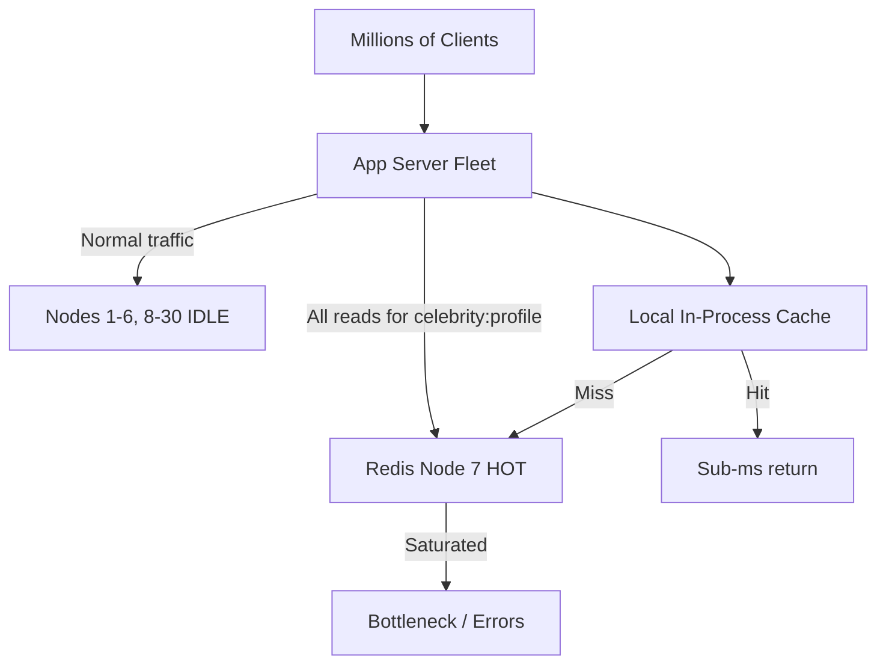
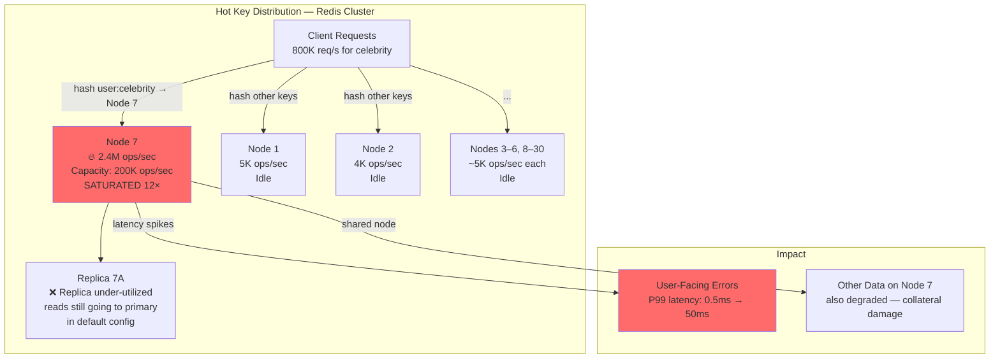
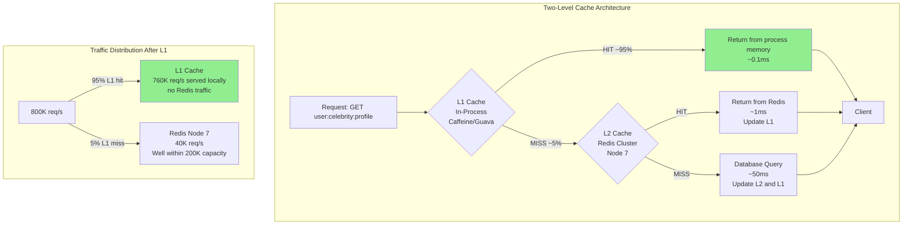
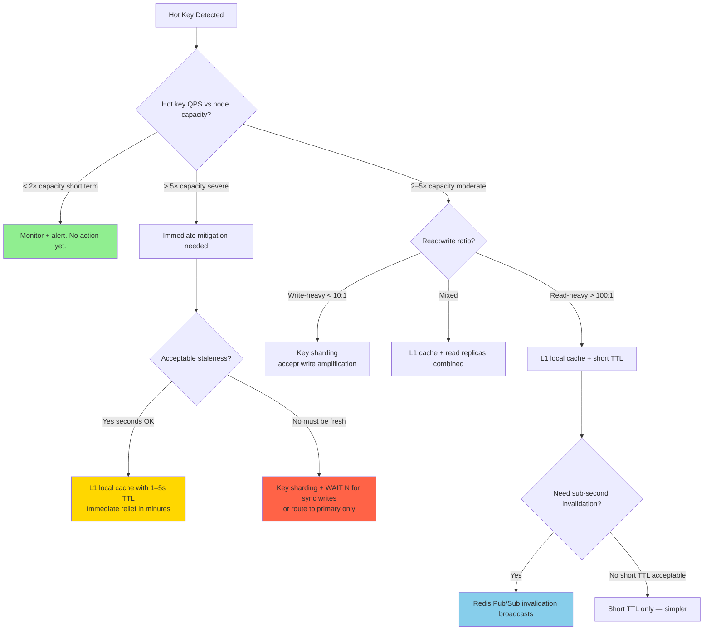

# Hot Key Problem: Detection, Local Caching, and Read Replica Strategies

## 🗺️ Quick Overview



*A single Redis node receives all traffic for a popular key while other nodes sit idle; the fix is an L1 in-process cache on each app server so the hot key is served locally without hitting Redis.*

**One Redis node getting 400,000 GET requests per second for a single key while the other 29 nodes sit idle at 5,000 req/sec each — that's the hot key problem. It's invisible until it causes a node-level bottleneck, and the usual distributed-systems solutions (add nodes, consistent hashing) make it worse.**

---

## The Problem Class `[Mid]`

Social media platform. 30-node Redis Cluster. A celebrity account with 50M followers posts a photo. For the next 15 minutes, 800K users/second are fetching that user's profile, post metadata, and follower count.

Consistent hashing maps `user:celebrity:profile` to Node 7. Node 7 now receives `800K × 3 keys = 2.4M` GET requests per second. Node 7's single-threaded event loop processes ~200K ops/sec maximum. Node 7 is saturated at `2.4M / 200K = 12×` over capacity.

Result: Node 7 latency climbs from 0.5ms to 50ms. Client timeouts begin. The social feed for all users whose other keys happen to live on Node 7 also degrades — not just the celebrity's followers.



The fundamental problem: consistent hashing distributes keys uniformly across nodes, but traffic is never uniform. One key can account for 80% of a node's traffic.

---

## Why the Obvious Solution Fails `[Senior]`

**"Add more Redis nodes"**: Consistent hashing will still map `user:celebrity:profile` to exactly one node. Adding nodes doesn't help — the hot key follows to whatever node the hash ring assigns it to. You've added cost with no benefit for the hot key.

**"Use a different hash function"**: You can change which node the key maps to, but it still maps to exactly one node. The bottleneck moves; it doesn't disappear.

**"Increase Redis thread count"**: Redis 7.x with `io-threads=4` improves I/O throughput but the command execution loop is still single-threaded per shard. Command-heavy workloads (GET/SET) don't benefit from I/O threading.

**"Set a short TTL to force rotation"**: Doesn't help — the key is read-heavy, not stale. Expiring it more often causes cache misses + DB stampede. Worse, not better.

**"Route reads to replicas"**: Replicas are on different nodes — distributed the read load across the primary and its replicas. This is actually the right direction, but the replica still can't be on a different hash slot. Two replicas × 200K ops/sec each gives 600K total capacity for the hot key. Still not enough for 2.4M ops/sec.

The real solution requires changing what is cached — not where it's cached.

---

## The Solution Landscape `[Senior]`

### Solution 1: Local L1 Cache on Application Servers

**What it is**: Cache the hot key's value in-process (L1) on each application server. Reads are served from local memory, never reaching Redis. The hot key is served at RAM speed from within the JVM/process.

**How it actually works at depth**:



The key insight: with L1 cache TTL of 1 second and 100 app servers, Redis Node 7 sees at most `100 servers × (1 miss per second per server) = 100 req/sec` instead of 800K req/sec.

**Sizing guidance** `[Staff+]`:

L1 cache sizing:
```
L1 memory per app server = hot_key_count × avg_value_size × overhead_factor

Conservative estimate for celebrity profile scenario:
- Top 1,000 hot users actively being cached in L1
- avg profile size: 2KB
- Caffeine overhead: ~50 bytes per entry
- 1,000 × (2,048 + 50) = ~2MB per app server

This is negligible. In practice, scope L1 to:
- Top-N keys by access frequency (N = 10K typically)
- Max L1 memory = 500MB per app server
- At 2KB per value: 256,000 hot keys in L1
```

L1 TTL selection:
```
L1 TTL determines staleness window.
Hot key reads: L1 TTL = 1–5 seconds (fresh enough for social content)
Inventory counts: L1 TTL = 0 (no L1 — must always read from Redis for correctness)
Configuration values: L1 TTL = 60 seconds (changes infrequently)

Write-through invalidation (ideal for correctness):
On write to Redis, broadcast invalidation message to all app servers.
App servers clear their L1 entry.
Redis Pub/Sub is the standard mechanism.
```

**The non-obvious problem: L1 cache invalidation coordination** `[Staff+]`:

When the celebrity updates their profile, you need to invalidate `user:celebrity:profile` from L1 on all 100 app servers. Options:

1. **Redis Pub/Sub broadcast**: `PUBLISH invalidation_channel "user:celebrity:profile"`. All app servers subscribe and clear local L1 on message.
   - Risk: if an app server's subscriber drops briefly (network hiccup), it misses the invalidation and serves stale until L1 TTL expires.
   - Mitigation: Keep L1 TTL short (5s). L1 is a temporary buffer, not a source of truth.

2. **Short TTL + no invalidation**: Set L1 TTL = 2s. Accept up to 2s of L1 staleness. No coordination needed.
   - Acceptable for social content (is 2-second-stale profile acceptable? Yes for most platforms.)
   - Not acceptable for inventory or financial data.

3. **Version-based L1 keys**: Cache `user:celebrity:profile:v{N}`. On update, increment version in Redis. L1 key mismatches on next request, fetches new version.
   - Extra Redis GET per request to check version. Defeats some of the hot-key load reduction.

**Configuration decisions that matter** `[Staff+]`:
- Use Caffeine (Java) or similar with `refreshAfterWrite` (async background refresh) vs `expireAfterWrite` (hard TTL). Background refresh avoids any L1 miss latency while keeping data fresh.
- Size L1 cache by time + count eviction: `maximumSize(10_000).expireAfterWrite(2, SECONDS)`. This bounds both memory and staleness.
- Instrument L1 hit rate per key class. If hot key L1 hit rate < 90%, your TTL may be too short or your L1 is evicting too aggressively.

**Failure modes** `[Staff+]`:
- **L1 invalidation broadcast failure**: Redis Pub/Sub drops messages if a subscriber reconnects. During reconnection, the subscriber misses invalidation events. All reads from that app server serve stale L1 data until TTL expires.
- **Thundering herd on app server restart**: On deploy of 100 app servers (rolling), each server starts with empty L1. First 2 seconds after restart: all 100K req/sec from that server go to Redis until L1 warms. If deploys are simultaneous (blue/green), 10× hot key traffic hits Redis during the warm-up window.
- **Memory fragmentation**: Long-running processes with high L1 churn accumulate memory fragmentation. JVM GC pressure increases. Monitor heap usage after L1 implementation.

---

### Solution 2: Key Replication / Hot Key Sharding

**What it is**: Store multiple copies of the hot key, each with a different name (shard key). Reads are distributed across all shards. Each shard is on a different Redis node.

**How it actually works at depth**:

```
# Instead of one key:
GET user:celebrity:profile

# Use N sharded copies:
shard_id = random.randint(0, N-1)
GET user:celebrity:profile:shard{shard_id}

# All shards contain the same value.
# Consistent hashing spreads them across different nodes.

# On write:
for shard_id in range(N):
    SET user:celebrity:profile:shard{shard_id} {value}
```

With N=10 shards and consistent hashing: the hot key's 800K req/sec is distributed across 10 different Redis nodes at 80K req/sec each. All 10 are within the 200K capacity.

**Sizing guidance** `[Staff+]`:

Shard count calculation:
```
required_shards = ceil(key_qps / per_node_capacity)

At 800K req/sec for the hot key and 200K ops/sec per node:
required_shards = ceil(800K / 200K) = 4 shards (minimum)
recommended_shards = 2× required = 8 shards (headroom)

Write amplification:
write_ops = original_write_ops × N_shards
At N=8: every write to the hot key → 8 Redis SET commands
For read-heavy keys (1000:1 read:write ratio): acceptable
For write-heavy keys: reconsider (8× write amplification)
```

**Configuration decisions that matter** `[Staff+]`:
- Shard count N should be a power of 2 for uniform random distribution: N=2, 4, 8, 16.
- Use `consistent_hash(key_name)` modulo N for deterministic shard selection (read), `random` for non-deterministic reads (better distribution).
- On write: write to all N shards atomically. Use a Lua script or pipeline for efficiency:
  ```lua
  -- Lua script: update all shards atomically
  local key = KEYS[1]
  local value = ARGV[1]
  local n = tonumber(ARGV[2])
  for i=0,n-1 do
    redis.call('SET', key .. ':shard' .. i, value, 'EX', 3600)
  end
  ```

**Failure modes** `[Staff+]`:
- **Shard divergence**: Network partition causes SET to succeed on 6 of 8 shards but fail on 2. Reads from failed shards return old value. Reads from successful shards return new value. Different users see different values.
  - Mitigation: Use `WAIT N T` after write to ensure at least N shards are updated before acknowledging write.
- **Non-atomic multi-key update**: If the hot key is composite (profile + follower count + post count as separate keys, all sharded), updating all composites atomically requires a distributed transaction. Not possible in Redis Cluster without a Lua script per shard.

---

### Solution 3: Read Replicas for Hot Key Reads

**What it is**: Route reads for known hot keys to Redis replicas. Replicas can serve reads without touching the primary. In Redis Cluster, this requires explicit `READONLY` mode on the connection to a replica shard.

**How it actually works at depth**:

In Redis Cluster, by default, replicas reject reads (only primary accepts commands). To enable replica reads:
```redis
# On connection to a replica node:
READONLY
# Now GET commands are accepted
GET user:celebrity:profile  # served by replica
```

Client-side routing:
```python
def get_hot_key(key, redis_cluster_client):
    if is_hot_key(key):
        # Route to replica
        replica_connection = get_replica_for_slot(hash_slot(key))
        replica_connection.execute_command('READONLY')
        return replica_connection.get(key)
    else:
        return redis_cluster_client.get(key)  # primary
```

With replication factor RF=3 (1 primary + 2 replicas):
- Primary capacity: 200K ops/sec
- Replica 1 capacity: 200K ops/sec
- Replica 2 capacity: 200K ops/sec
- Total capacity for hot key: 600K ops/sec
- Still not enough for 2.4M ops/sec

Read replica distribution for 2.4M req/sec:
```
required_replicas = ceil(key_qps / per_node_capacity) - 1 (subtract primary)
= ceil(2,400,000 / 200,000) - 1 = 12 - 1 = 11 replicas needed

That's 12 total nodes (1 primary + 11 replicas) for ONE hot key.
Cost: 12 × Redis node = significant.
Practical limit: replica strategy alone can't scale to arbitrary traffic.
```

Combine replica reads with L1 cache for multiplicative benefit:
```
With L1 cache (5s TTL) + 12 replicas:
- L1 handles 95% of reads locally (760K of 800K req/sec)
- Remaining 5% (40K req/sec) distributed across 12 nodes
- 40K / 12 ≈ 3,300 req/sec per node
- Well within capacity with massive headroom
```

**Sizing guidance** `[Staff+]`:

Replication lag consideration:
```
Replica lag under write burst:
- Each write to primary: replication takes ~1–5ms normally
- Under heavy write load on primary: up to 100–500ms replication lag
- Hot keys are typically read-heavy. Write rate is low.
- Replication lag for hot key: < 10ms in practice.
- Acceptable staleness for social profile: yes.
- Acceptable for inventory count: no (use primary only).
```

**Failure modes** `[Staff+]`:
- **Replica promotion flaps**: If primary fails and replica promotes, the promoted replica is now the primary and must handle primary-level write traffic. If it was handling 200K read ops/sec plus now receives write traffic, it may saturate.
- **READONLY mode not persisted**: Redis `READONLY` is per-connection, not persistent. Connection pool reconnects drop READONLY mode. Ensure your client sets `READONLY` on each connection establishment.

---

## Trade-off Matrix `[Senior]` → `[Staff+]`

| Dimension | L1 Local Cache | Key Sharding | Read Replicas | No Mitigation |
|---|---|---|---|---|
| Scalability ceiling | Effectively unlimited (all reads local) | N × node_capacity | RF × node_capacity | 1 × node_capacity |
| Write amplification | Low (with pub/sub invalidation) | N× writes | RF× (existing replication) | 1× |
| Staleness risk | L1 TTL window (1–5s) | Shard divergence risk | Replication lag (~5ms) | None |
| Implementation complexity | Medium | Medium | Low | None |
| Cost | App server memory (cheap) | N× Redis nodes for hot keys | RF× Redis nodes (existing) | Node upgrade |
| Cross-instance invalidation | Required (Pub/Sub) | N/A | N/A | N/A |
| Works for write-heavy hot keys | No (invalidation overhead) | No (N× write amplification) | No | N/A |

---

## Decision Framework `[Senior]` → `[Staff+]`



---

## Production Failure Story `[Staff+]`

**The World Cup Goal Hot Key — Streaming Platform, 2022**

**Context**: Live sports streaming platform. User interaction data (reactions, comments count) cached per event in Redis. 20-node Redis Cluster. Peak traffic: 2M concurrent viewers per match.

**What happened**: A goal is scored in a World Cup final. In the next 3 seconds:
- 2M users simultaneously refresh reaction counts for the event
- `event:wc2022:reactions` maps to Node 14
- Node 14 receives `2M × 2 = 4M` GET requests in 3 seconds = 1.33M/sec
- Node 14 single-threaded capacity: ~180K ops/sec
- Node 14 saturates instantly. Latency: 0.5ms → 4,500ms

Cascading effects:
- Other keys on Node 14 also degrade (follower counts, stream URLs)
- Stream URLs failing → video player fallback to direct origin
- Origin: 10K req/sec capacity, now receiving 2M req/sec for stream URL refresh
- Origin down for 8 minutes. 2M users see buffering.

**Root cause detection failure**: Platform had hot key monitoring. The `event:wc2022:reactions` key had been monitored for 2 weeks pre-tournament. During practice (300K concurrent users), it was flagged as "hot" but below threshold (used 50% of node capacity). Threshold for action was "80% node capacity". Threshold was too conservative.

**Fix implemented during incident**:
1. Redis Pub/Sub broadcast: added `event:wc2022:reactions` to L1 "hot key bypass" list
2. L1 TTL set to 500ms for this key
3. Result: L1 absorbs 95% of traffic. Node 14 drops to 65K req/sec. Stabilized in 4 minutes.

**Long-term fix**:
1. Hot key detection threshold changed from "80% node capacity" to "30% node capacity" → proactive action before incident
2. Top 100 event keys automatically promoted to L1 cache during high-traffic events
3. Key sharding: `event:{id}:reactions:shard{0..7}` for all live events → 8 nodes hold the load, not 1

---

## Observability Playbook `[Staff+]`

**Hot key detection**:
```bash
# Redis built-in: monitor ops per key
redis-cli --hotkeys  # Requires maxmemory-policy allkeys-lfu or volatile-lfu
# Returns: top keys by frequency of access

# Redis MONITOR (dangerous in production — massive performance overhead)
redis-cli MONITOR | grep -E "GET|SET" | awk '{print $4}' | sort | uniq -c | sort -rn | head -20

# Better: Redis keyspace notifications → stream to analytics
CONFIG SET notify-keyspace-events "KEA"  # all events
# Then subscribe to __keyevent@0__:* for frequency tracking
```

**Metrics to track**:
```
# Per-node imbalance detection
redis_ops_per_second_per_node{node}            # alert if any node > 3× average
redis_ops_imbalance_ratio = max_node / avg_node  # alert if > 3.0

# Hot key specifics
hot_key_ops_per_second{key}                    # top 20 keys by ops/sec
hot_key_concentration_ratio                    # single key ops / total node ops

# L1 cache effectiveness
l1_cache_hit_rate{key_class}                   # should be > 90% for hot keys
l1_to_redis_traffic_reduction_ratio            # (before L1) / (after L1) traffic to Redis
```

**Alert thresholds**:
- Any Redis node ops/sec > 150K (75% of 200K capacity) for > 30 seconds → hot key investigation
- `hot_key_concentration_ratio` > 0.3 (single key is 30%+ of node traffic) → immediate action
- L1 hit rate for known hot key < 80% → L1 TTL too short or L1 not loaded

---

## Architectural Evolution `[Staff+]`

**2017–2020**: Hot keys discovered during incidents. Post-mortem solution: Redis replicas for reads. Primitive.

**2020–2022**: L1 in-process caches (Caffeine, Guava) adopted for hot keys. Significant traffic reduction. Invalidation via Pub/Sub became standard pattern.

**2022–2024**: Automated hot key detection with threshold-based automatic L1 promotion. Platforms like Uber, Instagram open-sourced hot key detection frameworks.

**2025–2026 patterns**:
- **Redis 8.x client-side caching**: Server-assisted client tracking (`CLIENT TRACKING`) notifies the client when a tracked key changes. Eliminates need for Pub/Sub invalidation. L1 is kept fresh by Redis itself.
- **DragonflyDB multi-threaded hot key handling**: Because DragonflyDB is multi-threaded, a single node handles 3–4M ops/sec. A single "node" can absorb the World Cup scenario without sharding or L1.
- **eBPF-based hot key monitoring**: Production monitoring at kernel level with eBPF — zero overhead detection of hot keys by intercepting network calls. Available in 2026 in observability platforms (Datadog, New Relic experimental).
- **Serverless cache platforms (Momento, Upstash)**: Abstract the hot key problem entirely. Scaling is handled by the platform. Single key can scale to millions of ops/sec without client-side complexity.
- **Intelligent key placement**: Experimental — ML models predict hot keys from access patterns and pre-shard or pre-replicate them before they become hot. Not production-ready in 2026 but being researched at major platforms.

---

## Decision Framework Checklist `[All Levels]`

- [ ] **Enable `maxmemory-policy allkeys-lfu`** or `volatile-lfu` to enable `redis-cli --hotkeys` detection.
- [ ] **Set hot key alert at 30% node capacity** — act before 80% to avoid incidents.
- [ ] **Classify hot key staleness tolerance**: Social content (1–5s OK), inventory (0s — no L1), config (60s OK).
- [ ] **Implement L1 cache for read-heavy hot keys**: Target > 90% L1 hit rate. Measure actual Redis traffic reduction.
- [ ] **Choose invalidation mechanism for L1**: Pub/Sub broadcast for near-real-time, short TTL for simplicity.
- [ ] **Test L1 invalidation failure mode**: Disconnect a subscriber. How long until it sees fresh data? Is that acceptable?
- [ ] **For write-heavy hot keys**: Key sharding (N copies) + write to all shards + WAIT for consistency.
- [ ] **Size shard count for hot keys**: `required_shards = ceil(peak_qps / node_capacity)` with 2× headroom.
- [ ] **Pre-shard known hot keys proactively**: Live events, product launches, celebrity accounts — promote to sharded form before they become incidents.
- [ ] **Evaluate DragonflyDB**: If hot key problem is chronic, single multi-threaded node may eliminate need for L1 or sharding entirely.

---
*Written by Gaurav Porwal — 10+ Year Engineer | Tech Lead | Product Owner | Business-Minded Builder*
*Last updated: 2026-03-18*
