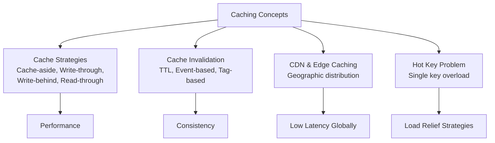

# Caching Concepts

Core theory behind caching strategies, invalidation, and CDN design.

```mermaid
graph TD
    CONCEPTS[Caching Concepts]
    CONCEPTS --> STRAT[Cache Strategies\nCache-aside, Write-through,\nWrite-behind, Read-through]
    CONCEPTS --> INV[Cache Invalidation\nTTL, Event-based, Tag-based]
    CONCEPTS --> CDN[CDN & Edge Caching\nGeographic distribution]
    CONCEPTS --> HOT[Hot Key Problem\nSingle key overload]
    STRAT --> PERF[Performance]
    INV --> CONSIST[Consistency]
    CDN --> LATENCY[Low Latency Globally]
    HOT --> RELIEF[Load Relief Strategies]
```
