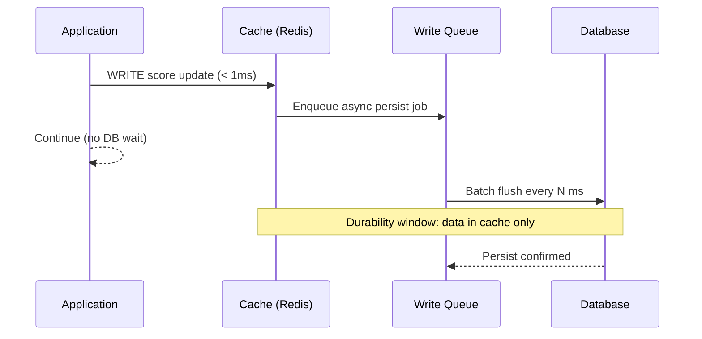
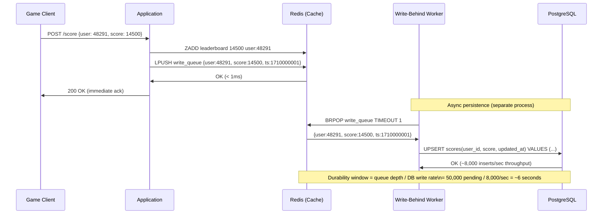
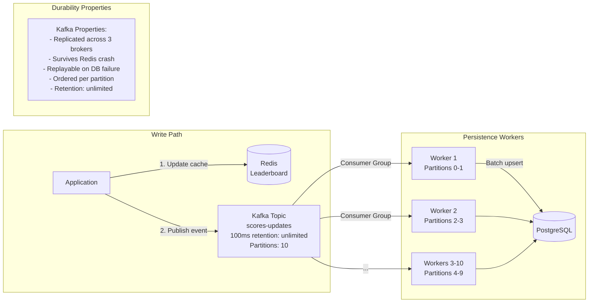
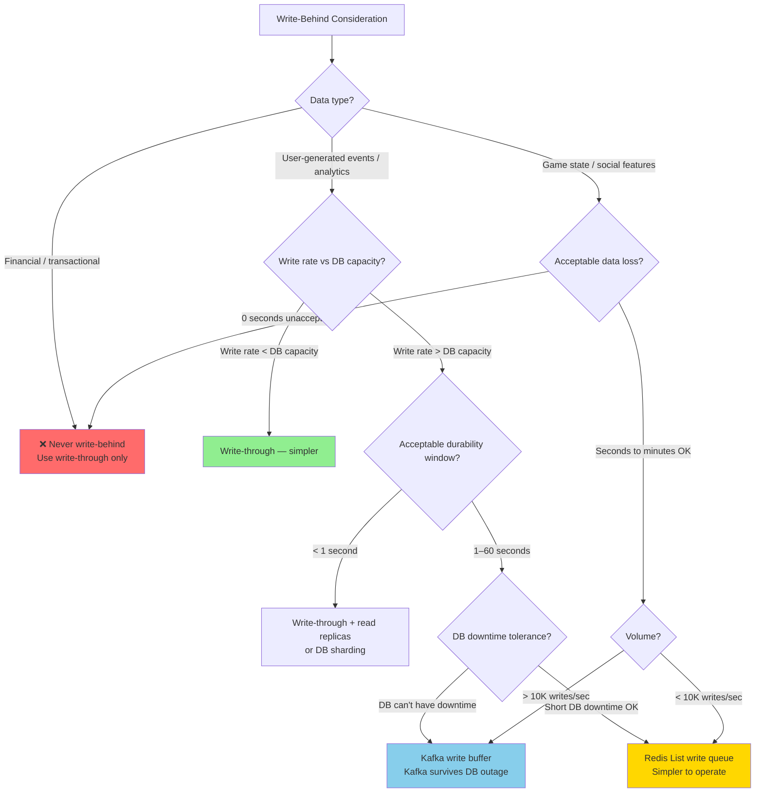

# Write-Behind Caching: Async Persistence, Durability Windows, and Failure Recovery

## 🗺️ Quick Overview



*Writes land in cache immediately for sub-millisecond latency; a background worker drains the queue into the database — but any crash before flush means data loss.*

**Write-behind caching writes to cache first and persists to the database asynchronously — giving you sub-millisecond write latency at the cost of a durability window where data lives only in cache. The failure mode is not "slow writes" — it's "data loss you didn't know was possible."**

---

## The Problem Class `[Mid]`

You're building a real-time gaming leaderboard. 50,000 score updates per second. Each update must be persisted to PostgreSQL for long-term storage. PostgreSQL handles 8,000 writes/sec at your scale.

Simple write-through: `UPDATE scores SET score=X WHERE user_id=Y` on every update.
Problem: at 50K updates/sec against 8K write capacity, you're 6× over DB capacity. Write queue backs up. Latency climbs from 5ms to 500ms. Users experience lag.

Write-behind solution:
1. Write to Redis sorted set immediately (< 1ms)
2. ACK to user immediately
3. Background worker drains Redis writes to PostgreSQL at 8K/sec
4. Score updates persist within 6–7 seconds



The durability window is the gap between the user receiving ACK and the data being durably committed to the database. In this example: up to 6 seconds of accepted writes are at risk if Redis crashes.

> 💡 **What this means in practice:** If the game server crashes during those 6 seconds, any score updates in the Redis queue that haven't been flushed to PostgreSQL are lost. The player's score reverts to what was last persisted. For a leaderboard, this means a player could replay a level and need to re-earn those 6 seconds of points. For a financial transaction, this would be unacceptable.

---

## Why the Obvious Solution Fails `[Senior]`

**"Just write directly to the database on every request"**: At 50K writes/sec vs 8K DB capacity, the queue grows unboundedly. Back-pressure will either slow game clients to 8K/sec max or drop 42K writes/sec. Neither acceptable.

**"Scale the database with more replicas"**: Replicas handle reads, not writes. Write throughput is bounded by the primary. Sharding the DB helps but adds operational complexity. Even with 10 DB shards, each handling 8K/sec = 80K/sec total — you're just pushing the ceiling up, not changing the architecture.

**"Use batch writes to the DB"**: Batching reduces round-trips but doesn't reduce total write volume. At 50K/sec, even batched, your DB must commit 50K rows/sec. The I/O bottleneck remains.

**"Enable Redis AOF persistence (write to disk first)"**: Redis AOF persists to disk on the cache node before ACK. Better than nothing, but still a single point of failure (if the Redis node and disk are both lost), and doesn't solve the "get data into PostgreSQL" requirement.

---

## The Solution Landscape `[Senior]`

### Solution 1: Redis Write Queue + Async Worker

**What it is**: Redis acts as the durable(ish) write buffer. Writes go to Redis LPUSH/ZADD. A pool of worker processes drains the write queue into the database at a controlled rate.

**How it actually works at depth**:

```python
# Write path (in application):
def record_score(user_id: int, score: int) -> None:
    pipe = redis.pipeline()
    # Update leaderboard in real-time
    pipe.zadd("leaderboard:global", {f"user:{user_id}": score})
    # Queue for persistence
    pipe.lpush("write_queue:scores", json.dumps({
        "user_id": user_id,
        "score": score,
        "timestamp": time.time()
    }))
    pipe.execute()  # atomic pipeline — both succeed or both fail

# Write-behind worker (separate process, N instances):
def persistence_worker():
    while True:
        # BRPOP: block until item available, timeout 1s
        item = redis.brpop("write_queue:scores", timeout=1)
        if not item:
            continue

        data = json.loads(item[1])

        # Batch: collect up to 100 items before DB write
        batch = [data]
        while len(batch) < 100:
            item = redis.rpop("write_queue:scores")
            if not item:
                break
            batch.append(json.loads(item))

        # Bulk upsert to PostgreSQL
        db.execute_many(
            """INSERT INTO scores (user_id, score, updated_at)
               VALUES %s
               ON CONFLICT (user_id) DO UPDATE SET
               score = GREATEST(scores.score, EXCLUDED.score),
               updated_at = EXCLUDED.updated_at""",
            [(r["user_id"], r["score"], r["timestamp"]) for r in batch]
        )
```

> 💡 **What this means in practice:** The `ON CONFLICT DO UPDATE SET score = GREATEST(...)` is critical here. Because writes can be reordered in the queue (a later high score might be processed before an earlier lower score due to batching), you want the database to always keep the highest score, not blindly overwrite with whatever arrives last. For other use cases, ordering may require including a timestamp in the `ON CONFLICT` clause.

**Sizing guidance** `[Staff+]`:

Queue depth and durability window:
```
write_rate = 50,000 writes/sec
persistence_rate = 8,000 writes/sec (per worker × N workers)
queue_growth_rate = write_rate - persistence_rate = 42,000 items/sec (if 1 worker)

With N workers:
worker_throughput = 8,000 items/sec per worker (limited by DB)
N_required = ceil(write_rate / worker_throughput) = ceil(50K / 8K) = 7 workers

At N=7 workers:
total_persistence_rate = 56,000/sec
queue depth stabilizes: write_rate - persistence_rate = 50K - 56K = -6K (draining)
steady-state queue depth ≈ 0 (consumption > production)

Durability window calculation at steady state:
If all 7 workers die simultaneously:
queue_accumulation_rate = 50,000/sec
Redis memory for queue = 50,000 items/sec × avg_item_size × durability_window_seconds
At 200 bytes/item and 60s durability window:
= 50,000 × 200 × 60 = 600MB of queue data at risk

Redis capacity check: 600MB << typical 25GB node. Acceptable.
```

**Configuration decisions that matter** `[Staff+]`:
- Use `RPOPLPUSH write_queue:scores processing:scores` for at-least-once delivery: atomically moves the item to a "processing" list. If worker crashes, items remain in `processing:scores` and a recovery job can rescue them.
- Set a max queue depth alert: if `LLEN write_queue:scores > 500K`, workers are falling behind — scale up workers or throttle writes.
- Worker idempotency: DB upsert must be idempotent. If a worker crashes after writing to DB but before removing from queue, the item is retried. Duplicate DB writes must be handled (use `ON CONFLICT DO UPDATE` or check-and-skip logic).

**Failure modes** `[Staff+]`:
- **Redis node crash with queue data**: If Redis crashes, all queued writes (not yet persisted to DB) are lost unless:
  - Redis AOF persistence is enabled (fsync=always: survives crash, 2–5× slower writes)
  - Redis persistence is to replicated Redis (Redis Cluster or Sentinel with replica)
  - Queue is backed by a durable queue (Kafka) rather than Redis list
- **Ordering violations in async writes**: Score update at T=100ms (score=500) queued before score update at T=200ms (score=550). Worker processes them out of order: DB receives 550 first, then 500. Overwrite with lower score. Mitigation: include timestamp + use GREATEST in upsert, or process per-user queues in order.

---

### Solution 2: Kafka as Durable Write Buffer

**What it is**: Replace the Redis queue with Apache Kafka. Kafka provides ordered, durable, replayable write buffering. The write-behind pattern becomes: write to cache (Redis) + publish to Kafka topic. Workers consume Kafka, persist to DB.

**How it actually works at depth**:



Kafka vs Redis queue durability comparison:
```
Redis List:
- Durability: Memory only (unless AOF enabled)
- Replication: Only with Redis Cluster/Sentinel
- Replay: No — once consumed, gone
- Ordering: Per-list, FIFO
- Throughput: 100K+ items/sec

Kafka:
- Durability: Disk + 3-way replication (default)
- Replication: Built-in, topic-level replication factor
- Replay: Yes — can replay from any offset
- Ordering: Per-partition, strict
- Throughput: 1M+ messages/sec
```

> 💡 **What this means in practice:** With Kafka, if your PostgreSQL DB goes down for 30 minutes, the writes don't pile up and crash Redis — they accumulate in Kafka (which has essentially unlimited storage relative to your write rate). When the DB comes back, workers replay from where they left off. With a Redis list, DB downtime means writes accumulate in memory, and if you exceed Redis memory limits, you start losing data.

**Sizing guidance** `[Staff+]`:

Kafka partition count for write throughput:
```
Kafka partition throughput ≈ 50–100 MB/sec per partition (depends on message size, compression)
At 200 bytes/message and 50K messages/sec:
= 200 × 50,000 = 10 MB/sec total

Single partition handles this easily.
But: consumer parallelism is limited to partition count.
For 7 workers processing in parallel: min 7 partitions.
Recommended: 10 partitions (allows scaling to 10 workers).

Kafka retention for durability window:
At 50K messages/sec × 200 bytes = 10 MB/sec
For 24h retention: 10 MB/sec × 86,400 sec = 864 GB
Size Kafka cluster accordingly.
```

**Failure modes** `[Staff+]`:
- **Consumer lag during DB slowness**: If DB slows from 8K to 2K writes/sec (due to load or incident), consumer lag grows. Kafka retains messages so no data loss, but freshness of DB diverges from cache. Monitor consumer group lag as a freshness SLI.
- **Kafka producer failure**: If the application can't publish to Kafka (Kafka broker down), writes to Redis succeed but no persistence event is generated. Implement a reconciliation job: periodically compare Redis state to DB and backfill missing writes.
- **Duplicate message delivery**: Kafka at-least-once semantics means a message may be delivered twice (producer retry after timeout where broker received but didn't ACK). Your DB upsert must be idempotent. Use `ON CONFLICT` in PostgreSQL.

---

### Solution 3: Configurable Durability Windows

**What it is**: Tune the write-behind persistence interval based on data criticality. Some data can tolerate a 10-second durability window; some requires < 1 second.

**How it actually works at depth**:

Different data classes need different durability guarantees:

```
Data Class             | Acceptable Durability Window | Strategy
-----------------------|------------------------------|----------------------------------
User session data      | 5 minutes                    | Redis AOF + write-behind 5min
Game scores            | 60 seconds                   | Redis + Kafka + worker 60s batch
Product views count    | 1 hour                       | Periodic snapshot only
Financial transactions | 0 seconds                    | Write-through ONLY — never write-behind
User profile updates   | 30 seconds                   | Redis + CDC-based sync
Clickstream events     | 24 hours                     | Redis + Kafka long-retention
```

> 💡 **What this means in practice:** "Durability window" is not the time from write to disk flush — it's the time window during which accepted writes are at risk of total loss if the cache crashes. For financial transactions, this window must be zero — meaning you cannot use write-behind at all. Every transaction must be synchronously committed to a durable store before ACKing the client.

**Configuration decisions that matter** `[Staff+]`:

Redis AOF fsync modes (affects Redis's own durability, not write-behind):
```
appendfsync always:   Write + fsync on every command. Safest. 2–10× slower.
appendfsync everysec: Write always, fsync once per second. Lose max 1s of data.
appendfsync no:       Write always, OS decides fsync. Fastest. May lose seconds.
```

Combining Redis AOF with write-behind:
```
# For 60-second acceptable durability window:
appendfsync everysec  # Redis survives crash with max 1s loss
write_behind_worker:
    batch_size: 100
    flush_interval_seconds: 5  # flush every 5 seconds
    max_queue_depth: 300_000   # alert if exceeded

# Effective durability:
# Redis AOF: 1s loss on Redis crash
# Write-behind: 5s loss on worker failure (queue still in Redis)
# Combined: 6s maximum data loss window
```

---

## Trade-off Matrix `[Senior]` → `[Staff+]`

| Dimension | Write-Through | Write-Behind (Redis Queue) | Write-Behind (Kafka) |
|---|---|---|---|
| Write latency | DB latency (5–50ms) | Cache latency (< 1ms) | Cache latency (< 1ms) |
| Max write throughput | DB capacity (8K/sec) | Cache capacity (100K+/sec) | Cache capacity (100K+/sec) |
| Durability | Immediate (DB committed) | Queue depth / persistence rate | Kafka retention period |
| Data loss on cache crash | None | Queue content lost (unless AOF/replica) | None (Kafka is durable) |
| Ordering guarantee | Strict (single writer) | Per-queue FIFO | Per-partition FIFO |
| Operational complexity | Low | Medium | High |
| Read freshness | Always fresh | Always fresh (read from cache) | Always fresh (read from cache) |
| DB down handling | Writes fail | Writes succeed (queue accumulates) | Writes succeed (Kafka buffers) |
| Write amplification on retry | None | Possible (on worker restart) | Possible (at-least-once) |

---

## Decision Framework `[Senior]` → `[Staff+]`



---

## Production Failure Story `[Staff+]`

**The Lost Purchases — Flash Sale Platform, 2023**

**Context**: Flash sale platform. Order creation flow: `POST /orders → write to Redis → ACK → async write to PostgreSQL`. Redis List as write queue. Workers drain queue to PostgreSQL at 5,000 orders/sec.

**Peak load**: 2022 Black Friday, 28,000 orders/sec sustained for 90 minutes.

**Configuration**: Redis single node, no AOF, no replication (cost-cutting decision). Workers: 6 processes.

**What happened**:
- 28K orders/sec arriving
- Worker throughput: 6 × 5K = 30K/sec — just barely keeping up
- T+47 minutes: Redis node OOM (queue backlog accumulated due to occasional worker pauses during DB batching)
- Redis OOM triggers LRU eviction — starts evicting old queue items to free memory
- 14,000 orders in queue are evicted (data lost)
- T+48 minutes: Redis crashes. All in-memory queue (current backlog: 180,000 orders) lost.
- Workers restart. Queue empty. DB has gaps.
- Orders taken in those 90 minutes: some persisted, some lost.

**Discovery**: Customer service calls starting 3 hours later. "I got charged but my order isn't in my account." Finance reconciliation at T+24h: 14,800 orders in payment system not in order database.

**Root cause analysis**:
1. No Redis persistence (AOF/RDB disabled for performance)
2. No Redis replication (cost saving)
3. No queue depth alarm
4. Write-behind used for financial transactions (orders) — fundamentally wrong

**Remediation**:
1. Order creation flow changed to write-through: `INSERT INTO orders ... → ACK`. Queue-based async abandoned for orders.
2. For inventory decrement (can tolerate short window): Kafka-based write-behind with 3× replication
3. Redis cluster with AOF `everysec` for all remaining write-behind queues
4. Queue depth alarm: `LLEN write_queue > 100K → PagerDuty`

**Lesson**: Write-behind is categorically wrong for financial transactions. The durability window is a business risk. Quantify it explicitly ("up to 60 seconds of data loss acceptable") and get stakeholder sign-off before implementing.

---

## Observability Playbook `[Staff+]`

**Key metrics**:
```
# Queue health
write_queue_depth{queue_name}                  # alert if > max_acceptable_depth
write_queue_growth_rate{queue_name}            # positive = workers can't keep up
write_behind_lag_seconds{queue_name}           # age of oldest item in queue

# Worker metrics
worker_processing_rate{worker_id}              # items/sec per worker
worker_db_write_latency_p99{worker_id}         # if high, DB is bottleneck
worker_error_rate{worker_id, error_type}       # DB errors, serialization errors

# Durability metrics
durability_window_seconds = write_queue_depth / worker_throughput
data_at_risk_bytes = write_queue_depth × avg_item_size_bytes

# DB sync status
db_last_write_timestamp_lag                    # time since last successful DB write
db_sync_freshness_p99                          # how fresh is DB vs cache
```

**Alert thresholds**:
- `write_queue_depth > 10 × (write_rate / persistence_rate)` → workers falling behind, scale up
- `durability_window_seconds > sla_durability_window` → immediate alert
- `worker_error_rate > 0.1%` for 5 minutes → DB issue, investigate
- `data_at_risk_bytes > 500MB` → critical (approaching Redis memory limits)

---

## Architectural Evolution `[Staff+]`

**2016–2020**: Write-behind via Redis List was common in gaming and analytics. Many incidents due to lack of AOF and no Redis replication. Teams learned the hard way.

**2020–2022**: Kafka adoption as write buffer made write-behind more reliable. Kafka's durability story is fundamentally better than Redis for queuing. Pattern: Redis for low-latency reads + Kafka for durable event stream → DB.

**2022–2024**: Outbox pattern as a safer alternative. Instead of write-behind, use a transactional outbox: write to DB and outbox table in the same transaction. CDC reads outbox and propagates. No durability window because data is in DB from the start.

**2025–2026 patterns**:
- **AWS MemoryDB for Redis**: Redis-compatible service with strong consistency (multi-AZ transaction log). Survives any single node failure with zero data loss. Write-behind with MemoryDB as queue has near-DB-level durability.
- **Neon + Kafka**: Serverless Postgres (Neon) can absorb 50K+ writes/sec with auto-scaling. In some cases, write-through to serverless DB is now feasible where it wasn't before.
- **TigerBeetle for financial writes**: Purpose-built financial transaction database designed for millions of transactions per second with full ACID compliance. Makes write-through feasible for high-volume financial workloads without the durability compromise of write-behind.
- **CRDT-based write-behind**: Conflict-free Replicated Data Types enable write-behind without ordering concerns — writes commute regardless of order. Used in collaborative editing and distributed game state.

---

## Decision Framework Checklist `[All Levels]`

- [ ] **Never use write-behind for financial transactions or orders** — use write-through or outbox pattern.
- [ ] **Explicitly define and document the durability window** for each data class. Get stakeholder sign-off.
- [ ] **Calculate durability window** = queue_depth / persistence_rate. Know this number at all times.
- [ ] **Enable Redis persistence** for write queues: AOF `everysec` minimum.
- [ ] **Use Redis Cluster or Sentinel** for write queues — single Redis node is a single point of failure.
- [ ] **Prefer Kafka over Redis List** for write queues when DB downtime tolerance is low.
- [ ] **Implement dead-letter queue** for failed persistence operations. Don't silently drop writes.
- [ ] **Make DB writes idempotent**: `ON CONFLICT DO UPDATE` or equivalent. Workers will retry.
- [ ] **Monitor queue depth continuously** — set alert at 50% of max acceptable depth for early warning.
- [ ] **Test "DB goes down for 10 minutes"**: Does your queue handle the backlog without data loss? Does it recover without duplication?

---
*Written by Gaurav Porwal — 10+ Year Engineer | Tech Lead | Product Owner | Business-Minded Builder*
*Last updated: 2026-03-18*
