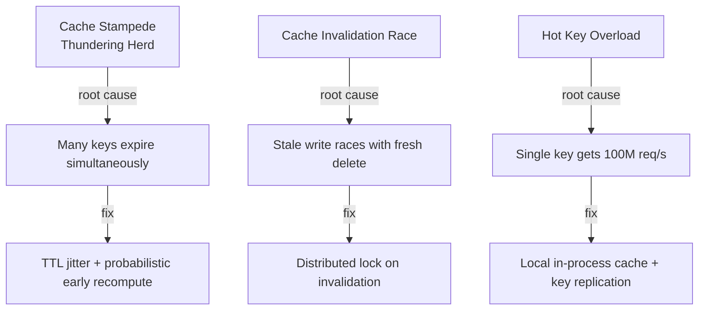

# Caching Failure Modes

Real caching failures — cache invalidation races, stampedes, and hot keys.

```mermaid
graph TD
    STAMP[Cache Stampede\nThundering Herd] -->|root cause| EXP[Many keys expire simultaneously]
    EXP -->|fix| JITTER[TTL jitter + probabilistic early recompute]
    RACE[Cache Invalidation Race] -->|root cause| STALE[Stale write races with fresh delete]
    STALE -->|fix| LOCK[Distributed lock on invalidation]
    HOTKEY[Hot Key Overload] -->|root cause| CELEB[Single key gets 100M req/s]
    CELEB -->|fix| REPLICATE[Local in-process cache + key replication]
```
