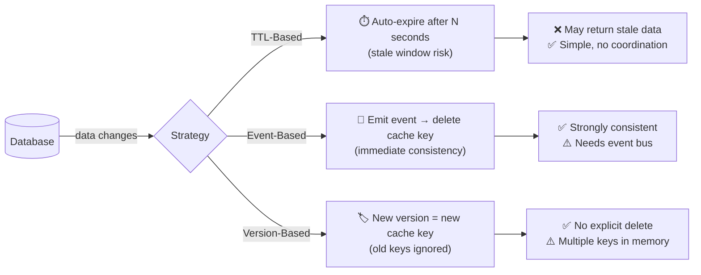

# POC #63: Cache Invalidation Strategies

> **Difficulty:** 🟡 Intermediate
> **Time:** 25 minutes
> **Prerequisites:** Cache-aside pattern, Redis basics

## 🗺️ Quick Overview



*Three strategies for answering "when should the cache stop trusting its data?" — each trades consistency for simplicity differently.*

## What You'll Learn

"There are only two hard things in Computer Science: cache invalidation and naming things." - Phil Karlton

This POC explores the three main cache invalidation strategies:

```
1. TIME-TO-LIVE (TTL) - Automatic expiration
   ┌─────────┐    5 min TTL    ┌─────────┐
   │  Cache  │ ───────────────▶│ Expired │
   └─────────┘                 └─────────┘

2. EVENT-BASED - Invalidate on data change
   ┌──────────┐    Update    ┌─────────┐
   │ Database │ ────────────▶│ Delete  │
   └──────────┘              │  Cache  │
                             └─────────┘

3. VERSION-BASED - Include version in cache key
   ┌─────────────────────┐
   │ product:123:v1 ───▶ stale (ignored)  │
   │ product:123:v2 ───▶ current (used)   │
   └─────────────────────┘
```

---

## Docker Compose Setup

```yaml
# docker-compose.yml
version: '3.8'
services:
  redis:
    image: redis:7-alpine
    ports:
      - "6379:6379"

  postgres:
    image: postgres:15-alpine
    ports:
      - "5432:5432"
    environment:
      POSTGRES_USER: demo
      POSTGRES_PASSWORD: demo
      POSTGRES_DB: demo
    volumes:
      - ./init.sql:/docker-entrypoint-initdb.d/init.sql
```

```sql
-- init.sql
CREATE TABLE products (
    id SERIAL PRIMARY KEY,
    name VARCHAR(255),
    price DECIMAL(10,2),
    version INT DEFAULT 1,
    updated_at TIMESTAMP DEFAULT CURRENT_TIMESTAMP
);

INSERT INTO products (name, price) VALUES
    ('Laptop', 999.99),
    ('Phone', 599.99),
    ('Tablet', 399.99);
```

---

## Implementation

```javascript
// cache-invalidation.js
const Redis = require('ioredis');
const { Pool } = require('pg');
const { EventEmitter } = require('events');

const redis = new Redis({ host: 'localhost', port: 6379 });
const pool = new Pool({
  host: 'localhost',
  port: 5432,
  user: 'demo',
  password: 'demo',
  database: 'demo'
});

// Event bus for invalidation events
const eventBus = new EventEmitter();

// ==========================================
// STRATEGY 1: TTL-BASED INVALIDATION
// ==========================================

class TTLCache {
  constructor(prefix, ttl = 300) {
    this.prefix = prefix;
    this.ttl = ttl; // Default 5 minutes
  }

  async get(key) {
    const cacheKey = `${this.prefix}:${key}`;
    const cached = await redis.get(cacheKey);

    if (cached) {
      const ttl = await redis.ttl(cacheKey);
      console.log(`✅ TTL CACHE HIT: ${key} (${ttl}s remaining)`);
      return JSON.parse(cached);
    }

    console.log(`❌ TTL CACHE MISS: ${key}`);
    return null;
  }

  async set(key, data) {
    const cacheKey = `${this.prefix}:${key}`;
    // Add jitter to prevent cache stampede
    const jitter = Math.floor(Math.random() * 30);
    await redis.setex(cacheKey, this.ttl + jitter, JSON.stringify(data));
    console.log(`📝 TTL CACHED: ${key} for ${this.ttl + jitter}s`);
  }

  // No explicit invalidation - relies on TTL
}

// ==========================================
// STRATEGY 2: EVENT-BASED INVALIDATION
// ==========================================

class EventBasedCache {
  constructor(prefix) {
    this.prefix = prefix;
    this.setupEventListeners();
  }

  setupEventListeners() {
    // Listen for invalidation events
    eventBus.on('product:updated', async (productId) => {
      await this.invalidate(productId);
    });

    eventBus.on('product:deleted', async (productId) => {
      await this.invalidate(productId);
    });

    // Pattern-based invalidation
    eventBus.on('category:updated', async (categoryId) => {
      await this.invalidatePattern(`*:category:${categoryId}:*`);
    });
  }

  async get(key) {
    const cacheKey = `${this.prefix}:${key}`;
    const cached = await redis.get(cacheKey);

    if (cached) {
      console.log(`✅ EVENT CACHE HIT: ${key}`);
      return JSON.parse(cached);
    }

    console.log(`❌ EVENT CACHE MISS: ${key}`);
    return null;
  }

  async set(key, data) {
    const cacheKey = `${this.prefix}:${key}`;
    // No TTL - relies on explicit invalidation
    await redis.set(cacheKey, JSON.stringify(data));
    console.log(`📝 EVENT CACHED: ${key} (no TTL)`);
  }

  async invalidate(key) {
    const cacheKey = `${this.prefix}:${key}`;
    const deleted = await redis.del(cacheKey);
    console.log(`🗑️ INVALIDATED: ${key} (deleted: ${deleted})`);
  }

  async invalidatePattern(pattern) {
    const keys = await redis.keys(pattern);
    if (keys.length > 0) {
      const deleted = await redis.del(...keys);
      console.log(`🗑️ PATTERN INVALIDATED: ${pattern} (deleted: ${deleted})`);
    }
  }
}

// ==========================================
// STRATEGY 3: VERSION-BASED INVALIDATION
// ==========================================

class VersionedCache {
  constructor(prefix) {
    this.prefix = prefix;
  }

  getCacheKey(key, version) {
    return `${this.prefix}:${key}:v${version}`;
  }

  async get(key, version) {
    const cacheKey = this.getCacheKey(key, version);
    const cached = await redis.get(cacheKey);

    if (cached) {
      console.log(`✅ VERSION CACHE HIT: ${key} v${version}`);
      return JSON.parse(cached);
    }

    console.log(`❌ VERSION CACHE MISS: ${key} v${version}`);
    return null;
  }

  async set(key, version, data) {
    const cacheKey = this.getCacheKey(key, version);
    // Old versions will be naturally ignored (never requested)
    await redis.setex(cacheKey, 86400, JSON.stringify(data)); // 24h TTL for cleanup
    console.log(`📝 VERSION CACHED: ${key} v${version}`);
  }

  // No explicit invalidation needed!
  // New version = new cache key
  // Old versions naturally expire
}

// ==========================================
// DATABASE OPERATIONS WITH INVALIDATION
// ==========================================

async function updateProduct(productId, updates) {
  // Update database
  const result = await pool.query(
    `UPDATE products
     SET name = COALESCE($2, name),
         price = COALESCE($3, price),
         version = version + 1,
         updated_at = NOW()
     WHERE id = $1
     RETURNING *`,
    [productId, updates.name, updates.price]
  );

  const product = result.rows[0];

  // Emit event for event-based cache
  eventBus.emit('product:updated', productId);

  console.log(`✅ DB UPDATED: Product ${productId} now at version ${product.version}`);
  return product;
}

async function getProduct(productId) {
  const result = await pool.query(
    'SELECT * FROM products WHERE id = $1',
    [productId]
  );
  return result.rows[0];
}

// ==========================================
// DEMONSTRATION
// ==========================================

async function demonstrate() {
  console.log('='.repeat(60));
  console.log('CACHE INVALIDATION STRATEGIES');
  console.log('='.repeat(60));

  await redis.flushdb();

  const ttlCache = new TTLCache('ttl:product', 10); // 10 second TTL for demo
  const eventCache = new EventBasedCache('event:product');
  const versionCache = new VersionedCache('ver:product');

  // Get initial product
  const product = await getProduct(1);
  console.log(`\n📦 Product 1: ${product.name} - $${product.price} (v${product.version})`);

  // ==========================================
  // DEMO 1: TTL-Based
  // ==========================================
  console.log('\n' + '='.repeat(60));
  console.log('STRATEGY 1: TTL-BASED');
  console.log('='.repeat(60));

  // Cache the product
  await ttlCache.set(1, product);

  // Read from cache (hit)
  await ttlCache.get(1);

  // Update the database
  console.log('\n--- Updating product in database ---');
  await updateProduct(1, { price: 899.99 });

  // Cache is now STALE but still returns old data
  console.log('\n--- Reading from TTL cache (STALE DATA!) ---');
  const staleData = await ttlCache.get(1);
  console.log(`⚠️ TTL cache shows: $${staleData.price} (STALE!)`);

  console.log('\n--- Waiting for TTL to expire (10s)... ---');
  await new Promise(resolve => setTimeout(resolve, 11000));

  // Now cache miss, fresh data
  const afterExpiry = await ttlCache.get(1);
  console.log(afterExpiry ? 'Still cached' : 'Cache expired - would fetch fresh data');

  // ==========================================
  // DEMO 2: Event-Based
  // ==========================================
  console.log('\n' + '='.repeat(60));
  console.log('STRATEGY 2: EVENT-BASED');
  console.log('='.repeat(60));

  const freshProduct = await getProduct(1);
  await eventCache.set(1, freshProduct);

  // Read from cache (hit)
  await eventCache.get(1);

  // Update the database (triggers invalidation event)
  console.log('\n--- Updating product (triggers invalidation) ---');
  await updateProduct(1, { price: 799.99 });

  // Cache was invalidated, now miss
  console.log('\n--- Reading from event cache ---');
  const afterInvalidation = await eventCache.get(1);
  console.log(afterInvalidation ? 'Still cached (bug!)' : '✅ Correctly invalidated');

  // ==========================================
  // DEMO 3: Version-Based
  // ==========================================
  console.log('\n' + '='.repeat(60));
  console.log('STRATEGY 3: VERSION-BASED');
  console.log('='.repeat(60));

  const productV3 = await getProduct(1);
  console.log(`Current version: ${productV3.version}`);

  await versionCache.set(1, productV3.version, productV3);

  // Read with correct version (hit)
  await versionCache.get(1, productV3.version);

  // Update the database (version increments)
  console.log('\n--- Updating product (version increments) ---');
  const updatedProduct = await updateProduct(1, { price: 699.99 });

  // Old version still cached but not used
  console.log('\n--- Reading with OLD version (ignored) ---');
  await versionCache.get(1, productV3.version);

  console.log('\n--- Reading with NEW version (miss until cached) ---');
  await versionCache.get(1, updatedProduct.version);

  // Cache new version
  await versionCache.set(1, updatedProduct.version, updatedProduct);
  await versionCache.get(1, updatedProduct.version);

  // ==========================================
  // SUMMARY
  // ==========================================
  console.log('\n' + '='.repeat(60));
  console.log('STRATEGY COMPARISON');
  console.log('='.repeat(60));

  console.log(`
| Strategy      | Stale Risk | Complexity | Best For                |
|---------------|------------|------------|-------------------------|
| TTL-Based     | Yes (temp) | Low        | Rarely changing data    |
| Event-Based   | No         | Medium     | Critical consistency    |
| Version-Based | No         | Medium     | High-read, low-write    |
  `);

  // Cleanup
  await redis.quit();
  await pool.end();
}

demonstrate().catch(console.error);
```

---

## Run the POC

```bash
docker-compose up -d
sleep 5
npm install ioredis pg
node cache-invalidation.js
```

---

## Expected Output

```
============================================================
CACHE INVALIDATION STRATEGIES
============================================================

📦 Product 1: Laptop - $999.99 (v1)

============================================================
STRATEGY 1: TTL-BASED
============================================================
📝 TTL CACHED: 1 for 38s
✅ TTL CACHE HIT: 1 (37s remaining)

--- Updating product in database ---
✅ DB UPDATED: Product 1 now at version 2

--- Reading from TTL cache (STALE DATA!) ---
✅ TTL CACHE HIT: 1 (35s remaining)
⚠️ TTL cache shows: $999.99 (STALE!)

--- Waiting for TTL to expire (10s)... ---
❌ TTL CACHE MISS: 1
Cache expired - would fetch fresh data

============================================================
STRATEGY 2: EVENT-BASED
============================================================
📝 EVENT CACHED: 1 (no TTL)
✅ EVENT CACHE HIT: 1

--- Updating product (triggers invalidation) ---
✅ DB UPDATED: Product 1 now at version 3
🗑️ INVALIDATED: 1 (deleted: 1)

--- Reading from event cache ---
❌ EVENT CACHE MISS: 1
✅ Correctly invalidated

============================================================
STRATEGY 3: VERSION-BASED
============================================================
Current version: 3
📝 VERSION CACHED: 1 v3
✅ VERSION CACHE HIT: 1 v3

--- Updating product (version increments) ---
✅ DB UPDATED: Product 1 now at version 4

--- Reading with OLD version (ignored) ---
✅ VERSION CACHE HIT: 1 v3

--- Reading with NEW version (miss until cached) ---
❌ VERSION CACHE MISS: 1 v4
📝 VERSION CACHED: 1 v4
✅ VERSION CACHE HIT: 1 v4
```

---

## Strategy Comparison

| Aspect | TTL | Event-Based | Version-Based |
|--------|-----|-------------|---------------|
| **Consistency** | Eventual | Strong | Strong |
| **Stale Data Risk** | Yes (bounded) | No | No |
| **Implementation** | Simple | Medium | Medium |
| **Cross-Service** | Easy | Needs pub/sub | Needs version tracking |
| **Storage** | Efficient | Efficient | Multiple versions |
| **Failure Mode** | Returns stale | Returns stale | Returns nothing |

---

## Hybrid Approach (Production)

```javascript
// Best practice: Combine TTL + Events
class HybridCache {
  async set(key, data) {
    // TTL as safety net (eventual consistency)
    await redis.setex(`cache:${key}`, 3600, JSON.stringify(data));
  }

  async invalidate(key) {
    // Event-based for immediate consistency
    await redis.del(`cache:${key}`);
  }
}

// Benefits:
// - Events provide immediate invalidation
// - TTL catches missed invalidation events
// - Belt and suspenders approach
```

---

## Related POCs

- [POC #61: Cache-Aside Pattern](/02-caching/hands-on/cache-aside-pattern)
- [POC #62: Write-Through Caching](/02-caching/hands-on/write-through-caching)
- [Stale Read After Write Problem](/problems-at-scale/consistency/stale-read-after-write)
