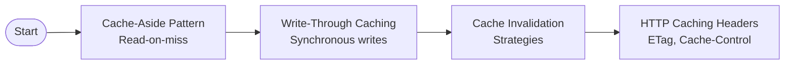

# Caching Hands-On

Practical implementations of common caching patterns.

```mermaid
graph LR
    Start([Start]) --> P1[Cache-Aside Pattern\nRead-on-miss]
    P1 --> P2[Write-Through Caching\nSynchronous writes]
    P2 --> P3[Cache Invalidation\nStrategies]
    P3 --> P4[HTTP Caching Headers\nETag, Cache-Control]
```
