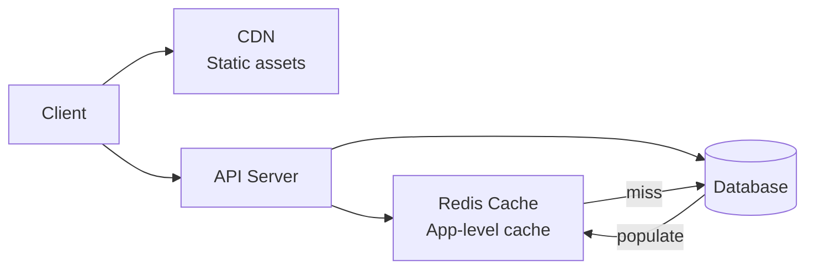

# Caching

Caching is the most impactful performance optimization you can make. Done right, it reduces database load by 90%+ and cuts response times from seconds to milliseconds.

## What You'll Learn

- **Concepts**: Cache strategies, invalidation, CDN design, stampede prevention
- **Hands-On**: Implement cache-aside, write-through, and HTTP caching patterns
- **Failure Modes**: Cache invalidation race conditions and how to avoid them

## Where to Start

1. [Caching Fundamentals](/02-caching/concepts/caching-fundamentals) — Read-through, write-through, write-behind
2. [Cache Invalidation Strategies](/02-caching/concepts/cache-invalidation-strategies) — The hardest problem in caching
3. [Cache-Aside Pattern](/02-caching/hands-on/cache-aside-pattern) — The most common pattern, implemented

## Topic Map

| Topic | Concepts | Hands-On | Problems at Scale | Interview Prep |
|-------|----------|----------|-------------------|----------------|
| Cache fundamentals | [caching-fundamentals](/02-caching/concepts/caching-fundamentals) | [cache-aside-pattern](/02-caching/hands-on/cache-aside-pattern) | [thundering-herd](/problems-at-scale/availability/thundering-herd) | [caching-strategies](/12-interview-prep/system-design/fundamentals/caching-strategies) |
| Cache strategies | [caching-strategies](/02-caching/concepts/caching-strategies) | [write-through-caching](/02-caching/hands-on/write-through-caching), [cache-aside-pattern](/02-caching/hands-on/cache-aside-pattern) | [cache-invalidation-race](/problems-at-scale/consistency/cache-invalidation-race) | [caching-strategies](/12-interview-prep/system-design/fundamentals/caching-strategies) |
| Cache invalidation | [cache-invalidation-strategies](/02-caching/concepts/cache-invalidation-strategies) | [cache-invalidation-strategies](/02-caching/hands-on/cache-invalidation-strategies) | [cache-invalidation-race](/problems-at-scale/consistency/cache-invalidation-race) | — |
| CDN & edge caching | [cdn-cache-deep-dive](/02-caching/concepts/cdn-cache-deep-dive) | — | — | [cdn-usage](/12-interview-prep/quick-reference/caching/cdn-usage) |
| Hot key problem | [hot-key-problem](/02-caching/concepts/hot-key-problem) | — | [thundering-herd](/problems-at-scale/availability/thundering-herd) | — |
