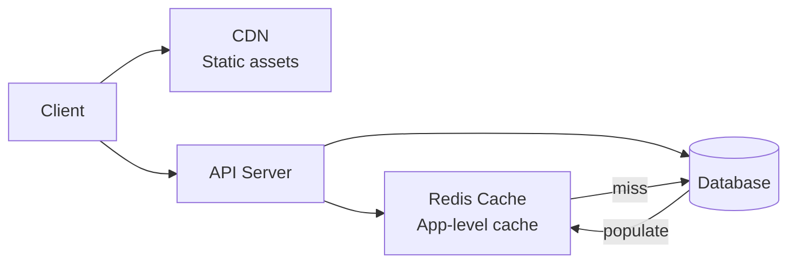

# Caching

Caching is the most impactful performance optimization you can make. Done right, it reduces database load by 90%+ and cuts response times from seconds to milliseconds.

## Navigate by Role

| I am... | Start here | Goal |
|---------|-----------|------|
| 🟢 Junior | [Caching Fundamentals](./concepts/caching-fundamentals) | Understand why and when to cache |
| 🟡 Mid-level | [Caching Strategies](./concepts/caching-strategies) | Choose the right cache strategy |
| 🔴 Senior / TL | [Cache Invalidation Strategies](./concepts/cache-invalidation-strategies) + [Failures](./failures) | Master invalidation and production failure modes |
| 🏆 Interview prepping | [Quick Reference](../../12-interview-prep/quick-reference/caching) | Ace caching questions in system design rounds |

## What You'll Learn

- **Concepts**: Cache strategies, invalidation, CDN design, stampede prevention
- **Hands-On**: Implement cache-aside, write-through, and HTTP caching patterns
- **Failure Modes**: Cache invalidation race conditions and how to avoid them

## Where to Start

1. [Caching Fundamentals](/02-caching/concepts/caching-fundamentals) — Read-through, write-through, write-behind
2. [Cache Invalidation Strategies](/02-caching/concepts/cache-invalidation-strategies) — The hardest problem in caching
3. [Cache-Aside Pattern](/02-caching/hands-on/cache-aside-pattern) — The most common pattern, implemented

## Topic Map

| Topic | 📖 Concept | 🔬 Hands-On | ⚠️ Failures |
|-------|-----------|------------|------------|
| Cache fundamentals | [caching-fundamentals](./concepts/caching-fundamentals) | [cache-aside-pattern](./hands-on/cache-aside-pattern) | — |
| Cache strategies | [caching-strategies](./concepts/caching-strategies) | [write-through-caching](./hands-on/write-through-caching), [cache-aside-pattern](./hands-on/cache-aside-pattern) | — |
| Cache invalidation | [cache-invalidation-strategies](./concepts/cache-invalidation-strategies) | [cache-invalidation-strategies](./hands-on/cache-invalidation-strategies) | [cache-invalidation-race](./failures/cache-invalidation-race) |
| Distributed caching | [distributed-cache-design](./concepts/distributed-cache-design) | — | — |
| CDN & edge caching | [cdn-cache-deep-dive](./concepts/cdn-cache-deep-dive) | — | — |
| Cache stampede | [cache-stampede-prevention](./concepts/cache-stampede-prevention) | — | — |
| Hot key problem | [hot-key-problem](./concepts/hot-key-problem) | — | — |
| Write-behind caching | [write-behind-caching](./concepts/write-behind-caching) | — | — |
| Multi-layer caching | [multi-layer-caching](./concepts/multi-layer-caching) | — | — |
| HTTP caching | — | [http-caching-headers](./hands-on/http-caching-headers) | — |
