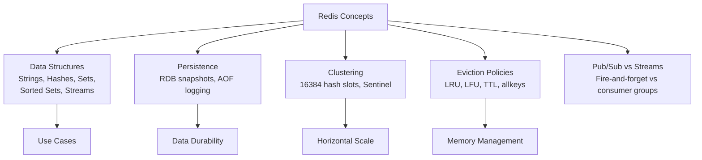

# Redis Concepts

Deep dives into Redis internals: data structures, persistence, clustering, and eviction.

```mermaid
graph TD
    CONCEPTS[Redis Concepts]
    CONCEPTS --> DS[Data Structures\nStrings, Hashes, Sets,\nSorted Sets, Streams]
    CONCEPTS --> PERSIST[Persistence\nRDB snapshots, AOF logging]
    CONCEPTS --> CLUSTER[Clustering\n16384 hash slots, Sentinel]
    CONCEPTS --> EVICT[Eviction Policies\nLRU, LFU, TTL, allkeys]
    CONCEPTS --> PUBSUB[Pub/Sub vs Streams\nFire-and-forget vs consumer groups]
    DS --> USE[Use Cases]
    PERSIST --> DURABILITY[Data Durability]
    CLUSTER --> SCALE[Horizontal Scale]
    EVICT --> MEMORY[Memory Management]
```
