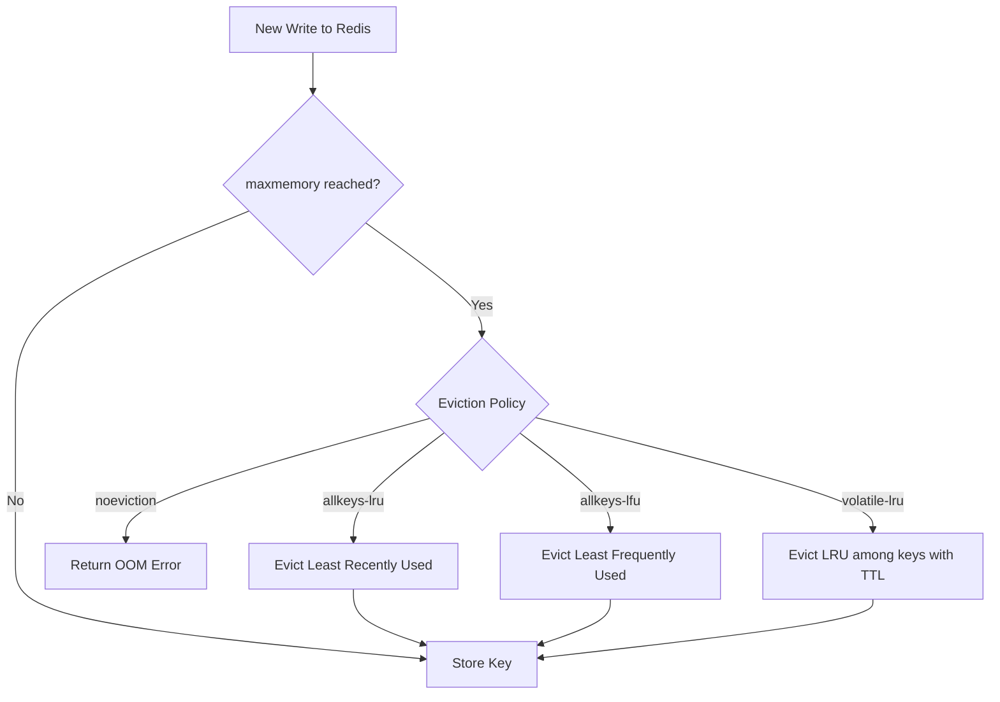
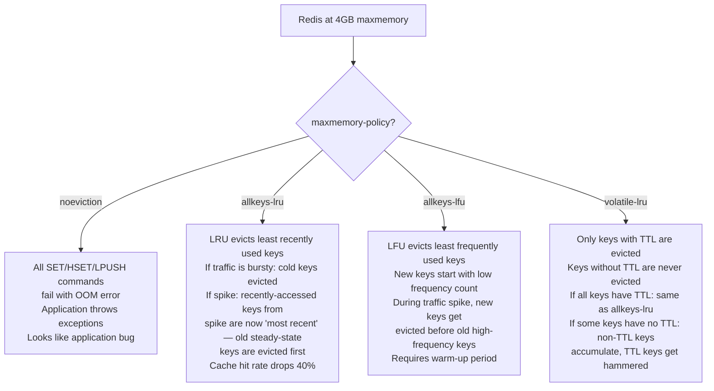
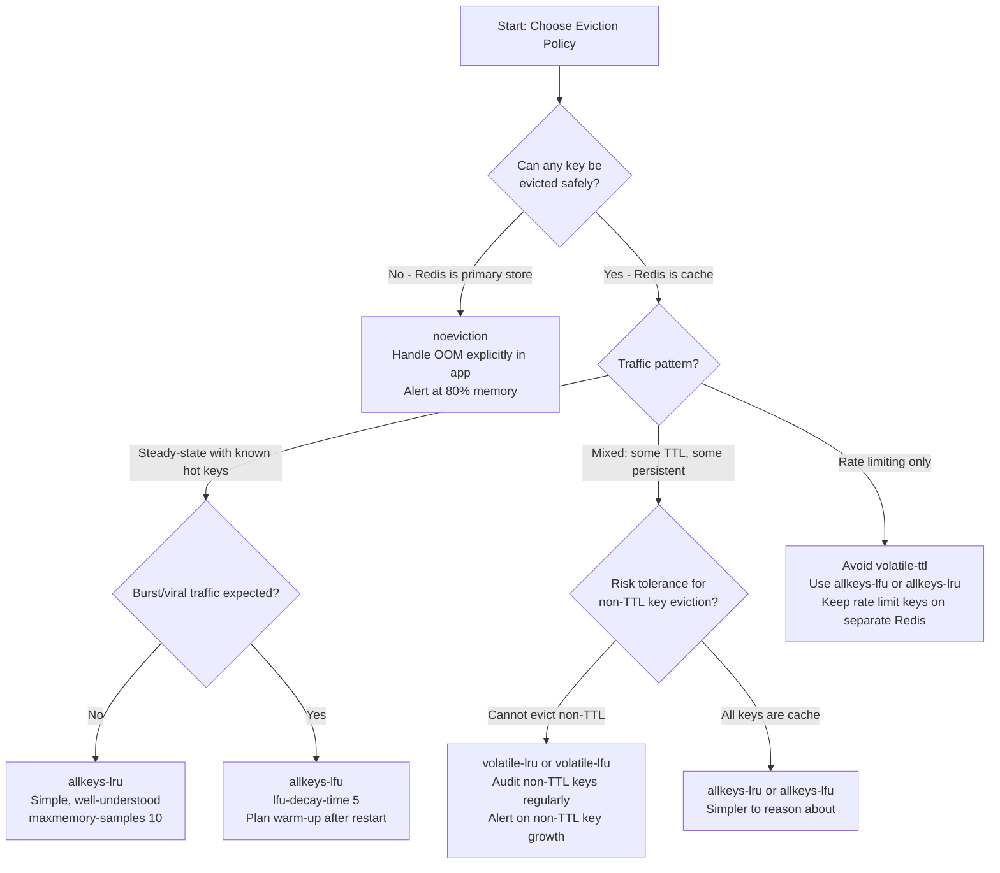

# Redis Eviction Policies: Memory Pressure, Hot Keys, and LFU vs LRU

## 🗺️ Quick Overview



*When Redis reaches its memory limit each incoming write triggers the configured eviction policy; choosing the wrong one silently discards your most-needed keys or rejects writes entirely.*

**When Redis hits `maxmemory`, it doesn't gracefully degrade — it either rejects writes or silently deletes your most important keys.** Which behavior you get depends entirely on the eviction policy, and most teams set it once without understanding the implications. LRU evicts recently-used keys during spikes (the ones you most need). LFU requires proper configuration or it behaves like random. Noeviction causes write failures that look like application bugs. The right policy is workload-specific and requires measurement to choose correctly.

---

## The Problem Class `[Mid]`

An API platform caches response data in Redis with a 5-minute TTL. `maxmemory` is set to 4GB. The platform runs fine for months, then adds a new high-traffic endpoint. Within days, memory hits 4GB.



The platform used `noeviction`. When memory hit 4GB, every write to a key with a value > available memory returned `OOM command not allowed when used memory > 'maxmemory'`. The application caught Redis connection exceptions but not OOM errors, so they appeared as unhandled 500 errors to end users.

---

## Why the Obvious Solution Fails `[Senior]`

**"Just increase maxmemory"**: Valid short-term fix, but on cloud instances you're paying for memory you may not need during off-peak hours. More importantly, it defers the policy decision until the next memory limit is reached — likely during a higher-traffic event.

**"Use allkeys-lru — it's the standard caching policy"**: LRU tracks recency, not frequency. In a workload with:
- 1000 steady-state hot keys accessed 50K times/day
- A burst of 10K new keys accessed once each during a viral event

The LRU clock shows the burst keys as "recently used" (because they were just accessed). The 1000 steady-state hot keys were last accessed seconds or minutes ago relative to the burst. LRU evicts the **steady-state hot keys** during the memory pressure caused by the burst — exactly backwards from what you want. After the burst ends, your cache is cold for the keys your regular traffic needs.

**"Use volatile-lru — only evict cache data, not persistent data"**: This only works if your schema is disciplined. If any developer accidentally stores a key without a TTL (e.g., `SET config:feature_flags "{...}"` without EX), that key is permanently in memory, never evicted, accumulating as permanent overhead. Over time, non-TTL keys fill memory, and `volatile-lru` has nothing eligible to evict except the TTL keys you actually want to keep. You get the worst of noeviction for non-TTL keys and aggressive eviction for TTL keys.

---

## The Solution Landscape `[Senior]`

### Solution 1: `noeviction` — Fail Explicitly on Memory Pressure

**What it is**: When memory hits `maxmemory`, all write commands (`SET`, `HSET`, `LPUSH`, etc.) return an OOM error. Read commands continue to work. Existing data is never deleted.

**When it wins**:
- Redis is used as a primary data store (not a cache) — you cannot afford silent data loss
- You need explicit backpressure: the application should fail loudly rather than silently degrade
- You have external capacity management: horizontal scaling or eviction of specific keys is done manually

**How it actually works at depth**: Redis checks `used_memory` against `maxmemory` before executing each write command. If `used_memory >= maxmemory`, the command fails immediately with `ERR OOM command not allowed when used memory > 'maxmemory'`. The check is per-command, not periodic — no background thread, no approximation.

**Sizing guidance** `[Staff+]`
- Memory overhead calculation: actual data + ~10% for jemalloc allocator fragmentation + ~5% for Redis internal metadata
- Set `maxmemory` to 85% of physical RAM (leave headroom for fork overhead, OS, and other processes)
- At 16GB RAM instance: `maxmemory 13gb`

**Failure modes** `[Staff+]`
- **Silent OOM in application logs**: If the application catches all Redis exceptions generically (`except RedisError`), OOM errors are swallowed. The symptom: writes stop working but reads continue; users see partial data or stale data. Always distinguish OOM errors in exception handling: `except redis.exceptions.ResponseError as e: if "OOM" in str(e): handle_oom()`
- **Replica OOM asymmetry**: If the primary has `noeviction` and the replica is a smaller instance (e.g., half the memory for cost savings), the replica evicts keys while the primary does not. Replication offset diverges. When the primary sends the key again (e.g., after expiry and re-SET), the replica accepts it — but during the divergence window, reads to the replica return different data than reads to the primary.

**Observability** `[Staff+]`
- `INFO stats` → `rejected_connections`, `evicted_keys` (should be 0 for noeviction)
- `INFO memory` → `used_memory_human` vs `maxmemory_human` — alert at 90%
- Alert: Any `OOM` error in Redis client logs — this should be a P1 incident for `noeviction` deployments

---

### Solution 2: `allkeys-lru` — LRU Eviction Across All Keys

**What it is**: When memory is full, Redis approximates LRU and evicts the least recently used key from the entire keyspace (regardless of TTL).

**How it actually works at depth**: Redis does NOT maintain a true LRU list (too expensive: O(1) update requires a doubly-linked list). Instead, it uses **probabilistic LRU**: each key stores a 24-bit LRU clock (seconds-resolution). On eviction, Redis samples `maxmemory-samples` keys (default: 5), compares their LRU timestamps, and evicts the oldest. Higher `maxmemory-samples` → better LRU approximation, more CPU overhead per eviction.

```
maxmemory-samples 5     # default; try 10 for better accuracy at moderate CPU cost
```

At `maxmemory-samples 5`: approximates top-5 oldest of random sample → good LRU approximation for most workloads
At `maxmemory-samples 10`: closer to true LRU, ~2x CPU overhead per eviction operation

**Sizing guidance** `[Staff+]`
- LRU clock overhead: 4 bytes per key (stored in the robj structure, no extra allocation)
- Eviction rate at memory pressure: typically 1K–10K evictions/sec for write-heavy workloads
- CPU overhead: with `maxmemory-samples 5`, eviction adds ~0.5μs per eviction. At 10K evictions/sec: 5ms/sec of CPU time. Negligible.

**When `allkeys-lru` wins**:
- Standard cache workload with Zipfian distribution (20% of keys serve 80% of requests)
- When all keys are cache-safe (any key can be evicted and will be re-fetched from source)
- No "sticky" keys that must survive memory pressure

**Failure modes** `[Staff+]`
- **Temporal locality attacks**: If an attacker (or a legitimate but poorly-designed feature) floods Redis with unique keys, those keys are "recently used" and fill the LRU recency window. Your long-lived hot keys get evicted. Monitor `evicted_keys` rate — a sudden spike indicates this pattern.
- **Cold start after eviction cascade**: If `allkeys-lru` evicts 50% of your hot cache during a traffic spike, when the spike ends your cache is half-empty. The subsequent traffic load hits the database with 2x normal miss rate. Design for this: implement circuit breaker on cache miss rate > threshold.

---

### Solution 3: `allkeys-lfu` — LFU Eviction Across All Keys

**What it is**: Evicts the least **frequently** used key, weighted by recency (keys with high historical frequency that haven't been used recently are down-scored).

**How it actually works at depth**: Redis LFU (added in Redis 4.0) uses a **Morris counter**: an 8-bit probabilistic frequency counter per key. The counter doesn't increment on every access — it increments with decreasing probability as the count grows (so low-count keys increment often, high-count keys increment rarely). This approximates frequency over the key's lifetime.

The counter also **decays over time**: `lfu-decay-time N` (default: 1 minute) means the counter decreases by 1 for every N minutes without access. This prevents old high-frequency keys from surviving indefinitely even if they're no longer hot.

```
lfu-log-factor 10       # how quickly frequency counter grows (default 10; higher = slower growth)
lfu-decay-time 1        # counter decay period in minutes (default 1)
```

**LFU vs LRU in the burst scenario**:
- 1000 hot keys with frequency counter ~200 (accessed many times)
- Burst of 10K new keys with frequency counter = 1 (accessed once)
- LRU: evicts hot keys (they're "older" than the burst keys by recency)
- LFU: evicts burst keys (frequency 1 vs 200)

LFU correctly handles this case — but requires the frequency counters to be accurate. New keys start with frequency 5 (configurable via `LFU_INIT_VAL`), not 0, to avoid immediate eviction of newly cached keys.

**Sizing guidance** `[Staff+]`
- LFU counter overhead: 8 bytes per key (16-bit LFU field in robj vs 24-bit LRU field — similar overhead)
- Warm-up period: LFU needs time to distinguish hot vs cold keys. Cold start (empty Redis) needs 15–30 minutes at normal traffic before frequency counters reflect actual access patterns.
- `lfu-log-factor` tuning: at 10M accesses/sec, `lfu-log-factor 10` → counter saturates at 255 quickly. Use `lfu-log-factor 100` for very high throughput to maintain discrimination between frequency levels.

**When `allkeys-lfu` wins**:
- Workloads with clear hot-key patterns (Zipfian distribution)
- Workloads with traffic spikes or viral events that shouldn't pollute the cache
- When you can afford a warm-up period after restarts (LFU needs training)

**Failure modes** `[Staff+]`
- **Cold start eviction of valid hot keys**: After Redis restart, all keys that survived via RDB/AOF have accurate LFU counters (Redis persists LFU counters). But if you restart without persistence, all counters reset to `LFU_INIT_VAL`. New writes and reads initially all have similar frequency → eviction is essentially random until frequency differentiation accumulates. Plan for this: keep LFU-enabled Redis alive longer between restarts, or pre-warm by replaying recent access logs.
- **Decay time misconfiguration**: `lfu-decay-time 0` disables decay — counters only grow, never decay. A key accessed heavily 6 months ago but now cold stays at high frequency indefinitely. Set decay time based on your "freshness" expectation: for session caches with 30-minute sessions, `lfu-decay-time 30`.

---

### Solution 4: `volatile-lru` / `volatile-lfu` — Evict Only TTL Keys

**What it is**: Only keys with an expiry (`EX`, `EXPIREAT`, `EXPIRE`) are candidates for eviction. Keys without TTL are never evicted. Uses LRU or LFU among eligible (TTL) keys.

**When it wins**:
- Mixed workload: some keys are cache (should be evictable), some keys are persistent config/metadata (must survive)
- Session storage: sessions have TTL (evictable), but feature flags or config keys don't

**Failure modes** `[Staff+]`
- **Non-TTL key accumulation**: Over time, bugs or intentional design add non-TTL keys. These accumulate, slowly consuming memory. Eventually, only TTL keys are eligible for eviction, and they get evicted aggressively. The non-TTL keys, which may represent much less value, are immune. Monitor: `DEBUG OBJECT key` → `expire_at` field; `INFO keyspace` → proportion of keys with TTL.
- **Policy ineffectiveness**: If 90% of keys are non-TTL and volatile-lru can only evict the 10% with TTL, eviction rate is limited. Memory pressure mounts faster than eviction can relieve it. You get OOM-like behavior even with an eviction policy.

---

### Solution 5: `volatile-ttl` — Evict Soonest-to-Expire Keys First

**What it is**: Among keys with TTL, evict the ones that will expire soonest (smallest remaining TTL).

**When it wins**: Workloads where keys with short remaining TTL are lowest value — e.g., short-lived rate limiting windows, temporary sessions about to expire anyway.

**Failure modes** `[Staff+]`
- **Premature eviction of valid short-TTL keys**: A rate limiting key with 30 seconds remaining is evicted before a 1-hour cache entry. The rate limiting window resets — the user gets a free quota reset. This is a security issue in rate limiting contexts. `volatile-ttl` is **dangerous for rate limiting**: any memory pressure resets rate limit counters for short-TTL windows first.

---

## Trade-off Matrix `[Senior]` → `[Staff+]`

| Policy | Eviction Candidates | Algorithm | Memory Pressure Behavior | Risk |
|---|---|---|---|---|
| `noeviction` | None | N/A | Write errors | Silent OOM if not caught |
| `allkeys-lru` | All keys | Approx LRU | Evicts least recently used | Evicts hot keys during bursts |
| `allkeys-lfu` | All keys | Approx LFU + decay | Evicts least frequently used | Cold start accuracy |
| `allkeys-random` | All keys | Random | Unpredictable | Evicts hot keys randomly |
| `volatile-lru` | TTL keys only | Approx LRU | Protects non-TTL keys | Non-TTL key accumulation |
| `volatile-lfu` | TTL keys only | Approx LFU | Protects non-TTL keys | Same + cold start |
| `volatile-random` | TTL keys only | Random | Protects non-TTL keys | Unpredictable TTL key eviction |
| `volatile-ttl` | TTL keys only | Shortest TTL first | Evicts expiring-soon keys | Evicts rate limits, short sessions |

---

## Decision Framework — When to Pick Each `[Senior]` → `[Staff+]`



---

## Production Failure Story `[Staff+]`

**The LRU eviction that deleted the hottest keys during a product launch.**

A media company pre-cached editorial content in Redis using `allkeys-lru` with `maxmemory 8gb`. Normal operation: 500K keys, 5GB used. Eviction rate: near zero.

A major product launch sent a burst of 2M unique users to 200K unique landing page URLs. The application cached each landing page's rendered HTML in Redis — 200K new keys, ~10KB each = 2GB of new data. Total memory jumped to 7GB, then hit 8GB.

Redis's LRU started evicting. The 200K new landing page keys had the most recent access timestamps (they were just created and immediately accessed). The 500K existing hot keys — API response caches for the product catalog, search results, user preference caches — were last accessed 30–120 seconds ago. LRU evicted them first.

After the launch burst, the 200K landing pages were no longer being accessed. But the 500K catalog and search caches were gone. Normal traffic hit the database for every catalog query. Database CPU hit 95%. Response times increased from 50ms to 800ms. The incident lasted 45 minutes until the cache refilled.

**Root cause**: `allkeys-lru` correctly implements LRU — but LRU is wrong for burst workloads. The fix: `allkeys-lfu` with `lfu-decay-time 5`. Steady-state hot keys had high frequency counters. The launch burst keys had frequency 5 (init value). LFU would have evicted launch burst keys first, preserving catalog caches.

**Secondary fix**: Landing pages should use a separate Redis instance with its own `maxmemory` so burst traffic doesn't compete with core product caches.

---

## Observability Playbook `[Staff+]`

**Metric 1: Eviction rate early warning**
- `INFO stats` → `evicted_keys` — cumulative evictions since startup
- Calculate rate: `(current_evicted_keys - previous) / interval`
- Alert: eviction rate > 100/sec — memory is under pressure
- Alert: eviction rate > 1000/sec — active degradation, investigate immediately
- Correlate with `used_memory` / `maxmemory` ratio

**Metric 2: Cache hit rate degradation from eviction**
- `INFO stats` → `keyspace_hits` and `keyspace_misses`
- Hit rate = `keyspace_hits / (keyspace_hits + keyspace_misses)`
- Alert: Hit rate drops > 5% from baseline within 5 minutes — eviction is affecting cache effectiveness
- Correlate hit rate drops with eviction rate spikes to distinguish eviction-caused misses from traffic pattern changes

**Metric 3: Memory fragmentation indicating eviction pressure**
- `INFO memory` → `mem_fragmentation_ratio` = `used_memory_rss` / `used_memory`
- Ratio > 1.5: high fragmentation — jemalloc returning memory in large pages but Redis using small chunks
- Ratio < 1.0: memory swapping (Redis used_memory > physical RAM — eviction is not happening fast enough)
- Action at ratio < 1.0: immediate page sizing increase or key eviction analysis

**Dashboard layout**:
1. Top row: `used_memory/maxmemory` ratio, eviction rate/sec, cache hit rate
2. Middle row: `evicted_keys` cumulative, `keyspace_hits` vs `keyspace_misses`, top evicted key patterns (from slow log)
3. Bottom row: `mem_fragmentation_ratio`, memory class breakdown (hash/string/zset), `maxmemory-policy` config display

---

## Architectural Evolution `[Staff+]`

**12-month compounding**: Teams that pick `noeviction` at launch and don't revisit hit memory limits 6–12 months later. The choice to move to an eviction policy requires understanding current data access patterns — which requires 6+ months of traffic data to analyze accurately. The longer `noeviction` runs, the more engineering work the eventual migration requires (audit all key types, identify safe-to-evict vs must-survive keys, add TTLs retroactively).

**10x scale changes**:
- At 10x data volume, single-instance `maxmemory` is insufficient. You need Cluster — but Cluster doesn't change eviction policy per se; each shard has its own `maxmemory` and eviction policy. Tune `lfu-decay-time` and `lfu-log-factor` per-shard based on that shard's access patterns.
- Hot key skew: In a Cluster, some shards may reach `maxmemory` while others are at 30% — if key distribution is uneven (Zipfian). Eviction on hot shards depletes the most valuable cache. Use hash tags to ensure related keys co-locate, and monitor per-shard `used_memory` for skew.
- Consider dedicated Redis instances per data type: one for sessions (`allkeys-lfu`, 30-minute decay), one for rate limiting (`noeviction`), one for content caches (`allkeys-lfu`). This prevents policy conflicts.

**2026 tooling perspective**:
- **eBPF for eviction profiling**: `kretprobe` on Redis's `performEvictions()` function captures which keys are being evicted, at what rate, and what their last-access pattern was. This enables post-hoc analysis of eviction decisions without modifying Redis code. Production safe: sampling at 1% of evictions adds minimal overhead.
- **LFU counter visualization**: Redis 6.0+ `OBJECT FREQ key` returns the current LFU counter value. Build dashboards showing LFU counter distribution across keyspace — a flat distribution indicates LFU isn't differentiating well (adjust `lfu-log-factor`); a bimodal distribution is ideal (clear hot vs cold).
- **Platform engineering**: The eviction policy should be part of the Redis provisioning API. Teams declare their use case (`cache`, `datastore`, `rate-limiter`, `session-store`) and the platform selects the appropriate eviction policy and configures memory headroom automatically.

---

## Decision Framework Checklist `[All Levels]`

- [ ] Explicitly set `maxmemory` — running without it means Redis will use all available RAM until OOM killer intervenes
- [ ] Set `maxmemory` to 85% of available RAM to leave room for fork overhead and OS
- [ ] Instrument `evicted_keys` rate and `keyspace_hits/misses` hit rate before deploying to production
- [ ] Test eviction behavior by artificially filling Redis to `maxmemory` in staging and measuring which keys get evicted
- [ ] For cache workloads with traffic bursts: choose `allkeys-lfu` over `allkeys-lru` and validate with realistic traffic replay
- [ ] For `volatile-lru`/`volatile-lfu`: audit non-TTL keys monthly to prevent permanent accumulation
- [ ] Never use `volatile-ttl` for rate limiting keys — memory pressure will reset rate limit windows
- [ ] Set `maxmemory-samples 10` for better LRU approximation at moderate CPU cost (default 5 is often insufficient)
- [ ] Monitor `mem_fragmentation_ratio` — below 1.0 means you're swapping, above 2.0 means fragmentation waste
- [ ] After any production incident involving eviction, run `INFO stats` before and after to quantify `evicted_keys` count and correlate with application error rates

---

*Written by Gaurav Porwal — 10+ Year Engineer | Tech Lead | Product Owner | Business-Minded Builder*
*Last updated: 2026-03-18*
