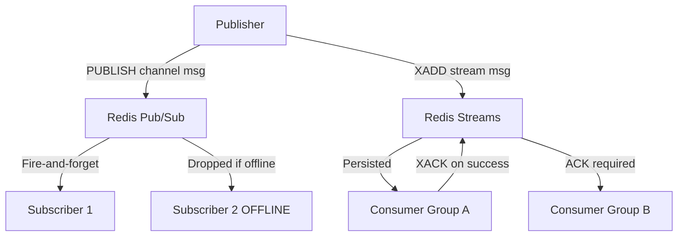
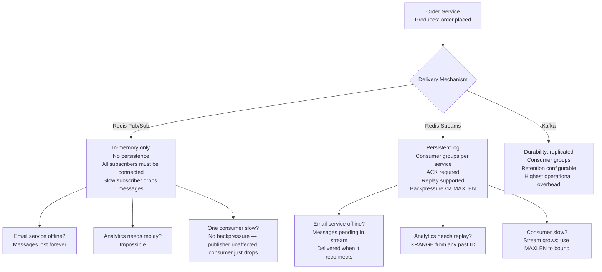
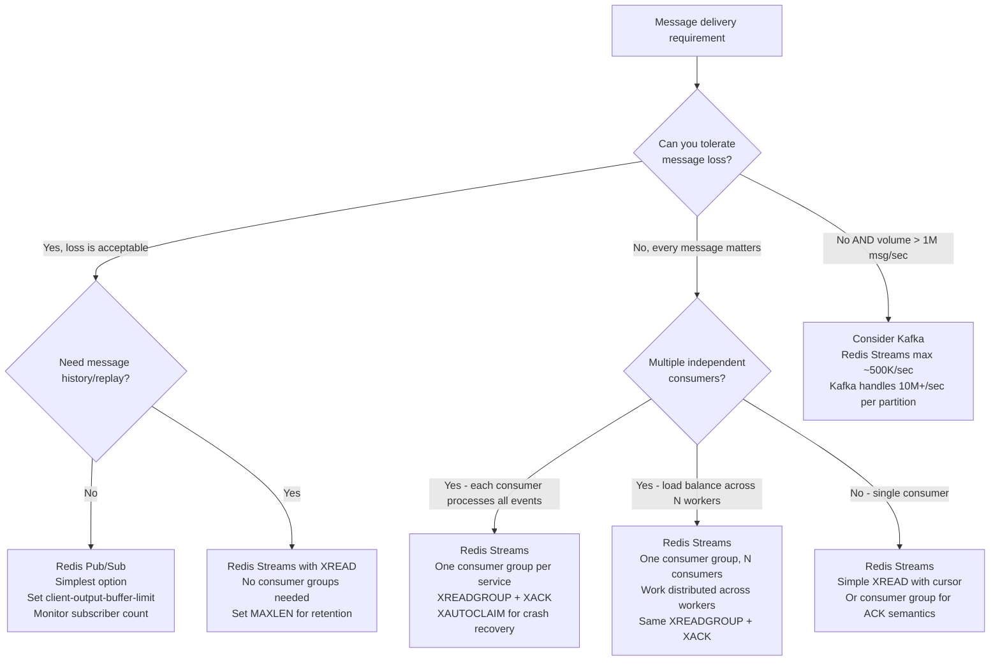

# Redis Pub/Sub vs Streams: Delivery Guarantees and Fan-Out Patterns

## 🗺️ Quick Overview



*Pub/Sub fans out instantly to online subscribers only and drops messages for any offline consumer; Streams persist every message and require explicit ACK, enabling at-least-once delivery with consumer groups.*

**Redis Pub/Sub has exactly zero delivery guarantees — a subscriber that is 1ms slow drops messages forever.** This is not a bug; it is the designed behavior. Redis Streams, introduced in 5.0, provides persistence, consumer groups, and acknowledgment semantics that Pub/Sub will never have. The cost is 10x the operational complexity. Choosing between them requires understanding what you actually lose when a message is dropped.

---

## The Problem Class `[Mid]`

A notification service needs to fan out events to multiple downstream consumers. An order placed event must reach: the email service, the analytics pipeline, the inventory service, and the mobile push notification service.



Pub/Sub is correct for: live notifications where loss is acceptable (chat typing indicators, live sports scores, ephemeral dashboard updates). Streams is correct for: any event that has business consequence if lost.

---

## Why the Obvious Solution Fails `[Senior]`

**"Pub/Sub is simpler, let's start there"**: The operational simplicity of Pub/Sub hides the durability risk. The pattern works in development (all services are up, low traffic, no restarts). In production:
- Rolling deployments disconnect subscribers for 30–60 seconds during each service restart
- Memory pressure causes Redis evictions — Pub/Sub message buffers are evicted under pressure
- A slow consumer causes its client-side buffer to fill; Redis disconnects the subscriber (`client-output-buffer-limit pubsub 32mb 8mb 60`)
- Load spikes cause consumer lag — Pub/Sub has no lag concept, just message loss

**The subscriber buffer limit**: This is the most commonly missed Pub/Sub failure mode:
```
client-output-buffer-limit pubsub 32mb 8mb 60
# Meaning: if subscriber's output buffer exceeds 32MB (hard limit)
#   OR exceeds 8MB for 60 continuous seconds (soft limit),
#   Redis disconnects the subscriber. Silently. No error to the publisher.
```

A consumer processing at 10MB/sec with a 100MB/sec publisher accumulates buffer at 90MB/sec. Hard limit hit in 355ms. Subscriber disconnected. Publisher doesn't know. Messages lost. No alert fires unless you monitor subscriber count.

**"Streams require too much setup"**: Streams have 3 concepts that don't exist in Pub/Sub:
1. Consumer groups (multiple independent consumers of the same stream)
2. Pending Entry List (PEL) — messages delivered but not acknowledged
3. Message acknowledgment (`XACK`) — marks message as processed

Teams that use Streams without consumer groups use `XREAD` which advances a client-side cursor — all clients see all messages (fan-out). Teams that use consumer groups use `XREADGROUP` — each consumer in a group sees only undelivered messages (load-balanced). Both patterns are valid; understanding which you need requires 5 minutes of design, not hours.

---

## The Solution Landscape `[Senior]`

### Solution 1: Redis Pub/Sub — Fire-and-Forget Fan-Out

**What it is**: A channel-based publish/subscribe system. Publishers send messages to a channel name; all currently-subscribed clients receive the message. No persistence, no buffering beyond client output buffer, no acknowledgment.

**How it actually works at depth**:
1. Client A calls `SUBSCRIBE notifications`. Redis adds A to an in-memory set of subscribers for `notifications`.
2. Publisher calls `PUBLISH notifications "message"`. Redis iterates the subscriber set, writes the message to each subscriber's client output buffer.
3. If subscriber is processing slowly and buffer fills, Redis disconnects the subscriber (see `client-output-buffer-limit`).
4. `SUBSCRIBE` puts the client in subscribe mode — it cannot run any other commands except `SUBSCRIBE`, `UNSUBSCRIBE`, `PSUBSCRIBE`, `PUNSUBSCRIBE`, `PING`.

**Pattern matching**: `PSUBSCRIBE notifications:*` subscribes to all channels matching the pattern. Matching uses glob-style: `*` (any chars), `?` (single char), `[ae]` (character class). Pattern matching is O(N) per pattern per PUBLISH — avoid patterns in high-throughput Pub/Sub.

**Keyspace notifications**: `notify-keyspace-events KEA` enables Redis to publish notifications on key events (set, expire, delete) to channels like `__keyevent@0__:expired`. Useful for cache invalidation coordination.

**Sizing guidance** `[Staff+]`
- Message throughput: Redis handles 1M+ PUBLISH/sec on modern hardware (Pub/Sub is pure in-memory fan-out)
- Subscriber count impact: Each additional subscriber adds ~1μs to PUBLISH latency (buffer write per subscriber). At 1000 subscribers: +1ms per PUBLISH.
- Client output buffer: 32MB hard limit per subscriber. At 100KB/msg × 320 messages/sec backlog = buffer full in 1 second.
- Memory per subscriber: ~20KB base + output buffer

**When Pub/Sub wins**:
- Real-time dashboards (user sees latest state; missing intermediate states is OK)
- Chat typing indicators (ephemeral, loss is fine)
- Live price updates (next tick replaces current tick)
- Invalidation signals (trigger cache invalidation; if signal missed, TTL handles eventual consistency)

**Failure modes** `[Staff+]`
- **Silent subscriber disconnect**: Buffer overflow disconnects subscriber without notifying the publisher. Monitor `PUBSUB NUMSUB channel` — a drop in subscriber count is the only signal.
- **Redis restart**: All subscribers are disconnected. They must reconnect and resubscribe. Publisher continues publishing — messages published between restart and resubscription are lost. Implement reconnection logic in all subscribers with exponential backoff.
- **Pattern subscription amplification**: `PSUBSCRIBE *` matches every channel. If you have 1000 channels and 100 pattern subscribers, each PUBLISH is delivered to channel subscribers + all pattern subscribers = potentially O(N) pattern matches per PUBLISH.

**Observability** `[Staff+]`
- `PUBSUB NUMSUB channel1 channel2...` — subscriber count per channel
- `PUBSUB CHANNELS pattern` — active channels
- `INFO stats` → `pubsub_channels`, `pubsub_patterns`
- Alert: `PUBSUB NUMSUB critical-channel` drops below expected minimum subscriber count

---

### Solution 2: Redis Streams — Persistent Log with Consumer Groups

**What it is**: An append-only log (like Kafka, but in Redis). Each message has an auto-generated ID (`millisecondsTimestamp-sequenceNumber`). Multiple independent consumer groups can read the same stream at different positions.

**How it actually works at depth**:

**Producers** append messages: `XADD mystream * field1 value1 field2 value2`. The `*` generates an auto-ID. Returns the message ID.

**Consumers** without groups use `XREAD` with a cursor:
```
XREAD COUNT 10 BLOCK 2000 STREAMS mystream $
# Read up to 10 new messages ($ = only messages after last ID seen)
# Block for 2 seconds if no messages
```

**Consumer groups** use `XREADGROUP`:
```
# Create group
XGROUP CREATE mystream email-group $ MKSTREAM
# MKSTREAM creates the stream if it doesn't exist; $ starts reading from newest

# Read as consumer within group
XREADGROUP GROUP email-group consumer-1 COUNT 10 BLOCK 2000 STREAMS mystream >
# > = only deliver messages not yet delivered to this group
```

**Acknowledgment**:
```
XACK mystream email-group 1615000000000-0
# Removes from Pending Entry List for email-group
```

**Pending Entry List (PEL)**: Messages delivered to a consumer group but not yet ACKed. Stored per consumer group. If consumer crashes, PEL retains unprocessed messages. On restart, consumer claims them via `XAUTOCLAIM`.

**MAXLEN trimming**:
```
XADD mystream MAXLEN ~ 1000000 * field value
# Keep approximately 1M messages; ~ allows trimming at listpack boundary
# Without ~: exact trimming, higher overhead
```

**Sizing guidance** `[Staff+]`
- Stream entry overhead: ~50–100 bytes per entry in listpack encoding
- PEL entry: ~130 bytes per pending message per consumer group
- At 10K messages/sec, 1-hour retention: 36M entries × 75 bytes = **2.7GB**
- At 100K messages/sec with MAXLEN 1M: steady-state ~100MB for stream data
- Consumer group overhead: ~1MB base + PEL size per group
- Delivery-to-ACK latency for PEL: if consumer takes 5 seconds to process each message, PEL = 10K/sec × 5s = 50K pending entries × 130 bytes = 6.5MB (manageable)

**When Streams wins**:
- Any event with business consequence (orders, payments, notifications)
- Multiple independent consumers of the same event stream (each with their own pace)
- Replay requirement (replay from a specific timestamp for reprocessing)
- At-least-once delivery (consumer must acknowledge or message stays in PEL)

**Failure modes** `[Staff+]`
- **PEL growth without XACK**: Consumers that crash or are slow without ACKing accumulate PEL. At 10K/sec with 20% unACKed: 2K PEL entries/sec → 120K entries/minute × 130 bytes = 15.6MB/minute. After 1 hour: 936MB. Monitor `XPENDING mystream group-name - + 10` — the count, not just the entries.
- **Stream growing without MAXLEN**: An unbounded stream with no MAXLEN and no external trimming grows indefinitely. At 1 GB/hour, you'll exhaust disk in days. Always set MAXLEN proportional to retention requirements.
- **Consumer group starvation with single consumer**: If a consumer group has 1 consumer and it crashes, PEL accumulates. Use `XAUTOCLAIM` to reassign pending messages to another consumer after `min-idle-time` milliseconds: `XAUTOCLAIM mystream group-name new-consumer 60000 0-0` — claims messages pending > 60 seconds.
- **XREADGROUP with `>` vs specific ID**: Using `>` delivers only new messages. Using `0-0` (or a specific ID) re-delivers pending messages. A consumer restart should use `0-0` first to process any pending (unACKed) messages before switching to `>` for new ones. Skipping this step means a crash causes message delivery gaps.

**Observability** `[Staff+]`
- `XLEN mystream` — total entries
- `XINFO GROUPS mystream` — per-group: lag (entries behind), pel-count (unACKed)
- `XPENDING mystream group-name - + 100` — oldest pending messages; if oldest is > 10 minutes old, consumer is stuck
- Alert: Any consumer group lag > 10K messages — consumer falling behind
- Alert: PEL count > 50K for any consumer group — consumer not acknowledging

---

### Solution 3: Keyspace Notifications (Pub/Sub on Redis Events)

**What it is**: Redis publishes events when keys are modified, expired, or deleted, using Pub/Sub channels. Subscribe to `__keyevent@0__:expired` to get notified when a key expires.

**When it wins**:
- Cache invalidation coordination across services
- TTL expiry-triggered workflows (e.g., session expiry triggering logout cleanup)
- Real-time monitoring of key changes in development/debugging

**Configuration**:
```
notify-keyspace-events KEA
# K = keyspace events
# E = keyevent events
# A = all events (equivalent to g$lszxedt)
# Be selective: A is expensive. Use specific letters for only needed events.
# x = expired events, e = evicted events, s = set events
notify-keyspace-events "xE"  # only expired and eviction events
```

**Sizing guidance** `[Staff+]`
- Each key event generates 2 Pub/Sub messages (keyspace + keyevent channels)
- At 100K writes/sec: 200K Pub/Sub messages/sec just for SET events. **Only enable what you need.**
- CPU overhead: keyspace notifications add ~5–10% CPU at 100K ops/sec (writing to Pub/Sub channels for every operation)

**Failure modes** `[Staff+]`
- **Expiry notification delay**: Redis only checks TTL on key access or during the background expiry sweep (runs every 100ms). A key's expiry notification fires at expiry time + up to 100ms of sweep delay + Pub/Sub delivery time. Do not use keyspace notifications for precise timing (use application-side timers or Sorted Sets with score = expiry timestamp + scheduled reader).
- **All-or-nothing channel**: Keyspace notifications are fire-and-forget Pub/Sub. All the Pub/Sub failure modes apply: subscriber disconnect = missed notifications.

---

## Trade-off Matrix `[Senior]` → `[Staff+]`

| Dimension | Pub/Sub | Streams (XREAD) | Streams (Consumer Groups) | Keyspace Notifications |
|---|---|---|---|---|
| Persistence | None | Yes | Yes | None |
| Delivery guarantee | At-most-once | At-most-once (cursor-based) | At-least-once (ACK required) | At-most-once |
| Fan-out model | All subscribers get all messages | All readers advance own cursor | Load-balanced within group | All subscribers |
| Subscriber offline | Messages lost | Reads catch up on reconnect | PEL holds messages | Messages lost |
| Replay | No | Yes (XRANGE) | Yes (XRANGE) | No |
| Backpressure | None (buffer overflow = disconnect) | Consumer-controlled | Consumer-controlled | None |
| Memory overhead | ~20KB/subscriber + buffer | Stream data size | Stream + PEL | Negligible (subscriber buffers) |
| Throughput ceiling | 1M+ msg/sec | 500K+ msg/sec | 200K+ msg/sec | Tied to key op rate |

---

## Decision Framework — When to Pick Each `[Senior]` → `[Staff+]`



---

## Production Failure Story `[Staff+]`

**The Pub/Sub subscriber that silently stopped receiving order events for 6 hours.**

A fintech platform used Redis Pub/Sub to fan out payment events to the fraud detection service. The fraud detection service subscribed to `payments:completed` and ran a risk scoring model (CPU-intensive, ~200ms per event).

Payment volume was normally 100 events/sec. The fraud service processed them fine at 200ms each with 5 concurrent workers = 25 events/sec effective throughput. Wait — 100 events/sec published but 25/sec processed. The Pub/Sub subscriber buffer accumulated at 75 events/sec × ~500 bytes/event = 37.5 KB/sec.

Over 12 minutes, the buffer filled to the 8MB soft limit. Redis started the 60-second soft-limit timer. After 60 seconds, the buffer was still above 8MB. Redis disconnected the fraud service subscriber. Silently. The publisher (payment service) received no error.

For 6 hours, payments were processed without fraud scoring. The fraud service reconnected its Pub/Sub subscription (it had reconnection logic) — but missed the 6 hours of events. Those payments were never fraud-scored.

**Root cause**: Pub/Sub with a slow consumer. The consumer throughput (25 events/sec) was less than the publish rate (100 events/sec).

**Fix**:
1. Moved to Redis Streams with consumer groups. PEL ensured unprocessed events were not lost.
2. Increased fraud service workers from 5 to 20 (consumers in the group) to match publish rate.
3. Added monitoring: `XINFO GROUPS payments-stream` for consumer group lag; alert at lag > 1000.
4. Fraud service startup: read `0-0` first to process PEL before reading new messages.

---

## Observability Playbook `[Staff+]`

**Metric 1: Pub/Sub subscriber count and buffer health**
- `PUBSUB NUMSUB channel1 channel2` — subscriber count per critical channel; alert on drops
- `INFO clients` → `blocked_clients` (clients blocked in SUBSCRIBE/BRPOP)
- Per-client buffer: `CLIENT LIST` → `oll` (output list length), `omem` (output memory); alert on any client with `omem > 1MB`
- Alert: `PUBSUB NUMSUB critical-events < expected_count` — subscriber disconnected without notice

**Metric 2: Stream consumer group lag**
- `XINFO GROUPS streamname` — for each group: `lag` (messages not yet delivered), `pel-count` (delivered but unACKed)
- Alert: lag > 1000 (consumer falling behind delivery rate)
- Alert: pel-count growing > 100/minute (consumer not acknowledging; possible crash or logic error)
- `XPENDING streamname groupname - + 100` — oldest pending message timestamp; if > 5 minutes old, consumer is stuck

**Metric 3: Stream growth rate**
- `XLEN streamname` — total entries; if growing faster than expected, MAXLEN may not be configured or trimming is failing
- Monitor rate: `(current_XLEN - previous) / interval`; compare to `XADD` rate to verify MAXLEN trimming is active
- Alert: stream size > 80% of expected MAXLEN (MAXLEN `~` allows 10% overshoot; exact MAXLEN adds CPU cost)

**Dashboard layout**:
1. Top row: Pub/Sub subscriber count per critical channel, stream XLEN, consumer group lag
2. Middle row: PEL count per group, oldest pending message age, XADD rate vs XACK rate
3. Bottom row: Client output buffer sizes (top 10 by memory), subscriber disconnect rate, stream trimming rate

---

## Architectural Evolution `[Staff+]`

**12-month compounding**: Teams that start with Pub/Sub for event delivery hit the reliability wall at month 6–9 when their first production incident involves lost events. Migrating to Streams requires:
- Adding consumer group semantics to all consumers
- Adding acknowledgment logic
- Adding crash-recovery logic (read PEL on startup)
- Adding monitoring for group lag and PEL

This migration is 2–4 engineering weeks per service. If you have 10 consumer services, that's 20–40 engineering weeks of migration work. Choose Streams for business events from day one.

**10x scale changes**:
- At 10x volume (1M+ messages/sec): Redis Streams starts to show memory pressure from stream data. Evaluate Kafka for this scale — Kafka's log compaction and disk-backed storage handles TB of event history without Redis memory concerns.
- Stream MAXLEN at 10x: 1M messages × 100 bytes = 100MB — manageable. 10M messages = 1GB — still manageable, but plan for MAXLEN tuning per stream.
- Consumer group scaling: add consumers to a group dynamically without restart. Consumers join the group automatically; Redis distributes pending messages via `XREADGROUP` semantics.

**2026 tooling perspective**:
- **eBPF for Pub/Sub subscriber disconnect detection**: `kprobe` on Redis's `pubsubUnsubscribeChannel()` can detect subscriber disconnections at microsecond precision, including the reason (buffer overflow vs client disconnect). This enables real-time alerting on subscription health that doesn't depend on polling `PUBSUB NUMSUB`.
- **Rust-based Stream consumers**: The `redis-rs` crate with async Tokio runtime can achieve 500K+ XREADGROUP+XACK cycles/sec per consumer process, with connection pooling and automatic reconnection. For high-throughput stream consumers, Rust significantly outperforms Python/Node consumers.
- **Platform engineering — event bus abstraction**: Rather than exposing Pub/Sub vs Streams as an infrastructure choice, platform teams should provide an "event bus" abstraction where producers publish and consumers subscribe. The platform selects Pub/Sub (for ephemeral) or Streams (for durable) based on the declared delivery requirement. This prevents accidental Pub/Sub usage for durable event requirements.
- **Redis 8.x Stream improvements**: Redis 8.x adds partial stream trimming optimizations and better consumer group migration during Cluster resharding. If you're running Streams at scale on Cluster, upgrade to Redis 8.x when stable.

---

## Decision Framework Checklist `[All Levels]`

- [ ] Define the delivery guarantee required: at-most-once (Pub/Sub acceptable) or at-least-once (Streams required)
- [ ] Identify whether consumers need independent replay positions or shared fan-out (XREAD vs consumer groups)
- [ ] Set `client-output-buffer-limit pubsub` explicitly — default is 32MB hard limit but soft limit may need tuning
- [ ] For Streams: always configure MAXLEN to bound memory growth; choose `~` (approximate) over exact for performance
- [ ] Implement consumer startup logic to drain PEL (`XREADGROUP ... 0-0`) before reading new messages (`>`)
- [ ] Configure `XAUTOCLAIM` for consumer crash recovery — manually claiming stale PEL entries requires ops intervention without it
- [ ] Monitor Pub/Sub subscriber count for critical channels; disconnect is silent from publisher perspective
- [ ] Monitor consumer group lag and PEL count; alert before PEL grows unbounded
- [ ] For keyspace notifications: enable only the event types needed (`notify-keyspace-events "xE"` not `"KEA"`)
- [ ] For > 500K messages/sec sustained: evaluate Kafka as the stream backbone with Redis Streams for low-latency fan-out

---

*Written by Gaurav Porwal — 10+ Year Engineer | Tech Lead | Product Owner | Business-Minded Builder*
*Last updated: 2026-03-18*
