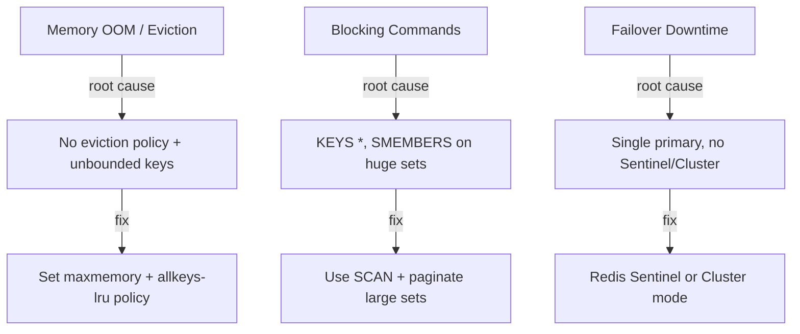

# Redis Failure Modes

Common Redis production issues and how to prevent them.

```mermaid
graph TD
    OOM[Memory OOM / Eviction] -->|root cause| NOEVICT[No eviction policy + unbounded keys]
    NOEVICT -->|fix| MAXMEM[Set maxmemory + allkeys-lru policy]
    BLOCK[Blocking Commands] -->|root cause| LARGE[KEYS *, SMEMBERS on huge sets]
    LARGE -->|fix| SCAN[Use SCAN + paginate large sets]
    FAILOVER[Failover Downtime] -->|root cause| NOHA[Single primary, no Sentinel/Cluster]
    NOHA -->|fix| SENTINEL[Redis Sentinel or Cluster mode]
```
