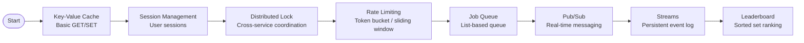

# Redis Hands-On

27 practical Redis POCs covering caching, locking, queues, streams, Lua scripting, and more.

```mermaid
graph LR
    Start([Start]) --> P1[Key-Value Cache\nBasic GET/SET]
    P1 --> P2[Session Management\nUser sessions]
    P2 --> P3[Distributed Lock\nCross-service coordination]
    P3 --> P4[Rate Limiting\nToken bucket / sliding window]
    P4 --> P5[Job Queue\nList-based queue]
    P5 --> P6[Pub/Sub\nReal-time messaging]
    P6 --> P7[Streams\nPersistent event log]
    P7 --> P8[Leaderboard\nSorted set ranking]
```
