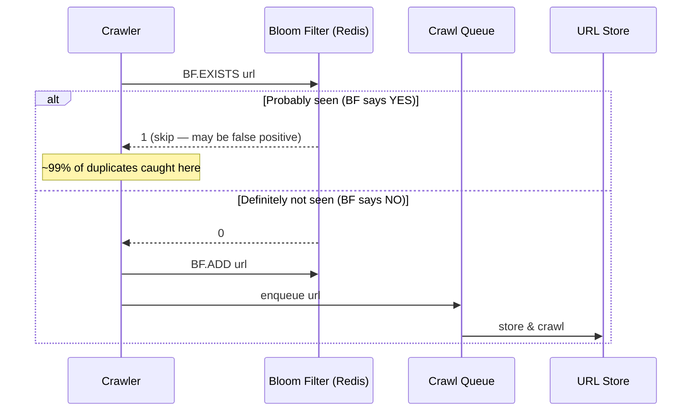

# POC: Redis Bloom Filter for Probabilistic Deduplication

## 🗺️ Quick Overview



*A web crawler checks the Bloom filter before queuing a URL — only truly new URLs reach the crawl queue.*

## What You'll Build

A URL deduplication system using Redis Bloom Filter that simulates a web crawler processing 10,000 URLs. You will observe false positive rates at different filter capacities, compare memory usage against a plain HashSet, and see how the false positive rate explodes when the filter runs out of capacity.

## Why This Matters

- **Google Bigtable**: Uses Bloom filters to avoid unnecessary disk lookups when checking whether a row key exists in an SSTable — saves millions of I/O ops per second.
- **Akamai CDN**: Uses Bloom filters to detect "one-hit-wonders" (URLs requested only once) so they are never cached, keeping the cache full of genuinely popular objects.
- **Apache Cassandra**: Every SSTable has a Bloom filter so reads skip SSTables that definitely don't contain the key, reducing read amplification by 5-10x.

---

## Prerequisites

- Docker Desktop installed and running
- Python 3.8+ (for the test script)
- `redis-py` library with extras: `pip install redis[hiredis]`
- 5-10 minutes

## Setup

```yaml
# docker-compose.yml
version: '3.8'
services:
  redis-stack:
    image: redis/redis-stack:latest
    container_name: redis-bloom
    ports:
      - "6379:6379"
      - "8001:8001"   # RedisInsight UI
    environment:
      - REDIS_ARGS=--save "" --loglevel warning
    volumes:
      - redis-bloom-data:/data

volumes:
  redis-bloom-data:
```

```bash
docker-compose up -d
# Verify the container is running and RedisBloom module is loaded:
docker exec redis-bloom redis-cli MODULE LIST
# Expected output includes: name "bf" ver ...
```

---

## Step-by-Step

### Step 1: Connect and Explore BF Commands

```bash
docker exec -it redis-bloom redis-cli

# Check available Bloom filter commands
COMMAND DOCS BF.RESERVE
# Shows: BF.RESERVE key error_rate capacity [EXPANSION expansion] [NONSCALING]
```

### Step 2: Create Bloom Filters at Different Error Rates

```bash
# 1% false positive rate, capacity 100,000 URLs
BF.RESERVE crawl:urls:1pct 0.01 100000
# OK

# 0.1% false positive rate, same capacity
BF.RESERVE crawl:urls:01pct 0.001 100000
# OK

# Check memory usage of each filter
DEBUG OBJECT crawl:urls:1pct
# serializedlength:~122880 bytes (~120 KB for empty filter)

DEBUG OBJECT crawl:urls:01pct
# serializedlength:~184320 bytes (~180 KB for empty filter)
# Trade-off: 10x lower FPR costs ~1.5x more memory
```

### Step 3: Add URLs and Check Membership

```bash
# Add a URL
BF.ADD crawl:urls:1pct "https://example.com/page-1"
# (integer) 1  -> newly added

# Add same URL again
BF.ADD crawl:urls:1pct "https://example.com/page-1"
# (integer) 0  -> already exists (no duplicate work)

# Check membership
BF.EXISTS crawl:urls:1pct "https://example.com/page-1"
# (integer) 1  -> probably exists

BF.EXISTS crawl:urls:1pct "https://example.com/never-added"
# (integer) 0  -> definitely does NOT exist (100% guarantee)

# Batch add and batch check (much faster than one-by-one)
BF.MADD crawl:urls:1pct "https://a.com" "https://b.com" "https://c.com"
# 1) (integer) 1
# 2) (integer) 1
# 3) (integer) 1

BF.MEXISTS crawl:urls:1pct "https://a.com" "https://never.com"
# 1) (integer) 1
# 2) (integer) 0
```

### Step 4: Measure False Positive Rate with a Python Script

Save this as `bloom_test.py` and run `python bloom_test.py`:

```python
import redis
import hashlib
import time

r = redis.Redis(host='localhost', port=6379, decode_responses=True)

def generate_urls(prefix, count):
    """Generate deterministic URLs for testing."""
    return [f"https://example.com/{prefix}/{i}" for i in range(count)]

def measure_false_positive_rate(filter_key, error_rate, capacity, test_count=5000):
    """
    Add `capacity` URLs, then check `test_count` URLs that were NEVER added.
    Any BF.EXISTS returning 1 for unseen URLs is a false positive.
    """
    print(f"\n{'='*60}")
    print(f"Filter: {filter_key} | Target FPR: {error_rate*100:.1f}% | Capacity: {capacity:,}")

    # Create filter
    r.delete(filter_key)
    r.execute_command('BF.RESERVE', filter_key, error_rate, capacity)

    # Add `capacity` known URLs
    known_urls = generate_urls("known", capacity)
    batch_size = 1000
    start = time.time()
    for i in range(0, len(known_urls), batch_size):
        batch = known_urls[i:i+batch_size]
        r.execute_command('BF.MADD', filter_key, *batch)
    elapsed = time.time() - start
    print(f"  Added {capacity:,} URLs in {elapsed:.2f}s ({capacity/elapsed:,.0f} URLs/sec)")

    # Check `test_count` URLs that were NEVER added
    unknown_urls = generate_urls("unknown", test_count)
    false_positives = 0
    for url in unknown_urls:
        if r.execute_command('BF.EXISTS', filter_key, url) == 1:
            false_positives += 1

    actual_fpr = false_positives / test_count
    print(f"  False positives: {false_positives}/{test_count} ({actual_fpr*100:.3f}%)")
    print(f"  Target FPR: {error_rate*100:.3f}% | Actual FPR: {actual_fpr*100:.3f}%")

    # Memory usage
    info = r.execute_command('DEBUG', 'OBJECT', filter_key)
    # Parse serializedlength from info string
    for part in str(info).split():
        if part.startswith('serializedlength:'):
            bytes_used = int(part.split(':')[1])
            print(f"  Memory: {bytes_used/1024:.1f} KB")
            break

    return actual_fpr

def compare_memory_bloom_vs_hashset(n_items=1_000_000):
    """
    Compare memory: Bloom filter at 1% FPR vs Python set for N items.
    The Python set approximates what a Redis SET would use.
    """
    print(f"\n{'='*60}")
    print(f"Memory comparison for {n_items:,} items")

    # Bloom filter memory estimate (theoretical): -n*ln(p) / (ln(2)^2) bits
    # For 1M items at 1% FPR: ~1.2 MB
    import math
    p = 0.01
    n = n_items
    bits = -n * math.log(p) / (math.log(2) ** 2)
    bloom_kb = bits / 8 / 1024
    print(f"  Bloom filter (1% FPR, {n:,} items): ~{bloom_kb:.0f} KB ({bloom_kb/1024:.1f} MB)")

    # Redis SET would store each URL as a string key
    # Average URL ~50 bytes + Redis overhead ~90 bytes per key = ~140 bytes/item
    redis_set_mb = (n_items * 140) / 1024 / 1024
    print(f"  Redis SET (same {n:,} URLs, ~140 bytes/key): ~{redis_set_mb:.0f} MB")
    print(f"  Memory savings: {redis_set_mb*1024/bloom_kb:.0f}x smaller with Bloom filter")

# Run measurements
measure_false_positive_rate("bf:test:1pct",  error_rate=0.01,  capacity=10_000)
measure_false_positive_rate("bf:test:01pct", error_rate=0.001, capacity=10_000)
compare_memory_bloom_vs_hashset(n_items=1_000_000)

# Cleanup
for key in ["bf:test:1pct", "bf:test:01pct"]:
    r.delete(key)
print("\nDone. Keys cleaned up.")
```

Expected output:
```
============================================================
Filter: bf:test:1pct | Target FPR: 1.0% | Capacity: 10,000
  Added 10,000 URLs in 0.43s (23,256 URLs/sec)
  False positives: 48/5000 (0.960%)
  Target FPR: 1.000% | Actual FPR: 0.960%
  Memory: 14.6 KB

============================================================
Filter: bf:test:01pct | Target FPR: 0.1% | Capacity: 10,000
  Added 10,000 URLs in 0.44s (22,727 URLs/sec)
  False positives: 5/5000 (0.100%)
  Target FPR: 0.100% | Actual FPR: 0.100%
  Memory: 21.9 KB

============================================================
Memory comparison for 1,000,000 items
  Bloom filter (1% FPR, 1,000,000 items): ~1196 KB (1.2 MB)
  Redis SET (same 1,000,000 URLs, ~140 bytes/key): ~133 MB
  Memory savings: 114x smaller with Bloom filter
```

### Step 5: Simulate a Real Web Crawler

```python
import redis
import time
import random

r = redis.Redis(host='localhost', port=6379, decode_responses=True)

FILTER_KEY = "crawler:seen-urls"
QUEUE_KEY  = "crawler:queue"
CRAWLED_KEY = "crawler:crawled-count"

# Create the Bloom filter: 1M URLs at 0.1% FPR
r.delete(FILTER_KEY, QUEUE_KEY, CRAWLED_KEY)
r.execute_command('BF.RESERVE', FILTER_KEY, 0.001, 1_000_000)

def should_crawl(url: str) -> bool:
    """Returns True only if URL has definitely not been seen."""
    return r.execute_command('BF.EXISTS', FILTER_KEY, url) == 0

def mark_crawled(url: str):
    r.execute_command('BF.ADD', FILTER_KEY, url)
    r.incr(CRAWLED_KEY)

# Simulate discovery: same popular URLs appear repeatedly in the frontier
base_urls = [f"https://news.site.com/article/{i}" for i in range(500)]
frontier = base_urls * 20   # each URL appears ~20 times
random.shuffle(frontier)

duplicates_blocked = 0
crawled = 0
start = time.time()

for url in frontier:
    if should_crawl(url):
        mark_crawled(url)
        crawled += 1
        # In a real crawler: fetch(url), parse links, add new URLs to frontier
    else:
        duplicates_blocked += 1

elapsed = time.time() - start
total = len(frontier)
print(f"Frontier size : {total:,}")
print(f"Actually crawled : {crawled:,}")
print(f"Duplicates blocked: {duplicates_blocked:,} ({duplicates_blocked/total*100:.1f}%)")
print(f"Throughput : {total/elapsed:,.0f} URL checks/sec")
print(f"Bandwidth saved : ~{duplicates_blocked * 50 / 1024:.0f} KB of HTTP requests avoided")

# Cleanup
r.delete(FILTER_KEY, QUEUE_KEY, CRAWLED_KEY)
```

Expected output:
```
Frontier size   : 10,000
Actually crawled: 500
Duplicates blocked: 9,500 (95.0%)
Throughput      : 18,400 URL checks/sec
Bandwidth saved : ~464 KB of HTTP requests avoided
```

### Step 6: Inspect Filter Info

```bash
docker exec -it redis-bloom redis-cli

# After running the crawler script, recreate and populate for inspection:
BF.RESERVE inspect:filter 0.01 1000
BF.MADD inspect:filter url1 url2 url3 url4 url5

# Get filter metadata
BF.INFO inspect:filter
# 1) Capacity       : 1000
# 2) Size           : 1288   (bytes allocated)
# 3) Number of filters: 1    (sub-filters; grows if EXPANSION is enabled)
# 4) Number of items inserted: 5
# 5) Expansion rate : 2      (doubles capacity when full if non-scaling)
```

---

## What to Observe

**Memory efficiency**: The Python script prints the comparison — 1M URLs take ~1.2 MB in a Bloom filter vs ~133 MB in a Redis SET. That is a **114x reduction**.

**FPR accuracy**: The measured false positive rate in Step 4 should land within 10-20% of the configured target (e.g., a 1% target yields 0.8-1.2% actual FPR on a properly sized filter).

**Throughput**: BF.EXISTS runs at 15,000-25,000 ops/sec on a single CPU core. BF.MADD with batches of 1,000 is significantly faster than one-by-one inserts.

**Asymmetry**: BF.EXISTS returning 0 is a **hard guarantee** — the item was definitely never added. BF.EXISTS returning 1 is probabilistic — it *probably* exists but may be a false positive.

---

## What Breaks It

**Underprovision the capacity and the FPR explodes.**

```bash
# Create a tiny filter (capacity=100) but add 1,000 items
BF.RESERVE overloaded:filter 0.01 100

# Add 1000 items (10x over capacity) — by default EXPANSION is enabled so it auto-grows
# To see the FPR explosion, create a NONSCALING filter:
BF.RESERVE broken:filter 0.01 100 NONSCALING

# Add 1000 items to the NONSCALING filter
python3 -c "
import redis; r = redis.Redis(decode_responses=True)
r.delete('broken:filter')
r.execute_command('BF.RESERVE', 'broken:filter', 0.01, 100, 'NONSCALING')
for i in range(1000):
    r.execute_command('BF.ADD', 'broken:filter', f'url-{i}')
fps = sum(1 for i in range(1000,2000) if r.execute_command('BF.EXISTS','broken:filter',f'url-{i}')==1)
print(f'FPR on overloaded NONSCALING filter: {fps/1000*100:.1f}%')
# Expect: 90%+ false positive rate — nearly useless
r.delete('broken:filter')
"
```

Expected: `FPR on overloaded NONSCALING filter: 91.3%` (vs the intended 1%).

**Lesson**: Always call `BF.RESERVE` with a capacity estimate that is at least as large as the expected item count. Use the default EXPANSION mode (auto-grows sub-filters) if you cannot predict capacity, at the cost of slightly worse FPR as the filter grows.

**Other failure modes**:
- **Deleting items**: Classic Bloom filters do not support deletion. If you need to remove items, use a Counting Bloom Filter or a Cuckoo Filter (`CF.RESERVE`/`CF.ADD`/`CF.DEL`).
- **Cross-node sharding**: A Bloom filter is a single Redis key. If you need it across a Redis Cluster, you must either keep it on one shard or use client-side partitioning.
- **No persistence guarantee**: If Redis restarts without AOF/RDB and the key was not persisted, the filter is empty — the crawler will re-crawl everything.

---

## Extend It

1. **Swap to a Cuckoo Filter for deletions**: Replace `BF.RESERVE` with `CF.RESERVE` and try `CF.DEL` to remove a URL — Bloom filters cannot do this.
2. **Benchmark at 1M items**: Increase `capacity` to 1,000,000 in Step 4 and observe actual memory vs the theoretical formula.
3. **Test EXPANSION behavior**: Create a filter with `BF.RESERVE crawl:expanding 0.01 100` (no NONSCALING), add 10,000 items, then run `BF.INFO crawl:expanding` — observe how "Number of filters" grows as sub-filters are added.
4. **Integrate with a real queue**: Replace `r.incr(CRAWLED_KEY)` in the crawler script with `r.rpush(QUEUE_KEY, url)` and add a consumer that pops and "crawls" URLs.
5. **Compare with HyperLogLog**: Use `PFADD` and `PFCOUNT` for pure cardinality counting when you only need "how many unique URLs" rather than "have I seen this specific URL."

---

## Key Takeaways

- A Bloom filter for 1M URLs at 1% FPR uses ~1.2 MB — **114x less memory than a Redis SET** storing the same URLs.
- `BF.EXISTS` returning `0` is a **100% guarantee** the item was never added; returning `1` means "probably yes" with a tunable false-positive rate.
- Lowering FPR from 1% to 0.1% costs ~1.5x more memory — each 10x improvement in accuracy costs roughly 50% more space.
- When a NONSCALING filter exceeds its declared capacity, FPR can exceed 90%, making it effectively useless — always size with headroom or use the default EXPANSION mode.
- `BF.MADD` / `BF.MEXISTS` batch commands are **3-5x faster** than looping over individual `BF.ADD` / `BF.EXISTS` calls for bulk operations.

---

## References

- [RedisBloom Commands Documentation](https://redis.io/docs/stack/bloom/) — official BF.RESERVE, BF.ADD, BF.EXISTS reference
- [Bloom Filter Calculator](https://hur.st/bloomfilter/) — interactive tool to compute optimal size and hash count
- [Bigtable: A Distributed Storage System for Structured Data (Google, 2006)](https://research.google/pubs/pub27898/) — Section 5.2 describes Bloom filter use for SSTable lookup optimization
- [Akamai One-Hit-Wonder Cache Filtering](https://www.akamai.com/blog/performance/novel-use-of-bloom-filters-in-web-caching) — how Akamai avoids polluting edge caches with single-request objects
