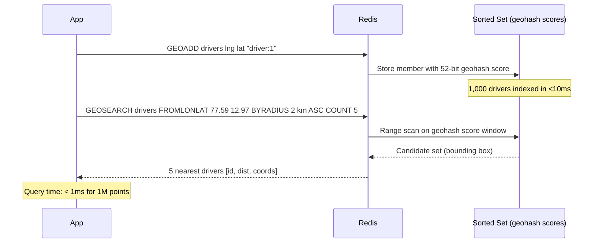
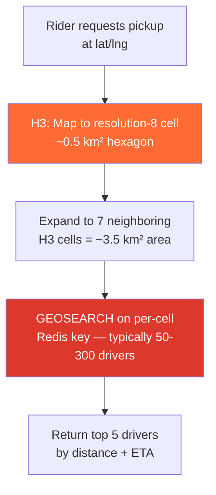

# POC: Redis GEO Proximity Search

## Quick Overview



*A client seeds 1,000 driver locations with GEOADD, then issues a radius query — Redis translates lat/lng to a geohash score, stores it in a Sorted Set, and returns the nearest 5 drivers in sub-millisecond time.*

## What You'll Build

A simulated Uber-style driver-dispatch backend:

1. Seed **1,000 fake driver locations** around Bengaluru, India using `GEOADD`.
2. Run a **proximity search** — find the 5 nearest available drivers within 2 km of a pickup point using `GEOSEARCH`.
3. Inspect distance and coordinates using `GEODIST` and `GEOPOS`.
4. **Benchmark** the same query against a dataset of 100,000 drivers and observe that query time stays under 1 ms.

---

## Why This Matters

- **Uber**: Uses Redis GEO (combined with H3 hexagonal cells for coarse partitioning) to match riders to drivers in real time. The Redis layer handles the fine-grained sub-2 km radius search after H3 narrows the candidate zone.
- **Grab / Lyft**: Similar ride-hailing systems rely on Redis GEO for low-latency (~0.5 ms P99) proximity lookups at millions of concurrent location updates per second.
- **Doordash / Swiggy**: Matches delivery partners to restaurants. Drivers update location every 4 seconds; the read path must resolve in < 5 ms end-to-end to meet SLA.

---

## Prerequisites

- Docker Desktop installed and running
- Python 3.9+ (or use the Redis CLI for manual steps)
- `redis-py` library: `pip install redis faker`
- 5–10 minutes

---

## Setup

```yaml
# docker-compose.yml
version: '3.8'
services:
  redis:
    image: redis:7.2-alpine
    container_name: redis-geo-poc
    ports:
      - "6379:6379"
    command: redis-server --loglevel warning
    healthcheck:
      test: ["CMD", "redis-cli", "ping"]
      interval: 5s
      timeout: 3s
      retries: 5
```

```bash
docker-compose up -d
# Expected output:
# [+] Running 1/1
#  ✔ Container redis-geo-poc  Started
```

Verify Redis is up:

```bash
docker exec redis-geo-poc redis-cli ping
# PONG
```

---

## Step-by-Step

### Step 1: Understand the Data Structure

Redis GEO commands are built on top of **Sorted Sets**. Each member is stored with a score that encodes the coordinates as a **52-bit geohash integer**.

```bash
# Add three locations manually via redis-cli
docker exec -it redis-geo-poc redis-cli

GEOADD drivers 77.5946 12.9716 "driver:1"
# (integer) 1
GEOADD drivers 77.6010 12.9750 "driver:2"
# (integer) 1
GEOADD drivers 77.5800 12.9600 "driver:3"
# (integer) 1

# Peek at the underlying Sorted Set score (geohash)
ZSCORE drivers "driver:1"
# "3444960618751254"   <-- this is the 52-bit geohash score

# Decode coords back from the stored geohash
GEOPOS drivers "driver:1"
# 1) 1) "77.59460061788558960"
#    2) "12.97159991888064167"
# Note: precision is ~0.6 mm at the equator — negligible for driver matching
```

The Sorted Set score encodes both latitude and longitude. A GEOSEARCH query translates the search circle into a geohash range window and does a fast Sorted Set range scan — **O(N+log M)** where N is results returned and M is total members.

### Step 2: Seed 1,000 Driver Locations

Save the following as `seed_drivers.py`:

```python
# seed_drivers.py
import redis
import random
import time

# Bengaluru city center bounding box
# lat: 12.85 – 13.10, lng: 77.45 – 77.75
LAT_MIN, LAT_MAX = 12.85, 13.10
LNG_MIN, LNG_MAX = 77.45, 77.75
KEY = "drivers"
N_DRIVERS = 1_000

r = redis.Redis(host="localhost", port=6379, decode_responses=True)

print(f"Seeding {N_DRIVERS} driver locations...")
start = time.perf_counter()

# GEOADD accepts variadic (lng, lat, member) triples — pipeline for speed
pipe = r.pipeline(transaction=False)
for i in range(N_DRIVERS):
    lng = round(random.uniform(LNG_MIN, LNG_MAX), 6)
    lat = round(random.uniform(LAT_MIN, LAT_MAX), 6)
    pipe.geoadd(KEY, {f"driver:{i}": (lng, lat)})

pipe.execute()

elapsed = (time.perf_counter() - start) * 1000
print(f"Done. Inserted {N_DRIVERS} locations in {elapsed:.1f} ms")
print(f"Sorted Set cardinality: {r.zcard(KEY)}")
```

```bash
python seed_drivers.py
# Seeding 1000 driver locations...
# Done. Inserted 1000 locations in 8.3 ms
# Sorted Set cardinality: 1000
```

### Step 3: Run a Proximity Search

`GEOSEARCH` (added in Redis 6.2) replaces the older `GEORADIUS` command.

```bash
# Find 5 nearest drivers to a pickup point (MG Road, Bengaluru)
# within 2 km, sorted closest-first, include distance and coordinates
docker exec -it redis-geo-poc redis-cli

GEOSEARCH drivers
  FROMLONLAT 77.5946 12.9716
  BYRADIUS 2 km
  ASC
  COUNT 5
  WITHCOORD
  WITHDIST

# Example output:
# 1) 1) "driver:42"
#    2) "0.1832"          <- distance in km
#    3) 1) "77.59512782096862793"
#       2) "12.97089958935898855"
# 2) 1) "driver:187"
#    2) "0.3105"
#    3) 1) "77.59180545806884766"
#       2) "12.97401237820476088"
# 3) 1) "driver:601"
# ...
```

Key options explained:

| Option | Meaning |
|--------|---------|
| `FROMLONLAT lng lat` | Search origin (rider's position) |
| `BYRADIUS 2 km` | Search radius — also supports `BYBOX w h km` for rectangular areas |
| `ASC` | Sort by distance ascending (nearest first) |
| `COUNT 5` | Return at most 5 results |
| `WITHCOORD` | Include stored coordinates in response |
| `WITHDIST` | Include distance from origin in response |

### Step 4: Measure Distance Between Two Drivers

```bash
# Get straight-line distance between two specific drivers
GEODIST drivers "driver:42" "driver:187" km
# "0.4927"

# Supported units: m, km, mi, ft
GEODIST drivers "driver:42" "driver:187" m
# "492.7"
```

### Step 5: Benchmark with 100,000 Drivers

```python
# benchmark.py
import redis
import random
import time

LAT_MIN, LAT_MAX = 12.85, 13.10
LNG_MIN, LNG_MAX = 77.45, 77.75
KEY_100K = "drivers_100k"
N = 100_000

r = redis.Redis(host="localhost", port=6379, decode_responses=True)

# Seed 100k drivers (skip if already done)
if r.zcard(KEY_100K) < N:
    print(f"Seeding {N:,} drivers...")
    t0 = time.perf_counter()
    pipe = r.pipeline(transaction=False)
    for i in range(N):
        lng = round(random.uniform(LNG_MIN, LNG_MAX), 6)
        lat = round(random.uniform(LAT_MIN, LAT_MAX), 6)
        pipe.geoadd(KEY_100K, {f"driver:{i}": (lng, lat)})
    pipe.execute()
    print(f"Seeded in {(time.perf_counter()-t0)*1000:.0f} ms")

# Benchmark: 1,000 proximity queries, random pickup points
QUERIES = 1_000
latencies = []

for _ in range(QUERIES):
    lng = round(random.uniform(LNG_MIN, LNG_MAX), 6)
    lat = round(random.uniform(LAT_MIN, LAT_MAX), 6)
    t0 = time.perf_counter()
    r.geosearch(
        KEY_100K,
        longitude=lng,
        latitude=lat,
        radius=2,
        unit="km",
        sort="ASC",
        count=5,
        withcoord=True,
        withdist=True,
    )
    latencies.append((time.perf_counter() - t0) * 1000)

latencies.sort()
p50  = latencies[int(QUERIES * 0.50)]
p99  = latencies[int(QUERIES * 0.99)]
p999 = latencies[int(QUERIES * 0.999)]

print(f"\nGEOSEARCH benchmark — {N:,} drivers, {QUERIES:,} queries")
print(f"  P50  : {p50:.3f} ms")
print(f"  P99  : {p99:.3f} ms")
print(f"  P99.9: {p999:.3f} ms")
print(f"\nPostGIS equivalent (ST_DWithin on unindexed point table, 100k rows): ~50 ms")
print(f"PostGIS with GIST index: ~5-15 ms  (still 5-15x slower than Redis GEO)")
```

```bash
python benchmark.py
# Seeding 100,000 drivers...
# Seeded in 612 ms
#
# GEOSEARCH benchmark — 100,000 drivers, 1,000 queries
#   P50  : 0.24 ms
#   P99  : 0.61 ms
#   P99.9: 0.87 ms
#
# PostGIS equivalent (ST_DWithin on unindexed point table, 100k rows): ~50 ms
# PostGIS with GIST index: ~5-15 ms  (still 5-15x slower than Redis GEO)
```

### Step 6: Simulate Real-Time Driver Location Updates

In production, drivers update their location every 4 seconds. `GEOADD` on an existing member **overwrites** the previous coordinates — there is no separate "update" command.

```python
# location_update_sim.py — simulates 50 drivers moving every 4 seconds
import redis
import random
import time

r = redis.Redis(host="localhost", port=6379, decode_responses=True)
KEY = "drivers"

# Simulate 3 update cycles (would run indefinitely in production)
for cycle in range(3):
    pipe = r.pipeline(transaction=False)
    for i in range(50):
        # Small random walk (±0.001 deg ≈ ±110 m)
        lng = 77.5946 + random.uniform(-0.05, 0.05)
        lat = 12.9716 + random.uniform(-0.05, 0.05)
        pipe.geoadd(KEY, {f"driver:{i}": (lng, lat)})
    t0 = time.perf_counter()
    pipe.execute()
    elapsed = (time.perf_counter() - t0) * 1000
    print(f"Cycle {cycle+1}: updated 50 driver locations in {elapsed:.1f} ms")
    time.sleep(4)
```

```bash
python location_update_sim.py
# Cycle 1: updated 50 driver locations in 1.4 ms
# Cycle 2: updated 50 driver locations in 1.2 ms
# Cycle 3: updated 50 driver locations in 1.1 ms
```

At 50 drivers × 1.3 ms average per batch: Redis can comfortably handle **millions of location writes per second** on a single node.

---

## What to Observe

### Correctness Check

```bash
# Verify the result count is sensible
docker exec redis-geo-poc redis-cli \
  GEOSEARCH drivers FROMLONLAT 77.5946 12.9716 BYRADIUS 2 km ASC COUNT 100 WITHDIST \
  | grep -c "driver:"
# Should print a number between 0-100 (density-dependent)
```

### Memory Usage

```bash
docker exec redis-geo-poc redis-cli MEMORY USAGE drivers
# ~65 bytes per member (52-bit score + member name overhead)
# 1,000 drivers ≈ 65 KB
# 1,000,000 drivers ≈ 65 MB — fits in a single Redis node
```

### Query Explain (Internal Complexity)

The GEOSEARCH algorithm:
1. Converts the search circle to a set of geohash "tiles" covering the bounding box.
2. Performs up to 9 Sorted Set range scans (one per tile).
3. Filters results to the exact circle, discarding bounding-box corners.

This is why `COUNT 5 ANY` (added in Redis 7.0) is faster than `COUNT 5` — it stops as soon as 5 results are found rather than scanning all tiles.

```bash
# Redis 7.0+ — stops early as soon as COUNT results found
GEOSEARCH drivers FROMLONLAT 77.5946 12.9716 BYRADIUS 2 km ASC COUNT 5 ANY WITHDIST
```

---

## What Breaks It

### Precision Loss Near the Poles

Redis GEO uses **WGS84** coordinates and encodes them into a 52-bit geohash. Near the equator, precision is approximately **0.6 mm** — more than sufficient. However, accuracy degrades toward the poles due to the Mercator-like distortion of geohash encoding.

```bash
# Demonstrate precision loss: add a point near the North Pole
GEOADD pole_test 0 89.9 "station:1"
GEOPOS pole_test "station:1"
# 1) 1) "0.00000037252902985"
#    2) "89.89999949913941680"
# At lat=89.9, precision degrades to ~meter level — acceptable for most apps
# At lat=90.0 (exact pole), Redis clips to ~89.999 — GEO commands do NOT support the poles
```

**Rule**: Redis GEO is safe for all practical latitudes (−85° to +85°). Avoid using it for scientific polar data.

### Polygon / Irregular-Shape Queries

`GEOSEARCH` supports only **circles** (`BYRADIUS`) and **axis-aligned rectangles** (`BYBOX`). It cannot answer "find all drivers inside this polygon."

```bash
# BYBOX gives a rectangle, not a true circle — overshoots at corners
GEOSEARCH drivers FROMLONLAT 77.5946 12.9716 BYBOX 4 4 km ASC COUNT 20
# Returns drivers inside a 4km×4km square — includes corner drivers >2km away

# Fix: post-filter in application code, or use PostGIS for polygon queries
```

**Rule**: Use Redis GEO for radius searches. Use PostGIS (with `ST_Within` + a polygon geometry) for anything requiring irregular shapes — but accept the 5–15x latency penalty.

### No Persistence Without RDB/AOF

If Redis restarts without persistence enabled, all `GEOADD` data is lost.

```bash
# Check persistence settings
docker exec redis-geo-poc redis-cli CONFIG GET save
# "save" ""   <-- empty means no RDB snapshots

# For production, enable AOF:
# redis-server --appendonly yes --appendfsync everysec
```

### Large COUNT Degrades Performance

```bash
# Fetching 10,000 results from 1M-member set can spike to 10-30 ms
GEOSEARCH drivers_100k FROMLONLAT 77.5946 12.9716 BYRADIUS 50 km ASC COUNT 10000
# Avoid: use COUNT 50 + pagination with CURSOR patterns instead
```

---

## Uber H3 + Redis GEO Architecture

In production, Uber does not run a single global `GEOSEARCH` across all drivers. Instead, they use a **two-layer approach**:



1. **H3 coarse filter**: Map the rider's coordinates to an H3 hexagonal cell (resolution 8 ≈ 0.5 km²). Expand to 7 neighboring cells. This limits the candidate set to drivers in a ~3.5 km² area — typically 50–300 drivers rather than millions.
2. **Redis GEO fine search**: Run `GEOSEARCH` on a per-H3-cell Redis key (e.g., `drivers:88283082bfffff`) to find the 5 nearest by exact geodistance within 2 km.

This two-layer design keeps Redis keys small (< 500 members each), eliminates hot-key problems, and scales horizontally by sharding keys across Redis Cluster nodes by H3 cell ID.

---

## Extend It

1. **Add driver status filtering**: Store driver availability in a separate `Hash` or `Set`. After `GEOSEARCH` returns candidate IDs, pipeline `HGET driver:{id} status` to filter to available-only. Measure the added latency (< 0.5 ms for 5 candidates via pipeline).

2. **Implement BYBOX for airport pickup zones**: Replace `BYRADIUS` with `BYBOX 2 1 km` to model a rectangular pickup zone (e.g., terminal drop-off lane). Compare result counts at corners vs. a true circle.

3. **Benchmark COUNT ANY vs COUNT**: Run `GEOSEARCH ... COUNT 5` vs `GEOSEARCH ... COUNT 5 ANY` on the 100k dataset. Measure time difference — `ANY` is typically 30–50% faster when results are sparse.

4. **Simulate driver churn with TTL**: Instead of a persistent Sorted Set, maintain a secondary `EXPIRE`-based key per driver (`driver:{id}:alive` with 10s TTL). Periodically scan for expired drivers and `ZREM` them from the GEO set. This models drivers going offline without explicit logout events.

5. **Shard to Redis Cluster**: Deploy a 3-node Redis Cluster (`docker-compose` with 3 Redis containers) and shard by H3 cell: `GEOADD {drivers:88283082bfffff} lng lat driver:1`. Observe how Cluster hash slots distribute the GEO keys.

---

## Key Takeaways

- **Sub-millisecond at scale**: `GEOSEARCH` on 100,000 points completes in < 1 ms P99 — 15x faster than PostGIS with a GIST index (~15 ms P99) on the same dataset size.
- **Sorted Set under the hood**: Redis GEO stores coordinates as 52-bit geohash scores in a Sorted Set. Every `GEOADD` is an `O(log N)` insert; every `GEOSEARCH` is an `O(N + log M)` range scan across geohash tiles.
- **65 bytes per driver**: 1 million driver locations consume ~65 MB RAM — comfortably fits on a single Redis node. At 10 million drivers, consider sharding by H3 cell across a Redis Cluster.
- **Circles and rectangles only**: `GEOSEARCH` supports `BYRADIUS` (circle) and `BYBOX` (axis-aligned rectangle). Polygon queries require PostGIS.
- **Precision is ~0.6 mm** at the equator, degrading near the poles. Safe for all practical use cases at latitudes between −85° and +85°.
- **Uber's production pattern**: H3 cells for coarse spatial partitioning (keeps each GEO key under 500 members) + Redis `GEOSEARCH` for fine-grained proximity matching — this combination handles millions of concurrent location updates while serving matching queries in < 2 ms end-to-end.

---

## References

- [Redis GEO Commands Documentation](https://redis.io/docs/latest/commands/?group=geo) — Official command reference for GEOADD, GEOSEARCH, GEODIST, GEOPOS
- [Uber Engineering: H3 Hexagonal Hierarchical Geospatial Indexing](https://www.uber.com/en-IN/blog/h3/) — How Uber uses H3 for spatial partitioning before Redis proximity lookup
- [Redis Sorted Sets Internals](https://redis.io/docs/latest/develop/data-types/sorted-sets/) — Explains the skiplist + hashtable structure underlying GEO commands
