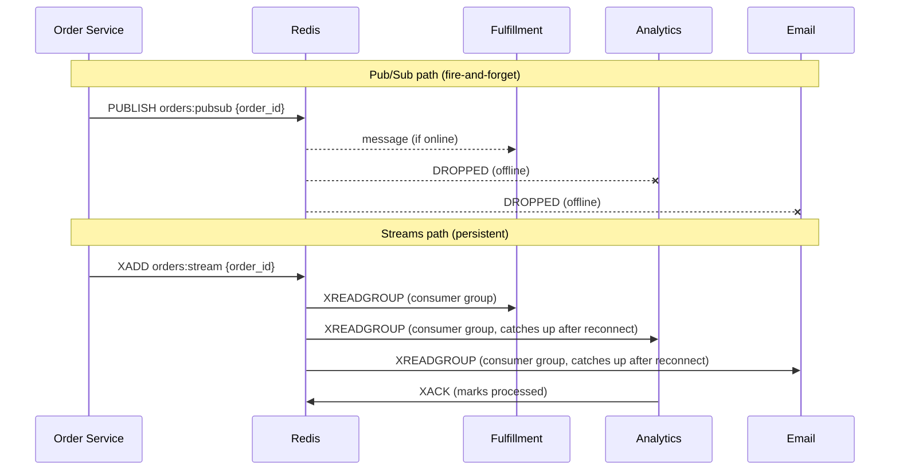

# POC: Redis Pub/Sub vs Streams — Order Notification System

## 🗺️ Quick Overview



*The diagram shows the same order event flowing through Pub/Sub (where offline consumers silently drop messages) vs Streams (where messages persist and consumers catch up after reconnect).*

## What You'll Build

An order notification system where a single `order:placed` event must reach three downstream services — Fulfillment, Analytics, and Email. You'll implement both approaches side by side, then simulate a consumer going offline to see exactly what Pub/Sub drops and what Streams retains. The XPENDING command will expose unacknowledged messages — the "lost" events Pub/Sub silently swallowed.

## Why This Matters

- **Shopify**: Uses Redis Streams for order processing pipelines; at-least-once delivery means no order silently skips fulfillment regardless of worker restarts.
- **Uber Eats**: Fan-out on order placement (driver dispatch, restaurant notification, ETA calculation) requires that a crashed notification worker can replay missed events — Streams consumer groups enable this.
- **Discord**: Uses Pub/Sub for real-time presence updates (it's fine if one heartbeat is lost) but Streams for audit log writes where every event must be recorded.

---

## Prerequisites

- Docker Desktop installed and running
- Redis CLI (`redis-cli`) or `docker exec` access
- Node.js 18+ (or run all commands directly in Redis CLI)
- 10-15 minutes

## Setup

```yaml
# docker-compose.yml
version: '3.8'
services:
  redis:
    image: redis:7.2-alpine
    container_name: redis-poc
    ports:
      - "6379:6379"
    command: redis-server --save "" --appendonly no
    healthcheck:
      test: ["CMD", "redis-cli", "ping"]
      interval: 5s
      timeout: 3s
      retries: 5
```

```bash
docker-compose up -d
# Expected: redis-poc container running

docker exec -it redis-poc redis-cli ping
# Expected: PONG
```

---

## Step-by-Step

### Step 1: Understand the Difference in One Command Each

Open two terminals. Both subscribe to something — but only one will survive a reconnect.

**Terminal A — Pub/Sub subscriber (Fulfillment Service):**
```bash
docker exec -it redis-poc redis-cli SUBSCRIBE orders:pubsub
# Expected output:
# 1) "subscribe"
# 2) "orders:pubsub"
# 3) (integer) 1
# (now blocking, waiting for messages)
```

**Terminal B — Streams consumer (Fulfillment Service):**
```bash
# Create consumer group first (only once, idempotent with MKSTREAM)
docker exec -it redis-poc redis-cli XGROUP CREATE orders:stream fulfillment $ MKSTREAM
# Expected: OK

# Start reading (block=0 means wait forever, count=1 = one message at a time)
docker exec -it redis-poc redis-cli XREADGROUP GROUP fulfillment worker-1 COUNT 1 BLOCK 0 STREAMS orders:stream ">"
# Expected: (blocking, waiting for messages)
```

**Terminal C — Publisher (Order Service):**
```bash
# Send one order to BOTH channels simultaneously
docker exec -it redis-poc redis-cli PUBLISH orders:pubsub '{"order_id":"ORD-001","item":"laptop","amount":999}'
# Expected: (integer) 1  ← 1 subscriber received it

docker exec -it redis-poc redis-cli XADD orders:stream '*' order_id ORD-001 item laptop amount 999
# Expected: 1700000000000-0  ← stream entry ID (timestamp-sequence)
```

You should see Terminal A print the order. Terminal B also prints it. Both work — so far.

### Step 2: Simulate an Offline Consumer — The Critical Difference

Kill Terminal A (Ctrl+C — simulating a Fulfillment worker restart) and Terminal B (Ctrl+C). Now publish 3 more orders while they are offline.

**Terminal C — Publish while consumers are offline:**
```bash
docker exec -it redis-poc redis-cli PUBLISH orders:pubsub '{"order_id":"ORD-002","item":"phone","amount":599}'
# Expected: (integer) 0  ← ZERO subscribers received it. Message LOST.

docker exec -it redis-poc redis-cli PUBLISH orders:pubsub '{"order_id":"ORD-003","item":"tablet","amount":399}'
# Expected: (integer) 0  ← LOST again

docker exec -it redis-poc redis-cli XADD orders:stream '*' order_id ORD-002 item phone amount 599
# Expected: 1700000000001-0

docker exec -it redis-poc redis-cli XADD orders:stream '*' order_id ORD-003 item tablet amount 399
# Expected: 1700000000002-0
```

### Step 3: Reconnect and See What Each Approach Delivers

**Reconnect the Pub/Sub subscriber (Terminal A):**
```bash
docker exec -it redis-poc redis-cli SUBSCRIBE orders:pubsub
# Expected: subscribes, but ORD-002 and ORD-003 are GONE FOREVER
# No way to retrieve them. No history. No replay.
```

**Reconnect the Streams consumer (Terminal B):**
```bash
# Use ">" to read only NEW pending messages for this consumer
docker exec -it redis-poc redis-cli XREADGROUP GROUP fulfillment worker-2 COUNT 10 STREAMS orders:stream ">"
# Expected output:
# 1) 1) "orders:stream"
#    2) 1) 1) "1700000000001-0"
#          2) 1) "order_id"
#             2) "ORD-002"
#             3) "item"
#             4) "phone"
#             5) "amount"
#             6) "599"
#       2) 1) "1700000000002-0"
#          2) 1) "order_id"
#             2) "ORD-003"
# ORD-002 and ORD-003 ARE HERE. Streams persisted them.
```

ORD-002 and ORD-003 were waiting in the stream. The new worker picks them up immediately.

### Step 4: Implement True Fan-out with Three Consumer Groups (Streams Only)

Pub/Sub does fan-out automatically (all subscribers receive every message). Streams require one consumer group per service.

```bash
# Create consumer groups for all three services ($ = only new messages from now)
docker exec -it redis-poc redis-cli XGROUP CREATE orders:stream analytics 0 MKSTREAM
# Use 0 to start from the BEGINNING — analytics catches up on all missed events
docker exec -it redis-poc redis-cli XGROUP CREATE orders:stream email 0 MKSTREAM
# Expected: OK for both

# Analytics service reads its own queue (independent from fulfillment)
docker exec -it redis-poc redis-cli XREADGROUP GROUP analytics analytics-worker-1 COUNT 10 STREAMS orders:stream ">"
# Expected: receives ORD-001, ORD-002, ORD-003 (all events from beginning, since we used 0 above)

# Email service reads its own queue
docker exec -it redis-poc redis-cli XREADGROUP GROUP email email-worker-1 COUNT 10 STREAMS orders:stream ">"
# Expected: receives ORD-001, ORD-002, ORD-003
```

Each consumer group gets its own independent cursor. The stream is one data structure, but three services consume it independently — each at their own pace.

### Step 5: Acknowledge Messages and Check for Unacked (XPENDING)

Streams use explicit acknowledgment. Without ACK, the message stays in the Pending Entries List (PEL) — the delivery guarantee mechanism.

```bash
# Acknowledge ORD-001 from fulfillment (replace ID with actual ID from Step 1)
docker exec -it redis-poc redis-cli XACK orders:stream fulfillment 1700000000000-0
# Expected: (integer) 1

# Check what's pending (unacknowledged) for fulfillment group
docker exec -it redis-poc redis-cli XPENDING orders:stream fulfillment - + 10
# Expected: shows ORD-002 and ORD-003 still pending (not yet acked)
# Output format: ID | consumer | milliseconds-since-delivery | delivery-count

# Acknowledge remaining
docker exec -it redis-poc redis-cli XACK orders:stream fulfillment 1700000000001-0 1700000000002-0
# Expected: (integer) 2

# Now check pending again
docker exec -it redis-poc redis-cli XPENDING orders:stream fulfillment - + 10
# Expected: (empty array) — all messages acknowledged
```

This is the critical difference: with Pub/Sub, you have **no visibility** into what was dropped. With Streams, `XPENDING` tells you exactly which messages are unacknowledged and for how long.

### Step 6: Simulate the Full Order Pipeline Side by Side

Here is the complete Node.js simulation for both approaches. Save as `order-poc.js`:

```javascript
// order-poc.js — run with: node order-poc.js
// Requires: npm install ioredis

const Redis = require('ioredis');

const redis = new Redis({ host: 'localhost', port: 6379 });
const subClient = new Redis({ host: 'localhost', port: 6379 });

const PUBSUB_CHANNEL = 'orders:pubsub';
const STREAM_KEY = 'orders:stream';
const GROUPS = ['fulfillment', 'analytics', 'email'];

async function setupStreams() {
  for (const group of GROUPS) {
    try {
      // 0 = start from beginning (catch all historical messages)
      await redis.xgroup('CREATE', STREAM_KEY, group, '0', 'MKSTREAM');
      console.log(`[STREAMS] Created consumer group: ${group}`);
    } catch (e) {
      if (!e.message.includes('BUSYGROUP')) throw e;
      console.log(`[STREAMS] Group already exists: ${group}`);
    }
  }
}

async function publishOrder(orderId, item, amount) {
  const payload = JSON.stringify({ order_id: orderId, item, amount });

  // --- Pub/Sub path ---
  const subscriberCount = await redis.publish(PUBSUB_CHANNEL, payload);
  console.log(`[PUB/SUB] Published ${orderId} → ${subscriberCount} subscriber(s) received it`);

  // --- Streams path ---
  const entryId = await redis.xadd(
    STREAM_KEY, '*',
    'order_id', orderId,
    'item', item,
    'amount', String(amount)
  );
  console.log(`[STREAMS] Appended ${orderId} → entry ID: ${entryId}`);
  return entryId;
}

async function readFromStream(group, consumerName, count = 5) {
  const results = await redis.xreadgroup(
    'GROUP', group, consumerName,
    'COUNT', count,
    'STREAMS', STREAM_KEY, '>'
  );
  if (!results) {
    console.log(`[STREAMS:${group}:${consumerName}] No new messages`);
    return [];
  }
  const messages = results[0][1]; // [[id, fields], ...]
  for (const [id, fields] of messages) {
    const obj = {};
    for (let i = 0; i < fields.length; i += 2) obj[fields[i]] = fields[i + 1];
    console.log(`[STREAMS:${group}:${consumerName}] Received ${id}:`, obj);
    // Acknowledge immediately (in production, ack after successful processing)
    await redis.xack(STREAM_KEY, group, id);
  }
  return messages;
}

async function showPending(group) {
  const pending = await redis.xpending(STREAM_KEY, group, '-', '+', 10);
  console.log(`[STREAMS:${group}] Pending (unacked): ${pending.length} messages`);
  for (const [id, consumer, idleMs, deliveries] of pending) {
    console.log(`  → ${id} (consumer: ${consumer}, idle: ${idleMs}ms, deliveries: ${deliveries})`);
  }
}

async function run() {
  console.log('\n=== SETUP ===');
  await setupStreams();

  // Subscribe to Pub/Sub (simulates online consumer)
  let pubsubReceived = 0;
  subClient.subscribe(PUBSUB_CHANNEL);
  subClient.on('message', (channel, message) => {
    pubsubReceived++;
    const order = JSON.parse(message);
    console.log(`[PUB/SUB:fulfillment] Received: ${order.order_id}`);
  });

  console.log('\n=== PHASE 1: All consumers online ===');
  await publishOrder('ORD-001', 'laptop', 999);
  await new Promise(r => setTimeout(r, 100)); // let pub/sub deliver

  // Read from streams (simulating online consumers)
  for (const group of GROUPS) {
    await readFromStream(group, `${group}-worker-1`);
  }

  console.log('\n=== PHASE 2: Pub/Sub consumer goes offline, Streams consumer restarts ===');
  subClient.unsubscribe(PUBSUB_CHANNEL);
  console.log('[PUB/SUB] Fulfillment worker disconnected');

  await publishOrder('ORD-002', 'phone', 599);
  await publishOrder('ORD-003', 'tablet', 399);
  await new Promise(r => setTimeout(r, 100));

  console.log(`\n[PUB/SUB] Messages received while offline: 0 (expected 2, got ${pubsubReceived - 1})`);
  console.log('[PUB/SUB] ORD-002 and ORD-003 are GONE — no way to retrieve them');

  console.log('\n=== PHASE 3: Consumers come back online ===');

  // Re-subscribe Pub/Sub — gets nothing
  subClient.subscribe(PUBSUB_CHANNEL);
  console.log('[PUB/SUB] Fulfillment worker reconnected — cannot recover ORD-002, ORD-003');

  // Streams consumers reconnect — get everything
  console.log('\n[STREAMS] Fulfillment worker reconnects (new worker name, same group):');
  await readFromStream('fulfillment', 'worker-2', 10);

  console.log('\n[STREAMS] Analytics worker connects for first time (catches up from beginning):');
  await readFromStream('analytics', 'analytics-worker-1', 10);

  console.log('\n[STREAMS] Email worker connects:');
  await readFromStream('email', 'email-worker-1', 10);

  console.log('\n=== PHASE 4: Simulate unacked message (what XPENDING exposes) ===');
  // Add one more order but DON'T ack it
  await redis.xadd(STREAM_KEY, '*', 'order_id', 'ORD-004', 'item', 'monitor', 'amount', '299');
  // Read but skip ack
  const results = await redis.xreadgroup(
    'GROUP', 'fulfillment', 'worker-2',
    'COUNT', 1, 'STREAMS', STREAM_KEY, '>'
  );
  console.log('\n[STREAMS] Read ORD-004 but did NOT acknowledge it');
  await showPending('fulfillment');

  console.log('\n=== DECISION SUMMARY ===');
  console.log('Pub/Sub:');
  console.log('  ✓ Simpler API (PUBLISH/SUBSCRIBE)');
  console.log('  ✓ Lower latency (~sub-millisecond fan-out)');
  console.log('  ✗ Messages dropped if no subscriber online');
  console.log('  ✗ No replay, no history, no delivery guarantee');
  console.log('\nStreams:');
  console.log('  ✓ Messages persist until explicitly trimmed');
  console.log('  ✓ Consumer groups = independent cursors per service');
  console.log('  ✓ XPENDING shows exactly what has not been processed');
  console.log('  ✓ Replay from any point by ID');
  console.log('  ✗ Requires explicit XACK');
  console.log('  ✗ Slightly more complex API');

  await redis.quit();
  await subClient.quit();
}

run().catch(console.error);
```

```bash
npm install ioredis
node order-poc.js
# Expected final output shows:
# - PUB/SUB received 1 message total (only ORD-001 when online)
# - STREAMS fulfillment received ORD-002, ORD-003 after reconnect
# - XPENDING shows ORD-004 unacked
```

---

## What to Observe

**Pub/Sub signals to watch:**
- `(integer) 0` return from `PUBLISH` — this is a **silent drop**. There is no error. No retry. No log entry unless you check the return value explicitly.
- `PUBSUB NUMSUB orders:pubsub` shows current subscriber count. If it drops to 0 during a deployment, the next `PUBLISH` is silently lost.

**Streams signals to watch:**
```bash
# Stream length — messages accumulate
docker exec -it redis-poc redis-cli XLEN orders:stream
# Expected: number grows with each XADD

# Consumer group lag — how far behind each group is
docker exec -it redis-poc redis-cli XINFO GROUPS orders:stream
# Expected: shows pel-count (pending), last-delivered-id, lag for each group

# Pending entries for a specific group
docker exec -it redis-poc redis-cli XPENDING orders:stream fulfillment - + 10
# Expected: lists unacknowledged message IDs, consumer names, idle time, delivery count

# Full stream contents (last 10 entries)
docker exec -it redis-poc redis-cli XREVRANGE orders:stream + - COUNT 10
```

**The key number to track:** `lag` in `XINFO GROUPS` — this is the number of messages delivered but not yet read by a consumer group. If this grows without bound, your consumer is falling behind.

---

## What Breaks It

### Break Pub/Sub — Silent Message Loss

```bash
# Terminal A: subscribe
docker exec -it redis-poc redis-cli SUBSCRIBE orders:pubsub

# Terminal B: publish 100 messages rapidly
for i in $(seq 1 100); do
  docker exec -it redis-poc redis-cli PUBLISH orders:pubsub "{\"order_id\":\"ORD-$i\"}"
done

# Kill Terminal A midway through (Ctrl+C after ~20 messages)
# Result: remaining 80 messages silently lost
# There is NO way to know which orders were dropped

# Check subscriber count after killing Terminal A:
docker exec -it redis-poc redis-cli PUBSUB NUMSUB orders:pubsub
# Expected: (integer) 0 — no subscribers, all subsequent publishes are no-ops
```

### Break Streams — Stale Pending Entries (Delivery Without ACK)

```bash
# Read a message but crash before ACKing
docker exec -it redis-poc redis-cli XREADGROUP GROUP fulfillment crash-worker COUNT 1 STREAMS orders:stream ">"
# (simulate crash — just press Ctrl+C)

# Now check XPENDING — message is stuck
docker exec -it redis-poc redis-cli XPENDING orders:stream fulfillment - + 10
# Expected: shows the message with idle time growing

# In production, use XCLAIM to reassign stale messages to healthy workers:
# XCLAIM orders:stream fulfillment healthy-worker 60000 <entry-id>
# (Claims entries idle for more than 60 seconds)

# Check delivery count — if > 3, something is wrong with this message
docker exec -it redis-poc redis-cli XPENDING orders:stream fulfillment - + 10
# delivery-count column increments each time XCLAIM reassigns it
# Use a dead-letter threshold: if delivery-count > 5, move to DLQ
```

---

## Decision Table

| Feature | Pub/Sub | Streams |
|---|---|---|
| Persistence | No (in-memory only) | Yes (configurable retention) |
| Consumer groups | No | Yes (independent cursors per service) |
| Replay / history | No | Yes (by entry ID, from any point) |
| Fan-out | Yes (all subscribers) | Yes (one group per service) |
| Delivery guarantee | Fire-and-forget | At-least-once (requires XACK) |
| Offline consumer behavior | Messages dropped | Messages wait in stream |
| Visibility into drops | None | XPENDING shows all unacked |
| API complexity | Simple (2 commands) | More complex (XADD/XREADGROUP/XACK) |
| Latency | Sub-millisecond | ~1ms (slightly higher) |
| Memory usage | None (no storage) | Grows until trimmed (MAXLEN) |
| Dead letter queue | Not built-in | Via delivery-count threshold + XCLAIM |
| Use case | Chat, live metrics, presence | Orders, payments, audit logs, job queues |

**Decision rule:**
- Use **Pub/Sub** when: losing a message is acceptable (live dashboard updates, presence, ephemeral notifications)
- Use **Streams** when: every message must be processed (orders, payments, inventory updates, compliance logs)

---

## Extend It

1. **Add MAXLEN trimming**: Change `XADD orders:stream '*' ...` to `XADD orders:stream MAXLEN ~ 1000 '*' ...`. The `~` means approximate trimming (faster). Watch `XLEN` stay bounded. This prevents unbounded memory growth.

2. **Implement XCLAIM-based dead letter queue**: Read `XPENDING` every 30 seconds. For any entry with `delivery-count > 5`, `XCLAIM` it to a special `dlq-worker` that writes it to a `orders:dlq` stream. This is the production pattern for handling poison messages.

3. **Benchmark fan-out throughput**: Open 10 Pub/Sub subscribers and 10 Streams consumer groups. Publish 10,000 messages. Use `redis-benchmark` or time the `node order-poc.js` loop. Pub/Sub fan-out is O(N subscribers) in a single thread — at 1,000 subscribers with large payloads, Redis CPU becomes the bottleneck. Streams fan-out is O(1) for writes (consumers pull independently).

4. **Test consumer group rebalancing**: Start two workers for the same group (`fulfillment worker-1` and `fulfillment worker-2`). Redis round-robins messages between them. Kill one mid-stream and use `XAUTOCLAIM` (Redis 6.2+) to automatically reassign stale pending entries.

---

## Key Takeaways

- **Pub/Sub `(integer) 0`** is a silent drop, not an error. At 1,000 orders/sec with a 30-second deployment restart, you lose 30,000 orders with no log entry — unless you check the return value.
- **Streams add ~10-50 bytes of overhead per entry** (ID + metadata), but the payoff is `XPENDING` visibility: you can see exactly which messages are unacknowledged, by which consumer, for how long.
- **Consumer groups give each service its own cursor** at O(1) write cost — one `XADD` delivers to all groups. Pub/Sub achieves similar fan-out but without the delivery guarantee.
- **XCLAIM + delivery-count is the production dead-letter pattern**: if a message has been delivered 5+ times without ACK, it's a poison pill — move it to a dead-letter stream instead of retrying forever.
- **Default to Streams for anything involving money, orders, or compliance**. Use Pub/Sub only when "best-effort" delivery is explicitly acceptable (live chat, ephemeral metrics).

---

## References

- 📚 [Redis Streams Introduction — redis.io](https://redis.io/docs/data-types/streams/)
- 📚 [Redis Pub/Sub — redis.io](https://redis.io/docs/manual/pubsub/)
- 📖 [Redis Streams vs Pub/Sub — Engineering at Instacart](https://tech.instacart.com/redis-streams-and-instacart-7ba84d197a7f)
- 📺 [Redis Streams Deep Dive — Redis University](https://university.redis.com/courses/ru202/)
- 📖 [Consumer Groups Explained — antirez (Salvatore Sanfilippo)](http://antirez.com/news/128)
