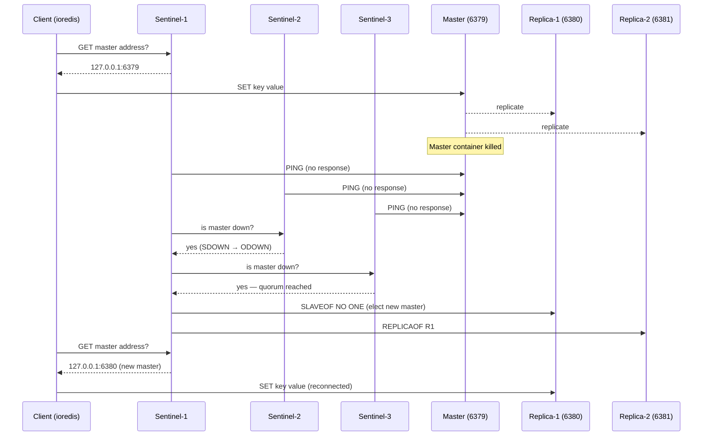

# POC: Redis Sentinel Failover

## 🗺️ Quick Overview



*Full sentinel failover sequence: client writes to master, master dies, sentinels reach quorum, a replica is promoted, and the client transparently reconnects.*

## What You'll Build

A 6-container Redis topology: 1 master + 2 replicas + 3 sentinel nodes. You will write data to the master, kill the master container mid-write, then watch the sentinels elect a new master within 10-30 seconds. A Node.js client using `ioredis` with sentinel support reconnects automatically and resumes writes — zero manual intervention.

## Why This Matters

- **Instagram**: Ran Redis Sentinel for all cache HA before migrating to Redis Cluster; Sentinel handled automatic failover during rolling deploys with no downtime.
- **GitHub**: Uses Redis Sentinel for session storage, requiring fast failover (< 30 s) so deploys don't log users out.
- **Shopify**: Sentinel-backed Redis powers flash-sale cart locking; quorum configuration ensures split-brain doesn't corrupt inventory counts.

---

## Prerequisites

- Docker Desktop installed and running
- Node.js 18+ (for the client script)
- `npm` available
- 5-10 minutes

---

## Setup

### docker-compose.yml

```yaml
version: '3.8'

networks:
  redis-net:
    driver: bridge

services:

  # ── Master ─────────────────────────────────────────────────────────────────
  redis-master:
    image: redis:7.2-alpine
    container_name: redis-master
    networks:
      - redis-net
    ports:
      - "6379:6379"
    command: >
      redis-server
      --port 6379
      --save ""
      --appendonly no
      --loglevel notice

  # ── Replica 1 ──────────────────────────────────────────────────────────────
  redis-replica-1:
    image: redis:7.2-alpine
    container_name: redis-replica-1
    networks:
      - redis-net
    ports:
      - "6380:6380"
    depends_on:
      - redis-master
    command: >
      redis-server
      --port 6380
      --replicaof redis-master 6379
      --save ""
      --appendonly no
      --loglevel notice

  # ── Replica 2 ──────────────────────────────────────────────────────────────
  redis-replica-2:
    image: redis:7.2-alpine
    container_name: redis-replica-2
    networks:
      - redis-net
    ports:
      - "6381:6381"
    depends_on:
      - redis-master
    command: >
      redis-server
      --port 6381
      --replicaof redis-master 6379
      --save ""
      --appendonly no
      --loglevel notice

  # ── Sentinel 1 ─────────────────────────────────────────────────────────────
  redis-sentinel-1:
    image: redis:7.2-alpine
    container_name: redis-sentinel-1
    networks:
      - redis-net
    ports:
      - "26379:26379"
    depends_on:
      - redis-master
      - redis-replica-1
      - redis-replica-2
    command: >
      redis-sentinel /etc/redis/sentinel.conf
    volumes:
      - ./sentinel.conf:/etc/redis/sentinel.conf

  # ── Sentinel 2 ─────────────────────────────────────────────────────────────
  redis-sentinel-2:
    image: redis:7.2-alpine
    container_name: redis-sentinel-2
    networks:
      - redis-net
    ports:
      - "26380:26380"
    depends_on:
      - redis-master
      - redis-replica-1
      - redis-replica-2
    command: >
      redis-sentinel /etc/redis/sentinel.conf
    volumes:
      - ./sentinel.conf:/etc/redis/sentinel.conf

  # ── Sentinel 3 ─────────────────────────────────────────────────────────────
  redis-sentinel-3:
    image: redis:7.2-alpine
    container_name: redis-sentinel-3
    networks:
      - redis-net
    ports:
      - "26381:26381"
    depends_on:
      - redis-master
      - redis-replica-1
      - redis-replica-2
    command: >
      redis-sentinel /etc/redis/sentinel.conf
    volumes:
      - ./sentinel.conf:/etc/redis/sentinel.conf
```

### sentinel.conf

Create this file alongside `docker-compose.yml`:

```conf
# sentinel.conf
# Each sentinel monitors the master named "mymaster"
sentinel monitor mymaster redis-master 6379 2

# Mark master as subjectively down after 5 seconds of no response
sentinel down-after-milliseconds mymaster 5000

# How many replicas to reconfigure in parallel during failover
sentinel parallel-syncs mymaster 1

# Failover times out after 10 seconds — retry after 20 seconds
sentinel failover-timeout mymaster 10000

# Sentinel listens on default port (overridden per container via port mapping)
port 26379
```

> **Quorum = 2**: At least 2 of 3 sentinels must agree that the master is down before an ODOWN (objectively down) state is declared and failover begins.

### Start the cluster

```bash
docker-compose up -d

# Verify all 6 containers are running
docker-compose ps
# Expected output (all State = Up):
# redis-master       Up  0.0.0.0:6379->6379/tcp
# redis-replica-1    Up  0.0.0.0:6380->6380/tcp
# redis-replica-2    Up  0.0.0.0:6381->6381/tcp
# redis-sentinel-1   Up  0.0.0.0:26379->26379/tcp
# redis-sentinel-2   Up  0.0.0.0:26380->26380/tcp
# redis-sentinel-3   Up  0.0.0.0:26381->26381/tcp
```

---

## Step-by-Step

### Step 1: Verify replication is working

```bash
# Check master knows about both replicas
docker exec redis-master redis-cli -p 6379 INFO replication
# Expected:
# role:master
# connected_slaves:2
# slave0:ip=172.x.x.x,port=6380,state=online,offset=...,lag=0
# slave1:ip=172.x.x.x,port=6381,state=online,offset=...,lag=0

# Check replica-1 is synced
docker exec redis-replica-1 redis-cli -p 6380 INFO replication
# Expected:
# role:slave
# master_host:redis-master
# master_port:6379
# master_link_status:up
# master_repl_offset:<number>
# slave_repl_offset:<same number>     ← lag=0 means fully synced
```

### Step 2: Query sentinels for master address

```bash
# Ask sentinel-1 who the current master is
docker exec redis-sentinel-1 redis-cli -p 26379 SENTINEL masters
# Returns details including:
# name: mymaster
# ip: redis-master  (or resolved IP)
# port: 6379
# flags: master
# num-slaves: 2
# num-other-sentinels: 2

# Programmatic lookup (used by clients)
docker exec redis-sentinel-1 redis-cli -p 26379 SENTINEL get-master-addr-by-name mymaster
# Expected:
# 1) "172.x.x.x"   ← master IP inside Docker network
# 2) "6379"
```

### Step 3: Write data to master

```bash
# Write test keys
docker exec redis-master redis-cli -p 6379 SET before_failover "value_written_before"
# OK

docker exec redis-master redis-cli -p 6379 SET counter 0
# OK

# Verify replicated to replica-1 immediately
docker exec redis-replica-1 redis-cli -p 6380 GET before_failover
# Expected: "value_written_before"
```

### Step 4: Start the Node.js client

Create a project directory alongside your `docker-compose.yml`:

```bash
mkdir client && cd client
npm init -y
npm install ioredis
```

Create `client/sentinel-client.js`:

```javascript
// sentinel-client.js
// Demonstrates ioredis connecting via Sentinel with automatic failover

const Redis = require('ioredis');

const redis = new Redis({
  sentinels: [
    { host: '127.0.0.1', port: 26379 },
    { host: '127.0.0.1', port: 26380 },
    { host: '127.0.0.1', port: 26381 },
  ],
  name: 'mymaster',       // must match sentinel.conf "sentinel monitor <name>"
  sentinelRetryStrategy: (times) => Math.min(times * 200, 5000),
  retryStrategy: (times) => {
    if (times > 20) return null;  // stop retrying after 20 attempts
    return Math.min(times * 500, 3000);
  },
  enableOfflineQueue: true,  // buffer commands while reconnecting
});

redis.on('connect', () => console.log('[client] Connected to master'));
redis.on('reconnecting', (ms) => console.log(`[client] Reconnecting in ${ms}ms...`));
redis.on('+switch-master', (name, oldHost, oldPort, newHost, newPort) => {
  console.log(`[sentinel] Master switched: ${oldHost}:${oldPort} → ${newHost}:${newPort}`);
});
redis.on('error', (err) => console.error('[client] Error:', err.message));

// Counter that keeps incrementing — proves writes resume after failover
async function runContinuousWrites() {
  let i = 0;
  while (true) {
    try {
      const val = await redis.incr('counter');
      console.log(`[write] counter = ${val}`);
    } catch (err) {
      console.error(`[write] Failed (counter=${i}):`, err.message);
    }
    await new Promise(r => setTimeout(r, 1000));
    i++;
  }
}

runContinuousWrites().catch(console.error);
```

Run the client in one terminal:

```bash
node client/sentinel-client.js
# Expected output every second:
# [client] Connected to master
# [write] counter = 1
# [write] counter = 2
# [write] counter = 3
# ...
```

### Step 5: Trigger failover — kill the master

In a **second terminal**, while the client is still writing:

```bash
docker stop redis-master
# Container stops immediately — sentinels begin SDOWN countdown (5s)
```

Watch the client terminal. After 5-30 seconds you should see:

```
[write] Failed (counter=7): Stream isn't writeable and enableOfflineQueue options is false
[client] Reconnecting in 500ms...
[client] Reconnecting in 1000ms...
[sentinel] Master switched: 172.x.x.x:6379 → 172.x.x.x:6380
[client] Connected to master
[write] counter = 8
[write] counter = 9
```

> Writes buffered during failover are replayed once the new master is elected. The `counter` increments continue without gaps.

### Step 6: Confirm new master in sentinels

```bash
# Sentinel now reports replica-1 (or replica-2) as the master
docker exec redis-sentinel-1 redis-cli -p 26379 SENTINEL get-master-addr-by-name mymaster
# Expected: port is now 6380 or 6381 (no longer 6379)

# New master reports role=master
docker exec redis-replica-1 redis-cli -p 6380 INFO replication
# role:master
# connected_slaves:1  ← the surviving replica is now its slave

# Check that the key written before failover survived
docker exec redis-replica-1 redis-cli -p 6380 GET before_failover
# Expected: "value_written_before"  ← data not lost (was replicated before master died)
```

### Step 7: Restore old master as a replica

```bash
docker start redis-master

# After a few seconds, old master rejoins as a replica of the new master
docker exec redis-master redis-cli -p 6379 INFO replication
# role:slave
# master_host:172.x.x.x
# master_port:6380   ← now follows the newly elected master
```

---

## What to Observe

| Metric | Command | What to Look For |
|--------|---------|-----------------|
| Replication lag | `INFO replication` on any replica | `slave_repl_offset` matches `master_repl_offset` |
| Sentinel state | `SENTINEL masters` | `flags: master` (not `s_down` or `o_down`) |
| Failover duration | client terminal timestamps | Gap between last successful write and first write to new master |
| Buffered commands | client terminal | No gap in `counter` values after reconnect |
| Sentinel election log | `docker logs redis-sentinel-1` | Lines containing `+vote-for-leader`, `+elected-leader`, `+failover-state-send-slaveof-noone` |

**Typical failover time**: 10-30 seconds — dominated by `down-after-milliseconds` (5 s in this POC) + election + replica sync. Production clusters lower this to 3-5 s at the cost of more false positives during network blips.

---

## What Breaks It

### Break 1 — Kill 2 of 3 sentinels (quorum fails)

```bash
# Kill 2 sentinels — only 1 remains, quorum of 2 can't be reached
docker stop redis-sentinel-1 redis-sentinel-2

# Now kill the master
docker stop redis-master

# Observe: the single surviving sentinel detects SDOWN but cannot reach ODOWN
docker logs redis-sentinel-3 --tail 20
# +sdown master mymaster ... ← subjectively down
# (no +odown line — quorum not reached)

# Client keeps reconnecting but failover NEVER happens
# This is the split-brain protection: it's better to go unavailable
# than to risk two masters being elected simultaneously.

# Fix: restart sentinels
docker start redis-sentinel-1 redis-sentinel-2
# Failover proceeds within seconds once quorum is restored
```

### Break 2 — Replication lag causes data loss

```bash
# Simulate a lagging replica by adding artificial delay
# (In production, caused by slow networks or large keyspaces)
docker exec redis-master redis-cli -p 6379 DEBUG SLEEP 0  # no-op here
# Real scenario: check lag before failover
docker exec redis-replica-1 redis-cli -p 6380 INFO replication | grep lag
# slave0:...,lag=3  ← 3-second lag means up to 3 seconds of data lost on failover

# Mitigation: set min-replicas-to-write / min-replicas-max-lag in master config
# so master refuses writes when replicas are too far behind
```

### Break 3 — Client not using sentinel-aware driver

```bash
# Hard-coded IP clients (bad pattern) break on failover:
redis-cli -h 127.0.0.1 -p 6379 SET foo bar
# After failover: READONLY You can't write against a read only replica (if old master rejoin)
# or: Connection refused (if old master still down)

# Always use sentinel-aware clients: ioredis (Node.js), redis-py sentinel (Python),
# Jedis SentinelPool (Java), StackExchange.Redis (C#)
```

---

## Extend It

1. **Lower `down-after-milliseconds` to 1000** and re-run the failover test — measure how much faster failover completes and check if you see any false positives (sentinel logs showing `+sdown` on healthy masters under load).

2. **Add a Python client** using `redis-py` sentinel support for polyglot comparison:
   ```python
   from redis.sentinel import Sentinel
   sentinel = Sentinel([('localhost', 26379), ('localhost', 26380), ('localhost', 26381)], socket_timeout=0.1)
   master = sentinel.master_for('mymaster', socket_timeout=0.1)
   master.set('py_key', 'hello from python')
   ```

3. **Add `min-replicas-to-write 1` and `min-replicas-max-lag 10`** to the master config — kill both replicas and see the master refuse writes to prevent data loss scenarios on the next failover.

4. **Benchmark replication throughput**: use `redis-benchmark -h 127.0.0.1 -p 6379 -n 100000 -c 50 -q` and observe replica lag under load via `INFO replication`.

5. **Explore Redis Cluster as the next step**: Sentinel gives HA for a single shard; Redis Cluster adds horizontal sharding across multiple master-replica pairs for both HA and scale-out.

---

## Key Takeaways

- **Failover takes 10-30 seconds** by default (`down-after-milliseconds` 5 s + election + sync); production clusters tune this to 3-5 s by accepting slightly more false-positive failovers.
- **Quorum = majority of sentinels**: with 3 sentinels you need quorum 2; killing 2 sentinels freezes failover — this is intentional split-brain protection, not a bug.
- **Use sentinel-aware clients**: `ioredis`, `redis-py Sentinel`, `Jedis SentinelPool` — hard-coded IPs break silently after failover; the sentinel API (`get-master-addr-by-name`) is the single source of truth.
- **Replication is async by default**: up to `down-after-milliseconds` worth of writes can be lost on abrupt master failure; use `min-replicas-to-write` to trade availability for durability.
- **Instagram's path**: used Sentinel for Redis HA for years before Redis Cluster existed; moved to Cluster only when they needed horizontal sharding beyond a single master's write throughput (~1M ops/sec on a single node).

---

## References

- 📚 [Redis Sentinel Documentation](https://redis.io/docs/management/sentinel/) — official configuration reference and guarantees
- 📖 [Instagram Engineering: Storing Hundreds of Millions of Simple Key-Value Pairs in Redis](https://instagram-engineering.com/storing-hundreds-of-millions-of-simple-key-value-pairs-in-redis-1091ae80f74c) — how Instagram scaled Redis before Cluster
- 📺 [Redis Replication and High Availability — Redis University](https://university.redis.com/) — hands-on course covering Sentinel, Cluster, and replication internals
- 📖 [ioredis Sentinel Support](https://github.com/redis/ioredis#sentinel) — client configuration options and reconnect behavior
