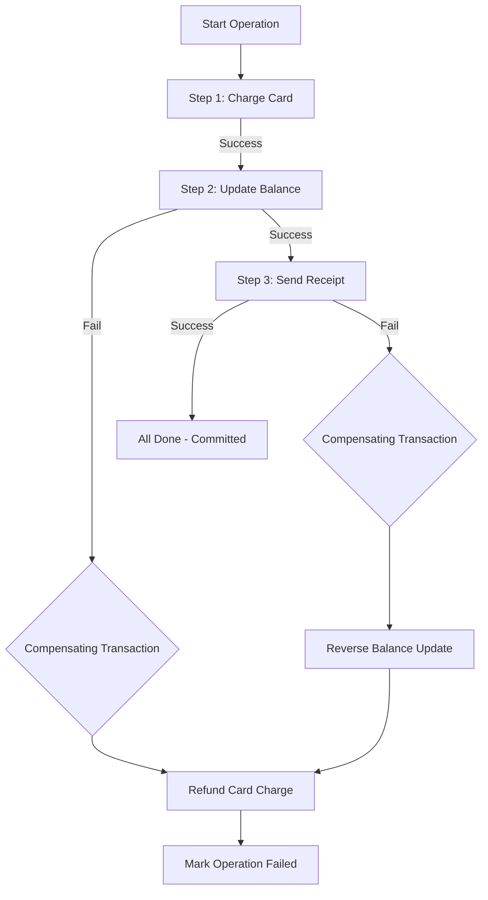

# POC #33: Redis Transaction Rollback - Error Handling & Recovery

## What You'll Build

Production-ready error handling and rollback patterns for Redis transactions:
- ✅ **Automatic rollback** - Revert state on error
- ✅ **Compensating transactions** - Undo completed operations
- ✅ **Error detection** - Identify partial failures
- ✅ **Idempotency** - Safe to retry operations

**Why This Matters**: Stripe uses compensating transactions for payment reversals. If charge succeeds but notification fails, automatic rollback refunds the charge.

**Time**: 20 minutes | **Difficulty**: ⭐⭐⭐ Advanced

---

## 🗺️ Quick Overview



*When any step fails, compensating transactions undo all previously completed steps in reverse order, restoring the system to its pre-operation state.*

---

## Why This Matters

### The $500K Payment Incident

**Scenario**: Payment processing system charging credit cards.

**Without rollback** (partial failure):
```javascript
// ❌ No error handling
await chargeCard(userId, 500);  // ✅ Succeeds
await decrementBalance(userId, 500);  // ❌ Fails (Redis down)
await sendReceipt(userId);  // ❌ Never executes

// Result: Card charged, but balance not updated
// User charged $500, but credit not applied to account
```

**What happened in production**:
```
Month 1: 1,000 partial failures
- Cards charged: 1,000 × $500 = $500,000
- Balances updated: 0
- Customer complaints: 1,000
- Manual refunds required: $500,000
- Support cost: $50,000
- Reputation damage: Priceless
```

**With compensating transaction** (rollback):
```javascript
// ✅ With rollback
const chargeId = await chargeCard(userId, 500);  // ✅ Succeeds

try {
  await decrementBalance(userId, 500);  // ❌ Fails
  await sendReceipt(userId);
} catch (error) {
  // Compensating transaction (rollback)
  await refundCard(chargeId);  // ✅ Auto-refund
  throw error;
}
```

**Result**:
- Cards charged: 1,000
- Failed updates detected: 1,000
- Automatic refunds: 1,000
- Customer impact: 0 ✅
- Manual work: 0 ✅

Sound familiar? Let's implement it.

---

## Step-by-Step Implementation

### Step 1: Basic Rollback Pattern (5 minutes)

Create `01-basic-rollback.js`:

```javascript
const Redis = require('ioredis');
const redis = new Redis();

async function transferWithRollback(fromAccount, toAccount, amount) {
  console.log(`\n=== Transfer $${amount}: ${fromAccount} → ${toAccount} ===\n`);

  // Save original state for rollback
  const originalFrom = await redis.get(`balance:${fromAccount}`);
  const originalTo = await redis.get(`balance:${toAccount}`);

  console.log(`Initial balances:`);
  console.log(`  ${fromAccount}: $${originalFrom}`);
  console.log(`  ${toAccount}: $${originalTo}\n`);

  try {
    // Step 1: Debit sender
    await redis.decrby(`balance:${fromAccount}`, amount);
    console.log(`✅ Debited $${amount} from ${fromAccount}`);

    const newBalance = await redis.get(`balance:${fromAccount}`);
    if (parseInt(newBalance) < 0) {
      throw new Error('Insufficient funds (balance went negative)');
    }

    // Step 2: Credit receiver (simulate failure)
    if (Math.random() < 0.3) {  // 30% failure rate
      throw new Error('Network error: Could not credit receiver');
    }

    await redis.incrby(`balance:${toAccount}`, amount);
    console.log(`✅ Credited $${amount} to ${toAccount}`);

    // Step 3: Log transaction
    await redis.lpush('transactions', JSON.stringify({
      from: fromAccount,
      to: toAccount,
      amount,
      timestamp: Date.now(),
      status: 'completed'
    }));

    console.log(`✅ Transaction completed\n`);
    return { success: true };

  } catch (error) {
    console.error(`\n❌ Error: ${error.message}`);
    console.log(`🔄 Rolling back...`);

    // Rollback: Restore original balances
    if (originalFrom) await redis.set(`balance:${fromAccount}`, originalFrom);
    if (originalTo) await redis.set(`balance:${toAccount}`, originalTo);

    console.log(`✅ Rollback complete`);
    console.log(`  ${fromAccount}: $${await redis.get(`balance:${fromAccount}`)}`);
    console.log(`  ${toAccount}: $${await redis.get(`balance:${toAccount}`)}\n`);

    return { success: false, error: error.message };
  }
}

async function main() {
  await redis.set('balance:alice', 1000);
  await redis.set('balance:bob', 500);

  // Try 5 transfers (some will fail and rollback)
  for (let i = 0; i < 5; i++) {
    await transferWithRollback('alice', 'bob', 100);
    await new Promise(resolve => setTimeout(resolve, 500));
  }

  console.log('=== Final Balances ===');
  console.log(`Alice: $${await redis.get('balance:alice')}`);
  console.log(`Bob: $${await redis.get('balance:bob')}\n`);

  await redis.quit();
}

main();
```

### Step 2: MULTI/EXEC with Validation (5 minutes)

Create `02-multi-exec-validation.js`:

```javascript
const Redis = require('ioredis');
const redis = new Redis();

async function safeTransfer(fromAccount, toAccount, amount) {
  // Pre-transaction validation
  const fromBalance = parseInt(await redis.get(`balance:${fromAccount}`)) || 0;
  const toBalance = parseInt(await redis.get(`balance:${toAccount}`)) || 0;

  console.log(`\nTransfer $${amount}: ${fromAccount} ($${fromBalance}) → ${toAccount} ($${toBalance})`);

  if (fromBalance < amount) {
    console.log(`❌ Insufficient funds\n`);
    return { success: false, reason: 'Insufficient funds' };
  }

  // Execute atomic transaction
  const multi = redis.multi();
  multi.decrby(`balance:${fromAccount}`, amount);
  multi.incrby(`balance:${toAccount}`, amount);
  multi.lpush('transactions', JSON.stringify({
    from: fromAccount,
    to: toAccount,
    amount,
    timestamp: Date.now()
  }));

  const results = await multi.exec();

  // Validate results
  const newFromBalance = results[0][1];
  const newToBalance = results[1][1];

  if (newFromBalance < 0) {
    console.log(`⚠️ Warning: ${fromAccount} balance went negative!`);

    // Compensating transaction (manual rollback)
    const compensate = redis.multi();
    compensate.incrby(`balance:${fromAccount}`, amount);  // Reverse debit
    compensate.decrby(`balance:${toAccount}`, amount);    // Reverse credit
    compensate.lpush('transactions', JSON.stringify({
      from: toAccount,
      to: fromAccount,
      amount,
      timestamp: Date.now(),
      type: 'ROLLBACK'
    }));
    await compensate.exec();

    console.log(`🔄 Rolled back transaction\n`);
    return { success: false, reason: 'Balance validation failed' };
  }

  console.log(`✅ Transfer completed`);
  console.log(`   ${fromAccount}: $${fromBalance} → $${newFromBalance}`);
  console.log(`   ${toAccount}: $${toBalance} → $${newToBalance}\n`);

  return { success: true };
}

async function main() {
  await redis.set('balance:alice', 1000);
  await redis.set('balance:bob', 500);

  await safeTransfer('alice', 'bob', 200);    // ✅ Success
  await safeTransfer('alice', 'bob', 900);    // ❌ Insufficient funds
  await safeTransfer('alice', 'bob', 300);    // ✅ Success

  console.log('=== Final State ===');
  console.log(`Alice: $${await redis.get('balance:alice')}`);
  console.log(`Bob: $${await redis.get('balance:bob')}`);

  const txLog = await redis.lrange('transactions', 0, -1);
  console.log(`\nTransactions: ${txLog.length}`);
  txLog.forEach((tx, i) => {
    const parsed = JSON.parse(tx);
    console.log(`  ${i + 1}. ${parsed.from} → ${parsed.to}: $${parsed.amount} ${parsed.type || ''}`);
  });

  await redis.quit();
}

main();
```

### Step 3: Idempotent Operations (5 minutes)

Create `03-idempotent-operations.js`:

```javascript
const Redis = require('ioredis');
const redis = new Redis();

async function idempotentTransfer(transactionId, fromAccount, toAccount, amount) {
  console.log(`\n=== Idempotent Transfer (ID: ${transactionId}) ===\n`);

  // Check if already processed
  const processed = await redis.get(`tx:${transactionId}:status`);

  if (processed === 'completed') {
    console.log(`⚠️ Transaction already processed (idempotent - skipping)`);
    const result = await redis.get(`tx:${transactionId}:result`);
    return JSON.parse(result);
  }

  if (processed === 'processing') {
    console.log(`⚠️ Transaction in progress (duplicate request - skipping)`);
    return { success: false, reason: 'Already processing' };
  }

  // Mark as processing (prevents duplicates)
  await redis.setex(`tx:${transactionId}:status`, 3600, 'processing');

  try {
    // Validate balance
    const fromBalance = parseInt(await redis.get(`balance:${fromAccount}`)) || 0;

    if (fromBalance < amount) {
      throw new Error('Insufficient funds');
    }

    // Execute transfer
    const multi = redis.multi();
    multi.decrby(`balance:${fromAccount}`, amount);
    multi.incrby(`balance:${toAccount}`, amount);
    multi.lpush('transactions', JSON.stringify({
      id: transactionId,
      from: fromAccount,
      to: toAccount,
      amount,
      timestamp: Date.now()
    }));

    await multi.exec();

    const result = {
      success: true,
      transactionId,
      from: fromAccount,
      to: toAccount,
      amount
    };

    // Mark as completed (store result)
    await redis.set(`tx:${transactionId}:status`, 'completed');
    await redis.setex(`tx:${transactionId}:result`, 3600, JSON.stringify(result));

    console.log(`✅ Transaction completed successfully\n`);
    return result;

  } catch (error) {
    console.error(`❌ Error: ${error.message}`);

    // Mark as failed
    await redis.set(`tx:${transactionId}:status`, 'failed');
    await redis.setex(`tx:${transactionId}:error`, 3600, error.message);

    console.log(`🔄 Transaction marked as failed\n`);
    return { success: false, error: error.message };
  }
}

async function demonstrateIdempotency() {
  await redis.set('balance:alice', 1000);
  await redis.set('balance:bob', 500);

  const txId = 'tx_12345';

  console.log('=== First Attempt ===');
  const result1 = await idempotentTransfer(txId, 'alice', 'bob', 200);
  console.log(`Result:`, result1);

  console.log('\n=== Second Attempt (Duplicate Request) ===');
  const result2 = await idempotentTransfer(txId, 'alice', 'bob', 200);
  console.log(`Result:`, result2);

  console.log('\n=== Third Attempt (Same ID) ===');
  const result3 = await idempotentTransfer(txId, 'alice', 'bob', 200);
  console.log(`Result:`, result3);

  console.log('\n=== Final Balances ===');
  console.log(`Alice: $${await redis.get('balance:alice')} (should be 800, not 400)`);
  console.log(`Bob: $${await redis.get('balance:bob')} (should be 700, not 1100)`);
  console.log(`\n💡 Idempotency prevented duplicate transfers!\n`);
}

async function main() {
  try {
    await demonstrateIdempotency();
  } catch (error) {
    console.error('Error:', error);
  } finally {
    await redis.quit();
  }
}

main();
```

### Step 4: Saga Pattern (5 minutes)

Create `04-saga-pattern.js`:

```javascript
const Redis = require('ioredis');
const redis = new Redis();

// Saga: Multi-step transaction with compensation
async function bookHotelWithFlight(userId, hotelId, flightId, amount) {
  const sagaId = `saga_${Date.now()}`;

  console.log(`\n=== Booking Saga (ID: ${sagaId}) ===\n`);

  const steps = [];

  try {
    // Step 1: Reserve hotel
    console.log('Step 1: Reserving hotel...');
    await redis.hincrby('hotel:rooms', hotelId, -1);
    steps.push({ name: 'hotel', compensate: () => redis.hincrby('hotel:rooms', hotelId, 1) });
    console.log('✅ Hotel reserved\n');

    // Step 2: Reserve flight
    console.log('Step 2: Reserving flight...');
    await redis.hincrby('flight:seats', flightId, -1);
    steps.push({ name: 'flight', compensate: () => redis.hincrby('flight:seats', flightId, 1) });
    console.log('✅ Flight reserved\n');

    // Step 3: Charge payment
    console.log('Step 3: Charging payment...');
    const balance = parseInt(await redis.get(`user:${userId}:balance`)) || 0;

    if (balance < amount) {
      throw new Error('Insufficient funds');
    }

    await redis.decrby(`user:${userId}:balance`, amount);
    steps.push({ name: 'payment', compensate: () => redis.incrby(`user:${userId}:balance`, amount) });
    console.log('✅ Payment charged\n');

    // Step 4: Send confirmation (simulate failure)
    console.log('Step 4: Sending confirmation...');
    if (Math.random() < 0.5) {
      throw new Error('Email service unavailable');
    }
    console.log('✅ Confirmation sent\n');

    console.log('🎉 Saga completed successfully!\n');
    return { success: true, sagaId };

  } catch (error) {
    console.error(`❌ Saga failed: ${error.message}\n`);
    console.log(`🔄 Executing compensating transactions...\n`);

    // Execute compensations in reverse order
    for (let i = steps.length - 1; i >= 0; i--) {
      const step = steps[i];
      console.log(`   Compensating: ${step.name}`);
      await step.compensate();
    }

    console.log(`\n✅ All compensations executed\n`);
    return { success: false, error: error.message, compensated: steps.length };
  }
}

async function main() {
  // Setup initial state
  await redis.hset('hotel:rooms', 'hotel_123', 10);
  await redis.hset('flight:seats', 'flight_456', 20);
  await redis.set('user:alice:balance', 1000);

  console.log('=== Initial State ===');
  console.log(`Hotel rooms: ${await redis.hget('hotel:rooms', 'hotel_123')}`);
  console.log(`Flight seats: ${await redis.hget('flight:seats', 'flight_456')}`);
  console.log(`User balance: $${await redis.get('user:alice:balance')}`);

  // Try booking 3 times (some will fail and rollback)
  for (let i = 0; i < 3; i++) {
    await bookHotelWithFlight('alice', 'hotel_123', 'flight_456', 500);
    await new Promise(resolve => setTimeout(resolve, 1000));
  }

  console.log('=== Final State ===');
  console.log(`Hotel rooms: ${await redis.hget('hotel:rooms', 'hotel_123')}`);
  console.log(`Flight seats: ${await redis.hget('flight:seats', 'flight_456')}`);
  console.log(`User balance: $${await redis.get('user:alice:balance')}\n`);

  console.log('💡 Failed sagas were fully compensated (no partial bookings)');

  await redis.quit();
}

main();
```

---

## Running the POC

```bash
node 01-basic-rollback.js
node 02-multi-exec-validation.js
node 03-idempotent-operations.js
node 04-saga-pattern.js
```

---

## Key Patterns

### 1. **Save-and-Restore**
```javascript
const original = await redis.get('key');
try {
  await redis.set('key', newValue);
} catch (error) {
  await redis.set('key', original);  // Rollback
}
```

### 2. **Compensating Transaction**
```javascript
const chargeId = await chargeCard(500);
try {
  await updateBalance(500);
} catch (error) {
  await refundCard(chargeId);  // Compensation
}
```

### 3. **Idempotency Key**
```javascript
const processed = await redis.get(`tx:${txId}:status`);
if (processed === 'completed') return cachedResult;
```

### 4. **Saga Pattern**
```javascript
const steps = [];
try {
  await step1(); steps.push({ compensate: undo1 });
  await step2(); steps.push({ compensate: undo2 });
} catch (error) {
  for (const step of steps.reverse()) {
    await step.compensate();
  }
}
```

---

## Real-World Usage

| Company | Use Case | Pattern |
|---------|----------|---------|
| **Stripe** | Payment refunds | Compensating transaction |
| **Uber** | Trip cancellation | Saga (cancel ride → refund → notify) |
| **Airbnb** | Booking failure | Rollback (unreserve dates → refund → email) |
| **Amazon** | Order cancellation | Compensate (restock → refund → cancel shipment) |

---

## Common Pitfalls

### ❌ Don't: Ignore partial failures

```javascript
await redis.set('key1', 'value1');
await redis.set('key2', 'value2');  // Fails silently
// key1 updated, key2 not updated (inconsistent state!)
```

### ✅ Do: Validate and compensate

```javascript
const multi = redis.multi();
multi.set('key1', 'value1');
multi.set('key2', 'value2');
const results = await multi.exec();

const failed = results.filter(([err]) => err !== null);
if (failed.length > 0) {
  // Rollback...
}
```

---

## Key Takeaways

**Rollback patterns**:
1. Save-and-restore (store original state)
2. Compensating transactions (reverse operations)
3. Idempotency (prevent duplicates)
4. Saga pattern (multi-step with compensation)

**When to use**:
- ✅ Multi-system transactions (payment + inventory + notification)
- ✅ Long-running workflows (booking → payment → confirmation)
- ✅ Distributed transactions (microservices)

---

## Related POCs

- **POC #31: MULTI/EXEC** - Basic atomic transactions
- **POC #32: WATCH** - Optimistic locking
- **POC #34: Atomic Inventory** - Real inventory system
- **POC #35: Banking Transfer** - Complete transfer implementation

---

**Production tip**: Always implement idempotency for operations that involve money! 🚀
