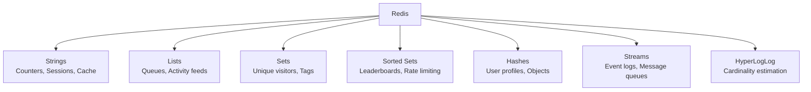

# Redis

Redis is the Swiss Army knife of backend engineering — cache, queue, pub/sub, rate limiter, session store, and distributed lock, all in one. This section covers Redis deeply, from data structures to production cluster management.

## Navigate by Role

| I am... | Start here | Goal |
|---------|-----------|------|
| 🟢 Junior | [Data Structures Deep Dive](./concepts/redis-data-structures-deep-dive) | Understand Redis data structures and basic usage |
| 🟡 Mid-level | [Pub/Sub vs Streams](./concepts/redis-pub-sub-vs-streams) + [Session Management](./hands-on/redis-session-management) | Use Redis for caching, sessions, pub/sub, and rate limiting |
| 🔴 Senior / TL | [Cluster vs Sentinel](./concepts/redis-cluster-vs-sentinel) + [Eviction Policies](./concepts/redis-eviction-policies) + [Distributed Locking](./concepts/redis-distributed-locking) | Production Redis: cluster, persistence, eviction, and failure modes |
| 🏆 Interview prepping | [Rate Limiting Patterns](./concepts/redis-rate-limiting-patterns) + [Persistence: RDB vs AOF](./concepts/redis-persistence-rdb-aof) | Key Redis numbers, trade-offs, and patterns |

## Topic Map

| Topic | 📖 Concept | 🔬 Hands-On |
|-------|-----------|------------|
| Data Structures | [Data Structures Deep Dive](./concepts/redis-data-structures-deep-dive) | [Key-Value Cache](./hands-on/redis-key-value-cache), [Atomic Counter](./hands-on/redis-counter), [Leaderboard](./hands-on/redis-leaderboard), [HyperLogLog](./hands-on/redis-hyperloglog) |
| Persistence | [Persistence: RDB vs AOF](./concepts/redis-persistence-rdb-aof) | [Persistence Strategies](./hands-on/redis-persistence-strategies) |
| Clustering | [Cluster vs Sentinel](./concepts/redis-cluster-vs-sentinel) | [Cluster Caching](./hands-on/redis-cluster-caching), [Cluster Sharding](./hands-on/redis-cluster-sharding) |
| Eviction | [Eviction Policies](./concepts/redis-eviction-policies) | — |
| Pub/Sub & Streams | [Pub/Sub vs Streams](./concepts/redis-pub-sub-vs-streams) | [Pub/Sub](./hands-on/redis-pubsub), [Pub/Sub Patterns](./hands-on/redis-pubsub-patterns), [Streams](./hands-on/redis-streams), [Streams & Event Sourcing](./hands-on/redis-streams-event-sourcing) |
| Distributed Locking | [Distributed Locking](./concepts/redis-distributed-locking) | [Distributed Lock](./hands-on/redis-distributed-lock), [WATCH & Optimistic Locking](./hands-on/redis-watch-optimistic-locking) |
| Rate Limiting | [Rate Limiting Patterns](./concepts/redis-rate-limiting-patterns) | [Rate Limiting](./hands-on/redis-rate-limiting), [Lua Rate Limiting](./hands-on/redis-lua-rate-limiting) |
| Sessions & Jobs | — | [Session Management](./hands-on/redis-session-management), [Job Queue](./hands-on/redis-job-queue) |
| Transactions | — | [Transactions (MULTI/EXEC)](./hands-on/redis-transactions-multi-exec), [Transaction Rollback](./hands-on/redis-transaction-rollback), [Banking Transfers](./hands-on/redis-banking-transfers), [Atomic Inventory](./hands-on/redis-atomic-inventory) |
| Lua Scripting | — | [Lua Scripting Basics](./hands-on/redis-lua-scripting-basics), [Lua Leaderboards](./hands-on/redis-lua-leaderboards), [Lua Workflows](./hands-on/redis-lua-workflows), [Lua Performance Benchmarks](./hands-on/redis-lua-performance-benchmarks) |
| Deduplication | — | [Deduplication](./hands-on/redis-deduplication) |
| Monitoring | — | [Monitoring & Performance](./hands-on/redis-monitoring-performance) |

## What You'll Learn

- **Concepts**: Data structures, persistence, clustering, eviction, pub/sub vs streams
- **Hands-On**: 27 practical POCs covering every major Redis use case
- **Failures**: Common Redis production pitfalls

## Where to Start

1. [Data Structures Deep Dive](/03-redis/concepts/redis-data-structures-deep-dive) — Strings, Hashes, Lists, Sets, Sorted Sets
2. [Key-Value Cache](/03-redis/hands-on/redis-key-value-cache) — Your first Redis program
3. [Distributed Lock](/03-redis/hands-on/redis-distributed-lock) — Coordinating across services
