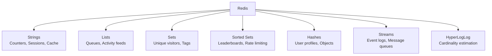

# Redis

Redis is the Swiss Army knife of backend engineering — cache, queue, pub/sub, rate limiter, session store, and distributed lock, all in one. This section covers Redis deeply, from data structures to production cluster management.

## What You'll Learn

- **Concepts**: Data structures, persistence, clustering, eviction, pub/sub vs streams
- **Hands-On**: 27 practical POCs covering every major Redis use case
- **Failures**: Common Redis production pitfalls

## Where to Start

1. [Data Structures Deep Dive](/03-redis/concepts/redis-data-structures-deep-dive) — Strings, Hashes, Lists, Sets, Sorted Sets
2. [Key-Value Cache](/03-redis/hands-on/redis-key-value-cache) — Your first Redis program
3. [Distributed Lock](/03-redis/hands-on/redis-distributed-lock) — Coordinating across services
