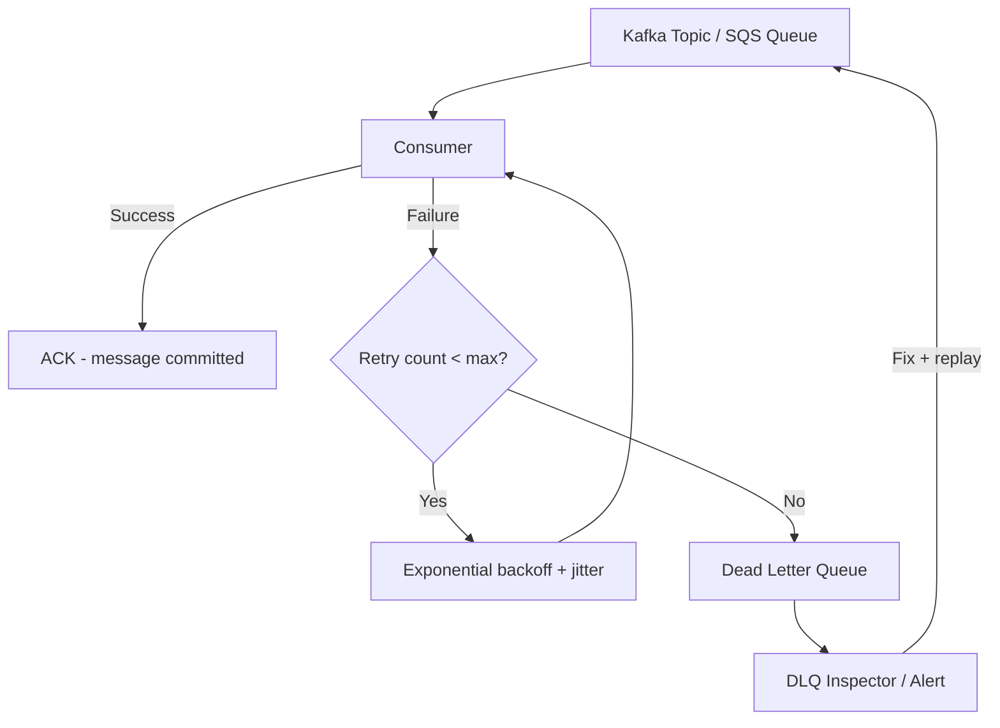
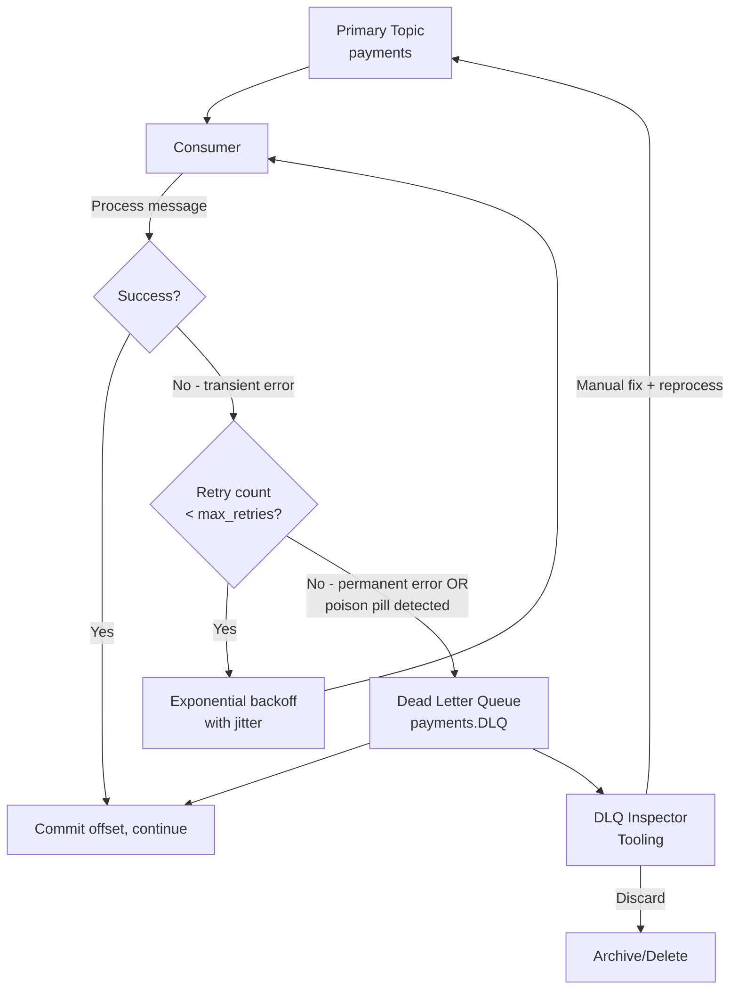
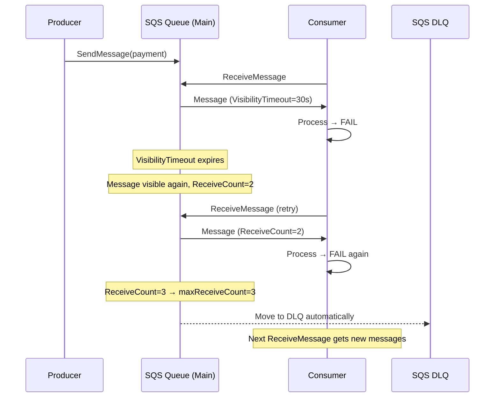
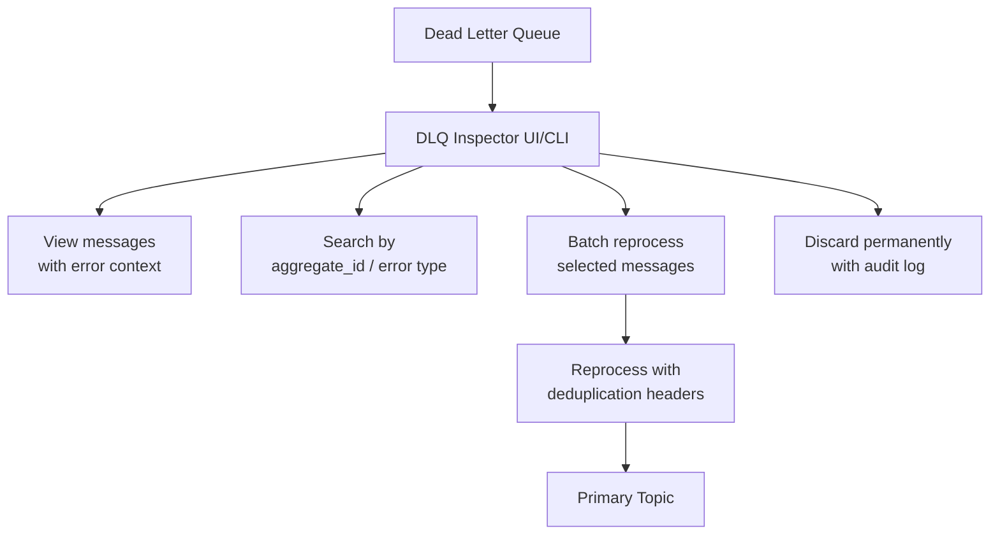
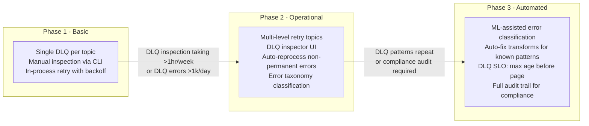

# Dead Letter Queue Design: Poison Pills, Retry Strategies, and Reprocessing

## 🗺️ Quick Overview



*Failed messages retry with exponential backoff until a maximum attempt threshold; messages that exceed the threshold are moved to the DLQ for manual inspection and safe reprocessing after the bug is fixed.*

**A DLQ is where messages go to die — but the real challenge is preventing the DLQ from killing your system first.** Poorly designed retry loops block partitions, DLQ consumers can backpressure the primary topic, and reprocessing without deduplication causes the exact duplicate processing you built the DLQ to avoid.

---

## The Problem Class `[Mid]`

Your payment processing consumer reads from a Kafka topic. Message 4,200 arrives with malformed JSON — a parsing bug in the upstream producer. Your consumer throws a `JsonParseException`. What happens next?

- **Option 1: Log and skip** — message lost, payment never processed
- **Option 2: Retry indefinitely** — consumer blocks on offset 4,200 forever; messages 4,201+ never processed
- **Option 3: DLQ** — move to dead letter queue, continue processing 4,201+, human review 4,200 later

Option 3 is the only production-grade answer. But DLQ design has 5 distinct sub-problems: detecting poison pills, retry strategy before DLQ routing, DLQ storage, DLQ inspection tooling, and safe reprocessing.



**Real numbers that define the stakes:**
- A single poison pill on a single-partition topic blocks ALL subsequent messages
- At 10,000 messages/sec, 30 retry attempts × 1s delay = 30 seconds of zero throughput per poison pill
- Without exponential backoff, a flapping dependency causes 1,000 retry RPCs/sec — a retry storm
- SQS default: messages become visible again after `VisibilityTimeout` — no progress without explicit DLQ routing

---

## Why the Obvious Solution Fails `[Senior]`

### Retry loops block partition progress

In Kafka, offsets must be committed in order. If message at offset N fails, you cannot commit offset N+1 even if it's already been processed successfully. A retry loop on a poison pill (permanently broken message) means infinite blocking.

**The critical distinction**: transient errors (database temporarily unavailable) should retry; permanent errors (malformed payload, schema violation, logic bug) should DLQ immediately.

### Immediate retry without backoff causes cascade failure

```
Timeline of naive immediate retry against a failing dependency:
  T+0s:  message_1 → process() → DB call fails → retry
  T+0ms: message_1 → process() → DB call fails → retry
  ... (10,000 retries/second)
  DB connection pool exhausted within seconds
  All consumers blocked
  Kafka consumer coordinator detects no heartbeat
  Consumer group rebalance triggered
  All consumers re-assigned partitions → all start retrying from last committed offset
  → Retry storm multiplied by consumer count
```

### DLQ without ordering guarantees corrupts stateful consumers

If your consumer maintains state (e.g., account balance), moving message N to DLQ and processing N+1 can produce incorrect state. Example: `WithdrawMoney($200)` fails (DLQ'd), then `GetBalance()` processed — returns pre-withdrawal balance, not reflecting the failed withdrawal.

**Stateful consumers should not DLQ without careful state compensation.**

### DLQ consumer competing with primary consumer

A common pattern: run the DLQ consumer at high priority to drain backlog quickly. If the DLQ consumer produces to the primary topic for reprocessing, and the primary consumer is slower than reprocessing rate, you get **DLQ backpressure**: primary topic lag grows, DLQ consumer keeps feeding, latency spirals.

---

## The Solution Landscape `[Senior]`

### Solution 1: Kafka DLQ Pattern

**What it is**

Kafka has no native DLQ (unlike SQS/SNS). The pattern involves a **retry topic** for transient errors and a **DLQ topic** for permanent errors, with exponential backoff enforced by consumer-side sleeping or by multiple retry topics with different TTLs.

**How it actually works at depth**

**Option A: Single DLQ + in-process retry (simple, low volume)**

```python
MAX_RETRIES = 3
RETRY_BASE_DELAY_MS = 100

def process_with_retry(record):
    for attempt in range(MAX_RETRIES):
        try:
            process(record)
            return  # success
        except TransientError as e:
            if attempt == MAX_RETRIES - 1:
                route_to_dlq(record, str(e))
                return
            delay = RETRY_BASE_DELAY_MS * (2 ** attempt) + random.randint(0, 100)  # jitter
            time.sleep(delay / 1000)
        except PermanentError as e:
            route_to_dlq(record, str(e))
            return

def route_to_dlq(record, error_reason):
    dlq_producer.produce(
        topic=f"{record.topic()}.dlq",
        key=record.key(),
        value=record.value(),
        headers={
            "original_topic": record.topic(),
            "original_partition": str(record.partition()),
            "original_offset": str(record.offset()),
            "error_reason": error_reason,
            "failed_at": datetime.utcnow().isoformat(),
            "retry_count": str(MAX_RETRIES)
        }
    )
    dlq_producer.flush()
```

**Option B: Multi-level retry topics (Spring Kafka pattern, high volume)**

```
Topic hierarchy:
  payments                    → primary topic
  payments.retry-1            → first retry, delay ~1s
  payments.retry-2            → second retry, delay ~10s
  payments.retry-3            → third retry, delay ~60s
  payments.dlq                → permanent failures

Each retry topic has a consumer that:
1. Checks if (now - message_timestamp) >= required_delay
2. If yes: re-produce to primary topic
3. If no: re-produce to same retry topic (effectively a delay queue)
```

This pattern avoids in-process sleeping (which blocks Kafka consumer heartbeats and triggers rebalances) by using Kafka itself as the delay mechanism.

**Sizing guidance** `[Staff+]`

```
DLQ topic sizing:
  dlq_rate = error_rate_fraction × primary_message_rate
  For 0.1% error rate, 100,000 msg/sec: dlq_rate = 100 msg/sec
  dlq_retention = max_time_before_reprocessing (typically 7 days)
  dlq_storage = dlq_rate × avg_msg_size × retention_seconds

  For 100 msg/sec, 1 KB/msg, 7 days:
    dlq_storage = 100 × 1024 × 604,800 ≈ 61 GB (manageable)

DLQ partition count:
  dlq_partitions = max(1, primary_partitions / 10)
  DLQ throughput is much lower; over-partitioning wastes resources
  Typical: 4–8 partitions regardless of primary partition count

Retry attempt budget:
  max_retries = ceil(log2(max_retry_window_ms / base_delay_ms))
  For max window = 60s, base delay = 100ms:
    max_retries = ceil(log2(60000/100)) = ceil(9.2) = 10 retries
  Total retry time = base × (2^max_retries - 1) + jitter ≈ 2 minutes worst case
```

**Configuration decisions that matter** `[Staff+]`

```python
# Exponential backoff with full jitter (recommended by AWS)
def backoff_ms(attempt: int, base_ms: int = 100, cap_ms: int = 30000) -> int:
    exponential = base_ms * (2 ** attempt)
    capped = min(exponential, cap_ms)
    return random.randint(0, capped)  # full jitter: uniform between 0 and cap

# Spring Kafka configuration (Java)
@Bean
fun retryTopicConfig(): RetryTopicConfiguration {
    return RetryTopicConfigurationBuilder
        .newInstance()
        .maxAttempts(4)
        .exponentialBackoff(100, 2, 30_000, true)  // base=100ms, mult=2, max=30s, withJitter=true
        .retryTopicSuffix(".retry")
        .dltSuffix(".dlq")
        .create(kafkaTemplate)
}
```

**Failure modes** `[Staff+]`

| Failure Mode | Trigger | Impact | Mitigation |
|---|---|---|---|
| DLQ full / retention exceeded | No reprocessing SLA | Messages permanently lost | Alert on DLQ consumer lag > threshold |
| Reprocessing loop | Reprocessed message fails again → DLQ → retry → DLQ | Infinite loop, DLQ grows unbounded | Max DLQ retry count; archive after N reprocessing attempts |
| DLQ backpressure | Reprocessing faster than primary can handle | Primary lag grows, latency increases | Rate-limit DLQ reprocessing; backpressure-aware reprocessing logic |
| Missing error context | DLQ message without original headers | Cannot diagnose root cause | Always copy original topic, partition, offset, timestamp, exception into DLQ message headers |
| Poison pill not classified | All errors retry (no transient/permanent distinction) | Transient retries waste resources; permanent errors cause retry storms | Define error taxonomy: transient (retry), permanent (DLQ-immediately), unknown (retry × N then DLQ) |

---

### Solution 2: SQS DLQ Pattern

**What it is**

SQS has native DLQ support: configure `maxReceiveCount` on the source queue, and after N failed receive+delete cycles, the message is automatically moved to the DLQ queue.

**How it actually works at depth**



SQS DLQ CloudFormation configuration:

```yaml
MainQueue:
  Type: AWS::SQS::Queue
  Properties:
    QueueName: payments-main
    VisibilityTimeout: 30
    MessageRetentionPeriod: 86400  # 1 day
    RedrivePolicy:
      deadLetterTargetArn: !GetAtt DLQueue.Arn
      maxReceiveCount: 3  # after 3 failed receives, move to DLQ

DLQueue:
  Type: AWS::SQS::Queue
  Properties:
    QueueName: payments-main-dlq
    MessageRetentionPeriod: 1209600  # 14 days
```

**The `VisibilityTimeout` and `maxReceiveCount` relationship:**

```
Effective retry window = VisibilityTimeout × maxReceiveCount
For VisibilityTimeout=30s, maxReceiveCount=3: 90 seconds total window

WARNING: If processing takes 45s and VisibilityTimeout=30s:
  Message becomes visible at T+30s while still being processed
  Another consumer picks it up → DUPLICATE PROCESSING
  Set VisibilityTimeout > max_processing_time × 1.5
```

**Sizing guidance** `[Staff+]`

```
SQS DLQ sizing:
  SQS is managed (no manual partition sizing), but:
  DLQ message retention must exceed reprocessing cadence
  If on-call reviews DLQ weekly → retention ≥ 14 days (maximum SQS retention)

  Alert threshold for DLQ depth:
    ApproximateNumberOfMessagesVisible > 0  → page on-call (first message in DLQ)
    OR use a threshold based on acceptable loss rate

  SQS DLQ throughput limits:
    Standard queue: unlimited throughput
    FIFO queue DLQ: 3,000 messages/sec with batching (10 messages/batch)
```

---

### Solution 3: DLQ Inspector Tooling

**What it is**

The DLQ is only valuable if teams can inspect, triage, and reprocess messages efficiently. Without tooling, the DLQ accumulates silently until someone notices the queue depth alert.

**Required tooling capabilities:**



**Kafka DLQ CLI tooling (example using kafkactl or custom script):**

```bash
# List DLQ topics
kafkactl get topics | grep dlq

# Inspect DLQ messages with headers
kafkactl consume payments.dlq --print-headers --max-messages 20

# Reprocess: copy DLQ messages back to primary with idempotency header
kafkactl consume payments.dlq --max-messages 100 | \
  jq '{value: .value, key: .key, headers: (.headers + {"reprocessed": "true", "reprocess_time": now})}' | \
  kafkactl produce payments

# For SQS: AWS CLI
aws sqs receive-message --queue-url $DLQ_URL --max-number-of-messages 10
aws sqs send-message --queue-url $MAIN_URL --message-body "$DLQ_MESSAGE_BODY"
aws sqs delete-message --queue-url $DLQ_URL --receipt-handle "$RECEIPT_HANDLE"
```

---

## Trade-off Matrix `[Senior]` → `[Staff+]`

| Dimension | In-process retry | Multi-level retry topics | Native SQS DLQ |
|---|---|---|---|
| Implementation complexity | Low | Medium | Low (config-based) |
| Partition blocking risk | High (sleep blocks consumer) | None | None |
| Retry delay accuracy | ~Accurate | Approximate (re-queue overhead) | Governed by VisibilityTimeout |
| Ordering guarantee | Maintained | Not maintained (retry topic = new order) | Not maintained |
| Operational visibility | Low (logs only) | High (topic-level metrics) | High (CloudWatch metrics) |
| Reprocess capability | Manual | Topic replay | SQS message mover (built-in) |
| Infrastructure cost | None | Extra topics (~minimal) | SQS DLQ queue (minimal) |

---

## Production Failure Story `[Staff+]`

**The DLQ consumer that backpressured the payment system**

A payments platform processed 20,000 messages/sec through a Kafka topic. 0.5% had malformed data from a legacy producer — 100 messages/sec to the DLQ. The team built an automated reprocessor that would periodically drain the DLQ back to the primary topic after applying a transform to fix the malformed data.

The reprocessor was too aggressive. It read 10,000 DLQ messages (accumulated over 100 seconds) and produced them all simultaneously to the primary topic. The primary consumer group's processing rate was 20,000/sec. Adding 10,000 additional messages per 100 seconds was a ~5% throughput increase — manageable.

**The bug**: the reprocessor ran every 60 seconds and reprocessed the entire DLQ each time, not just new additions. After 24 hours, the DLQ had 8.6 million messages (100/sec × 86,400s). The reprocessor produced 8.6 million messages to the primary topic in seconds.

- Primary topic lag: jumped from 0 to 8.6 million messages in 30 seconds
- Consumer processing latency: 8.6M / 20,000/sec = 430 seconds of catch-up
- Downstream payment confirmation service: all requests timed out (30s timeout)
- Alert: P1 incident, 7 minutes of payment confirmation degradation

**Root cause**: No rate limiting on DLQ reprocessor; reprocessing idempotency not verified; DLQ reprocessor not accounting for current primary topic backlog.

**Fix**:
1. Rate-limit reprocessor to 1% of primary topic throughput (200 msg/sec)
2. Check primary topic consumer lag before reprocessing; pause if lag > 10,000 messages
3. Reprocess only messages added to DLQ in the last N minutes (time-bounded window)
4. Add idempotency check: deduplicate by `original_offset + original_partition` before reprocessing

---

## Observability Playbook `[Staff+]`

```
Dashboard: DLQ Health

Panel 1: DLQ message rate (messages/sec arriving in DLQ)
  Alert: > 0.1% of primary message rate → elevated error rate, investigate root cause

Panel 2: DLQ message age (oldest message)
  Alert: oldest message > SLA reprocessing window → DLQ not being drained

Panel 3: Retry attempt distribution
  Metric: histogram of retry_count header values at DLQ arrival
  Insight: if most arrive at retry_count=1 → permanent errors (skip retries)
           if most arrive at retry_count=max → transient errors resolved before DLQ

Panel 4: Error type distribution
  Metric: frequency of error_reason header values in DLQ
  Alert: single error type > 80% of DLQ → systemic bug, requires immediate fix

Panel 5: DLQ reprocessing rate vs primary throughput
  Alert: reprocessing_rate > 5% of primary_throughput → throttle reprocessor

Runbooks:
  dlq_spike → check error_reason distribution, identify systematic producer bug
  dlq_not_draining → check on-call DLQ review schedule, trigger reprocessing job
  reprocessing_backpressure → reduce reprocessor rate, increase primary consumer count
```

---

## Architectural Evolution `[Staff+]`



---

## Decision Framework Checklist `[All Levels]`

- [ ] **Error taxonomy defined**: transient (retry), permanent (DLQ-immediately), unknown (retry N then DLQ)?
- [ ] **Exponential backoff with jitter implemented**: not linear delay, not fixed delay?
- [ ] **Retry does not block partition**: in-process sleep replaced with retry topic pattern for high-volume?
- [ ] **DLQ headers include**: original_topic, original_partition, original_offset, error_reason, failed_at?
- [ ] **DLQ retention ≥ reprocessing SLA**: if on-call reviews weekly, retention ≥ 14 days?
- [ ] **DLQ depth alert configured**: page on-call when DLQ receives first message?
- [ ] **Reprocessing rate-limited**: reprocessor throttled to ≤5% of primary throughput?
- [ ] **Reprocessing idempotency verified**: consumer deduplicates on original_offset+partition?
- [ ] **DLQ inspector tooling exists**: team can inspect, triage, and selectively reprocess?
- [ ] **DLQ consumer does not cause backpressure**: reprocessor checks primary lag before producing?

*Written by Gaurav Porwal — 10+ Year Engineer | Tech Lead | Product Owner | Business-Minded Builder*
*Last updated: 2026-03-18*
